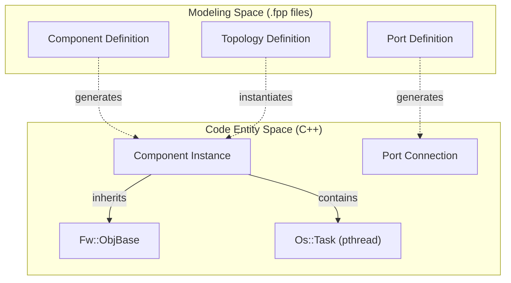
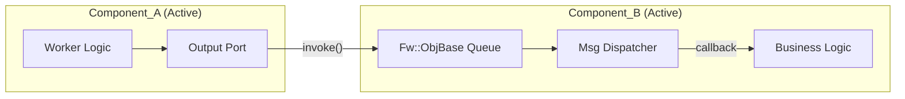

# F´ Framework Architecture

Relevant source files

The following files were used as context for generating this wiki page:

- [.gitmodules](.gitmodules)
- [README.md](README.md)

This page provides a high-level overview of the F Prime (F´) framework architecture as implemented in the `pfsoc-fsw-linux` deployment. F´ is a component-based architecture designed for spaceflight applications, emphasizing modularity, reusability, and strong interface typing. In this project, the framework is deployed within a Linux userspace environment on the Microchip PolarFire SoC (MPFS) [README.md:1-3]().

The architecture is built upon three primary pillars: the component model, the system topology, and the service layer. These elements work together to provide a robust execution environment for flight software on RISC-V.

## Core Architectural Pillars

The F´ architecture organizes software into discrete functional units that communicate through well-defined interfaces. The following diagram illustrates the relationship between the framework's structural layers and the code entities that define them.

### F´ Structural Hierarchy

**Sources:** [README.md:1-17](), [.gitmodules:1-8]()

### 1. Components and Ports
Components are the fundamental units of business logic in F´. They encapsulate state and behavior, interacting with other components exclusively through "Ports." Ports are typed interfaces that ensure data consistency across component boundaries.

In this deployment, components are categorized by their execution model:
*   **Active Components:** Possess their own execution thread (implemented via `Os::Task` wrapping Linux pthreads) and an internal message queue.
*   **Passive Components:** Execute logic within the thread of the calling component.

The deployment leverages the `fprime-pfsoc-linux` library to provide hardware-specific drivers and platform adaptations [README.md:9-11](). For a detailed breakdown of component types, port-based communication, and FPP modeling, see **[Components and Ports (#3.1)]()**.

### 2. Topology and Deployment
The "Topology" is the static graph of the entire software system. It defines which component instances exist and how their ports are interconnected. In F´, the topology is typically defined in FPP files and instantiated during the system startup sequence.

The "Deployment" refers to the specific instance of the F´ framework tailored for the PolarFire SoC Linux target, located in the `PfSocLinux/` directory [README.md:12-15](). This includes the `Main.cpp` entry point and the topology configuration which wires the system together.

For details on how the system graph is constructed and initialized, see **[Topology and Deployment (#3.2)]()**.

### 3. Service Layer (Svc)
The Service Layer provides the essential "infrastructure" components that any flight-like system requires. These components handle cross-cutting concerns such as:
*   **Commanding:** Dispatching ground commands to specific components via `Svc::CommandDispatcher`.
*   **Telemetry:** Collecting and buffering data for downlink via `Svc::TlmChan`.
*   **Events:** Logging system-wide notifications and errors via `Svc::ActiveLogger`.
*   **Health:** Monitoring the execution status of active components.

In `pfsoc-fsw-linux`, these services are provided by the standard F´ `Svc` namespace components located within the `lib/fprime` submodule [README.md:9-10](), adapted for the RISC-V Linux environment.

For a deep dive into the specific service components used in this deployment, see **[Service Layer (Svc) (#3.3)]()**.

## Framework Communication Flow
The following diagram bridges the conceptual communication between components and the underlying code mechanisms used in this repository.

### Component Interaction Model

**Sources:** [README.md:1-17](), [.gitmodules:1-8]()

**Sources:**
* [README.md:1-17]()
* [.gitmodules:1-8]()
