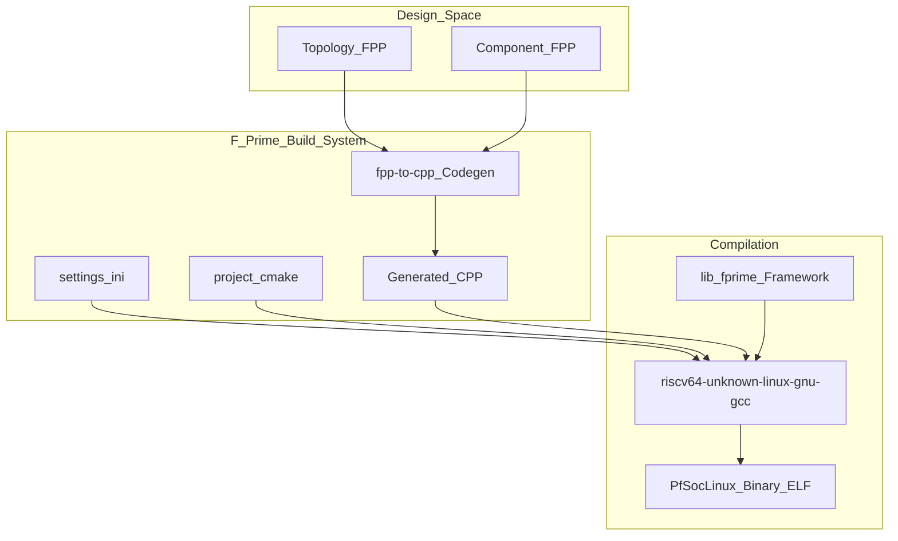
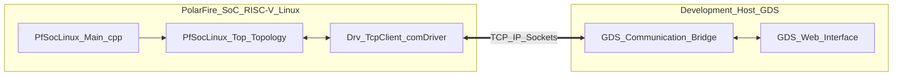

# Getting Started

<details>
<summary>Relevant source files</summary>

The following files were used as context for generating this wiki page:

- [CMakeLists.txt](CMakeLists.txt)
- [README.md](README.md)
- [settings.ini](settings.ini)

</details>


This page provides a practical guide for onboarding engineers to the `pfsoc-fsw-linux` project. It covers the environment setup, the cross-compilation process for the RISC-V architecture, and the procedure for executing the flight software (FSW) and connecting it to the F´ Ground Data System (GDS).

## Prerequisites and Environment Setup

The `pfsoc-fsw-linux` project targets the Microchip PolarFire SoC (MPFS) running a Linux distribution on its application-class RISC-V cores [README.md:1-3](). To build and run this deployment, several tools must be installed on the development host.

### Toolchain Requirements
*   **RISC-V Cross-Compiler**: A `riscv64-unknown-linux-gnu-gcc` toolchain is required. The project is configured to use the `pfsoc-linux` toolchain by default [settings.ini:4]().
*   **CMake**: Used as the primary build system generator (minimum version 3.26), integrated with the F´ build extensions [CMakeLists.txt:6-11]().
*   **Python 3**: Required for the F´ framework tools, including the `fprime-util` CLI and the GDS.
*   **F´ Framework**: The core framework providing the component model, located in the project's `lib/fprime` directory [settings.ini:2]().

### Directory Structure and Cloning
The deployment is structured as an F´ project with submodules for the framework and platform-specific libraries [README.md:5-17]().

```bash
# Clone the repository with submodules
git clone --recursive <repo-url>
cd pfsoc-fsw-linux
```

**Sources:** [README.md:1-24](), [settings.ini:1-6](), [CMakeLists.txt:1-11]()

---

## Building the Project

The build process utilizes the `fprime-util` wrapper around CMake. This handles the code generation from FPP (F Prime Prime) modeling files and compiles the resulting C++ source code.

### 1. Generating the Build Cache
The `settings.ini` file specifies the default toolchain as `pfsoc-linux` [settings.ini:4](). This instructs the build system to use the cross-compiler for the RISC-V target.

```bash
# Navigate to the deployment directory
cd PfSocLinux

# Generate a build for the RISC-V Linux target
fprime-util generate
```

### 2. Compiling the Binary
Once the cache is generated, use the build command to compile the deployment. This produces a single ELF binary containing the entire FSW topology [README.md:26-31]().

```bash
# Compile the deployment
fprime-util build
```

### Build Data Flow
The following diagram illustrates how the F´ build system transforms model files into a deployable RISC-V binary, referencing the project configuration files.

**Build Process: Model to Binary**


**Sources:** [README.md:26-31](), [settings.ini:1-6](), [CMakeLists.txt:1-14]()

---

## Running and Testing

After building, the binary must be transferred to the PolarFire SoC hardware. Testing is performed by connecting the FSW to the F´ Ground Data System (GDS) via a network interface.

### Deployment to Hardware
1.  Transfer the binary (located in `PfSocLinux/bin/riscv64-unknown-linux-gnu/PfSocLinux`) to the MPFS Linux filesystem.
2.  Ensure the target hardware has network connectivity to the host running the GDS.

### Starting the Ground Data System (GDS)
On the host machine, start the GDS. This provides a web-based interface to monitor telemetry, view events, and send commands.

```bash
# Start GDS without automatically starting a local FSW binary
fprime-gds -n --ip-address <MPFS_IP_ADDRESS>
```

### Executing the FSW
Run the binary on the PolarFire SoC. The FSW uses a socket-based communication provider to connect to the GDS. The entry point for the application is defined in `Main.cpp` [README.md:14]().

```bash
# On the PolarFire SoC
./PfSocLinux -a <HOST_IP_ADDRESS> -p <PORT>
```

### System Connectivity
The diagram below maps the communication path between the software entities in the FSW and the GDS, highlighting the key directories and components involved.

**Entity Connectivity: FSW to GDS**


**Sources:** [README.md:5-17](), [README.md:19-31]()
