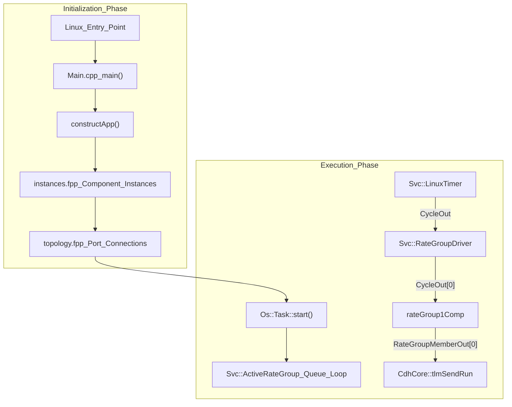
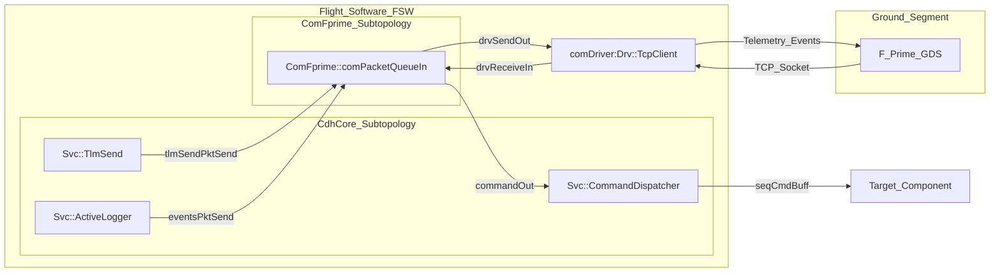

# Glossary

Relevant source files

The following files were used as context for generating this wiki page:

- [.gitmodules](.gitmodules)
- [PfSocLinux/Top/PfSocLinuxTopologyDefs.hpp](PfSocLinux/Top/PfSocLinuxTopologyDefs.hpp)
- [PfSocLinux/Top/instances.fpp](PfSocLinux/Top/instances.fpp)
- [PfSocLinux/Top/topology.fpp](PfSocLinux/Top/topology.fpp)
- [README.md](README.md)
- [settings.ini](settings.ini)

This page provides definitions for the technical terminology, architectural patterns, and domain-specific acronyms used throughout the `pfsoc-fsw-linux` deployment. This project adapts the NASA JPL F´ (F Prime) framework to the Microchip PolarFire SoC (MPFS) Linux environment.

## Core Framework Concepts

The following terms represent the building blocks of the F´ framework as implemented in this repository.

### Active Component
A component that possesses its own execution thread (typically a `pthread` in the Linux OS abstraction). It maintains an internal message queue; when a port is invoked, the message is pushed to the queue, and the component's thread processes it asynchronously.
*   **Implementation:** Inherits from `Fw::ActiveComponentBase`.
*   **Attributes:** Defined with `queue size`, `stack size`, and `priority` in FPP.
*   **Examples:** `rateGroup1Comp`, `cmdSeq` [PfSocLinux/Top/instances.fpp:29-47]().

### Passive Component
A component that does not have its own thread. Port calls to a passive component are executed synchronously within the thread of the caller.
*   **Implementation:** Inherits from `Fw::PassiveComponentBase`.
*   **Examples:** `posixTime`, `systemResources`, `linuxTimer` [PfSocLinux/Top/instances.fpp:53-59]().

### Port
The typed interface through which components communicate. Ports can be input or output and are connected in the topology to form the functional graph of the software.
*   **Data Flow:** Ports facilitate "Point-to-Point" communication.
*   **Code Pointer:** Port definitions are generated from FPP files and handled by `Fw::PortBase`.

### Topology
The static structural graph of the system. It defines which component instances exist and how their ports are interconnected.
*   **Code Pointer:** Defined in `topology.fpp` [PfSocLinux/Top/topology.fpp:9-95]().
*   **State:** Managed via `PfSocLinux::TopologyState` [PfSocLinux/Top/PfSocLinuxTopologyDefs.hpp:73-80]().

---

## PolarFire SoC & Hardware Terms

Terms specific to the target hardware platform and the interaction between the Linux userspace and the RISC-V silicon.

### MPFS (Microchip PolarFire SoC)
The target hardware platform featuring a Linux-capable multi-core RISC-V processor subsystem (MSS) integrated with an FPGA fabric.
*   **Context:** [README.md:1-4]()

### MSS (Microprocessor Subsystem)
The hardened RISC-V complex within the PolarFire SoC. In this deployment, the FSW runs on the application cores (U54 cores) under a Linux environment.

### PAL (Platform Adaptation Layer)
The layer of code that abstracts OS-specific calls (threading, mutexes, file I/O) into a generic interface used by the F´ framework.
*   **Implementation:** Located within the `Os` namespace (e.g., `Os::Task`, `Os::Mutex`).

---

## Service Layer (Svc) & Driver (Drv) Components

Standard F´ components utilized in this deployment to provide system-level services.

| Term | Description | Key Code Entity |
| :--- | :--- | :--- |
| **Command Dispatcher** | Receives ground commands and routes them to the destination component. | `Svc::CommandDispatcher` |
| **Active Logger** | Manages event logging and sends event packets to the ground. | `Svc::ActiveLogger` |
| **TlmChan** | The Telemetry Channel manager; collects and stores telemetry data for downlink. | `Svc::TlmChan` |
| **comDriver** | Provides the communication bridge between the FSW and the GDS over TCP/UDP. | `Drv::TcpClient` [PfSocLinux/Top/instances.fpp:61]() |
| **Rate Group** | A component triggered by a periodic tick to execute a list of port calls at a specific frequency. | `Svc::ActiveRateGroup` [PfSocLinux/Top/instances.fpp:29]() |
| **LinuxTimer** | Linux-specific timer component that drives the system heartbeat. | `Svc::LinuxTimer` [PfSocLinux/Top/instances.fpp:59]() |

---

## Communication & Ground Systems

### GDS (Ground Data System)
The suite of tools used to visualize telemetry, log events, and send commands to the flight software.
*   **Protocol:** Communicates with the FSW via the `comDriver` (a `Drv::TcpClient` instance) [PfSocLinux/Top/topology.fpp:64-71]().

### FPP (F Prime Prime)
The modeling language used to define components, ports, and topologies. FPP files are processed by the build system to generate C++ header and source files.
*   **Key Files:** `topology.fpp` [PfSocLinux/Top/topology.fpp:1](), `instances.fpp` [PfSocLinux/Top/instances.fpp:1]().

### Subtopology
A modular grouping of related component instances and connections, used to organize the main topology.
*   **Instances:** `CdhCore`, `ComFprime`, `FileHandling`, `DataProducts` [PfSocLinux/Top/topology.fpp:11-14]().

---

## System Execution Flow

The following diagram bridges the natural language concepts of "Initialization" and "Execution" to the specific code entities involved in the `pfsoc-fsw-linux` lifecycle.

### Lifecycle Mapping: Initialization to Steady State

**Sources:**
*   [PfSocLinux/Top/topology.fpp:40-50]()
*   [PfSocLinux/Top/instances.fpp:29-59]()
*   [PfSocLinux/Main.cpp:1-15]()

---

## Data Flow: Command and Telemetry

This diagram illustrates how data flows from the code entities to the external GDS, highlighting the subtopology boundaries.

### Data Path: Code Entities to GDS

**Sources:**
*   [PfSocLinux/Top/topology.fpp:64-80]()
*   [PfSocLinux/Top/instances.fpp:61]()
*   [PfSocLinux/Top/PfSocLinuxTopologyDefs.hpp:73-80]()
