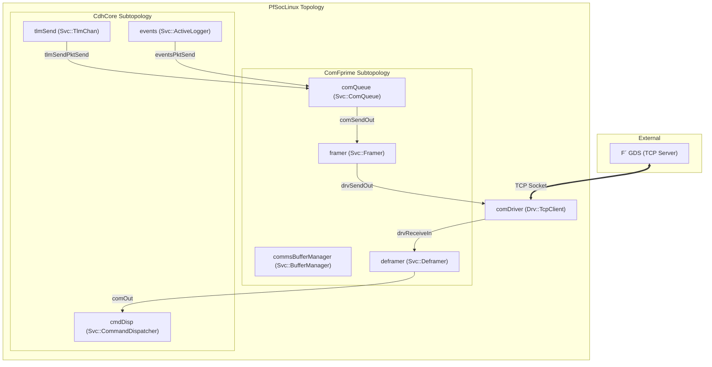

# Ground Data System (GDS) Communication

Relevant source files

The following files were used as context for generating this wiki page:

- [PfSocLinux/Top/PfSocLinuxPackets.fppi](PfSocLinux/Top/PfSocLinuxPackets.fppi)
- [PfSocLinux/Top/PfSocLinuxTopology.cpp](PfSocLinux/Top/PfSocLinuxTopology.cpp)
- [PfSocLinux/Top/topology.fpp](PfSocLinux/Top/topology.fpp)

This page describes the communication architecture between the Flight Software (FSW) and the Ground Data System (GDS). In the `pfsoc-fsw-linux` deployment, this interface is managed by the `Drv::TcpClient` (aliased as `comDriver`) component, which provides a bridge between the F´ internal port-based communication and standard Linux TCP/IP network sockets.

## 1. Overview of GDS Connectivity

The GDS interface allows operators to send commands to the spacecraft and receive telemetry, events, and file data. The communication stack utilizes TCP sockets to bridge the gap between the Linux userspace environment on the PolarFire SoC and the external GDS workstation [PfSocLinux/Top/topology.fpp:24]().

### Data Flow Diagram: Natural Language to Code Entities
The following diagram illustrates the path of data from the GDS through the FSW components, mapping conceptual roles to specific code instances defined in the topology.

**GDS Communication Stack**

**Sources:** [PfSocLinux/Top/topology.fpp:12,24,64-80](), [PfSocLinux/Top/PfSocLinuxTopology.cpp:38-40]()

## 2. The comDriver Component (Drv::TcpClient)

The `comDriver` (an instance of `Drv::TcpClient`) is the primary interface for network-based communication. It encapsulates the standard Linux socket API and presents it to the F´ framework.

### Implementation and Lifecycle
*   **Protocol:** Configured as a TCP client that connects to a remote host and port [PfSocLinux/Top/PfSocLinuxTopology.cpp:38-40]().
*   **Threading:** It is an Active component. During `setupTopology`, a dedicated thread named `ReceiveTask` is started with priority `34` (`COMM_PRIORITY`) to handle blocking socket reads [PfSocLinux/Top/PfSocLinuxTopology.cpp:19-21,44-47]().
*   **Connection Management:** The driver provides a `ready` port to signal connection status to the `ComFprime` subtopology [PfSocLinux/Top/topology.fpp:70]().

| Code Entity | Type / Value | Description |
| :--- | :--- | :--- |
| `comDriver` | `Drv::TcpClient` | Component instance handling TCP I/O [PfSocLinux/Top/topology.fpp:24]() |
| `COMM_PRIORITY` | `34` | Priority for the socket receive task [PfSocLinux/Top/PfSocLinuxTopology.cpp:20]() |
| `ReceiveTask` | `Os::Task` | The thread name for the driver's internal loop [PfSocLinux/Top/PfSocLinuxTopology.cpp:45]() |
| `comDriver.configure` | Function | Sets the target hostname and port [PfSocLinux/Top/PfSocLinuxTopology.cpp:39]() |

**Sources:** [PfSocLinux/Top/PfSocLinuxTopology.cpp:19-47](), [PfSocLinux/Top/topology.fpp:24,64-71]()

## 3. Uplink: Command and File Reception

Uplink refers to data flowing from the GDS to the FSW.

1.  **Socket Reception:** The `comDriver` receives raw bytes from the TCP socket.
2.  **Buffer Allocation:** It requests a buffer via the `allocate` port, which is serviced by the `commsBufferManager` in the `ComFprime` subtopology [PfSocLinux/Top/topology.fpp:65]().
3.  **Data Routing:** The received data is passed through `drvReceiveIn` to the deframing logic [PfSocLinux/Top/topology.fpp:67]().
4.  **Command Dispatch:** Once deframed, commands are routed to `CdhCore.cmdDisp` via the `commandOut` to `seqCmdBuff` connection [PfSocLinux/Top/topology.fpp:76]().
5.  **File Uplink:** File data is routed to `FileHandling.fileUplinkBufferSendIn` [PfSocLinux/Top/topology.fpp:85]().

**Sources:** [PfSocLinux/Top/topology.fpp:64-87]()

## 4. Downlink: Telemetry, Events, and Packets

Downlink data is aggregated and framed before transmission. To optimize bandwidth, this deployment uses **Telemetry Packets** defined in `PfSocLinuxPackets.fppi`.

### Telemetry Packet Grouping
Instead of sending every channel individually, channels are grouped into named packets. This is controlled by the `PfSocLinuxPackets` definition [PfSocLinux/Top/PfSocLinuxPackets.fppi:1-3]().

| Packet Name | ID | Group | Key Contents |
| :--- | :--- | :--- | :--- |
| `CDH` | 1 | 1 | Command counts, sequence status, queue depths [PfSocLinux/Top/PfSocLinuxPackets.fppi:3-25]() |
| `CDHErrors` | 2 | 1 | Dropped commands, health warnings, cycle slips [PfSocLinux/Top/PfSocLinuxPackets.fppi:27-42]() |
| `SystemRes1/3` | 5/6 | 2 | CPU usage (per core) and Memory/NV stats [PfSocLinux/Top/PfSocLinuxPackets.fppi:44-69]() |
| `DataProducts` | 21 | 3 | DP catalog status and writer statistics [PfSocLinux/Top/PfSocLinuxPackets.fppi:71-91]() |
| `Version` | 22-37| 2 | Framework, Project, and Library version strings [PfSocLinux/Top/PfSocLinuxPackets.fppi:93-162]() |

### Transmission Flow
1.  **Packetization:** `tlmSend` (TlmChan) assembles packets based on the `.fppi` definition.
2.  **Queuing:** Packets are sent to `ComFprime.comPacketQueueIn`. Events and Telemetry have dedicated ports in the queue [PfSocLinux/Top/topology.fpp:74-75]().
3.  **Framing & Sending:** The `ComFprime` subtopology frames the queued data and invokes `comDriver.send` [PfSocLinux/Top/topology.fpp:69]().

**Sources:** [PfSocLinux/Top/PfSocLinuxPackets.fppi:1-166](), [PfSocLinux/Top/topology.fpp:73-80]()

## 5. Configuration for PolarFire SoC

The communication settings are typically passed via command-line arguments to the FSW binary, which populates the `TopologyState`.

*   **Host/Port Setup:** If a hostname and port are provided in the `state`, the `comDriver` is configured and started [PfSocLinux/Top/PfSocLinuxTopology.cpp:38-47]().
*   **Execution:** The driver is started in `setupTopology` after components are initialized but before rate groups begin [PfSocLinux/Top/PfSocLinuxTopology.cpp:44-47]().
*   **Cleanup:** During `teardownTopology`, the driver is stopped and the task is joined to ensure a clean shutdown of the Linux socket [PfSocLinux/Top/PfSocLinuxTopology.cpp:61-62]().

**Sources:** [PfSocLinux/Top/PfSocLinuxTopology.cpp:31-67]()
