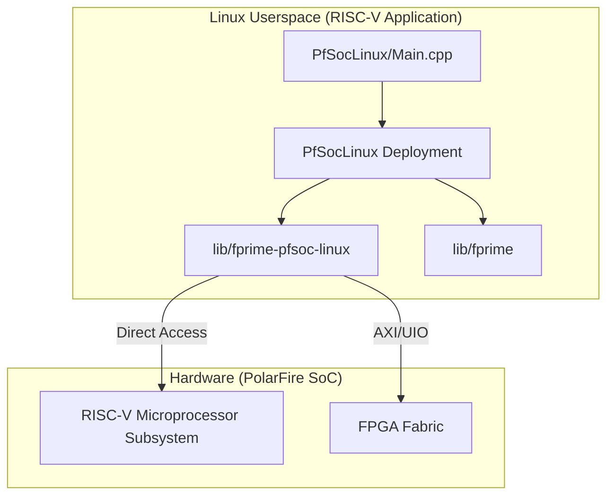
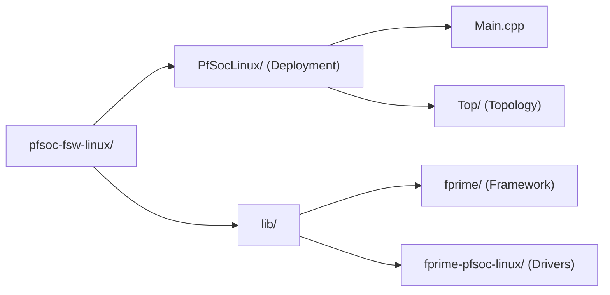
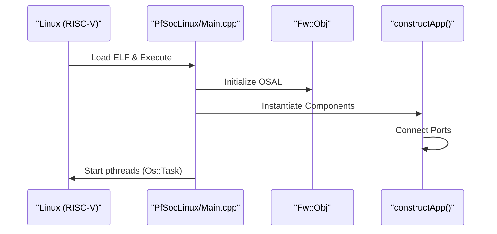

# Overview

Relevant source files

The following files were used as context for generating this wiki page:

- [.gitmodules](.gitmodules)
- [README.md](README.md)

The `pfsoc-fsw-linux` project is a flight software (FSW) deployment test repository utilizing the **F´ (F Prime)** framework. It specifically targets the **Microchip PolarFire SoC (MPFS)**, an architecture that combines a multi-core RISC-V processor subsystem with FPGA fabric. This project serves as a validation environment for running F´ components within a Linux userspace on RISC-V hardware.

For a detailed explanation of the project's objectives and the specific hardware/software boundaries, see [Project Purpose and Scope](#1.1).

### System Purpose and Target Hardware

The primary goal of this repository is to demonstrate the portability of the F´ framework to the MPFS Linux environment [README.md:1-3](). By leveraging the F´ component-based architecture, the software provides a modular approach to managing spacecraft or embedded system functions on high-performance RISC-V cores.

The software is designed to run as a Linux userspace application, interacting with the underlying hardware through the standard F´ OS Abstraction Layer (OSAL) and external libraries like `fprime-pfsoc-linux` [.gitmodules:5-7]().

#### Hardware-to-Code Mapping
The following diagram illustrates how the conceptual system layers map to specific entities within the F´ framework and the target Linux environment.

**System Layer Mapping**

**Sources:** [README.md:1-17](), [.gitmodules:1-8]()

### The F´ Framework

F´ is a component-driven framework developed by JPL for rapid development and deployment of spaceflight and other embedded software applications. In this deployment, the framework is integrated as a submodule [lib/fprime:1-3](). It provides:
*   **Component Model:** Separation of concerns through encapsulated logic.
*   **Communication:** A standardized port-based messaging system.
*   **Services:** Built-in components for commanding, telemetry, and logging.

The deployment utilizes the FPP (F Prime Prime) modeling language to define these components and their interconnections (the topology) within the `PfSocLinux` directory [README.md:12-15]().

### Project Structure and Navigation

The repository is organized to separate the core framework, platform-specific libraries, and the project-specific deployment logic.

| Topic | Description |
| :--- | :--- |
| **[Project Purpose and Scope](#1.1)** | Detailed project goals, the role of the PolarFire SoC, and validation objectives. |
| **[Getting Started](#1.2)** | Instructions on setting up the RISC-V toolchain, cloning the repository with submodules, and performing the first build. |

**Codebase Organization**

**Sources:** [README.md:7-17]()

### High-Level Execution Flow

The software follows the standard F´ execution pattern. Upon startup, the Linux executable initializes the framework, instantiates the static topology of components, and begins the dispatch loops for "Active" components. The build is managed via `fprime-util` which orchestrates CMake and code generation [README.md:28-31]().

**Execution Initialization**

**Sources:** [README.md:1-17](), [PfSocLinux/Main.cpp:1-15]()

For details on the build process and how the FPP models are transformed into C++, see the documentation on the [Build System](5).
