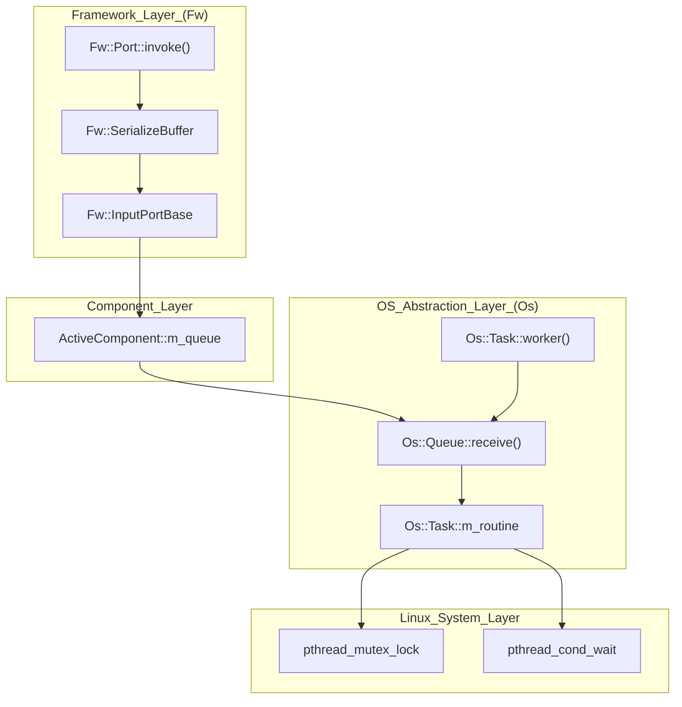

# Platform Adaptation Layer (PAL) and OS Abstraction

<details>
<summary>Relevant source files</summary>

The following files were used as context for generating this wiki page:

- [.gitmodules](.gitmodules)
- [settings.ini](settings.ini)

</details>


The Platform Adaptation Layer (PAL) in `pfsoc-fsw-linux` provides a consistent interface between the F´ framework and the underlying Linux operating system running on the RISC-V cores of the PolarFire SoC. By utilizing the `Os` namespace, the framework abstracts low-level primitives such as threading (pthreads), timing, and filesystem I/O, allowing the higher-level flight software components to remain platform-independent.

## Framework Foundations: Fw::Obj and Serialization

At the base of all components is the `Fw` namespace, which defines the fundamental building blocks of the software. Every component in the system inherits from `Fw::ObjBase`, providing a standard mechanism for identification and trace logging.

The framework utilizes a port-based communication model where data is passed between components using serialized buffers. The `Fw::Serializable` class defines the interface for objects that can be converted to a byte stream for transmission across port boundaries or storage.

### Data Flow: Port Invocation to OS Task
The following diagram illustrates how a port invocation on an Active Component transitions from the framework's serialization layer into a Linux pthread managed by the PAL.

**Diagram: Port Serialization and Task Execution Flow**

**Sources:** [.gitmodules:1-3](), [settings.ini:1-6]()

## OS Abstraction (Os Namespace)

The `Os` namespace adapts the F´ framework to the Linux environment on the Microchip PolarFire SoC. This implementation relies on the POSIX standard and is integrated via the `fprime` and `fprime-pfsoc-linux` libraries.

### Task Management (Os::Task)
Active components in F´ require their own execution context. The `Os::Task` class wraps the `pthread` library:
*   **Creation:** When an active component is started, `Os::Task::start()` is called, which invokes `pthread_create`.
*   **Priority:** Maps F´ task priorities to Linux scheduling parameters (typically `SCHED_FIFO` or `SCHED_RR` if running with sufficient privileges, otherwise default `SCHED_OTHER`).
*   **Affinity:** On the PolarFire SoC's multi-core RISC-V complex, `Os::Task` can be configured to set CPU affinity, ensuring critical FSW tasks run on specific application cores.

### Queueing (Os::Queue)
Inter-component communication for active components is asynchronous, mediated by `Os::Queue`.
*   **Implementation:** Under Linux, this is typically implemented using POSIX message queues (`mq_open`, `mq_send`, `mq_receive`) or wrapped around `pthreads` condition variables and mutexes for internal memory-based queueing.
*   **Blocking:** Supports blocking, non-blocking, and timed-wait semantics for component message processing.

### Timing and Synchronization
*   **Os::Time:** Provides access to the system clock. On the PolarFire SoC Linux target, this maps to `clock_gettime(CLOCK_REALTIME, ...)` to provide sub-millisecond precision for telemetry timestamps.
*   **Os::Mutex:** A wrapper around `pthread_mutex_t`, used to protect shared resources in passive components or shared drivers.

## Filesystem and I/O Abstraction

The PAL provides a uniform way to interact with the PolarFire SoC's storage (e.g., eMMC or SD card) via `Os::File` and `Os::FileSystem`.

| Class | Linux Implementation | Purpose |
| :--- | :--- | :--- |
| `Os::File` | `open()`, `read()`, `write()`, `close()` | Basic file I/O for logs and parameters. |
| `Os::FileSystem` | `mkdir()`, `remove()`, `stat()` | Directory management and disk usage monitoring. |

**Diagram: PAL Entity Mapping**
This diagram bridges the F´ abstract classes to the specific Linux/POSIX entities used in the `pfsoc-fsw-linux` deployment.

```mermaid
classDiagram
    class "Os::Task" {
        +start(name, routine, arg)
        -pthread_t "m_handle"
    }
    class "Os::Mutex" {
        +lock()
        +unLock()
        -pthread_mutex_t "m_mutex"
    }
    class "Os::Queue" {
        +send(buffer, priority)
        +receive(buffer)
        -mqd_t "m_handle"
    }
    class "Os::File" {
        +open(path, mode)
        -int "m_fd"
    }

    "Os::Task" ..> "libpthread.so" : "invokes_pthread_create"
    "Os::Mutex" ..> "libpthread.so" : "invokes_pthread_mutex_lock"
    "Os::Queue" ..> "librt.so" : "invokes_mq_send"
    "Os::File" ..> "libc.so" : "invokes_open_read_write"
```

## Summary of Data Flow for Linux Adaptation

1.  **Initialization:** The `main()` function initializes the PAL layer, ensuring the system clock and threading primitives are available. The project uses the `pfsoc-linux` toolchain to link against the correct RISC-V Linux libraries.
2.  **Component Startup:** As the topology instantiates components, `Os::Task` objects are created for every Active component.
3.  **Execution:** The Linux scheduler manages the execution of these threads across the RISC-V cores.
4.  **Communication:** When a port is called, `Fw::SerializeBuffer` packages the data, and `Os::Queue` pushes it to the destination component's mailbox, triggering a context switch if necessary.

**Sources:** [.gitmodules:5-7](), [settings.ini:4-5]()
