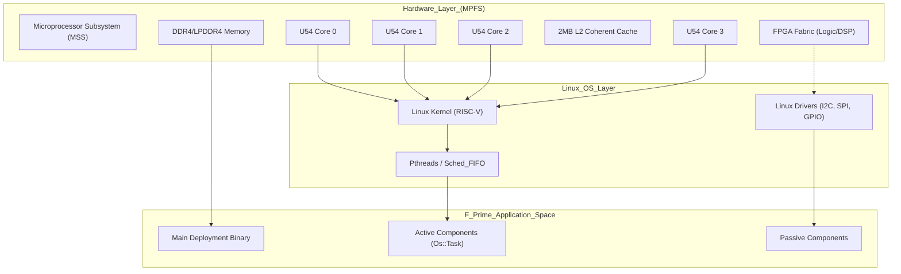
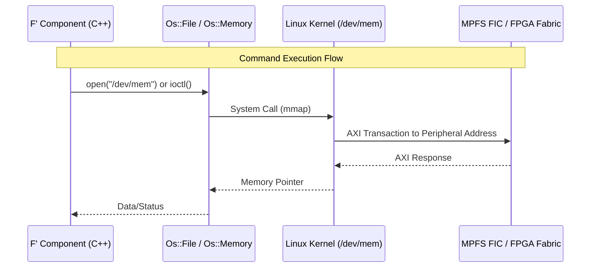

# PolarFire SoC Architecture

Relevant source files

The following files were used as context for generating this wiki page:

- [.gitmodules](.gitmodules)
- [settings.ini](settings.ini)

The Microchip PolarFire SoC (MPFS) represents a unique hardware platform combining a high-performance multi-core RISC-V processor subsystem (MSS) with a flexible FPGA fabric. This deployment of the F´ (F Prime) framework specifically targets the Linux-capable application cores within the MSS, utilizing the Linux userspace environment to manage flight software (FSW) execution while maintaining the ability to interface with hardware-level resources.

## Microprocessor Subsystem (MSS) Overview

The MSS is the heart of the PolarFire SoC, providing a deterministic and coherent execution environment. It consists of a five-core RISC-V CPU cluster. In this deployment, the software operates within a Linux environment typically running across the four U54 application cores.

### CPU Cluster Composition
*   **E51 Monitor Core:** A 64-bit RISC-V IMAC core used for system management, security, and initial boot phases. It generally does not run the F´ application.
*   **U54 Application Cores:** Four 64-bit RISC-V GC cores with Memory Management Units (MMU). These cores support the Linux OS where the `pfsoc-fsw-linux` binary resides.
*   **L2 Coherent Cache:** A 2MB L2 cache that maintains memory coherency between all five RISC-V cores and the FPGA fabric.

### Memory Map and Interconnect
The MSS uses an AXI4-based switch interconnect to manage data flow between the RISC-V cores, DDR memory controllers, and the FPGA fabric. This allows the F´ application, running on the U54 cores, to access hardware registers mapped into the system memory space.

**Hardware and Software Mapping**
The following diagram illustrates how the physical hardware layers of the PolarFire SoC map to the software entities defined within the `pfsoc-fsw-linux` deployment and its submodules.

**PolarFire SoC System Mapping**

Sources: [.gitmodules:1-8](), [settings.ini:1-6]()

## Application Core Execution Model

The `pfsoc-fsw-linux` deployment leverages the Symmetric Multi-Processing (SMP) capabilities of the Linux kernel running on the U54 cores. 

### Multi-Threading and Scheduling
F´ components are categorized into **Active** and **Passive** types. On the PolarFire SoC architecture:
1.  **Active Components:** Each active component maps to an `Os::Task`, which in the Linux implementation (located in the `fprime` submodule) wraps a `pthread`. These threads are scheduled by the Linux kernel across the available U54 cores.
2.  **Concurrency:** The MPFS hardware ensures cache coherency via the L2 cache, allowing F´ components to pass serialized data across ports between different threads/cores without manual cache flushing.

### Data Flow: MSS to FPGA Fabric
A key feature of the PolarFire SoC is the high-bandwidth interface between the MSS and the FPGA fabric (FIC - Fabric Interface Controllers). While the F´ deployment runs on the RISC-V cores, it interacts with the fabric through:
*   **Memory-Mapped I/O (MMIO):** The FPGA logic is mapped into specific address ranges.
*   **Interrupts:** Fabric-to-MSS interrupts allow FPGA logic to trigger asynchronous processing within F´ components.

**Component to Hardware Interface Flow**
This diagram shows how a specific F´ component (e.g., a Driver from the `fprime-pfsoc-linux` library) bridges the gap between the C++ code and the PolarFire hardware registers.

**Data Flow: F´ Component to MPFS Hardware**

Sources: [.gitmodules:5-7](), [settings.ini:4-5]()

## Implementation Details

| Feature | PolarFire SoC Implementation | F´ Adaptation |
|:---|:---|:---|
| **Instruction Set** | RV64GC (RISC-V 64-bit) | Compiled via `pfsoc-linux` toolchain |
| **Operating System** | Linux (Microchip Yocto/Buildroot) | `Os` Namespace (pthreads, POSIX) in `lib/fprime` |
| **Inter-core Sync** | Hardware L1/L2 Coherency | `Fw::SerializeBuffer` and `Os::Mutex` |
| **Peripheral Access** | AXI-mapped registers / Sysfs | `fprime-pfsoc-linux` drivers |

### Target Environment Constraints
The deployment is designed to handle the specific constraints of the RISC-V Linux environment on the PolarFire SoC:
*   **Memory Management:** The F´ deployment uses static allocation for component instances, which is ideal for the fixed-memory constraints of embedded systems, even when running under Linux.
*   **Real-time Performance:** While Linux provides the execution environment, the software utilizes `Os::Task` priorities to ensure that high-criticality F´ threads (like `Svc::RateGroup`) receive appropriate CPU time on the U54 cores.
*   **Toolchain Integration:** The project is configured to use the `pfsoc-linux` default toolchain for cross-compilation targeting the RISC-V architecture.

Sources: [settings.ini:1-6](), [.gitmodules:1-8]()
