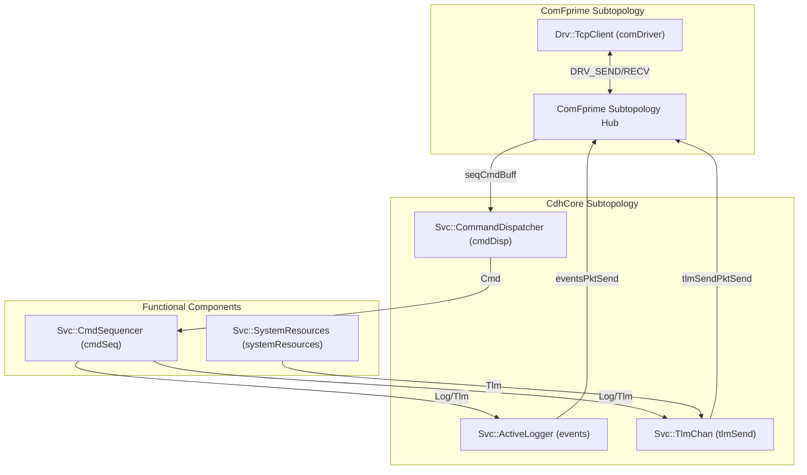
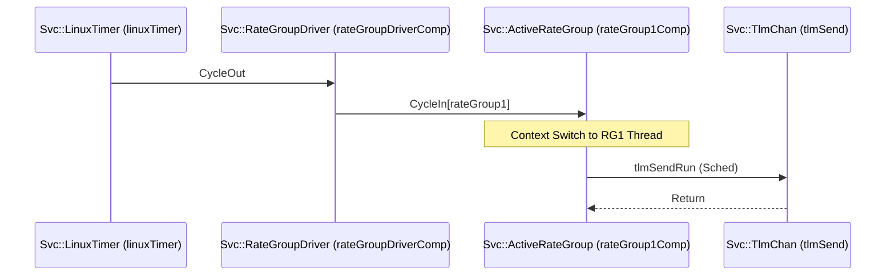

# Service Layer (Svc)

<details>
<summary>Relevant source files</summary>

The following files were used as context for generating this wiki page:

- [PfSocLinux/Top/PfSocLinuxTopologyDefs.hpp](PfSocLinux/Top/PfSocLinuxTopologyDefs.hpp)
- [PfSocLinux/Top/instances.fpp](PfSocLinux/Top/instances.fpp)
- [PfSocLinux/Top/topology.fpp](PfSocLinux/Top/topology.fpp)

</details>


The Service Layer provides the foundational infrastructure for the flight software (FSW) deployment on the PolarFire SoC. These components are standard F´ service implementations that handle command routing, event logging, telemetry storage, execution timing, and system health monitoring. In this deployment, these services facilitate the interaction between functional components and the Ground Data System (GDS) via the Linux userspace environment.

## 1. Command and Data Handling (C&DH) Flow

The C&DH infrastructure in the `PfSocLinux` deployment is organized into subtopologies, primarily the `CdhCore` and `ComFprime` modules [PfSocLinux/Top/topology.fpp:11-12](). These manage the flow of commands from the ground and the reporting of system state.

### 1.1 Command Dispatcher (`Svc::CommandDispatcher`)
The `CommandDispatcher` (instantiated as `CdhCore.cmdDisp`) is the central hub for all ground commands [PfSocLinux/Top/topology.fpp:28](). It receives encoded command packets and routes them to the appropriate component based on the OpCode.

*   **Registration**: Components register their commands with the dispatcher during system initialization.
*   **Dispatching**: The dispatcher invokes the `Cmd` input port on the target component. In this topology, it also supports sequenced commands via `cmdSeq` [PfSocLinux/Top/topology.fpp:78-79]().
*   **Execution**: It is triggered periodically by `rateGroup1Comp` to process its dispatch queue [PfSocLinux/Top/topology.fpp:49-50]().

### 1.2 Event Logger (`Svc::ActiveLogger`)
The `ActiveLogger` (instantiated as `CdhCore.events`) handles event reports (EVRs) from all components [PfSocLinux/Top/topology.fpp:29]().

*   **Buffering**: As an active component, it maintains an internal queue to buffer events, ensuring that high-frequency logging does not block the reporting component.
*   **Downlink**: Events are sent to the `ComFprime` subtopology for packetization and transmission to the GDS [PfSocLinux/Top/topology.fpp:74]().

### 1.3 Telemetry Database (`Svc::TlmChan`)
The `TlmChan` component (instantiated as `CdhCore.tlmSend`) serves as the database for system telemetry [PfSocLinux/Top/topology.fpp:30]().

*   **Writing**: Components push telemetry updates to `TlmChan` via their `Tlm` ports.
*   **Reading**: Periodically triggered by `rateGroup1Comp` [PfSocLinux/Top/topology.fpp:45](), it iterates through its database and sends the latest values to the `ComFprime` subtopology [PfSocLinux/Top/topology.fpp:75]().

### C&DH Data Flow Diagram

The following diagram illustrates the interaction between the core service components and the communication driver in the `PfSocLinux` topology.

"C&DH Service Layer Component Interaction"

**Sources:** [PfSocLinux/Top/topology.fpp:28-32](), [PfSocLinux/Top/topology.fpp:64-80](), [PfSocLinux/Top/instances.fpp:44-61]()

## 2. Rate Groups and Execution Timing

Timing is driven by a `Svc::LinuxTimer` which triggers a `Svc::RateGroupDriver` to distribute execution cycles across multiple `Svc::ActiveRateGroup` instances.

### 2.1 Rate Group Driver (`Svc::RateGroupDriver`)
The `rateGroupDriverComp` receives a heartbeat from `linuxTimer` [PfSocLinux/Top/topology.fpp:41]() and distributes it to three rate groups [PfSocLinux/Top/topology.fpp:44-57]().

### 2.2 Active Rate Groups (`Svc::ActiveRateGroup`)
Three active rate groups are defined with descending priorities to manage task execution [PfSocLinux/Top/instances.fpp:29-42]().

| Instance | Priority | Base ID | Key Scheduled Tasks |
| :--- | :--- | :--- | :--- |
| `rateGroup1Comp` | 43 | `0x10001000` | Telemetry Send, Com Queue, Command Dispatch [PfSocLinux/Top/topology.fpp:45-50]() |
| `rateGroup2Comp` | 42 | `0x10002000` | Command Sequencer, File Manager [PfSocLinux/Top/topology.fpp:53-55]() |
| `rateGroup3Comp` | 41 | `0x10003000` | Health Monitor, Data Product Managers [PfSocLinux/Top/topology.fpp:58-62]() |

"Rate Group Execution Logic"

**Sources:** [PfSocLinux/Top/topology.fpp:3-7](), [PfSocLinux/Top/topology.fpp:40-62](), [PfSocLinux/Top/instances.fpp:29-42]()

## 3. Health Monitoring (`Svc::Health`)

The `Svc::Health` component (instantiated as `CdhCore.$health`) performs watchdog monitoring of active components [PfSocLinux/Top/topology.fpp:32]().

### 3.1 Keep-Alive Heartbeats
During each execution cycle (driven by `rateGroup3Comp` [PfSocLinux/Top/topology.fpp:58]()), the Health component pings registered active components. In this deployment, the following components are monitored with specific thresholds:

| Monitored Component | Warning Threshold | Fatal Threshold |
| :--- | :--- | :--- |
| `rateGroup1Comp` | 3 missed pings | 5 missed pings |
| `rateGroup2Comp` | 3 missed pings | 5 missed pings |
| `rateGroup3Comp` | 3 missed pings | 5 missed pings |
| `cmdSeq` | 3 missed pings | 5 missed pings |

### 3.2 System Resource Monitoring
The `systemResources` component (Svc::SystemResources) is scheduled by `rateGroup1Comp` [PfSocLinux/Top/topology.fpp:47]() to collect Linux-level metrics such as CPU and memory usage, which are then reported as telemetry [PfSocLinux/Top/instances.fpp:57]().

"Health Check Configuration"
```mermaid
graph LR
    subgraph "Svc::Health (CdhCore.health)"
        H_COMP["Health Component"]
    end

    subgraph "Active Components (PingEntries)"
        RG1["rateGroup1Comp"]
        RG2["rateGroup2Comp"]
        RG3["rateGroup3Comp"]
        SEQ["cmdSeq"]
    end

    H_COMP <-->|Ping| RG1
    H_COMP <-->|Ping| RG2
    H_COMP <-->|Ping| RG3
    H_COMP <-->|Ping| SEQ

    Note right of RG1: WARN=3, FATAL=5
```
**Sources:** [PfSocLinux/Top/PfSocLinuxTopologyDefs.hpp:47-60](), [PfSocLinux/Top/topology.fpp:58](), [PfSocLinux/Top/instances.fpp:57]()

## 4. Summary of Key Service Instances

The following table maps the functional requirements to the specific instances defined in the `PfSocLinux` deployment.

| Function | Instance Name | Component Class |
| :--- | :--- | :--- |
| Command Routing | `CdhCore.cmdDisp` | `Svc::CommandDispatcher` |
| Event Handling | `CdhCore.events` | `Svc::ActiveLogger` |
| Telemetry Storage | `CdhCore.tlmSend` | `Svc::TlmChan` |
| Command Sequencing| `cmdSeq` | `Svc::CmdSequencer` |
| Task Scheduling | `rateGroup[1-3]Comp`| `Svc::ActiveRateGroup` |
| Watchdog | `CdhCore.$health` | `Svc::Health` |
| Timekeeping | `posixTime` | `Svc::PosixTime` |
| Resource Monitor | `systemResources` | `Svc::SystemResources` |

**Sources:** [PfSocLinux/Top/instances.fpp:29-62](), [PfSocLinux/Top/topology.fpp:11-26]()
