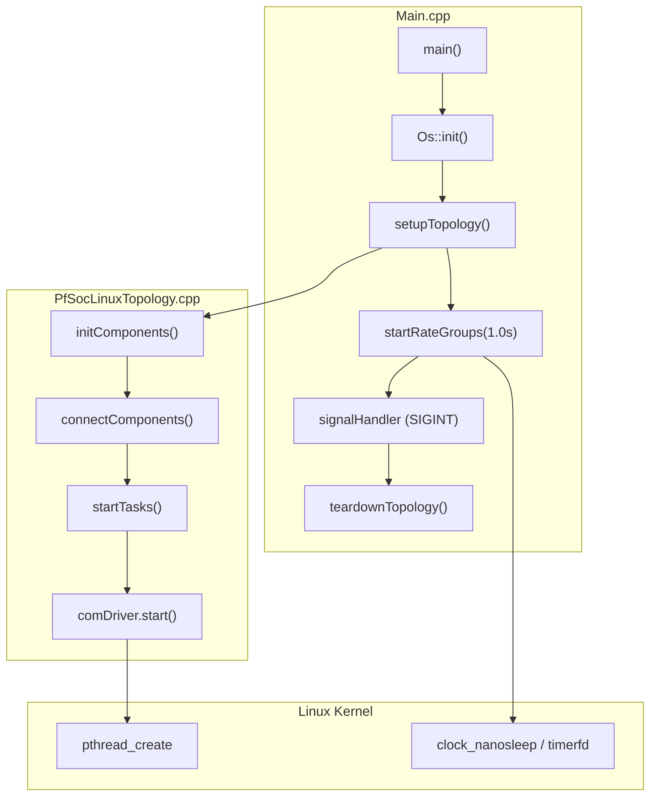
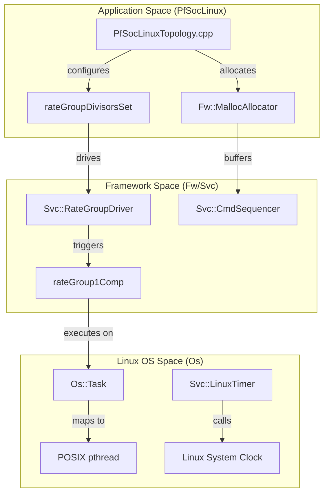

# Software Architecture and Execution

Relevant source files

The following files were used as context for generating this wiki page:

- [PfSocLinux/Main.cpp](PfSocLinux/Main.cpp)
- [PfSocLinux/Top/PfSocLinuxTopology.cpp](PfSocLinux/Top/PfSocLinuxTopology.cpp)

The `pfsoc-fsw-linux` deployment utilizes the F´ (F Prime) framework to provide a layered software architecture that abstracts the underlying Linux operating system on the PolarFire SoC. This page provides a high-level overview of how the flight software (FSW) is structured, how it leverages the Platform Adaptation Layer (PAL) for hardware independence, and how the execution flow is managed from startup to steady-state operations.

### System Layering Overview

The architecture is divided into three primary layers:
1.  **Application Layer (Top):** Contains project-specific components and the system topology defined in `PfSocLinux/Top/` [PfSocLinux/Top/PfSocLinuxTopology.cpp:1-66]().
2.  **Service Layer (Middle):** Provides standard F´ services such as command dispatching (`Svc::CommandDispatcher`), telemetry collection (`Svc::TlmChan`), and rate group management (`Svc::RateGroupDriver`) [PfSocLinux/Top/PfSocLinuxTopology.cpp:13-29]().
3.  **Platform Adaptation Layer (Bottom):** Maps framework-level abstractions (threads, mutexes, files) to Linux-specific system calls (pthreads, POSIX file I/O) via the `Os` namespace [PfSocLinux/Main.cpp:14-25]().

For an overview of the hardware this architecture runs on, see [PolarFire SoC Architecture](#2.1).

---

### Platform Adaptation Layer (PAL) and OS Abstraction

The FSW interacts with the Linux kernel through the `Os` namespace, which provides a consistent interface for core operating system services. In this deployment, the PAL translates F´ framework requirements into standard Linux/POSIX calls, ensuring that components can remain platform-agnostic.

*   **Task Management:** Uses `Os::Task` to wrap `pthread_create` for managing concurrent execution of Active components. The `comDriver` (a `Drv::TcpClient`) utilizes an `Os::TaskString` named `"ReceiveTask"` to manage its background thread [PfSocLinux/Top/PfSocLinuxTopology.cpp:44-47]().
*   **Memory Management:** Employs `Fw::MallocAllocator` for dynamic memory requirements, such as command sequence buffers [PfSocLinux/Top/PfSocLinuxTopology.cpp:11-28]().
*   **Timekeeping:** Interfaces with Linux system clocks via `Svc::LinuxTimer` to drive the system's execution cadence [PfSocLinux/Top/PfSocLinuxTopology.cpp:50-52]().

For details on how these abstractions are implemented for the RISC-V Linux environment, see [Platform Adaptation Layer (PAL) and OS Abstraction](#4.1).

**Sources:** [PfSocLinux/Top/PfSocLinuxTopology.cpp:11-47](), [PfSocLinux/Main.cpp:25-25]()

---

### Execution Flow and Startup Sequence

The execution of the FSW follows a deterministic sequence managed within `PfSocLinux/Main.cpp`. The lifecycle begins with the loading of the ELF binary and proceeds through a structured initialization phase.

#### Initialization Sequence
1.  **Entry Point:** The `main()` function initializes the OS abstraction layer via `Os::init()` [PfSocLinux/Main.cpp:24-25]().
2.  **Topology Setup:** `PfSocLinux::setupTopology()` handles component instantiation (`initComponents`), port interconnection (`connectComponents`), and task startup (`startTasks`) [PfSocLinux/Top/PfSocLinuxTopology.cpp:32-48]().
3.  **Steady State:** The system enters steady state when `PfSocLinux::startRateGroups()` is called with a `Fw::TimeInterval(1, 0)`, initiating a 1Hz base rate [PfSocLinux/Main.cpp:54-55]().
4.  **Teardown:** Upon receiving `SIGINT` or `SIGTERM`, the `signalHandler` stops the rate groups, leading to `PfSocLinux::teardownTopology()` which joins threads and deallocates buffers [PfSocLinux/Main.cpp:20-22](), [PfSocLinux/Top/PfSocLinuxTopology.cpp:58-65]().

**Execution Flow Mapping**

For a step-by-step walkthrough of the code responsible for this sequence, see [Execution Flow and Startup Sequence](#4.2).

**Sources:** [PfSocLinux/Main.cpp:20-58](), [PfSocLinux/Top/PfSocLinuxTopology.cpp:32-65]()

---

### Ground Data System (GDS) Communication

The FSW architecture includes a communication bridge to interface with the F´ GDS. This bridge is responsible for serializing framework data (Telemetry, Events, and Commands) and transmitting them over a network interface.

#### Communication Stack
The deployment uses a `comDriver` (typically a `Drv::TcpClient` or similar) configured with a hostname and port provided via command-line arguments `-a` and `-p` [PfSocLinux/Main.cpp:30-48]().

| Code Entity | Role |
| :--- | :--- |
| `comDriver` | Manages the TCP/IP socket connection to the GDS [PfSocLinux/Top/PfSocLinuxTopology.cpp:39-47](). |
| `COMM_PRIORITY` | Thread priority (34) for the communication receive task [PfSocLinux/Top/PfSocLinuxTopology.cpp:19-21](). |
| `hostname` / `port` | Network coordinates for the GDS connection [PfSocLinux/Main.cpp:47-48](). |

For details on the socket implementation and packet formats, see [Ground Data System (GDS) Communication](#4.3).

**Sources:** [PfSocLinux/Main.cpp:30-48](), [PfSocLinux/Top/PfSocLinuxTopology.cpp:19-47]()

---

### Architecture Bridge: Concept to Code

The following diagram illustrates how high-level architectural concepts map to specific entities within the F´ framework and the Linux userspace.

**System Entity Mapping**

**Sources:** [PfSocLinux/Top/PfSocLinuxTopology.cpp:11-28](), [PfSocLinux/Main.cpp:25-25]()
