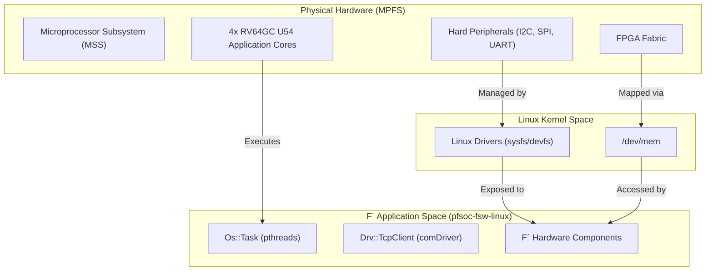

# Target Hardware: Microchip PolarFire SoC

Relevant source files

The following files were used as context for generating this wiki page:

- [.gitmodules](.gitmodules)

This page provides a high-level overview of the Microchip PolarFire SoC (MPFS) hardware platform and its role as the execution environment for the `pfsoc-fsw-linux` flight software deployment. The project leverages the MPFS's unique combination of a hardened RISC-V processor subsystem and programmable FPGA fabric.

## Hardware Platform Overview

The Microchip PolarFire SoC is the first SoC FPGA with a deterministic, coherent RISC-V CPU cluster. In this deployment, the F´ (F Prime) framework runs within a Linux userspace environment hosted on the application-class RISC-V cores. The software interacts with the underlying hardware through standard Linux system calls, drivers, and memory-mapped I/O.

### System Hierarchy and Code Mapping

The following diagram illustrates how the physical hardware components of the MPFS map to specific software entities and drivers within the `pfsoc-fsw-linux` codebase.

**Diagram: Hardware-to-Code Mapping**

**Sources:** [.gitmodules:5-7](), [README.md:1-3]()

---

## Processor Subsystem (MSS)

The core of the PolarFire SoC is the Microprocessor Subsystem (MSS). It features a five-core RISC-V CPU cluster, including one E51 monitor core and four U54 application cores. This deployment targets the U54 cores running a Linux distribution.

The F´ framework treats these cores as a symmetric multi-processing (SMP) environment. Threading is handled via the `Os::Task` abstraction, which maps to Linux `pthreads`. This allows the flight software to distribute active components across the available RISC-V cores, managed by the Linux scheduler.

For details on the CPU architecture, memory map, and RISC-V specific configurations, see [PolarFire SoC Architecture](#2.1).

**Sources:** [.gitmodules:1-3](), [README.md:1-3]()

---

## Hardware Interaction Layer

The flight software interacts with MPFS-specific hardware through several Linux-mediated pathways. Unlike bare-metal deployments, `pfsoc-fsw-linux` utilizes the standard Linux filesystem and device nodes to abstract hardware complexity.

### Interaction Methods
| Method | Target Hardware | F´ Implementation Strategy |
| :--- | :--- | :--- |
| **Standard Drivers** | I2C, SPI, UART | Wrapped in F´ Driver components using `read()`, `write()`, and `ioctl()` |
| **Sysfs/Devfs** | GPIO, PWM | Accessed via file I/O operations on `/sys/class/gpio` or similar |
| **Memory Mapping** | FPGA Fabric Registers | Direct access using `mmap()` on `/dev/mem` for high-performance fabric interaction |

Detailed information on component implementation and peripheral access can be found in [Hardware Interfaces and Drivers](#2.2).

**Sources:** [.gitmodules:5-7](), [README.md:1-3]()

---

## Related Documentation

*   **[PolarFire SoC Architecture](#2.1):** Deep dive into the MSS, U54 cores, and memory coherency.
*   **[Hardware Interfaces and Drivers](#2.2):** Technical details on implementing F´ drivers for MPFS peripherals.
*   **[F´ Framework Architecture](#3):** How the framework utilizes these hardware resources.
