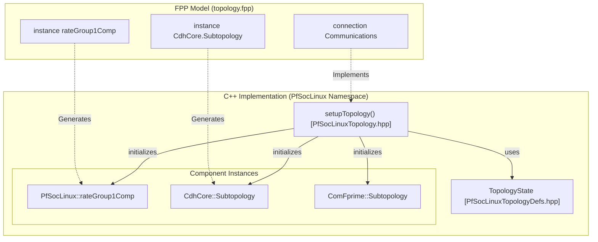
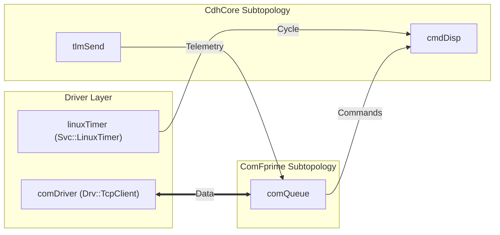

# Topology and Deployment

Relevant source files

The following files were used as context for generating this wiki page:

- [PfSocLinux/Top/PfSocLinuxPackets.fppi](PfSocLinux/Top/PfSocLinuxPackets.fppi)
- [PfSocLinux/Top/PfSocLinuxTopology.hpp](PfSocLinux/Top/PfSocLinuxTopology.hpp)
- [PfSocLinux/Top/PfSocLinuxTopologyDefs.hpp](PfSocLinux/Top/PfSocLinuxTopologyDefs.hpp)
- [PfSocLinux/Top/topology.fpp](PfSocLinux/Top/topology.fpp)

In the F´ framework, a **Deployment** represents a single executable binary that contains a specific set of component instances and their interconnections. The **Topology** is the static graph defining how these component instances communicate via ports. In the `pfsoc-fsw-linux` project, the topology is defined using the F´ Prime (FPP) modeling language and instantiated at runtime through a standardized initialization sequence in the `PfSocLinux` namespace.

## System Deployment Concept

A deployment in F´ is a self-contained system with a defined entry point. For the PolarFire SoC Linux target, this results in a standard Linux userspace executable. The deployment defines which hardware drivers, service components (like command dispatch and telemetry), and application-specific logic are included.

### Key Deployment Characteristics
*   **Static Allocation:** All component instances are instantiated at startup and exist for the lifetime of the process.
*   **Port Mapping:** Connections between components are established during the initialization phase via `setupTopology` [PfSocLinux/Top/PfSocLinuxTopology.hpp:11]().
*   **Subtopology Pattern:** The `PfSocLinux` topology leverages modular subtopologies: `CdhCore`, `ComFprime`, `DataProducts`, and `FileHandling` [PfSocLinux/Top/topology.fpp:11-14]().

**Sources:** [PfSocLinux/Top/topology.fpp:1-15](), [PfSocLinux/Top/PfSocLinuxTopology.hpp:10-16]()

## Topology Definition and Code Generation

The topology is modeled in `topology.fpp`, which the F´ build system uses to generate C++ code. This generated code handles the boilerplate of instantiating the component classes and connecting ports.

### The `TopologyState` and `PingEntries`
The deployment uses a `TopologyState` struct to carry configuration such as the hostname and port for TCP communication, as well as the nested states for each subtopology [PfSocLinux/Top/PfSocLinuxTopologyDefs.hpp:73-80](). Additionally, `PingEntries` define the health monitoring thresholds (WARN and FATAL) for active components like rate groups and the command sequencer [PfSocLinux/Top/PfSocLinuxTopologyDefs.hpp:47-60]().

### Component Instance Mapping
The following diagram illustrates how the FPP model entities correspond to the C++ implementation used on the PolarFire SoC.

**Deployment Entity Mapping**

**Sources:** [PfSocLinux/Top/PfSocLinuxTopologyDefs.hpp:47-80](), [PfSocLinux/Top/topology.fpp:9-25](), [PfSocLinux/Top/PfSocLinuxTopology.hpp:10-15]()

## Port Connections and Data Flow

The topology defines the "wiring" of the system across several functional groups: Rate Groups, Communications, and cross-subtopology links.

### Primary Connection Groups
*   **RateGroups:** The `linuxTimer` drives the `rateGroupDriverComp`, which distributes cycles to three distinct rate groups [PfSocLinux/Top/topology.fpp:41-62]().
*   **Communications:** Links the `comDriver` (TCP/UDP) to the `ComFprime` subtopology for ground data system interaction [PfSocLinux/Top/topology.fpp:64-71]().
*   **Subtopology Interconnects:** 
    *   `ComFprime_CdhCore`: Routes commands from ground/sequencer to the dispatcher and telemetry/events back to the comms stack [PfSocLinux/Top/topology.fpp:73-80]().
    *   `ComFprime_FileHandling`: Handles file uplink and downlink buffer exchanges [PfSocLinux/Top/topology.fpp:82-87]().
    *   `FileHandling_DataProducts`: Connects the Data Product cataloger to the file downlink system [PfSocLinux/Top/topology.fpp:89-92]().

### System Data Flow Topology

**Sources:** [PfSocLinux/Top/topology.fpp:40-93]()

## Telemetry Packet Definitions

To optimize downlink bandwidth, telemetry channels are grouped into packets in `PfSocLinuxPackets.fppi`. This allows the FSW to send related data together rather than as individual updates.

| Packet Name | ID | Group | Key Contents |
| :--- | :--- | :--- | :--- |
| **CDH** | 1 | 1 | Command counts, file transfer stats, queue depths [PfSocLinux/Top/PfSocLinuxPackets.fppi:3-25]() |
| **CDHErrors** | 2 | 1 | Health pings, dropped commands, cycle slips [PfSocLinux/Top/PfSocLinuxPackets.fppi:27-42]() |
| **SystemRes** | 5/6 | 2 | CPU usage (per core 0-15) and Memory/NV stats [PfSocLinux/Top/PfSocLinuxPackets.fppi:44-69]() |
| **DataProducts** | 21 | 3 | DP Manager allocations, writer success/fail, buffer stats [PfSocLinux/Top/PfSocLinuxPackets.fppi:71-91]() |
| **Version** | 22-37| 2 | Framework, Project, Library, and Custom version strings [PfSocLinux/Top/PfSocLinuxPackets.fppi:93-162]() |

**Sources:** [PfSocLinux/Top/PfSocLinuxPackets.fppi:1-166]()

## Execution Entry Point

The deployment lifecycle is managed through the `PfSocLinux` namespace functions:
1.  **Setup:** `setupTopology(state)` initializes all components and ports [PfSocLinux/Top/PfSocLinuxTopology.hpp:11]().
2.  **Execution:** `startRateGroups(interval)` begins the execution of periodic tasks [PfSocLinux/Top/PfSocLinuxTopology.hpp:13]().
3.  **Teardown:** `stopRateGroups()` and `teardownTopology(state)` ensure a graceful exit by stopping threads and releasing resources [PfSocLinux/Top/PfSocLinuxTopology.hpp:12-14]().

**Sources:** [PfSocLinux/Top/PfSocLinuxTopology.hpp:10-15]()
