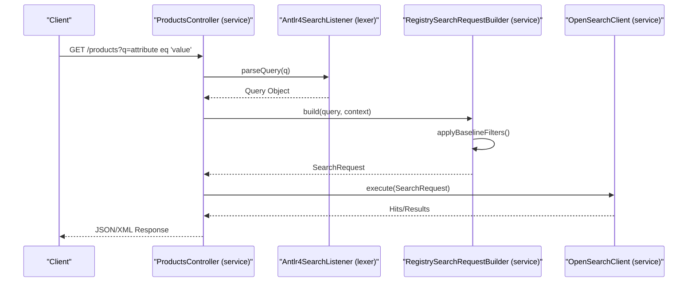

# Page: Architecture Overview

# Architecture Overview

<details>
<summary>Relevant source files</summary>

The following files were used as context for generating this wiki page:

- [.github/CODEOWNERS](.github/CODEOWNERS)
- [.gitignore](.gitignore)
- [LICENSE.md](LICENSE.md)
- [NOTICE.txt](NOTICE.txt)
- [README.md](README.md)
- [SECURITY.md](SECURITY.md)
- [lexer/pom.xml](lexer/pom.xml)
- [model/pom.xml](model/pom.xml)
- [pom.xml](pom.xml)
- [service/pom.xml](service/pom.xml)
- [service/src/main/java/gov/nasa/pds/api/registry/ConnectionContext.java](service/src/main/java/gov/nasa/pds/api/registry/ConnectionContext.java)
- [service/src/main/java/gov/nasa/pds/api/registry/SpringBootMain.java](service/src/main/java/gov/nasa/pds/api/registry/SpringBootMain.java)
- [service/src/main/java/gov/nasa/pds/api/registry/model/EntityProduct.java](service/src/main/java/gov/nasa/pds/api/registry/model/EntityProduct.java)
- [service/src/main/java/gov/nasa/pds/api/registry/search/OpenSearchConfig.java](service/src/main/java/gov/nasa/pds/api/registry/search/OpenSearchConfig.java)
- [service/src/main/java/gov/nasa/pds/api/registry/search/OpenSearchRegistryConnectionImplBuilder.java](service/src/main/java/gov/nasa/pds/api/registry/search/OpenSearchRegistryConnectionImplBuilder.java)
- [service/src/main/java/gov/nasa/pds/api/registry/search/OpenSearchRegistryConnectionNewImpl.java](service/src/main/java/gov/nasa/pds/api/registry/search/OpenSearchRegistryConnectionNewImpl.java)
- [service/src/test/java/gov/nasa/pds/api/registry/opensearch/RegistrySearchRequestBuilderTest.java](service/src/test/java/gov/nasa/pds/api/registry/opensearch/RegistrySearchRequestBuilderTest.java)

</details>


The Registry API is built on a multi-module Maven architecture designed to separate the concerns of API definition, search query parsing, and service implementation. It provides a RESTful interface to the PDS Registry, leveraging OpenSearch as the primary data store.

## Multi-Module Structure

The project is divided into three distinct Maven modules, as defined in the root [pom.xml:77-81]().

| Module | Purpose | Key Technologies |
| :--- | :--- | :--- |
| **`model`** | API definition and DTOs | OpenAPI 3.0, Spring Boot, Jackson |
| **`lexer`** | Search query string parsing | ANTLR4 |
| **`service`** | Application logic and OpenSearch integration | Spring Boot, OpenSearch Java Client |

### Module Interdependencies

The dependency flow is unidirectional to maintain a clean separation of concerns. The `service` module acts as the aggregator, depending on both `model` and `lexer` to fulfill its requirements.

```mermaid
graph TD
    subgraph "Registry API Project"
        [service] --> [model]
        [service] --> [lexer]
        [model] -.-> |"Generated Interfaces"| [service]
        [lexer] -.-> |"Query Parsing"| [service]
    end

    [service] --> [OpenSearch]
    [Client] --> |"REST/JSON"| [service]

    style [service] stroke-width:2px
    style [model] stroke-dasharray: 5 5
    style [lexer] stroke-dasharray: 5 5
```
**Sources:** [pom.xml:77-81](), [README.md:8-12]()

---

## Component Overviews

### Lexer Module — Search Query Grammar
The `lexer` module handles the translation of the `q` parameter in API requests into structured query objects. It uses an ANTLR4 grammar to support complex logical expressions and comparison operators (e.g., `eq`, `ne`, `like`, `and`, `or`).

For details, see [Lexer Module — Search Query Grammar](#2.1).

**Sources:** [lexer/pom.xml:96-106](), [README.md:9]()

### Model Module — OpenAPI Code Generation
The `model` module is the "Source of Truth" for the API surface. It uses the `openapi-generator-maven-plugin` to ingest a `swagger.yml` specification and generate Spring `@Controller` interfaces and Data Transfer Objects (DTOs). This ensures the implementation always matches the published PDS API specification.

For details, see [Model Module — OpenAPI Code Generation](#2.2).

**Sources:** [model/pom.xml:54-86](), [README.md:10]()

### Service Module — Spring Boot Application
The `service` module contains the business logic, OpenSearch query construction, and the Spring Boot entry point. It implements the interfaces generated by the `model` module and utilizes the `lexer` to build OpenSearch DSL queries.

For details, see [Service Module — Spring Boot Application](#2.3).

**Sources:** [service/pom.xml:61-84](), [README.md:11]()

---

## Request Lifecycle

The following diagram illustrates how a request flows through the system, bridging the gap between HTTP endpoints and the underlying Java implementation.

### End-to-End Search Flow



1.  **Entry Point**: The application starts via `SpringBootMain` [service/src/main/java/gov/nasa/pds/api/registry/SpringBootMain.java:25-50]().
2.  **Configuration**: OpenSearch connection details are managed by `OpenSearchConfig` [service/src/main/java/gov/nasa/pds/api/registry/search/OpenSearchConfig.java:19]() and instantiated via `OpenSearchRegistryConnectionNewImpl` [service/src/main/java/gov/nasa/pds/api/registry/search/OpenSearchRegistryConnectionNewImpl.java:51]().
3.  **Connection Management**: The `ConnectionContext` interface defines how the service interacts with the search cluster [service/src/main/java/gov/nasa/pds/api/registry/ConnectionContext.java:7-24]().

**Sources:** [service/src/main/java/gov/nasa/pds/api/registry/SpringBootMain.java:25-50](), [service/src/main/java/gov/nasa/pds/api/registry/search/OpenSearchRegistryConnectionNewImpl.java:51-171](), [service/src/main/java/gov/nasa/pds/api/registry/ConnectionContext.java:7-24]()
