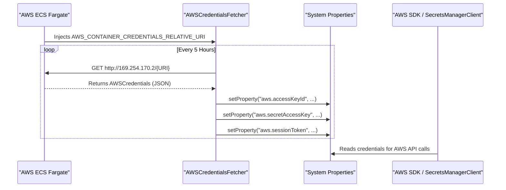
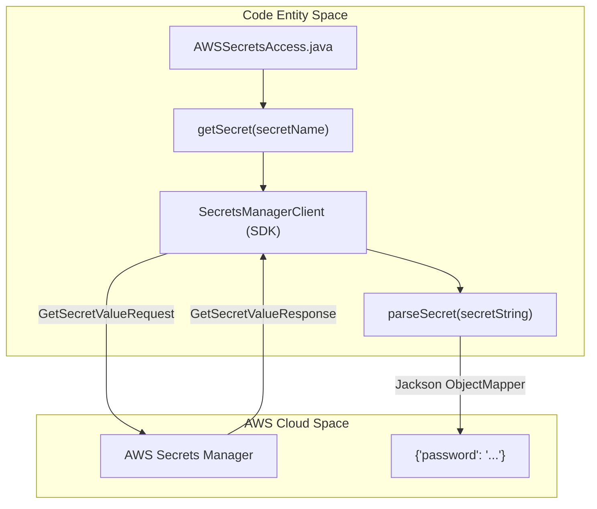

# Page: AWS Integration — Secrets and Credentials

# AWS Integration — Secrets and Credentials

Relevant source files

The following files were used as context for generating this wiki page:

- [docker/Dockerfile](docker/Dockerfile)
- [lexer/README.md](lexer/README.md)
- [service/src/main/java/gov/nasa/pds/api/registry/configuration/AWSSecretsAccess.java](service/src/main/java/gov/nasa/pds/api/registry/configuration/AWSSecretsAccess.java)
- [service/src/main/java/gov/nasa/pds/api/registry/controllers/HealthController.java](service/src/main/java/gov/nasa/pds/api/registry/controllers/HealthController.java)
- [service/src/main/java/gov/nasa/pds/api/registry/util/AWSCredentialsFetcher.java](service/src/main/java/gov/nasa/pds/api/registry/util/AWSCredentialsFetcher.java)
- [service/src/main/resources/application.properties.docker](service/src/main/resources/application.properties.docker)
- [service/src/main/resources/application.properties.local](service/src/main/resources/application.properties.local)
- [service/src/main/resources/static/logo.svg](service/src/main/resources/static/logo.svg)
- [service/src/main/resources/swagger-ui/pds.css](service/src/main/resources/swagger-ui/pds.css)
- [service/src/test/java/gov/nasa/pds/api/registry/configuration/AWSSecretsAccessTest.java](service/src/test/java/gov/nasa/pds/api/registry/configuration/AWSSecretsAccessTest.java)

The Registry API provides robust integration with Amazon Web Services (AWS) to support cloud-native deployments, particularly when hosted within an ECS Fargate environment and connecting to an AWS OpenSearch Service. This integration handles two primary security concerns: the automated rotation of temporary IAM credentials for containerized tasks and the retrieval of sensitive connection parameters (like OpenSearch passwords) from AWS Secrets Manager.

## Credential Management Lifecycle

When running in an AWS environment, the service must authenticate with other AWS services. The `AWSCredentialsFetcher` class manages the lifecycle of these credentials by interacting with the AWS Task Metadata Service.

### AWSCredentialsFetcher
The `AWSCredentialsFetcher` is a Spring `@Component` that automates the retrieval of temporary security credentials [service/src/main/java/gov/nasa/pds/api/registry/util/AWSCredentialsFetcher.java:58-60](). It relies on the environment variable `AWS_CONTAINER_CREDENTIALS_RELATIVE_URI`, which is automatically injected by AWS ECS [service/src/main/java/gov/nasa/pds/api/registry/util/AWSCredentialsFetcher.java:70-72]().

**Key Behaviors:**
*   **Automated Refresh:** It uses a `@Scheduled` task to renew credentials every 5 hours [service/src/main/java/gov/nasa/pds/api/registry/util/AWSCredentialsFetcher.java:67-68]().
*   **Metadata Interaction:** It queries the local AWS credential server at `169.254.170.2` [service/src/main/java/gov/nasa/pds/api/registry/util/AWSCredentialsFetcher.java:64-75]().
*   **System Property Injection:** Once fetched, the `AccessKeyId`, `SecretAccessKey`, and `Token` are mapped to standard AWS Java SDK system properties (`aws.accessKeyId`, `aws.secretAccessKey`, `aws.sessionToken`) [service/src/main/java/gov/nasa/pds/api/registry/util/AWSCredentialsFetcher.java:82-86]().

### Data Flow: ECS Credential Retrieval
The following diagram illustrates how `AWSCredentialsFetcher` populates the system environment for the AWS SDK.

**AWS Credential Resolution Flow**

Sources: [service/src/main/java/gov/nasa/pds/api/registry/util/AWSCredentialsFetcher.java:62-97]()

## AWS Secrets Manager Integration

For sensitive configuration data that should not be stored in plaintext property files (such as OpenSearch administrative passwords), the API utilizes `AWSSecretsAccess`.

### AWSSecretsAccess
This class provides a wrapper around the `SecretsManagerClient` to retrieve and parse secrets [service/src/main/java/gov/nasa/pds/api/registry/configuration/AWSSecretsAccess.java:21-36]().

*   **Default Region:** It defaults to `us-west-2` for secret lookups [service/src/main/java/gov/nasa/pds/api/registry/configuration/AWSSecretsAccess.java:24-36]().
*   **Parsing Logic:** The `parseSecret` method expects a JSON string from Secrets Manager. It extracts a single key-value pair and returns it as a `DefaultKeyValue<String, String>` [service/src/main/java/gov/nasa/pds/api/registry/configuration/AWSSecretsAccess.java:61-91]().
*   **Error Handling:** If multiple fields are found in a single secret string, it throws a `RuntimeException` to ensure configuration clarity [service/src/main/java/gov/nasa/pds/api/registry/configuration/AWSSecretsAccess.java:71-75]().

**Entity Mapping: Secrets Access**

Sources: [service/src/main/java/gov/nasa/pds/api/registry/configuration/AWSSecretsAccess.java:33-58](), [service/src/main/java/gov/nasa/pds/api/registry/configuration/AWSSecretsAccess.java:61-80]()

## Configuration and IAM Requirements

### Profile Selection
While the codebase includes `application.properties.local` and `application.properties.docker` for standard deployments [service/src/main/resources/application.properties.local:1-21](), [service/src/main/resources/application.properties.docker:1-33](), AWS-specific deployments typically utilize environment variables or specialized profiles to trigger the `AWSCredentialsFetcher`.

### IAM Role Requirements
For the integration to function within AWS, the ECS Task Execution Role and the Task Role must have the following permissions:

| Permission | Purpose |
| :--- | :--- |
| `secretsmanager:GetSecretValue` | Required by `AWSSecretsAccess` to retrieve OpenSearch credentials [service/src/main/java/gov/nasa/pds/api/registry/configuration/AWSSecretsAccess.java:50-51](). |
| `kms:Decrypt` | Required if the secret in Secrets Manager is encrypted with a customer-managed key. |
| `ecs-tasks.amazonaws.com` trust | Required for the task to assume the role and access the metadata URI [service/src/main/java/gov/nasa/pds/api/registry/util/AWSCredentialsFetcher.java:70-75](). |

### Docker and Environment Setup
The `Dockerfile` is configured to support high-memory Java operations suitable for AWS instances, setting `JAVA_OPTS` to `-Xmx6144m -Xms512m` [docker/Dockerfile:79](). It also installs `curl`, which is used for health checks and connectivity testing within the cloud environment [docker/Dockerfile:64-66]().

Sources: [docker/Dockerfile:60-85](), [service/src/main/java/gov/nasa/pds/api/registry/configuration/AWSSecretsAccess.java:44-54](), [service/src/main/java/gov/nasa/pds/api/registry/util/AWSCredentialsFetcher.java:17-54]()
