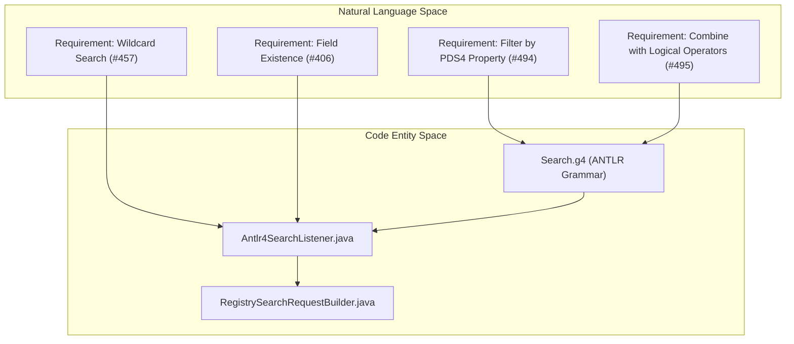
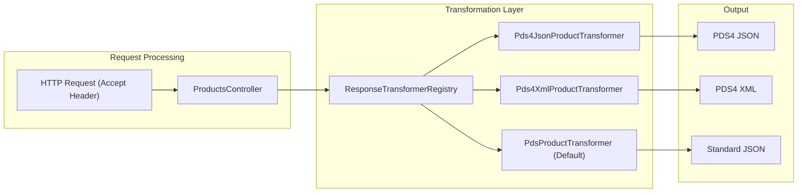

# Page: Changelog and Requirements History

# Changelog and Requirements History

Relevant source files

The following files were used as context for generating this wiki page:

- [CHANGELOG.md](CHANGELOG.md)
- [docs/requirements/v1.0.2/REQUIREMENTS.md](docs/requirements/v1.0.2/REQUIREMENTS.md)
- [docs/requirements/v1.6.0/REQUIREMENTS.md](docs/requirements/v1.6.0/REQUIREMENTS.md)
- [docs/requirements/v1.6.1/REQUIREMENTS.md](docs/requirements/v1.6.1/REQUIREMENTS.md)

This page provides a summary of the major version milestones, feature evolution, and the history of requirements for the NASA PDS Registry API. It details how the system transitioned from a basic registry interface to a complex search engine supporting PDS4-specific metadata formats and advanced query logic.

## Major Version Milestones

The Registry API has evolved through several significant versions, each introducing critical architectural components or satisfying new user requirements.

### Version 1.6.0 Series (2025-2026)
This series focused on stabilizing production stability and expanding the range of supported PDS4 response formats.
*   **Enhanced PDS4 Support**: Added support for `application/vnd.nasa.pds.pds4+json` and `application/vnd.nasa.pds.pds4+xml` content types [CHANGELOG.md:51-53]().
*   **Search Improvements**: Introduced the ability to query for the existence of specific search fields [CHANGELOG.md:10]() and improved the "search-after" pagination mechanism [CHANGELOG.md:20]().
*   **Logging & Observability**: Implemented full OpenSearch query logging to assist application support in debugging [CHANGELOG.md:50]().

### Version 1.5.0 (2024)
A major milestone that introduced the dynamic properties endpoint and advanced filtering.
*   **Dynamic Metadata**: Added the `/properties` endpoint to allow users to discover searchable PDS4 properties [CHANGELOG.md:82]().
*   **Complex Queries**: Enabled logical operators (AND, OR, NOT) for combining comparison operators in search strings [CHANGELOG.md:84-85]().
*   **Class-based Search**: Introduced the `/classes/{class}` endpoint to filter products by their PDS4 product class [CHANGELOG.md:81]().

### Version 1.0.x (Early History)
Focused on establishing the core RESTful structure and initial performance targets.
*   **Performance Targets**: Established a goal of 1-second average response time for wildcard queries [docs/requirements/v1.0.2/REQUIREMENTS.md:7]().
*   **Pagination**: Introduced initial pagination support to handle large result sets [docs/requirements/v1.0.2/REQUIREMENTS.md:95]().

---

## Evolution of Search Requirements

The transition from simple keyword search to a full-featured PDS4 domain-specific query language is documented through the requirements history.

### From Requirements to Code Entities
The following diagram illustrates how natural language requirements for search evolved into specific code implementations within the Lexer and Service modules.

**Search Evolution Mapping**

**Sources:** [CHANGELOG.md:84-85](), [CHANGELOG.md:10](), [docs/requirements/v1.6.1/REQUIREMENTS.md:7]()

---

## Response Format Evolution

The Registry API has significantly expanded its content negotiation capabilities to support diverse client needs, moving beyond standard JSON to domain-specific PDS4 formats.

| Format Identifier | Description | Milestone |
| :--- | :--- | :--- |
| `application/json` | Default JSON representation of registry objects. | v1.0.0 |
| `application/xml` | Standard XML representation. | v1.6.0 |
| `application/vnd.nasa.pds.pds4+json` | PDS4 label metadata transformed into JSON. | v1.6.0 |
| `application/vnd.nasa.pds.pds4+xml` | PDS4 label metadata in its native XML format. | v1.6.0 |
| `text/csv` | Comma-separated values for spreadsheet integration. | v1.5.0 |

**Content Negotiation Implementation**

**Sources:** [CHANGELOG.md:51-53](), [CHANGELOG.md:19]()

---

## Requirements Traceability (Summary)

The project maintains versioned requirement documents in `docs/requirements/`. These documents track the "Impact" of specific versions on long-standing architectural goals.

### Performance and Stability Requirements
*   **Response Time**: The system consistently targets < 1 second for standard queries [docs/requirements/v1.6.1/REQUIREMENTS.md:55]().
*   **Long-running Queries**: Mechanisms for handling queries exceeding 10 seconds were established early to prevent service exhaustion [docs/requirements/v1.0.2/REQUIREMENTS.md:11]().
*   **Error Management**: Transitioned to centralized error handling using Spring `@ControllerAdvice` to ensure consistent 500 error reporting and user guidance [CHANGELOG.md:26](), [docs/requirements/v1.0.2/REQUIREMENTS.md:83]().

### Data Integrity and Versioning
*   **Latest vs All**: A recurring requirement was the ability to distinguish between the "latest" version of a product and "all" versions in search results [docs/requirements/v1.6.1/REQUIREMENTS.md:111-115](). This led to the implementation of `excludeSupersededProducts` logic in the `RegistrySearchRequestBuilder`.
*   **LID/LIDVID Resolution**: Requirements for consistent handling of Logical Identifiers (LID) and Versioned Identifiers (LIDVID) across different endpoints (bundles, collections, products) [docs/requirements/v1.0.2/REQUIREMENTS.md:87]().

**Sources:** [CHANGELOG.md:1-92](), [docs/requirements/v1.0.2/REQUIREMENTS.md:1-98](), [docs/requirements/v1.6.1/REQUIREMENTS.md:1-150]()
