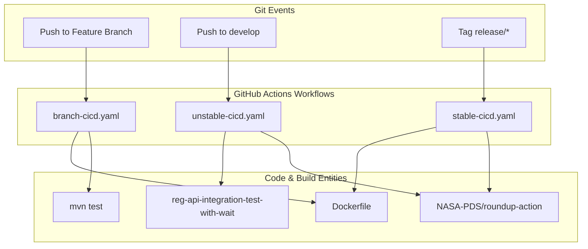
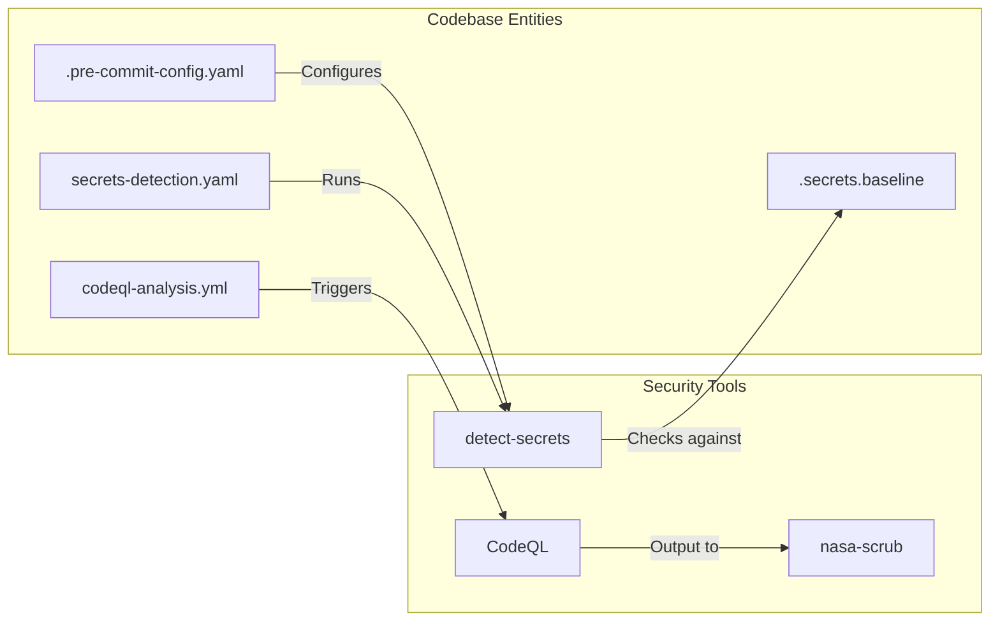

# Page: CI/CD and Developer Workflows

# CI/CD and Developer Workflows

Relevant source files

The following files were used as context for generating this wiki page:

- [.github/workflows/branch-cicd.yaml](.github/workflows/branch-cicd.yaml)
- [.github/workflows/codeql-analysis.yml](.github/workflows/codeql-analysis.yml)
- [.github/workflows/secrets-detection.yaml](.github/workflows/secrets-detection.yaml)
- [.github/workflows/stable-cicd.yaml](.github/workflows/stable-cicd.yaml)
- [.github/workflows/unstable-cicd.yaml](.github/workflows/unstable-cicd.yaml)
- [.pre-commit-config.yaml](.pre-commit-config.yaml)
- [.secrets.baseline](.secrets.baseline)

This page provides a high-level overview of the automation pipelines, security gating, and developer workflows used in the Registry API project. The system utilizes GitHub Actions to manage a multi-tiered CI/CD strategy that ensures code quality, security compliance, and automated deployment.

## CI/CD Pipeline Tiers

The Registry API employs three distinct pipeline tiers based on the branch and event type. All pipelines leverage a shared Maven caching strategy using `actions/cache@v5` to optimize build times by hashing `pom.xml` files [ .github/workflows/branch-cicd.yaml:49-57 ]().

### 1. Branch Validation (Pre-merge)
Triggered on pushes to any branch except `main` or `develop`. It focuses on rapid feedback for developers by running unit tests and verifying the build [ .github/workflows/branch-cicd.yaml:15-21 ]().
*   **Key Tasks**: `mvn test`, `mvn package`, and Docker image construction [ .github/workflows/branch-cicd.yaml:68-84 ]().
*   **Compatibility**: Runs the `pds-deep-registry-archive` tool to ensure compatibility with PDS deep archive requirements [ .github/workflows/branch-cicd.yaml:117-122 ]().

### 2. Unstable Delivery (Develop)
Triggered on pushes to the `develop` branch. This tier handles the integration of new features into the development environment [ .github/workflows/unstable-cicd.yaml:32-35 ]().
*   **Artifacts**: Publishes a snapshot Docker image to Docker Hub with the `:develop` tag [ .github/workflows/unstable-cicd.yaml:101-109 ]().
*   **Testing**: Executes full integration tests by cloning the PDS Registry, generating certificates, and running the `reg-api-integration-test-with-wait` container via Docker Compose [ .github/workflows/unstable-cicd.yaml:111-124 ]().

### 3. Stable Release (Main/Tags)
Triggered by tags matching the `release/*` pattern [ .github/workflows/stable-cicd.yaml:34-37 ]().
*   **Deployment**: Uses the `NASA-PDS/roundup-action` to deploy versioned artifacts to the Maven Central Repository [ .github/workflows/stable-cicd.yaml:71-83 ]().
*   **Docker**: Builds and pushes multi-architecture images (`linux/amd64`, `linux/arm64`) to Docker Hub with tags derived from the release version [ .github/workflows/stable-cicd.yaml:103-111 ]().

For detailed configuration of these tiers, see **[CI/CD Pipelines](#8.1)**.

---

## Security Scanning and Code Quality

Security is integrated directly into the workflow through automated scanning and pre-commit hooks.

### CodeQL Analysis
The project runs a weekly CodeQL analysis to identify vulnerabilities and coding errors [ .github/workflows/codeql-analysis.yml:4-5 ]().
*   **Suites**: Utilizes `security-and-quality` and `security-extended` query suites [ .github/workflows/codeql-analysis.yml:37 ]().
*   **Reporting**: Results are translated into the `SCRUB` format for internal NASA compliance reporting [ .github/workflows/codeql-analysis.yml:64-75 ]().

### Secret Detection
A robust secret detection mechanism prevents sensitive information (keys, tokens, emails) from entering the repository.
*   **Baseline**: Uses a `.secrets.baseline` file to track known non-secret strings (e.g., false positives in `pom.xml` or `application.properties`) [ .secrets.baseline:1-222 ]().
*   **Workflow**: The `secrets-detection.yaml` workflow compares a fresh scan against the baseline; any new detections will fail the build [ .github/workflows/secrets-detection.yaml:58-69 ]().
*   **Local Enforcement**: Developers can use `pre-commit` hooks to run `detect-secrets` locally before pushing code [ .pre-commit-config.yaml:18-31 ]().

For details on security suites and baseline management, see **[Security Scanning and Code Quality](#8.2)**.

---

## Workflow Integration Diagrams

### Pipeline Execution Logic
The following diagram illustrates how different git events trigger specific pipeline behaviors and code entities.

**Sources:** [ .github/workflows/branch-cicd.yaml:15-21 ](), [ .github/workflows/unstable-cicd.yaml:32-35 ](), [ .github/workflows/stable-cicd.yaml:34-37 ]()

### Security Gating Architecture
This diagram maps the security tools to the files and processes they monitor.

**Sources:** [ .github/workflows/codeql-analysis.yml:33-37 ](), [ .github/workflows/secrets-detection.yaml:47-55 ](), [ .pre-commit-config.yaml:18-31 ](), [ .secrets.baseline:1-20 ]()

---

## Developer Quick Links
*   **Build System**: Managed via Maven (`pom.xml`).
*   **Local Testing**: Developers should run `mvn test` before pushing to trigger the `branch-cicd.yaml` logic locally.
*   **Environment**: Java 17/21 is the standard across all CI environments [ .github/workflows/branch-cicd.yaml:38 ](), [ .github/workflows/unstable-cicd.yaml:76 ]().

**Sources:**
*   [ .github/workflows/branch-cicd.yaml:1-126 ]()
*   [ .github/workflows/unstable-cicd.yaml:1-127 ]()
*   [ .github/workflows/stable-cicd.yaml:1-115 ]()
*   [ .github/workflows/codeql-analysis.yml:1-115 ]()
*   [ .github/workflows/secrets-detection.yaml:1-71 ]()
*   [ .secrets.baseline:1-222 ]()
*   [ .pre-commit-config.yaml:1-36 ]()
