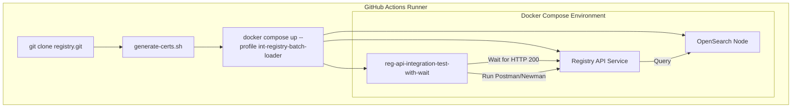
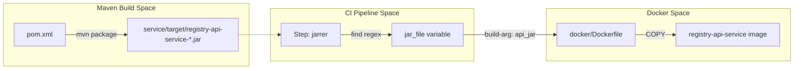

# Page: CI/CD Pipelines

# CI/CD Pipelines

<details>
<summary>Relevant source files</summary>

The following files were used as context for generating this wiki page:

- [.github/workflows/branch-cicd.yaml](.github/workflows/branch-cicd.yaml)
- [.github/workflows/codeql-analysis.yml](.github/workflows/codeql-analysis.yml)
- [.github/workflows/secrets-detection.yaml](.github/workflows/secrets-detection.yaml)
- [.github/workflows/stable-cicd.yaml](.github/workflows/stable-cicd.yaml)
- [.github/workflows/unstable-cicd.yaml](.github/workflows/unstable-cicd.yaml)
- [.pre-commit-config.yaml](.pre-commit-config.yaml)
- [.secrets.baseline](.secrets.baseline)

</details>


The Registry API utilizes a tiered Continuous Integration and Delivery (CI/CD) strategy implemented via GitHub Actions. These pipelines ensure code quality through unit testing, validate system integrity via containerized integration tests, and automate the distribution of both Maven artifacts and multi-architecture Docker images.

## Pipeline Tiers

The infrastructure is divided into three primary workflows based on the lifecycle of the code: branch validation, unstable development integration, and stable release delivery.

### 1. Branch Integration (Pre-merge)
The `branch-cicd.yaml` workflow triggers on every push to non-protected branches. Its primary purpose is to provide rapid feedback to developers before code is merged into `develop` or `main`.

*   **Validation**: Runs `mvn test` to execute the JUnit suite and `mvn package` to ensure the multi-module project builds successfully [.github/workflows/branch-cicd.yaml:67-71]().
*   **Docker Preview**: Builds a local Docker image using the `Dockerfile` and the generated service JAR [.github/workflows/branch-cicd.yaml:83-91]().
*   **Deep Archive Compatibility**: A unique step in this tier is the execution of `pds-deep-registry-archive`. It clones the `NASA-PDS/deep-archive` repository, installs it, and attempts to archive a specific URN (`urn:nasa:pds:insight_rad::2.1`) against the locally running service to ensure backward compatibility for long-term preservation tools [.github/workflows/branch-cicd.yaml:117-122]().

**Sources:**
* [.github/workflows/branch-cicd.yaml:15-21]()
* [.github/workflows/branch-cicd.yaml:67-122]()

### 2. Unstable Integration (Develop Branch)
The `unstable-cicd.yaml` workflow triggers on pushes to the `develop` branch. It handles the "Snapshot" lifecycle of the API.

*   **Roundup Assembly**: Uses the `NASA-PDS/roundup-action` with the `unstable` assembly profile to handle Maven documentation and snapshot publication [.github/workflows/unstable-cicd.yaml:72-83]() .
*   **Docker Publication**: Unlike the branch tier, this pipeline pushes the resulting image to Docker Hub with the `:develop` tag [.github/workflows/unstable-cicd.yaml:101-109]().
*   **Multi-Arch Support**: Utilizes `QEMU` and `Docker Buildx` to produce images for both `linux/amd64` and `linux/arm64` architectures [.github/workflows/unstable-cicd.yaml:95-107]().

**Sources:**
* [.github/workflows/unstable-cicd.yaml:32-37]()
* [.github/workflows/unstable-cicd.yaml:72-109]()

### 3. Stable Delivery (Releases)
The `stable-cicd.yaml` workflow is reserved for production-ready code, triggered by tags matching the `release/*` pattern [.github/workflows/stable-cicd.yaml:34-37]().

*   **Maven Central Deployment**: Executes the `stable` assembly via Roundup, which includes `clean`, `install`, and `deploy` phases to push versioned artifacts to the Sonatype OSSRH (OSS Repository Hosting) for eventual sync to Maven Central [.github/workflows/stable-cicd.yaml:71-83]().
*   **Versioned Images**: Extracts the version from the git tag (e.g., `release/1.2.3` becomes image tag `1.2.3`) and pushes the final multi-arch image to Docker Hub [.github/workflows/stable-cicd.yaml:85-111]().

**Sources:**
* [.github/workflows/stable-cicd.yaml:34-38]()
* [.github/workflows/stable-cicd.yaml:71-111]()

---

## Integration Test Lifecycle

Both the `branch` and `unstable` pipelines execute a full integration test suite that mimics a production environment using Docker Compose.

### Data Flow: Integration Testing
The following diagram illustrates how the CI runner orchestrates the Registry API and its dependencies during the `∫ Integration tests` step.

**Integration Test Orchestration**

**Sources:**
* [.github/workflows/unstable-cicd.yaml:111-124]()
* [.github/workflows/branch-cicd.yaml:93-108]()

The process involves:
1.  **Registry Clone**: Cloning the main `NASA-PDS/registry` repository to access shared Docker Compose profiles [.github/workflows/unstable-cicd.yaml:113]().
2.  **Certificate Generation**: Running `./generate-certs.sh` to create the SSL/TLS certificates required for secure communication between the API and OpenSearch [.github/workflows/unstable-cicd.yaml:114-115]().
3.  **Profile Activation**: Starting the environment with the `int-registry-batch-loader` profile, which includes a pre-configured OpenSearch instance and a data-loading container [.github/workflows/unstable-cicd.yaml:119-121]().
4.  **Wait & Execute**: Running the `reg-api-integration-test-with-wait` container, which blocks until the API is healthy before executing the Postman-based integration suite [.github/workflows/unstable-cicd.yaml:122-124]().

---

## Pipeline Components and Implementation

### Maven Caching Strategy
To optimize build times, all pipelines implement a sophisticated caching mechanism for the `~/.m2/repository`. The cache key is derived from a combination of the runner OS and a hash of all `pom.xml` files in the repository [.github/workflows/branch-cicd.yaml:49-59]().

```yaml
key: pds-${{runner.os}}-mvn-${{hashFiles('**/pom.xml')}}
restore-keys: pds-${{runner.os}}-mvn-
```

### Artifact Determination
Because the Maven build produces versioned JAR files (e.g., `registry-api-service-1.0.0-SNAPSHOT.jar`), the pipelines use a shell command with regex to dynamically locate the artifact path and pass it as a `build-arg` to Docker [.github/workflows/unstable-cicd.yaml:85-87]().

**Code Entity Mapping: Build to Container**

**Sources:**
* [.github/workflows/unstable-cicd.yaml:85-87]()
* [.github/workflows/unstable-cicd.yaml:101-106]()
* [.github/workflows/branch-cicd.yaml:73-75]()

### Security and Code Quality
In addition to the CI/CD tiers, two specialized workflows handle security:
1.  **CodeQL Analysis**: Runs weekly to perform static analysis using `security-and-quality` and `security-extended` query suites. Results are translated into the PDS-standard `SCRUB` format [.github/workflows/codeql-analysis.yml:33-37, 64-74]().
2.  **Secret Detection**: Uses `detect-secrets` to scan the repository against a `.secrets.baseline`. The workflow compares the current scan (`.secrets.new`) with the baseline using `jq` to detect new entropy-based secrets without exposing them in logs [.github/workflows/secrets-detection.yaml:40-58]().

**Sources:**
* [.github/workflows/codeql-analysis.yml:1-88]()
* [.github/workflows/secrets-detection.yaml:1-70]()
* [.secrets.baseline:1-222]()
