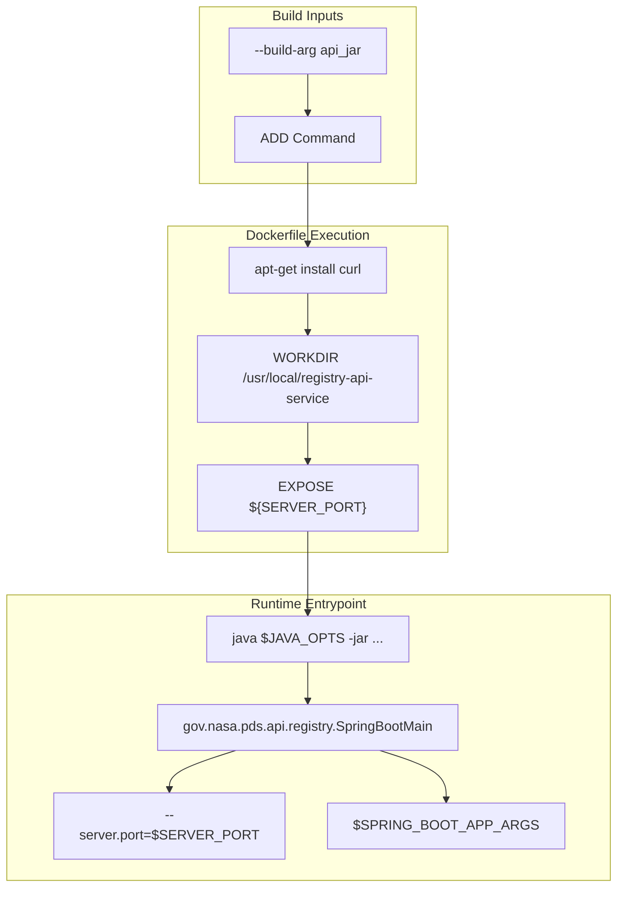
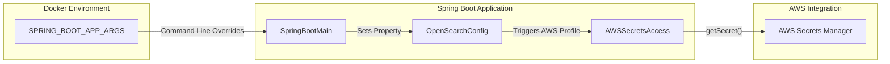

# Page: Docker Images

# Docker Images

<details>
<summary>Relevant source files</summary>

The following files were used as context for generating this wiki page:

- [docker/Dockerfile](docker/Dockerfile)
- [docker/README.md](docker/README.md)
- [service/src/main/java/gov/nasa/pds/api/registry/configuration/AWSSecretsAccess.java](service/src/main/java/gov/nasa/pds/api/registry/configuration/AWSSecretsAccess.java)
- [service/src/main/java/gov/nasa/pds/api/registry/controllers/HealthController.java](service/src/main/java/gov/nasa/pds/api/registry/controllers/HealthController.java)
- [service/src/main/resources/static/logo.svg](service/src/main/resources/static/logo.svg)
- [service/src/main/resources/swagger-ui/pds.css](service/src/main/resources/swagger-ui/pds.css)

</details>


The Registry API is distributed as a containerized Spring Boot application. The Docker infrastructure supports multiple deployment scenarios, ranging from local development with Docker Compose to cloud-native deployments on AWS ECS Fargate. The project utilizes a single multi-stage capable Dockerfile and supports multi-architecture builds for `linux/amd64` and `linux/arm64`.

## Dockerfile Architecture

The repository uses a unified `Dockerfile` located in the `docker/` directory. While the codebase refers to various "variants" (local, http, https, aws), these are implemented by passing different `--build-arg` values and environment variables to the base Docker image rather than maintaining separate files.

### Base Image and Environment
The image is built upon `tomcat:jre25-temurin-noble` [docker/Dockerfile:44-44](). Although Alpine Linux is often preferred for size, the project utilizes a slim Debian-based image to ensure full compatibility with JDK 11+ requirements [docker/Dockerfile:41-43]().

### Image Morphology
The container is configured with several key environment variables that control the Spring Boot application behavior at runtime:

| Environment Variable | Default Value | Description |
| :--- | :--- | :--- |
| `SERVER_PORT` | `" "` | Defines the port the API listens on [docker/Dockerfile:77-77](). |
| `SPRING_BOOT_APP_ARGS` | `" "` | Passes command-line arguments directly to the Spring Boot JAR [docker/Dockerfile:78-78](). |
| `JAVA_OPTS` | `-Xmx6144m -Xms512m` | Configures JVM memory allocation [docker/Dockerfile:79-79](). |

### Build Process Diagram
The following diagram illustrates how the `Dockerfile` consumes build arguments to produce the final executable image.

**Docker Build Flow**

Sources: [docker/Dockerfile:54-85](), [docker/README.md:12-15]()

## Build and Artifact Convention

The Docker build requires an `api_jar` argument. This argument can point to a local file generated by Maven or a remote URL (e.g., a GitHub Release) [docker/Dockerfile:50-54]().

### Local Build Workflow
To build an image using a locally compiled JAR:
1. Compile the project: `mvn package` [docker/README.md:26-26]().
2. Execute the build from the project root:
   ```bash
   docker image build \
     --build-arg api_jar=service/target/registry-api-service-*.jar \
     --tag registry-api-service:latest \
     --file docker/Dockerfile .
   ```
   [docker/README.md:27-27]()

### Remote Artifact Workflow
Images can be built directly from released assets without local compilation:
```bash
docker image build \
  --build-arg api_jar=https://github.com/NASA-PDS/registry-api/releases/download/v1.0.0/registry-api-service-1.0.0.jar \
  --tag nasapds/registry-api-service:1.0.0 \
  --file docker/Dockerfile .
```
[docker/README.md:32-32]()

## Deployment Variants

The service adapts its behavior based on the `SPRING_BOOT_APP_ARGS` passed during `docker run`.

### Local Execution
For standard local testing, the image is typically run by mapping the internal port to a host port:
```bash
docker run -t -i -e SERVER_PORT=8082 -p 8082:8082 registry-api-service:latest
```
[docker/README.md:40-40]()

### AWS and Cloud Configurations
When deploying to AWS (e.g., using OpenSearch Serverless), the `SPRING_BOOT_APP_ARGS` are used to override `application.properties` settings [docker/README.md:43-45]().

**Entity Mapping: Docker Runtime to Code Configuration**

Sources: [docker/Dockerfile:83-85](), [docker/README.md:47-49](), [service/src/main/java/gov/nasa/pds/api/registry/configuration/AWSSecretsAccess.java:33-58]()

## Multi-Architecture Support
The CI/CD pipelines (`stable-cicd.yaml` and `unstable-cicd.yaml`) are configured to build and push multi-architecture manifests to Docker Hub. This allows the same tag to be used on:
*   `linux/amd64`: Standard Intel/AMD servers.
*   `linux/arm64`: Apple Silicon (M1/M2/M3) and AWS Graviton instances.

The GitHub Actions workflows automate this process, tagging successful builds as `:latest` for the `develop` branch and `:X.Y.Z` for official releases [docker/README.md:17-17]().

## Health Checks and Connectivity
The Docker image includes `curl` to facilitate health checks and connectivity testing within container networks (e.g., waiting for an OpenSearch container to become ready) [docker/Dockerfile:60-66](). The service exposes a `/health` endpoint, implemented by the `HealthController`, which is used by orchestrators like Docker Compose or AWS Target Groups to monitor container status [service/src/main/java/gov/nasa/pds/api/registry/controllers/HealthController.java:10-17]().

Sources:
- [docker/README.md:1-49]()
- [docker/Dockerfile:1-96]()
- [service/src/main/java/gov/nasa/pds/api/registry/configuration/AWSSecretsAccess.java:21-92]()
- [service/src/main/java/gov/nasa/pds/api/registry/controllers/HealthController.java:9-19]()
