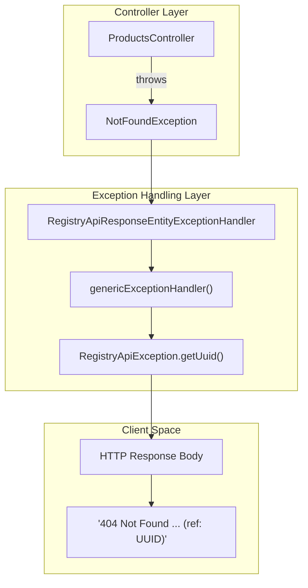
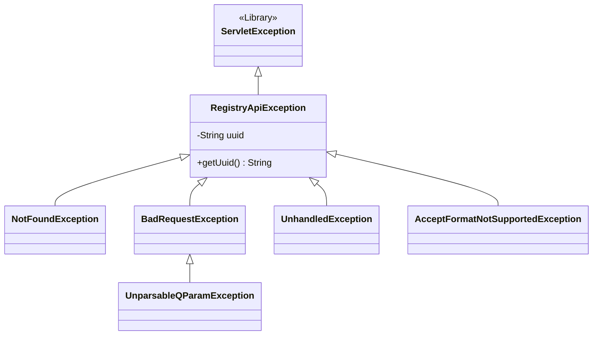

# Page: Error Handling

# Error Handling

Relevant source files

The following files were used as context for generating this wiki page:

- [CHANGELOG.md](CHANGELOG.md)
- [service/src/main/java/gov/nasa/pds/api/registry/configuration/WebMVCConfig.java](service/src/main/java/gov/nasa/pds/api/registry/configuration/WebMVCConfig.java)
- [service/src/main/java/gov/nasa/pds/api/registry/controllers/DocsController.java](service/src/main/java/gov/nasa/pds/api/registry/controllers/DocsController.java)
- [service/src/main/java/gov/nasa/pds/api/registry/controllers/RegistryApiResponseEntityExceptionHandler.java](service/src/main/java/gov/nasa/pds/api/registry/controllers/RegistryApiResponseEntityExceptionHandler.java)
- [service/src/main/java/gov/nasa/pds/api/registry/model/exceptions/AcceptFormatNotSupportedException.java](service/src/main/java/gov/nasa/pds/api/registry/model/exceptions/AcceptFormatNotSupportedException.java)
- [service/src/main/java/gov/nasa/pds/api/registry/model/exceptions/BadRequestException.java](service/src/main/java/gov/nasa/pds/api/registry/model/exceptions/BadRequestException.java)
- [service/src/main/java/gov/nasa/pds/api/registry/model/exceptions/NotFoundException.java](service/src/main/java/gov/nasa/pds/api/registry/model/exceptions/NotFoundException.java)
- [service/src/main/java/gov/nasa/pds/api/registry/model/exceptions/RegistryApiException.java](service/src/main/java/gov/nasa/pds/api/registry/model/exceptions/RegistryApiException.java)
- [service/src/main/java/gov/nasa/pds/api/registry/model/exceptions/UnhandledException.java](service/src/main/java/gov/nasa/pds/api/registry/model/exceptions/UnhandledException.java)
- [service/src/main/java/gov/nasa/pds/api/registry/model/exceptions/UnparsableQParamException.java](service/src/main/java/gov/nasa/pds/api/registry/model/exceptions/UnparsableQParamException.java)
- [service/src/main/java/gov/nasa/pds/api/registry/model/properties/PdsProperty.java](service/src/main/java/gov/nasa/pds/api/registry/model/properties/PdsProperty.java)

The Registry API implements a centralized exception handling strategy using Spring Boot's `@ControllerAdvice` mechanism. This ensures that errors across all controllers are intercepted and transformed into a consistent HTTP response format, including a unique tracking identifier (UUID) for log correlation.

## Centralized Exception Handling

The core of the error handling logic resides in `RegistryApiResponseEntityExceptionHandler`. This class extends `ResponseEntityExceptionHandler` to provide custom processing for both standard Spring exceptions and domain-specific registry exceptions.

### RegistryApiResponseEntityExceptionHandler

The handler uses the `@ControllerAdvice` annotation to globally intercept exceptions thrown by any `@Controller` or `@RequestMapping` methods [service/src/main/java/gov/nasa/pds/api/registry/controllers/RegistryApiResponseEntityExceptionHandler.java:11-18]().

Key features of the centralized handler:
*   **Unique Error IDs**: Every exception handled generates a random UUID, which is included in the response body to allow users to reference specific errors when contacting support [service/src/main/java/gov/nasa/pds/api/registry/model/exceptions/RegistryApiException.java:21-33]().
*   **Standardized Response Body**: Error responses include the HTTP status, the request description, the specific error message, the UUID, and a standard support disclaimer [service/src/main/java/gov/nasa/pds/api/registry/controllers/RegistryApiResponseEntityExceptionHandler.java:26-39]().
*   **Logging**: Exceptions are logged at the `INFO` level with their associated UUID at the moment of instantiation [service/src/main/java/gov/nasa/pds/api/registry/model/exceptions/RegistryApiException.java:25-25]().

**Error Response Data Flow**

The following diagram illustrates how an exception moves from a Controller to the final HTTP response.

Title: Error Response Generation Flow

Sources: [service/src/main/java/gov/nasa/pds/api/registry/controllers/RegistryApiResponseEntityExceptionHandler.java:26-46](), [service/src/main/java/gov/nasa/pds/api/registry/model/exceptions/RegistryApiException.java:31-33]()

## Exception Hierarchy

The API uses a custom exception hierarchy rooted in `RegistryApiException`, which extends `jakarta.servlet.ServletException` [service/src/main/java/gov/nasa/pds/api/registry/model/exceptions/RegistryApiException.java:10-10]().

### Exception Mappings and Status Codes

| Exception Class | HTTP Status Code | Description |
| :--- | :--- | :--- |
| `NotFoundException` | 404 Not Found | Resource (Product/LIDVID) does not exist [service/src/main/java/gov/nasa/pds/api/registry/controllers/RegistryApiResponseEntityExceptionHandler.java:42-46]() |
| `BadRequestException` | 400 Bad Request | General malformed request error [service/src/main/java/gov/nasa/pds/api/registry/controllers/RegistryApiResponseEntityExceptionHandler.java:48-52]() |
| `UnparsableQParamException` | 400 Bad Request | Syntax error in the `q` search parameter grammar [service/src/main/java/gov/nasa/pds/api/registry/controllers/RegistryApiResponseEntityExceptionHandler.java:77-81]() |
| `AcceptFormatNotSupportedException` | 406 Not Acceptable | Requested `Accept` header format is not supported by the API [service/src/main/java/gov/nasa/pds/api/registry/controllers/RegistryApiResponseEntityExceptionHandler.java:60-69]() |
| `SortSearchAfterMismatchException` | 400 Bad Request | Pagination error where `search-after` token does not match sort criteria [service/src/main/java/gov/nasa/pds/api/registry/controllers/RegistryApiResponseEntityExceptionHandler.java:71-75]() |
| `UnauthorizedForwardedHostException`| 400 Bad Request | Request blocked by security validation (e.g., `X-Forwarded-Host` mismatch) [service/src/main/java/gov/nasa/pds/api/registry/controllers/RegistryApiResponseEntityExceptionHandler.java:89-93]() |
| `UnhandledException` | 500 Internal Server Error | Catch-all for unexpected server-side failures [service/src/main/java/gov/nasa/pds/api/registry/controllers/RegistryApiResponseEntityExceptionHandler.java:54-57]() |

**Exception Class Relationships**

Title: Registry Exception Hierarchy

Sources: [service/src/main/java/gov/nasa/pds/api/registry/model/exceptions/RegistryApiException.java:10-10](), [service/src/main/java/gov/nasa/pds/api/registry/model/exceptions/BadRequestException.java:8-8](), [service/src/main/java/gov/nasa/pds/api/registry/model/exceptions/NotFoundException.java:6-6]()

## Implementation Details

### Specialized Handling Logic

*   **Format Support Hints**: When an `AcceptFormatNotSupportedException` is thrown, the handler inspects the `ResponseTransformerRegistry.TRANSFORMERS` keys to append a list of valid formats to the error message, assisting the developer in correcting the request [service/src/main/java/gov/nasa/pds/api/registry/controllers/RegistryApiResponseEntityExceptionHandler.java:63-65]().
*   **Security Validation**: Errors caught by the `SecurityValidationFilter` (such as unauthorized forwarded hosts) are mapped to `UnauthorizedForwardedHostException` and returned as 400 Bad Request to prevent information leakage about the internal network [service/src/main/java/gov/nasa/pds/api/registry/controllers/RegistryApiResponseEntityExceptionHandler.java:89-93](), [service/src/main/java/gov/nasa/pds/api/registry/configuration/WebMVCConfig.java:131-133]().
*   **Query Parsing**: The `UnparsableQParamException` is typically thrown when the ANTLR4 lexer/parser fails to process the search string provided in the `q` parameter [service/src/main/java/gov/nasa/pds/api/registry/model/exceptions/UnparsableQParamException.java:8-17]().

### Serialization of Errors

While `RegistryApiResponseEntityExceptionHandler` provides a plain text fallback, the API also registers specific message converters in `WebMVCConfig` to handle error serialization for different content types:
*   `CsvErrorMessageSerializer` [service/src/main/java/gov/nasa/pds/api/registry/configuration/WebMVCConfig.java:86-86]()
*   `JsonErrorMessageSerializer` [service/src/main/java/gov/nasa/pds/api/registry/configuration/WebMVCConfig.java:120-120]()
*   `XmlErrorMessageSerializer` [service/src/main/java/gov/nasa/pds/api/registry/configuration/WebMVCConfig.java:105-105]()

Sources: [service/src/main/java/gov/nasa/pds/api/registry/controllers/RegistryApiResponseEntityExceptionHandler.java:1-96](), [service/src/main/java/gov/nasa/pds/api/registry/configuration/WebMVCConfig.java:81-125](), [service/src/main/java/gov/nasa/pds/api/registry/model/exceptions/RegistryApiException.java:1-35]()
