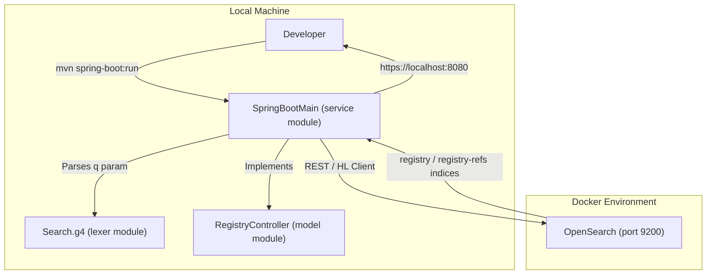
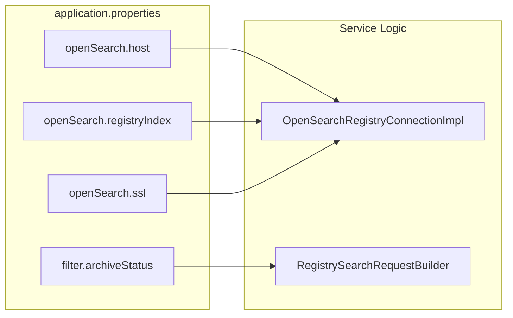

# Page: Getting Started

# Getting Started

<details>
<summary>Relevant source files</summary>

The following files were used as context for generating this wiki page:

- [.github/CODEOWNERS](.github/CODEOWNERS)
- [.gitignore](.gitignore)
- [LICENSE.md](LICENSE.md)
- [NOTICE.txt](NOTICE.txt)
- [README.md](README.md)
- [SECURITY.md](SECURITY.md)
- [docker/README.md](docker/README.md)
- [lexer/README.md](lexer/README.md)
- [service/README.md](service/README.md)
- [service/src/main/resources/application.properties](service/src/main/resources/application.properties)
- [service/src/main/resources/application.properties.docker](service/src/main/resources/application.properties.docker)
- [service/src/main/resources/application.properties.local](service/src/main/resources/application.properties.local)
- [service/src/test/java/gov/nasa/pds/api/registry/configuration/AWSSecretsAccessTest.java](service/src/test/java/gov/nasa/pds/api/registry/configuration/AWSSecretsAccessTest.java)

</details>


This page provides a comprehensive guide for developers to set up, build, and run the NASA PDS Registry API locally. It covers the prerequisites, the multi-module Maven structure, configuration via `application.properties`, and integration with OpenSearch.

## Prerequisites

To build and execute the Registry API, the following software must be installed on your development machine:

*   **Java Development Kit (JDK):** Version 17 is required for the main build [README.md:44-44](), though some sub-modules may reference version 25 in documentation [service/README.md:12-12]().
*   **Apache Maven:** Used for dependency management and building the multi-module project [README.md:45-45]().
*   **Docker & Docker Compose:** Required for running the OpenSearch backend and integration test environment [README.md:18-24]().

### Data Requirements
The API expects specific metadata states in the backend OpenSearch instance to return results:
1.  Data must have an `archive_status` of "archived" or "certified" [README.md:47-49]().
2.  The `registry-sweepers` must have been executed against the data to populate required metadata fields [README.md:49-49]().

**Sources:** [README.md:40-50](), [service/README.md:10-13]()

---

## Project Structure and Build Process

The Registry API is a multi-module Maven project consisting of three primary components:
1.  `lexer`: Handles ANTLR4 grammar for parsing API request queries (`q` parameter) [README.md:9-9]().
2.  `model`: Contains OpenAPI-generated controller definitions and DTOs [README.md:10-10]().
3.  `service`: The Spring Boot application that implements the business logic and connects to OpenSearch [README.md:11-11]().

### Building the Project
From the root directory, execute the following command to build all modules and install them to your local repository:

```bash
mvn clean install
```
[README.md:72-72]()

### Building a Docker Image
For containerized deployment, you can build a development image using the Spring Boot Maven plugin:

```bash
mvn spring-boot:build-image
```
[README.md:93-93]()

Alternatively, you can use the provided `Dockerfile` with a manual build argument for the JAR location:

```bash
docker image build --build-arg api_jar=service/target/registry-api-service-*.jar --tag registry-api-service:latest --file docker/Dockerfile .
```
[docker/README.md:27-27]()

**Sources:** [README.md:8-12](), [README.md:70-73](), [docker/README.md:20-28]()

---

## Local Development Setup

There are two primary ways to run the API for development.

### Option 1: Non-Containerized (Breakpoint Debugging)
This method is preferred for active development where you need to attach a debugger.

1.  **Start OpenSearch:** Clone the `registry` repository and follow its Quick Start Guide to launch the backend via Docker Compose [README.md:21-24]().
2.  **Configure SSL:** By default, the API expects SSL. For local dev with the default registry setup, disable certificate CN verification in `service/src/main/resources/application.properties`:
    `openSearch.sslCertificateCNVerification=false` [README.md:60-62]().
3.  **Run the Service:**
    ```bash
    cd service
    mvn spring-boot:run
    ```
    [README.md:76-77]()

### Option 2: Docker Compose Integration
You can run the API alongside the entire registry stack (harvest, opensearch, etc.) by using the `int-registry-batch-loader` profile in the `registry` repository's docker-compose [README.md:101-110]().

### Developer Workflow Diagram
The following diagram illustrates the data flow between the developer's local environment and the system components.

**Developer Local Execution Flow**

**Sources:** [README.md:8-12](), [README.md:53-80](), [service/src/main/resources/application.properties:34-36]()

---

## Configuration

The application is configured via `application.properties`. Key settings for connecting to OpenSearch and defining API behavior are listed below.

### Key Properties

| Property | Description | Default/Local Value |
| :--- | :--- | :--- |
| `openSearch.host` | Hostname and port of the OpenSearch instance | `localhost:9200` [service/src/main/resources/application.properties:34]() |
| `openSearch.registryIndex` | The primary index for PDS products | `registry` [service/src/main/resources/application.properties:35]() |
| `openSearch.registryRefIndex` | The index for product references | `registry-refs` [service/src/main/resources/application.properties:36]() |
| `openSearch.disciplineNodes` | Comma-separated list of tenant prefixes | `geo` [service/src/main/resources/application.properties:40]() |
| `filter.archiveStatus` | Only show products with these statuses | `archived,certified` [service/src/main/resources/application.properties:49]() |
| `server.port` | The port the API listens on | `8080` [service/src/main/resources/application.properties:2]() |

### Using Profiles
You can create environment-specific configurations (e.g., `application-dev.properties`) and activate them using Maven:
```bash
mvn -Dspring-boot.run.profiles=dev spring-boot:run
```
[README.md:85-85]()

### Configuration Entity Mapping
The following diagram maps configuration keys to the internal logic they influence.

**Configuration to Code Mapping**

**Sources:** [service/src/main/resources/application.properties:34-49](), [README.md:60-67]()

---

## Verification and Testing

Once the application is running, you can verify the deployment using the following tools:

1.  **Swagger UI:** Access `http://localhost:8080/index.html` to view the interactive API documentation [service/src/main/resources/application.properties:5-6]().
2.  **Health Check:** Access the Spring Boot Actuator endpoints if enabled via `management.endpoints.web.exposure.include=*` [service/src/main/resources/application.properties:17-17]().
3.  **Postman:** A Postman collection is provided in `service/src/test/resources/postman_collection.json` for manual and automated testing [service/README.md:86-86]().

**Sources:** [README.md:96-100](), [service/README.md:63-73](), [service/src/main/resources/application.properties:1-18]()
