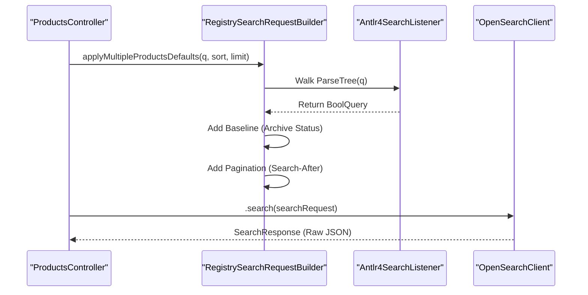

# Page: Glossary

# Glossary

<details>
<summary>Relevant source files</summary>

The following files were used as context for generating this wiki page:

- [.github/workflows/branch-cicd.yaml](.github/workflows/branch-cicd.yaml)
- [.github/workflows/codeql-analysis.yml](.github/workflows/codeql-analysis.yml)
- [.github/workflows/secrets-detection.yaml](.github/workflows/secrets-detection.yaml)
- [.github/workflows/stable-cicd.yaml](.github/workflows/stable-cicd.yaml)
- [.github/workflows/unstable-cicd.yaml](.github/workflows/unstable-cicd.yaml)
- [.pre-commit-config.yaml](.pre-commit-config.yaml)
- [.secrets.baseline](.secrets.baseline)
- [CHANGELOG.md](CHANGELOG.md)
- [lexer/pom.xml](lexer/pom.xml)
- [lexer/src/main/antlr4/gov/nasa/pds/api/registry/lexer/Search.g4](lexer/src/main/antlr4/gov/nasa/pds/api/registry/lexer/Search.g4)
- [lexer/src/test/java/api/pds/nasa/gov/api_search_query_lexer/MockedListener.java](lexer/src/test/java/api/pds/nasa/gov/api_search_query_lexer/MockedListener.java)
- [lexer/src/test/java/api/pds/nasa/gov/api_search_query_lexer/TestParsing.java](lexer/src/test/java/api/pds/nasa/gov/api_search_query_lexer/TestParsing.java)
- [model/pom.xml](model/pom.xml)
- [model/swagger.yml](model/swagger.yml)
- [pom.xml](pom.xml)
- [service/pom.xml](service/pom.xml)
- [service/src/main/java/gov/nasa/pds/api/registry/configuration/OpenAPIClearedTags.java](service/src/main/java/gov/nasa/pds/api/registry/configuration/OpenAPIClearedTags.java)
- [service/src/main/java/gov/nasa/pds/api/registry/controllers/ProductsController.java](service/src/main/java/gov/nasa/pds/api/registry/controllers/ProductsController.java)
- [service/src/main/java/gov/nasa/pds/api/registry/model/Antlr4SearchListener.java](service/src/main/java/gov/nasa/pds/api/registry/model/Antlr4SearchListener.java)
- [service/src/main/java/gov/nasa/pds/api/registry/model/EntityProduct.java](service/src/main/java/gov/nasa/pds/api/registry/model/EntityProduct.java)
- [service/src/main/java/gov/nasa/pds/api/registry/model/identifiers/PdsLid.java](service/src/main/java/gov/nasa/pds/api/registry/model/identifiers/PdsLid.java)
- [service/src/main/java/gov/nasa/pds/api/registry/model/identifiers/PdsLidVid.java](service/src/main/java/gov/nasa/pds/api/registry/model/identifiers/PdsLidVid.java)
- [service/src/main/java/gov/nasa/pds/api/registry/model/identifiers/PdsProductIdentifier.java](service/src/main/java/gov/nasa/pds/api/registry/model/identifiers/PdsProductIdentifier.java)
- [service/src/main/java/gov/nasa/pds/api/registry/model/transformers/ResponseTransformerImpl.java](service/src/main/java/gov/nasa/pds/api/registry/model/transformers/ResponseTransformerImpl.java)
- [service/src/main/java/gov/nasa/pds/api/registry/search/RegistrySearchRequestBuilder.java](service/src/main/java/gov/nasa/pds/api/registry/search/RegistrySearchRequestBuilder.java)
- [service/src/main/resources/application.properties.all](service/src/main/resources/application.properties.all)
- [service/src/test/java/gov/nasa/pds/api/registry/model/PdsProductIdentifierTest.java](service/src/test/java/gov/nasa/pds/api/registry/model/PdsProductIdentifierTest.java)
- [service/src/test/java/gov/nasa/pds/api/registry/opensearch/Antlr4SearchListenerTest.java](service/src/test/java/gov/nasa/pds/api/registry/opensearch/Antlr4SearchListenerTest.java)
- [service/src/test/java/gov/nasa/pds/api/registry/opensearch/RegistrySearchRequestBuilderTest.java](service/src/test/java/gov/nasa/pds/api/registry/opensearch/RegistrySearchRequestBuilderTest.java)
- [terraform/README.md](terraform/README.md)
- [terraform/aws/api_uri_rewrite.js](terraform/aws/api_uri_rewrite.js)
- [terraform/aws/test_api_uri_rewrite.html](terraform/aws/test_api_uri_rewrite.html)
- [terraform/ecs.tf](terraform/ecs.tf)
- [terraform/provider.tf](terraform/provider.tf)
- [terraform/variables.tf](terraform/variables.tf)

</details>


This page provides technical definitions for domain-specific terms, architectural components, and acronyms used throughout the PDS Registry API codebase.

## 1. Core Domain Concepts (PDS4)

The Planetary Data System (PDS) uses a specific information model (PDS4) that dictates how data is identified and related.

| Term | Definition | Code Pointer |
| :--- | :--- | :--- |
| **LID** | Logical Identifier. A unique string identifying a product across all versions. | [service/src/main/java/gov/nasa/pds/api/registry/model/identifiers/PdsLid.java:1-10]() |
| **VID** | Version Identifier. A version number (e.g., `1.0`). | [service/src/main/java/gov/nasa/pds/api/registry/model/identifiers/PdsVid.java:1-10]() |
| **LIDVID** | The combination of a LID and a VID (e.g., `urn:nasa:pds:bundle::1.0`), uniquely identifying a specific version of a product. | [service/src/main/java/gov/nasa/pds/api/registry/model/identifiers/PdsLidVid.java:15-25]() |
| **Product Class** | A category of PDS4 product (e.g., `Product_Bundle`, `Product_Collection`, `Product_Observational`). | [service/src/main/java/gov/nasa/pds/api/registry/model/identifiers/PdsProductClasses.java:12-20]() |
| **Archive Status** | The lifecycle state of a product (e.g., `ARCHIVED`, `IN_QUEUE`). The API filters by this by default. | [service/src/main/java/gov/nasa/pds/api/registry/search/RegistrySearchRequestBuilder.java:80-91]() |

**Sources:**
- [service/src/main/java/gov/nasa/pds/api/registry/model/identifiers/PdsLidVid.java]()
- [service/src/main/java/gov/nasa/pds/api/registry/search/RegistrySearchRequestBuilder.java]()

---

## 2. Architectural Components

The system is divided into three Maven modules: `lexer`, `model`, and `service`.

### Code Entity Space to Natural Language Mapping

This diagram maps high-level system responsibilities to the specific Java classes and modules that implement them.

**System Responsibility Mapping**
```mermaid
graph TD
    subgraph "Lexer Module"
        "Search.g4"["Search.g4 (Grammar)"]
        "Antlr4SearchListener"["Antlr4SearchListener (Tree Walker)"]
    end

    subgraph "Model Module"
        "swagger.yml"["swagger.yml (OpenAPI Spec)"]
        "ProductsApi"["ProductsApi (Generated Interface)"]
    end

    subgraph "Service Module"
        "ProductsController"["ProductsController (Implementation)"]
        "RegistrySearchRequestBuilder"["RegistrySearchRequestBuilder (Query Builder)"]
        "ResponseTransformer"["ResponseTransformer (Serialization)"]
    end

    "Search.g4" -->|Generates| "SearchParser"
    "SearchParser" -->|Input to| "Antlr4SearchListener"
    "swagger.yml" -->|Generates| "ProductsApi"
    "ProductsApi" -.->|Implemented by| "ProductsController"
    "ProductsController" -->|Uses| "RegistrySearchRequestBuilder"
    "RegistrySearchRequestBuilder" -->|Uses| "Antlr4SearchListener"
    "ProductsController" -->|Uses| "ResponseTransformer"
```
**Sources:**
- [pom.xml:77-81]()
- [lexer/pom.xml:95-106]()
- [model/pom.xml:54-66]()
- [service/src/main/java/gov/nasa/pds/api/registry/controllers/ProductsController.java:52-79]()

---

## 3. Search and Query Pipeline Terms

### Query String (`q` parameter)
The API supports a custom query language for filtering products. This is processed using ANTLR4.

*   **Lexer/Parser:** Defined in `Search.g4`.
*   **Listener:** `Antlr4SearchListener` converts the parse tree into OpenSearch `BoolQuery` objects.
*   **Logic:** Supports operators like `eq`, `ne`, `gt`, `ge`, `lt`, `le`, `like`, `and`, `or`, and `not`.

### RegistrySearchRequestBuilder
A wrapper around the OpenSearch `SearchRequest.Builder` that injects PDS-specific constraints.

*   **Baseline Query:** Every request is automatically constrained by `ops:Tracking_Meta/ops:archive_status`.
*   **Superseded Products:** Logic to filter out older versions when only the "latest" is requested.

**Search Execution Flow**

**Sources:**
- [service/src/main/java/gov/nasa/pds/api/registry/search/RegistrySearchRequestBuilder.java:121-135]()
- [service/src/main/java/gov/nasa/pds/api/registry/search/RegistrySearchRequestBuilder.java:80-91]()
- [service/src/main/java/gov/nasa/pds/api/registry/controllers/ProductsController.java:109-136]()

---

## 4. Response and Serialization Terms

### ResponseTransformer
An interface for converting raw OpenSearch documents into the requested PDS format.

*   **Selection:** The `ResponseTransformerRegistry` selects the implementation based on the `Accept` header.
*   **Implementations:**
    *   `PdsProductTransformer`: Standard PDS metadata.
    *   `Pds4XmlProductTransformer`: Returns the original PDS4 XML label.
    *   `Pds4JsonProductTransformer`: Returns PDS4 metadata in JSON format.

### Pagination (Search-After)
The API uses OpenSearch "search-after" for deep paging instead of traditional offsets. This requires a deterministic sort (usually `ops:Harvest_Info/ops:harvest_date_time` and `lidvid`).

**Sources:**
- [service/src/main/java/gov/nasa/pds/api/registry/model/transformers/ResponseTransformerRegistry.java:90-95]()
- [service/src/main/java/gov/nasa/pds/api/registry/controllers/ProductsController.java:82-107]()
- [service/src/main/java/gov/nasa/pds/api/registry/search/RegistrySearchRequestBuilder.java:121-128]()

---

## 5. Infrastructure and CI/CD Jargon

| Term | Definition | Code Pointer |
| :--- | :--- | :--- |
| **Roundup** | A PDS-wide GitHub Action used for assembling, signing, and deploying Maven artifacts. | [.github/workflows/unstable-cicd.yaml:72-84]() |
| **Fargate** | The AWS serverless compute engine where the API is deployed via Terraform. | [terraform/ecs.tf:1-20]() |
| **LFS** | Git Large File Storage, used for handling binary dependencies or large test resources. | [.github/workflows/branch-cicd.yaml:45]() |
| **CodeQL** | Semantic code analysis engine used for security scanning. | [.github/workflows/codeql-analysis.yml:1-10]() |
| **Scrub** | A tool used to translate CodeQL/SARIF results into a PDS-compliant format. | [.github/workflows/codeql-analysis.yml:64-75]() |

**Sources:**
- [.github/workflows/unstable-cicd.yaml]()
- [.github/workflows/codeql-analysis.yml]()
- [terraform/ecs.tf]()