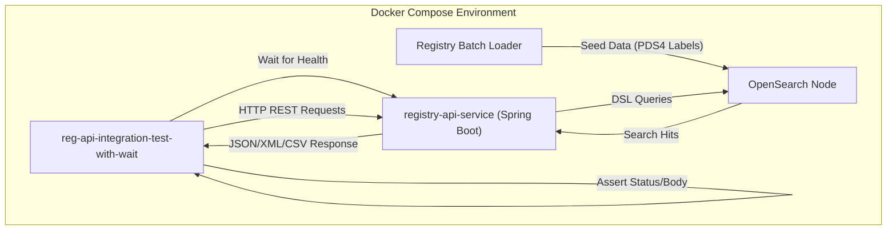
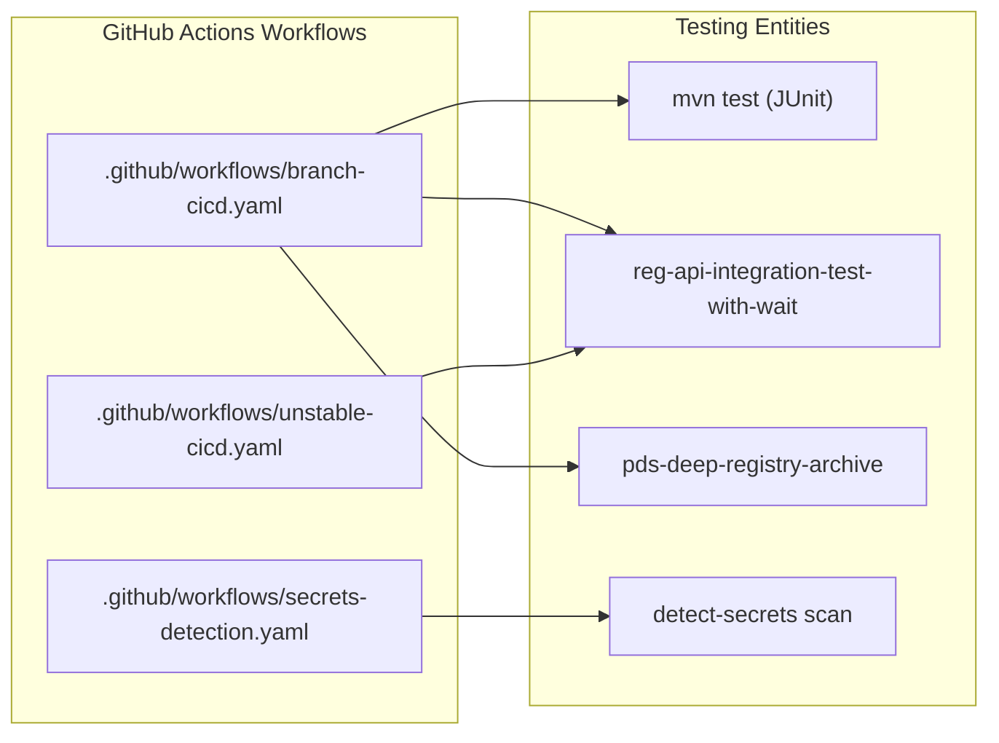

# Page: Integration and Regression Testing

# Integration and Regression Testing

<details>
<summary>Relevant source files</summary>

The following files were used as context for generating this wiki page:

- [.github/workflows/branch-cicd.yaml](.github/workflows/branch-cicd.yaml)
- [.github/workflows/codeql-analysis.yml](.github/workflows/codeql-analysis.yml)
- [.github/workflows/secrets-detection.yaml](.github/workflows/secrets-detection.yaml)
- [.github/workflows/stable-cicd.yaml](.github/workflows/stable-cicd.yaml)
- [.github/workflows/unstable-cicd.yaml](.github/workflows/unstable-cicd.yaml)
- [.pre-commit-config.yaml](.pre-commit-config.yaml)
- [.secrets.baseline](.secrets.baseline)
- [docker/README.md](docker/README.md)
- [service/src/test/resources/POSTMAN_TESTS_README.txt](service/src/test/resources/POSTMAN_TESTS_README.txt)

</details>


The Registry API employs a multi-tiered testing strategy to ensure functional correctness, performance stability, and backward compatibility. This page focuses on integration and regression testing, which validate the interaction between the API service, the OpenSearch backend, and external PDS tools.

## Integration Testing Framework

Integration tests are designed to verify the end-to-end flow of the system, from HTTP request reception to OpenSearch query execution and response serialization. These tests run within a containerized environment that mimics production deployments.

### reg-api-integration-test-with-wait
The primary vehicle for integration testing is the `reg-api-integration-test-with-wait` container, which is managed via Docker Compose. This container orchestrates the testing lifecycle by waiting for the Registry API service and OpenSearch nodes to be healthy before executing the test suite.

**Workflow Execution:**
1.  **Environment Setup**: The CI/CD pipeline clones the [NASA-PDS/registry](https://github.com/NASA-PDS/registry) repository to access shared Docker configurations and certificate generation scripts [.github/workflows/unstable-cicd.yaml:113-115]().
2.  **Certificate Generation**: SSL certificates are generated locally to enable secure communication between containers [.github/workflows/unstable-cicd.yaml:115]().
3.  **Service Orchestration**: Docker Compose starts the `int-registry-batch-loader` profile, which includes OpenSearch, the Registry API service, and a data loader to seed the test database [.github/workflows/unstable-cicd.yaml:119-121]().
4.  **Test Execution**: The `reg-api-integration-test-with-wait` container runs the functional test suite against the live endpoints [.github/workflows/unstable-cicd.yaml:122-124]().

### Postman Collections
The functional tests are primarily defined in Postman collections. While the Registry API repository contains a reference to these tests in `service/src/test/resources/postman_collection.json` (noted in documentation), the canonical versions are maintained in the central [registry repository](https://github.com/NASA-PDS/registry/tree/main/docker/postman) [service/src/test/resources/POSTMAN_TESTS_README.txt:1-3]().

### Integration Test Data Flow
The following diagram illustrates how the integration test suite interacts with the system components.

**Integration Test Component Interaction**

Sources: [.github/workflows/unstable-cicd.yaml:112-124](), [service/src/test/resources/POSTMAN_TESTS_README.txt:1-3]()

---

## Regression Testing Scripts

Regression testing ensures that new features or bug fixes do not break existing functionality. This is handled through specialized Python scripts and compatibility checks with downstream tools.

### Python Regression Suite
The codebase includes Python-based regression scripts located in `service/ut/` (referenced in project structure). These scripts typically automate complex query scenarios that are difficult to represent in simple Postman assertions, such as deep-paging validation and LIDVID resolution logic across large datasets.

### Deep Archive Compatibility
A critical regression check is the compatibility with the `pds-deep-registry-archive` tool. This tool relies on the Registry API to extract metadata for long-term preservation.

The CI/CD pipeline performs the following steps to validate this:
1.  Clones the [NASA-PDS/deep-archive](https://github.com/NASA-PDS/deep-archive) repository [.github/workflows/branch-cicd.yaml:119]().
2.  Installs the tool in the runner environment [.github/workflows/branch-cicd.yaml:121]().
3.  Executes `pds-deep-registry-archive` against the local integration test instance using a known URN (e.g., `urn:nasa:pds:insight_rad::2.1`) [.github/workflows/branch-cicd.yaml:122]().

Sources: [.github/workflows/branch-cicd.yaml:117-123]()

---

## CI/CD Pipeline Integration

Integration and regression tests are embedded into the GitHub Actions workflows to provide continuous validation.

| Pipeline | Trigger | Testing Scope |
| :--- | :--- | :--- |
| **Branch CI/CD** | Push to non-main branches | Unit tests, Docker build, Integration tests, Deep Archive compatibility [.github/workflows/branch-cicd.yaml:15-20, 67-123]() |
| **Unstable CI/CD** | Push to `develop` | Full integration suite, Docker image publication to `:develop` [.github/workflows/unstable-cicd.yaml:32-35, 111-124]() |
| **Stable CI/CD** | Release Tag (`release/*`) | Final validation and publication to Maven Central and Docker Hub [.github/workflows/stable-cicd.yaml:34-37]() |

### Security and Quality Regression
In addition to functional testing, the API undergoes automated security regression:
*   **CodeQL**: Runs weekly to detect security vulnerabilities (SQL injection, XSS, etc.) and generates SARIF/SCRUB reports [.github/workflows/codeql-analysis.yml:4-5, 33-37, 64-77]().
*   **Secret Detection**: Uses `detect-secrets` to prevent accidental inclusion of credentials, comparing current code against `.secrets.baseline` [.github/workflows/secrets-detection.yaml:40-58]().

**CI/CD Logic Space Mapping**

Sources: [.github/workflows/branch-cicd.yaml:1-124](), [.github/workflows/unstable-cicd.yaml:1-124](), [.github/workflows/secrets-detection.yaml:1-71]()

---

## Running Integration Tests Locally

To execute the full integration suite on a local machine, follow these steps:

1.  **Build the Service**:
    Generate the JAR file using Maven: `mvn package` [docker/README.md:26]().
2.  **Build the Docker Image**:
    ```bash
    docker image build --build-arg api_jar=service/target/registry-api-service-*.jar \
    --tag nasapds/registry-api-service:latest --file docker/Dockerfile .
    ```
    [docker/README.md:27]()
3.  **Prepare the Registry Environment**:
    Clone the registry repo and generate certificates as shown in the CI workflow [.github/workflows/branch-cicd.yaml:95-97]().
4.  **Launch the Stack**:
    Use the `int-registry-batch-loader` profile:
    ```bash
    docker compose --profile int-registry-batch-loader up -d
    ```
    [.github/workflows/branch-cicd.yaml:100-102]()
5.  **Run Tests**:
    Execute the integration test container:
    ```bash
    docker compose --profile int-registry-batch-loader run --rm reg-api-integration-test-with-wait
    ```
    [.github/workflows/branch-cicd.yaml:106-108]()

Sources: [docker/README.md:23-28](), [.github/workflows/branch-cicd.yaml:94-108]()
