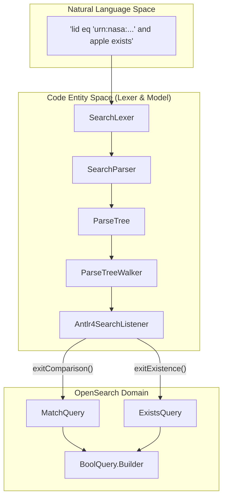
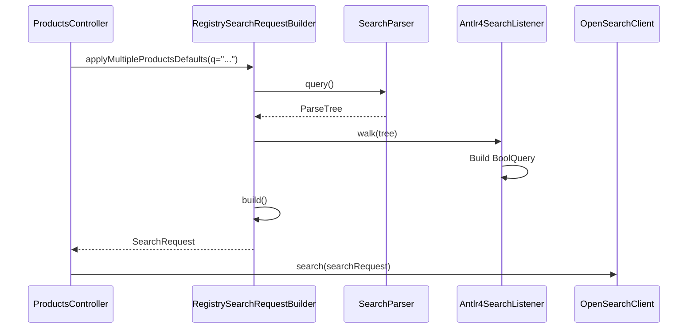

# Page: Lexer Module — Search Query Grammar

# Lexer Module — Search Query Grammar

Relevant source files

The following files were used as context for generating this wiki page:

- [lexer/src/main/antlr4/gov/nasa/pds/api/registry/lexer/Search.g4](lexer/src/main/antlr4/gov/nasa/pds/api/registry/lexer/Search.g4)
- [lexer/src/test/java/api/pds/nasa/gov/api_search_query_lexer/MockedListener.java](lexer/src/test/java/api/pds/nasa/gov/api_search_query_lexer/MockedListener.java)
- [lexer/src/test/java/api/pds/nasa/gov/api_search_query_lexer/TestParsing.java](lexer/src/test/java/api/pds/nasa/gov/api_search_query_lexer/TestParsing.java)
- [model/swagger.yml](model/swagger.yml)
- [service/src/main/java/gov/nasa/pds/api/registry/configuration/OpenAPIClearedTags.java](service/src/main/java/gov/nasa/pds/api/registry/configuration/OpenAPIClearedTags.java)
- [service/src/main/java/gov/nasa/pds/api/registry/controllers/ProductsController.java](service/src/main/java/gov/nasa/pds/api/registry/controllers/ProductsController.java)
- [service/src/main/java/gov/nasa/pds/api/registry/model/Antlr4SearchListener.java](service/src/main/java/gov/nasa/pds/api/registry/model/Antlr4SearchListener.java)
- [service/src/main/java/gov/nasa/pds/api/registry/model/transformers/ResponseTransformerImpl.java](service/src/main/java/gov/nasa/pds/api/registry/model/transformers/ResponseTransformerImpl.java)
- [service/src/main/java/gov/nasa/pds/api/registry/search/RegistrySearchRequestBuilder.java](service/src/main/java/gov/nasa/pds/api/registry/search/RegistrySearchRequestBuilder.java)
- [service/src/main/resources/application.properties.all](service/src/main/resources/application.properties.all)
- [service/src/test/java/gov/nasa/pds/api/registry/opensearch/Antlr4SearchListenerTest.java](service/src/test/java/gov/nasa/pds/api/registry/opensearch/Antlr4SearchListenerTest.java)

The Lexer module provides the capability to parse complex natural language search strings into structured OpenSearch queries. It utilizes **ANTLR4** to define a formal grammar for the PDS Registry search language, allowing users to perform advanced filtering on metadata fields using logical operators, comparisons, and existence checks.

## Search Grammar Definition

The core of the lexer is defined in `Search.g4`. This file specifies the syntax rules for the query language, including operator precedence and token definitions.

### Supported Operators and Syntax

The grammar supports a variety of operations to constrain search results based on product properties [lexer/src/main/antlr4/gov/nasa/pds/api/registry/lexer/Search.g4:3-13]():

| Operator | Description | Example |
| :--- | :--- | :--- |
| `eq` | Equality (Match) | `pds:stop_date_time eq "2021-05-21T15:47:08Z"` |
| `ne` | Not Equal | `ops:archive_status ne "superseded"` |
| `gt` | Greater Than | `timestamp gt 12` |
| `ge` | Greater Than or Equal | `timestamp ge 12` |
| `lt` | Less Than | `timestamp lt 27` |
| `le` | Less Than or Equal | `timestamp le 27` |
| `like` | Wildcard Pattern Match | `lid like "*pdart14_meap"` |
| `exists` | Field Existence Check | `apple exists` |
| `and` | Logical Conjunction | `a eq 1 and b eq 2` |
| `or` | Logical Disjunction | `a eq 1 or b eq 2` |
| `not` | Logical Negation | `not (a eq 1)` |

### Wildcard Field Matching
The grammar allows for wildcarding in field names using the `ALL()` or `ANY()` functions, or direct wildcard characters in the field name [lexer/src/main/antlr4/gov/nasa/pds/api/registry/lexer/Search.g4:5](). For instance, `*.apple exists` will match any property ending in `.apple` [lexer/src/test/java/api/pds/nasa/gov/api_search_query_lexer/TestParsing.java:159-173]().

**Sources:**
* [lexer/src/main/antlr4/gov/nasa/pds/api/registry/lexer/Search.g4:1-68]()
* [lexer/src/test/java/api/pds/nasa/gov/api_search_query_lexer/TestParsing.java:44-192]()

---

## Lexer Build Process

The lexer and parser classes are automatically generated during the Maven build lifecycle using the `antlr4-maven-plugin`.

### Generated Entities
When the project is compiled, ANTLR4 generates the following key classes in the `gov.nasa.pds.api.registry.lexer` package:
* `SearchLexer`: Breaks the input string into a stream of tokens (e.g., `EQ`, `STRINGVAL`, `FIELDNAME`).
* `SearchParser`: Validates the token stream against the grammar and builds a `ParseTree`.
* `SearchListener` / `SearchBaseListener`: Interface and default implementation for classes that need to react to tree traversal events.

**Sources:**
* [service/src/main/java/gov/nasa/pds/api/registry/search/RegistrySearchRequestBuilder.java:41-42]()
* [service/src/main/java/gov/nasa/pds/api/registry/model/Antlr4SearchListener.java:7-8]()

---

## Query Translation Pipeline

The translation from a text string to an OpenSearch `BoolQuery` involves the `RegistrySearchRequestBuilder` and the `Antlr4SearchListener`.

### Natural Language to Code Entity Mapping

The following diagram illustrates how a raw query string is transformed into OpenSearch Java API objects.

**Query Processing Flow**

**Sources:**
* [service/src/main/java/gov/nasa/pds/api/registry/search/RegistrySearchRequestBuilder.java:126-128]()
* [service/src/main/java/gov/nasa/pds/api/registry/model/Antlr4SearchListener.java:157-200]()

### Antlr4SearchListener Implementation

The `Antlr4SearchListener` extends `SearchBaseListener` and maintains an internal stack of `BoolQuery.Builder` objects to handle nested groups and logical conjunctions [service/src/main/java/gov/nasa/pds/api/registry/model/Antlr4SearchListener.java:29-47]().

#### Key Lifecycle Methods:
* `enterGroup(GroupContext ctx)`: Pushes the current query builder onto a stack and starts a new `BoolQuery.Builder` for the parenthesized expression [service/src/main/java/gov/nasa/pds/api/registry/model/Antlr4SearchListener.java:103-112]().
* `exitComparison(ComparisonContext ctx)`: Extracts the field name and literal value (String or Number), then creates a `MatchQuery` (for `eq`/`ne`) or a `RangeQuery` (for `gt`/`lt`/etc.) [service/src/main/java/gov/nasa/pds/api/registry/model/Antlr4SearchListener.java:157-199]().
* `exitFields(FieldsContext ctx)`: Handles field name resolution. If a wildcard is used (e.g., `ops:*`), it queries the OpenSearch mapping via `ProductsController.productPropertiesList()` to expand the wildcard into a list of concrete field names [service/src/main/java/gov/nasa/pds/api/registry/model/Antlr4SearchListener.java:65-100]().

**Sources:**
* [service/src/main/java/gov/nasa/pds/api/registry/model/Antlr4SearchListener.java:29-210]()
* [service/src/main/java/gov/nasa/pds/api/registry/controllers/ProductsController.java:109-136]()

---

## Integration with Search Request Builder

The `RegistrySearchRequestBuilder` orchestrates the lexing process through the `constrainByQueryString` method (invoked during `applyMultipleProductsDefaults`) [service/src/main/java/gov/nasa/pds/api/registry/search/RegistrySearchRequestBuilder.java:121-135]().

**Component Interaction**

### Error Handling
The system uses a `BailErrorStrategy` during parsing [service/src/main/java/gov/nasa/pds/api/registry/search/RegistrySearchRequestBuilder.java:15](). If a query is syntactically invalid (e.g., mismatched parentheses or unsupported characters), the parser throws a `ParseCancellationException`, which is eventually caught and translated into a `400 Bad Request` by the API's exception handlers [lexer/src/test/java/api/pds/nasa/gov/api_search_query_lexer/TestParsing.java:27-39]().

**Sources:**
* [service/src/main/java/gov/nasa/pds/api/registry/search/RegistrySearchRequestBuilder.java:15-22]()
* [lexer/src/test/java/api/pds/nasa/gov/api_search_query_lexer/TestParsing.java:23-39]()
* [service/src/test/java/gov/nasa/pds/api/registry/opensearch/Antlr4SearchListenerTest.java:148-158]()
