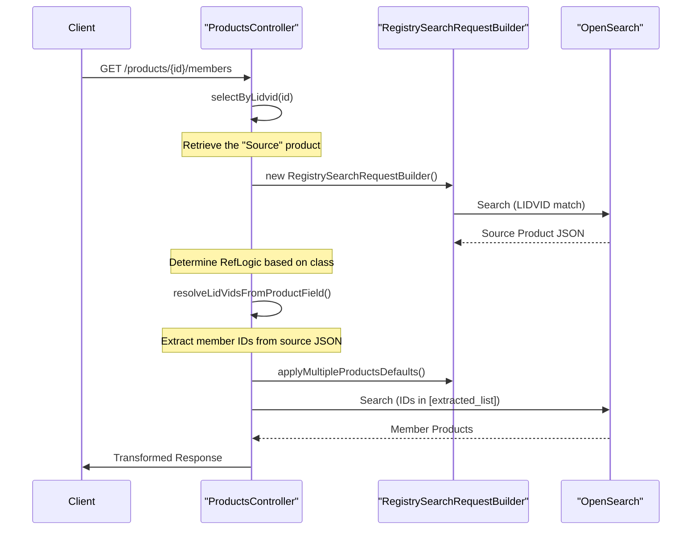
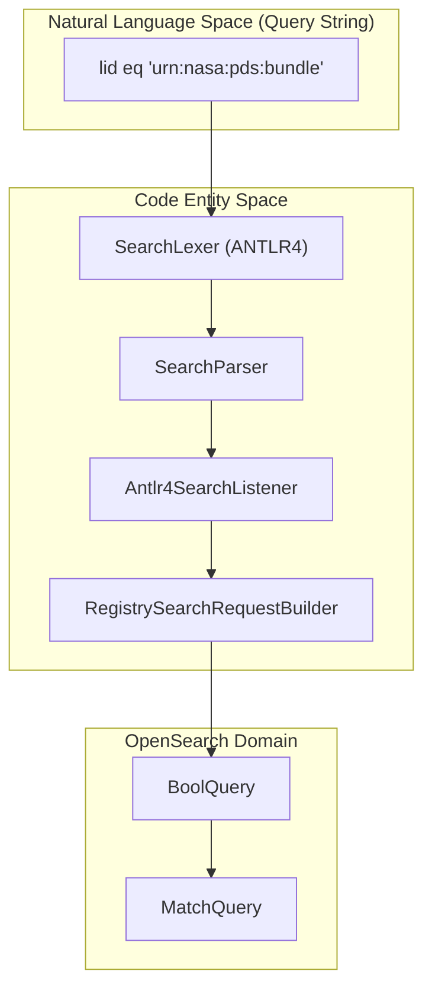

# Page: Membership and Hierarchy Endpoints

# Membership and Hierarchy Endpoints

Relevant source files

The following files were used as context for generating this wiki page:

- [lexer/src/main/antlr4/gov/nasa/pds/api/registry/lexer/Search.g4](lexer/src/main/antlr4/gov/nasa/pds/api/registry/lexer/Search.g4)
- [lexer/src/test/java/api/pds/nasa/gov/api_search_query_lexer/MockedListener.java](lexer/src/test/java/api/pds/nasa/gov/api_search_query_lexer/MockedListener.java)
- [lexer/src/test/java/api/pds/nasa/gov/api_search_query_lexer/TestParsing.java](lexer/src/test/java/api/pds/nasa/gov/api_search_query_lexer/TestParsing.java)
- [service/src/main/java/gov/nasa/pds/api/registry/configuration/OpenAPIClearedTags.java](service/src/main/java/gov/nasa/pds/api/registry/configuration/OpenAPIClearedTags.java)
- [service/src/main/java/gov/nasa/pds/api/registry/controllers/ProductsController.java](service/src/main/java/gov/nasa/pds/api/registry/controllers/ProductsController.java)
- [service/src/main/java/gov/nasa/pds/api/registry/model/Antlr4SearchListener.java](service/src/main/java/gov/nasa/pds/api/registry/model/Antlr4SearchListener.java)
- [service/src/main/java/gov/nasa/pds/api/registry/model/transformers/ResponseTransformerImpl.java](service/src/main/java/gov/nasa/pds/api/registry/model/transformers/ResponseTransformerImpl.java)
- [service/src/main/java/gov/nasa/pds/api/registry/search/RegistrySearchRequestBuilder.java](service/src/main/java/gov/nasa/pds/api/registry/search/RegistrySearchRequestBuilder.java)

This page provides a technical reference for the PDS Registry API endpoints that handle product relationships, memberships, and hierarchical resolution. These endpoints allow users to navigate from a product to its members (e.g., a Bundle to its Collections) or from a product to the aggregates it belongs to (e.g., a Collection to its parent Bundles).

## Overview of Hierarchy Endpoints

The Registry API implements four primary endpoints for navigating PDS4 hierarchies. These are defined in the `ProductsApi` interface and implemented within the `ProductsController` [service/src/main/java/gov/nasa/pds/api/registry/controllers/ProductsController.java:52-52]().

| Endpoint | Controller Method | Description |
| :--- | :--- | :--- |
| `/products/{identifier}/members` | `getMembers` | Retrieves the immediate members of a product (e.g., Collections in a Bundle). |
| `/products/{identifier}/members/members` | `getMembersOfMembers` | Retrieves members of members (e.g., Observational Products within Collections of a Bundle). |
| `/products/{identifier}/member-of` | `getMemberOf` | Retrieves the immediate parents/aggregates that the product belongs to. |
| `/products/{identifier}/member-of/member-of` | `getMemberOfMemberOf` | Retrieves higher-level aggregates (e.g., the Bundle that contains the Collection that contains this product). |

Sources: [service/src/main/java/gov/nasa/pds/api/registry/controllers/ProductsController.java:52-52]().

## Recursive Resolution Logic

The resolution of memberships relies on the `resolveLidVidsFromProductField` logic. This mechanism identifies specific fields within a PDS4 product document (stored in OpenSearch) that contain references to other products.

### Referencing Logic Transmuter

The system uses a "Transmuter" pattern to determine which fields should be inspected based on the product class. The logic is encapsulated in several `RefLogic` classes:

*   **RefLogicBundle**: Handles `Product_Bundle` references to `Product_Collection`.
*   **RefLogicCollection**: Handles `Product_Collection` references to member products.
*   **RefLogicNonAggregateProduct**: Base logic for products that do not contain other products.
*   **RefLogicObservational**: Specific logic for `Product_Observational`.
*   **RefLogicDocument**: Specific logic for `Product_Document`.

### Membership Resolution Flow

The following diagram illustrates how a request for members is processed through the search pipeline and the referencing logic.

**Membership Resolution Sequence**

Sources: [service/src/main/java/gov/nasa/pds/api/registry/controllers/ProductsController.java:109-136](), [service/src/main/java/gov/nasa/pds/api/registry/search/RegistrySearchRequestBuilder.java:121-135]().

## Query Construction for Memberships

When querying for members or parents, the `RegistrySearchRequestBuilder` is used to construct the OpenSearch DSL. 

### Mandatory Baseline Query
Every search, including hierarchy navigation, is wrapped in a mandatory baseline query that filters by `archive_status` to ensure only authorized products are returned [service/src/main/java/gov/nasa/pds/api/registry/search/RegistrySearchRequestBuilder.java:80-91]().

### Search Execution
The `searchAndTransform` method in `ProductsController` executes the following steps:
1.  **Transformer Selection**: Selects a `ResponseTransformerImpl` based on the `Accept` header [service/src/main/java/gov/nasa/pds/api/registry/controllers/ProductsController.java:82-107]().
2.  **Field Mapping**: Maps user-requested fields to OpenSearch internal fields using `PdsProperty` [service/src/main/java/gov/nasa/pds/api/registry/controllers/ProductsController.java:117-120]().
3.  **Request Building**: Calls `applyMultipleProductsDefaults` to handle pagination, sorting, and keyword constraints [service/src/main/java/gov/nasa/pds/api/registry/search/RegistrySearchRequestBuilder.java:121-135]().

Sources: [service/src/main/java/gov/nasa/pds/api/registry/controllers/ProductsController.java:109-136](), [service/src/main/java/gov/nasa/pds/api/registry/search/RegistrySearchRequestBuilder.java:68-70]().

## Integration with Search Lexer

Membership endpoints support the same query parameter `q` used in general search. This allows filtering members of a specific bundle (e.g., `/products/{id}/members?q=ops:Harvest_Info/ops:harvest_date_time gt "2023-01-01"`).

The `Antlr4SearchListener` translates these queries into OpenSearch `BoolQuery` objects [service/src/main/java/gov/nasa/pds/api/registry/model/Antlr4SearchListener.java:29-41]().

**Lexer to OpenSearch Mapping**

Sources: [service/src/main/java/gov/nasa/pds/api/registry/model/Antlr4SearchListener.java:157-184](), [service/src/main/java/gov/nasa/pds/api/registry/search/RegistrySearchRequestBuilder.java:138-153](), [lexer/src/main/antlr4/gov/nasa/pds/api/registry/lexer/Search.g4:3-13]().

## Technical Details: RefLogic and Fields

The hierarchy resolution identifies specific PDS4 relationship fields. While the exact field names vary by class, the `Antlr4SearchListener` and `SearchUtil` handle the translation between API property names (JSON syntax) and OpenSearch field names [service/src/main/java/gov/nasa/pds/api/registry/model/Antlr4SearchListener.java:86-98]().

| PDS4 Relation | Internal OpenSearch Field (Example) |
| :--- | :--- |
| Bundle Member | `ref_lid_collection` |
| Collection Member | `ref_lid_product` |
| Member Of | `ref_lid_parent` |

The `getFilteredProperties` method in `ResponseTransformerImpl` ensures that the resulting product metadata is filtered according to the user's requested fields before serialization [service/src/main/java/gov/nasa/pds/api/registry/model/transformers/ResponseTransformerImpl.java:111-143]().

Sources: [service/src/main/java/gov/nasa/pds/api/registry/model/transformers/ResponseTransformerImpl.java:111-143](), [service/src/main/java/gov/nasa/pds/api/registry/model/Antlr4SearchListener.java:91-98]().
