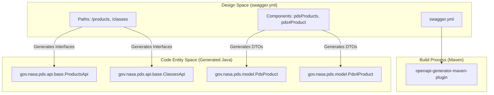
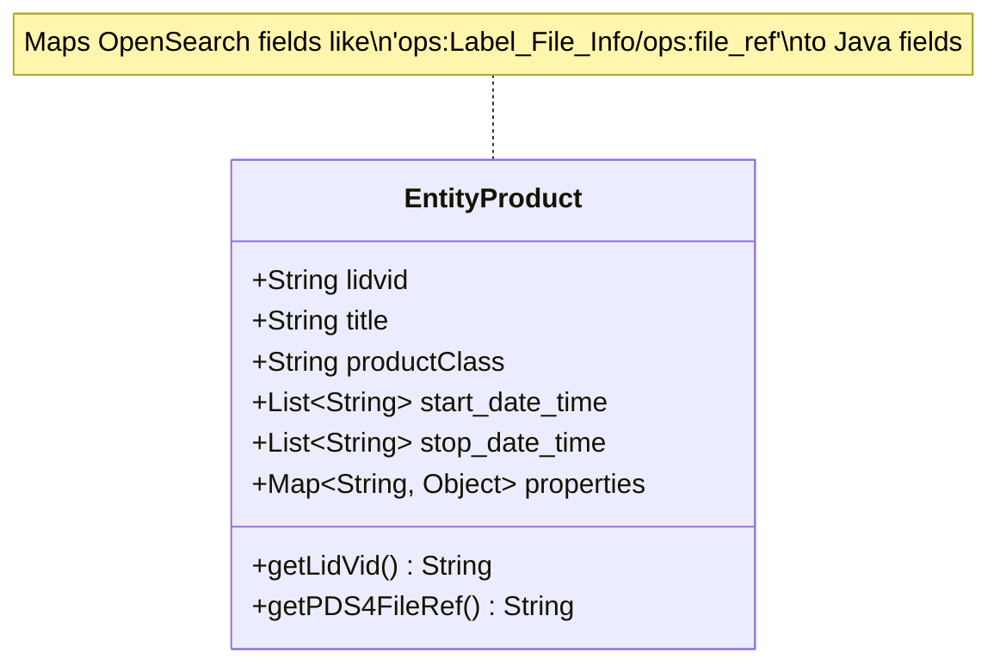

# Page: Model Module — OpenAPI Code Generation

# Model Module — OpenAPI Code Generation

Relevant source files

The following files were used as context for generating this wiki page:

- [lexer/pom.xml](lexer/pom.xml)
- [model/pom.xml](model/pom.xml)
- [model/swagger.yml](model/swagger.yml)
- [pom.xml](pom.xml)
- [service/pom.xml](service/pom.xml)
- [service/src/main/java/gov/nasa/pds/api/registry/model/EntityProduct.java](service/src/main/java/gov/nasa/pds/api/registry/model/EntityProduct.java)
- [service/src/main/resources/application.properties.all](service/src/main/resources/application.properties.all)
- [service/src/test/java/gov/nasa/pds/api/registry/opensearch/Antlr4SearchListenerTest.java](service/src/test/java/gov/nasa/pds/api/registry/opensearch/Antlr4SearchListenerTest.java)
- [service/src/test/java/gov/nasa/pds/api/registry/opensearch/RegistrySearchRequestBuilderTest.java](service/src/test/java/gov/nasa/pds/api/registry/opensearch/RegistrySearchRequestBuilderTest.java)

The **Model Module** (`registry-api-model`) is a core component of the Registry API architecture responsible for defining the RESTful interface contract and the Data Transfer Objects (DTOs) used across the system. It leverages a "Design-First" approach, where the API specification is maintained in a Swagger/OpenAPI YAML file, and Java code is automatically generated during the Maven build lifecycle.

## OpenAPI Infrastructure

The module uses the `openapi-generator-maven-plugin` to ensure that the Java implementation remains perfectly synchronized with the API documentation. This plugin processes the `swagger.yml` file to produce Spring Boot-compatible controller interfaces and model classes.

### Maven Configuration
The code generation is triggered during the `generate` goal of the `openapi-generator-maven-plugin`. Key configuration options include:
*   **Generator**: `spring` [model/pom.xml:66-66]().
*   **Model Package**: `gov.nasa.pds.model` [model/pom.xml:74-74]().
*   **API Package**: `gov.nasa.pds.api.base` [model/pom.xml:75-75]().
*   **Library**: `spring-boot` with `useSpringBoot3` enabled [model/pom.xml:78-78]().
*   **Interface Only**: Set to `false` to generate default method implementations [model/pom.xml:77-77]().

### Data Flow: Specification to Code
The following diagram illustrates how the `swagger.yml` definitions are transformed into Java entities within the `gov.nasa.pds.api.base` and `gov.nasa.pds.model` packages.

**OpenAPI Generation Pipeline**

Sources: [model/pom.xml:54-86](), [model/swagger.yml:1-15]()

---

## Swagger Specification Structure

The `swagger.yml` file serves as the single source of truth for the API. It categorizes endpoints into functional tags and defines strict response schemas.

### Endpoint Categories (Tags)
Endpoints are organized into five primary categories to facilitate documentation and client generation:
1.  **1. all products**: Generic search and resolution by identifier [model/swagger.yml:17-18]().
2.  **2. product references**: Hierarchical navigation (members/member-of) [model/swagger.yml:19-20]().
3.  **3. by product classes**: Class-specific searches (e.g., bundles, collections) [model/swagger.yml:21-22]().
4.  **4. healthcheck**: System status and monitoring [model/swagger.yml:23-24]().
5.  **5. all docs**: Direct OpenSearch DSL access for expert users [model/swagger.yml:25-26]().

### Key Response Schemas
The API utilizes specific schemas to handle the variety of PDS metadata formats:

| Schema Name | Purpose |
| :--- | :--- |
| `pdsProducts` | A plural response containing a list of products and pagination metadata. |
| `pds4Product` | Represents a product formatted according to PDS4 standards. |
| `wyriwygProduct` | "What You Registered Is What You Get" — returns the raw properties as stored in the registry. |

Sources: [model/swagger.yml:16-27](), [model/swagger.yml:150-153](), [model/swagger.yml:178-181]()

---

## Entity and Model Mapping

While the `model` module generates the base DTOs, the `service` module often maps these to internal entities for processing. A critical internal class is `EntityProduct`, which defines the mapping between OpenSearch document fields and Java fields.

### EntityProduct Mapping
`EntityProduct` contains the `JSON_PROPERTIES` constant, which lists the specific PDS4 and operational fields retrieved from the OpenSearch index [service/src/main/java/gov/nasa/pds/api/registry/model/EntityProduct.java:12-16]().

**Entity Mapping Diagram**

Sources: [service/src/main/java/gov/nasa/pds/api/registry/model/EntityProduct.java:11-73]()

---

## Integration with Lexer
The `model` module also contains the `Antlr4SearchListener`, which bridges the gap between the generated API and the `lexer` module. This listener is used to translate the `q` (query) parameter from the REST request into an OpenSearch `BoolQuery`.

### Search Listener Logic
The `Antlr4SearchListener` implements the visitor pattern to walk the parse tree generated by ANTLR.
*   **Conjunctions**: Handles `AND` and `OR` logic [service/src/test/java/gov/nasa/pds/api/registry/opensearch/Antlr4SearchListenerTest.java:177-188]().
*   **Operators**: Supports `eq`, `ne`, `gt`, `ge`, `lt`, `le`, and `like` [service/src/test/java/gov/nasa/pds/api/registry/opensearch/Antlr4SearchListenerTest.java:71-82]().
*   **Nesting**: Correctly processes grouped statements using parentheses [service/src/test/java/gov/nasa/pds/api/registry/opensearch/Antlr4SearchListenerTest.java:102-107]().

Sources: [service/src/test/java/gov/nasa/pds/api/registry/opensearch/Antlr4SearchListenerTest.java:23-26](), [service/src/test/java/gov/nasa/pds/api/registry/opensearch/Antlr4SearchListenerTest.java:51-67]()
