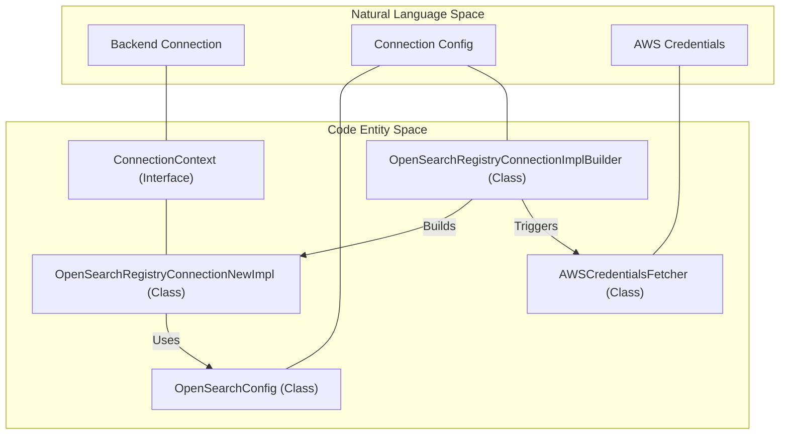
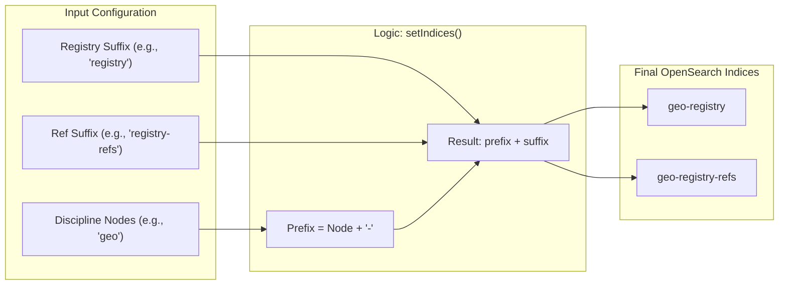

# Page: OpenSearch Backend Integration

# OpenSearch Backend Integration

Relevant source files

The following files were used as context for generating this wiki page:

- [lexer/pom.xml](lexer/pom.xml)
- [model/pom.xml](model/pom.xml)
- [pom.xml](pom.xml)
- [service/pom.xml](service/pom.xml)
- [service/src/main/java/gov/nasa/pds/api/registry/ConnectionContext.java](service/src/main/java/gov/nasa/pds/api/registry/ConnectionContext.java)
- [service/src/main/java/gov/nasa/pds/api/registry/SpringBootMain.java](service/src/main/java/gov/nasa/pds/api/registry/SpringBootMain.java)
- [service/src/main/java/gov/nasa/pds/api/registry/model/EntityProduct.java](service/src/main/java/gov/nasa/pds/api/registry/model/EntityProduct.java)
- [service/src/main/java/gov/nasa/pds/api/registry/search/OpenSearchConfig.java](service/src/main/java/gov/nasa/pds/api/registry/search/OpenSearchConfig.java)
- [service/src/main/java/gov/nasa/pds/api/registry/search/OpenSearchRegistryConnectionImplBuilder.java](service/src/main/java/gov/nasa/pds/api/registry/search/OpenSearchRegistryConnectionImplBuilder.java)
- [service/src/main/java/gov/nasa/pds/api/registry/search/OpenSearchRegistryConnectionNewImpl.java](service/src/main/java/gov/nasa/pds/api/registry/search/OpenSearchRegistryConnectionNewImpl.java)
- [service/src/test/java/gov/nasa/pds/api/registry/opensearch/RegistrySearchRequestBuilderTest.java](service/src/test/java/gov/nasa/pds/api/registry/opensearch/RegistrySearchRequestBuilderTest.java)

The PDS Registry API utilizes OpenSearch as its primary metadata storage and search engine. This page provides a high-level overview of how the service establishes connections, manages multiple client implementations, handles authentication, and resolves index names.

### Connection Architecture

The integration is centered around the `ConnectionContext` interface [service/src/main/java/gov/nasa/pds/api/registry/ConnectionContext.java:7-24](), which abstracts the underlying OpenSearch client and provides metadata about the connection, such as target indices and timeout settings.

The primary implementation, `OpenSearchRegistryConnectionNewImpl`, manages the lifecycle of the OpenSearch clients and handles the complexities of both local and AWS-hosted environments [service/src/main/java/gov/nasa/pds/api/registry/search/OpenSearchRegistryConnectionNewImpl.java:51-62]().

#### Dual-Client Support
The service maintains support for two distinct client types to ensure compatibility with different parts of the OpenSearch ecosystem:
1.  **OpenSearch Java Client**: The modern, strongly-typed client used for newer search operations [service/src/main/java/gov/nasa/pds/api/registry/ConnectionContext.java:9]().
2.  **OpenSearch Generic Client**: Used for low-level or generic requests that may not be fully modeled in the high-level API [service/src/main/java/gov/nasa/pds/api/registry/ConnectionContext.java:11]().

**Note:** While the codebase contains references to legacy `RestHighLevelClient` patterns, the current implementation prioritizes the newer Apache HttpClient 5 transport [service/src/main/java/gov/nasa/pds/api/registry/search/OpenSearchRegistryConnectionNewImpl.java:31-35]().

### Connection Management and Code Entities

The following diagram illustrates how the natural language concept of a "Backend Connection" maps to specific Java classes and interfaces within the `service` module.

**OpenSearch Connection Entity Map**

Sources: [service/src/main/java/gov/nasa/pds/api/registry/ConnectionContext.java:7-24](), [service/src/main/java/gov/nasa/pds/api/registry/search/OpenSearchRegistryConnectionNewImpl.java:51-62](), [service/src/main/java/gov/nasa/pds/api/registry/search/OpenSearchConfig.java:19-140](), [service/src/main/java/gov/nasa/pds/api/registry/search/OpenSearchRegistryConnectionImplBuilder.java:17-18]()

### Connection Configuration
The service is highly configurable via `application.properties` and environment variables. Key settings include:
*   **Host Resolution**: Supports multiple hosts for cluster connectivity [service/src/main/java/gov/nasa/pds/api/registry/search/OpenSearchConfig.java:27-28]().
*   **SSL/TLS**: Detailed control over SSL context, including the ability to disable hostname verification for internal dev environments [service/src/main/java/gov/nasa/pds/api/registry/search/OpenSearchRegistryConnectionNewImpl.java:85-112]().
*   **Cross-Cluster Search (CCS)**: Capability to enable/disable searching across remote clusters [service/src/main/java/gov/nasa/pds/api/registry/search/OpenSearchConfig.java:50-51]().

For detailed property keys and implementation logic, see [OpenSearch Connection Configuration](#5.1).

### AWS and Authentication
The Registry API supports two primary authentication modes:
1.  **Basic Authentication**: Standard username/password credentials provided via configuration [service/src/main/java/gov/nasa/pds/api/registry/search/OpenSearchRegistryConnectionNewImpl.java:116-126]().
2.  **AWS IAM Authentication**: For deployments in AWS (e.g., Amazon OpenSearch Service), the API uses `AWSCredentialsFetcher` to retrieve credentials from AWS Secrets Manager or IAM roles [service/src/main/java/gov/nasa/pds/api/registry/search/OpenSearchRegistryConnectionImplBuilder.java:133-142]().

For details on AWS-specific setup and Secrets Manager integration, see [AWS Integration — Secrets and Credentials](#5.2).

### Index Naming Conventions
The API resolves index names dynamically based on "discipline nodes." This allows a single API instance to target specific subsets of data (e.g., `geo-registry` vs `img-registry`) [service/src/main/java/gov/nasa/pds/api/registry/search/OpenSearchRegistryConnectionNewImpl.java:136-149]().

**Index Resolution Logic**

Sources: [service/src/main/java/gov/nasa/pds/api/registry/search/OpenSearchRegistryConnectionNewImpl.java:136-149]()

### Summary Table: Key Backend Components

| Component | Responsibility | Source |
| :--- | :--- | :--- |
| `OpenSearchConfig` | Maps `application.properties` to Java fields. | [OpenSearchConfig.java:19]() |
| `ConnectionContext` | Interface for accessing the OpenSearch client and index info. | [ConnectionContext.java:7]() |
| `AWSCredentialsFetcher` | Retrieves AWS credentials for secure cloud connections. | [AWSCredentialsFetcher.java]() |
| `ApacheHttpClient5Transport` | The underlying network transport for OpenSearch communication. | [OpenSearchRegistryConnectionNewImpl.java:31]() |

Sources: [service/src/main/java/gov/nasa/pds/api/registry/search/OpenSearchConfig.java:19-140](), [service/src/main/java/gov/nasa/pds/api/registry/ConnectionContext.java:7-24](), [service/src/main/java/gov/nasa/pds/api/registry/search/OpenSearchRegistryConnectionNewImpl.java:31-35]()
