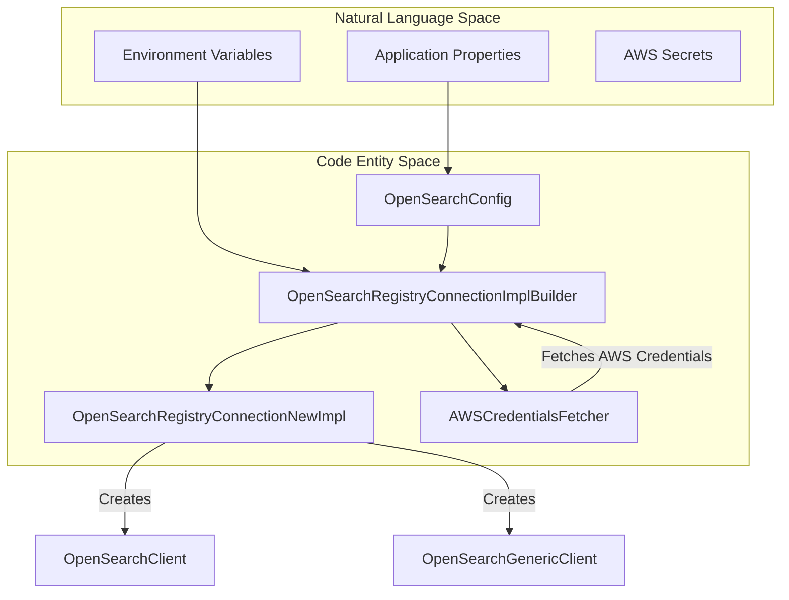
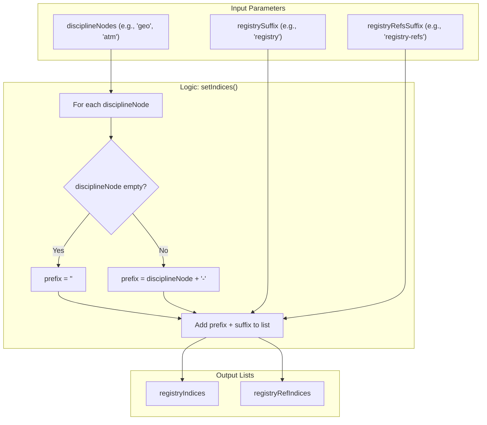

# Page: OpenSearch Connection Configuration

# OpenSearch Connection Configuration

Relevant source files

The following files were used as context for generating this wiki page:

- [service/README.md](service/README.md)
- [service/src/main/java/gov/nasa/pds/api/registry/ConnectionContext.java](service/src/main/java/gov/nasa/pds/api/registry/ConnectionContext.java)
- [service/src/main/java/gov/nasa/pds/api/registry/SpringBootMain.java](service/src/main/java/gov/nasa/pds/api/registry/SpringBootMain.java)
- [service/src/main/java/gov/nasa/pds/api/registry/SystemConstants.java](service/src/main/java/gov/nasa/pds/api/registry/SystemConstants.java)
- [service/src/main/java/gov/nasa/pds/api/registry/search/OpenSearchConfig.java](service/src/main/java/gov/nasa/pds/api/registry/search/OpenSearchConfig.java)
- [service/src/main/java/gov/nasa/pds/api/registry/search/OpenSearchRegistryConnectionImplBuilder.java](service/src/main/java/gov/nasa/pds/api/registry/search/OpenSearchRegistryConnectionImplBuilder.java)
- [service/src/main/java/gov/nasa/pds/api/registry/search/OpenSearchRegistryConnectionNewImpl.java](service/src/main/java/gov/nasa/pds/api/registry/search/OpenSearchRegistryConnectionNewImpl.java)
- [service/src/main/resources/application.properties](service/src/main/resources/application.properties)
- [service/src/main/resources/application.properties.aws](service/src/main/resources/application.properties.aws)

This page details the configuration and implementation of the OpenSearch backend connection within the Registry API. The system uses a flexible configuration model that supports local development via Docker, standard on-premise OpenSearch clusters, and AWS-managed OpenSearch services.

## Overview

The Registry API connects to OpenSearch using the `ConnectionContext` interface [service/src/main/java/gov/nasa/pds/api/registry/ConnectionContext.java:7-24](). The primary implementation is `OpenSearchRegistryConnectionNewImpl`, which leverages the OpenSearch Java Client to perform search operations [service/src/main/java/gov/nasa/pds/api/registry/search/OpenSearchRegistryConnectionNewImpl.java:51-62]().

### Configuration Flow
The connection is initialized during the Spring Boot application startup [service/src/main/java/gov/nasa/pds/api/registry/SpringBootMain.java:22-25](). The flow follows this sequence:
1.  **OpenSearchConfig**: Loads properties from `application.properties` [service/src/main/java/gov/nasa/pds/api/registry/search/OpenSearchConfig.java:18-140]().
2.  **OpenSearchRegistryConnectionImplBuilder**: Consolidates configuration and handles environment variable overrides [service/src/main/java/gov/nasa/pds/api/registry/search/OpenSearchRegistryConnectionImplBuilder.java:113-136]().
3.  **OpenSearchRegistryConnectionNewImpl**: Constructs the `OpenSearchClient` and `OpenSearchTransport` based on the provided builder [service/src/main/java/gov/nasa/pds/api/registry/search/OpenSearchRegistryConnectionNewImpl.java:75-78]().

### Connection Component Architecture
The following diagram illustrates how the configuration classes map to the connection implementation.

**Configuration to Implementation Mapping**

Sources: [service/src/main/java/gov/nasa/pds/api/registry/search/OpenSearchConfig.java:18-140](), [service/src/main/java/gov/nasa/pds/api/registry/search/OpenSearchRegistryConnectionImplBuilder.java:17-161](), [service/src/main/java/gov/nasa/pds/api/registry/search/OpenSearchRegistryConnectionNewImpl.java:51-62]().

## Key Configuration Properties

The following properties in `application.properties` control the backend behavior:

| Property | Description | Default |
| :--- | :--- | :--- |
| `openSearch.host` | Comma-separated list of OpenSearch nodes (host:port). | `localhost:9200` |
| `openSearch.registryIndex` | Base name for the product registry index. | `registry` |
| `openSearch.registryRefIndex` | Base name for the reference/membership index. | `registry-refs` |
| `openSearch.disciplineNodes` | Prefixes used for discipline-specific indices (e.g., `geo`). | `geo` |
| `openSearch.CCSEnabled` | Enables Cross-Cluster Search logic. | `true` |
| `openSearch.username` | Username for Basic Auth. | `admin` |
| `openSearch.password` | Password for Basic Auth. | `admin` |
| `openSearch.ssl` | Enables SSL/TLS for the connection. | `true` |
| `openSearch.sslCertificateCNVerification` | Enables/Disables hostname verification. | `true` |
| `filter.archiveStatus` | Filters results by `ops:Harvest_Info/ops:archive_status`. | `archived,certified` |

Sources: [service/src/main/resources/application.properties:34-49](), [service/src/main/java/gov/nasa/pds/api/registry/search/OpenSearchConfig.java:27-91]().

## Connection Logic and Transports

The `OpenSearchRegistryConnectionNewImpl` class manages two types of transports depending on the environment:

### 1. Local/Standard Transport
Used for standard HTTP/HTTPS connections with Basic Authentication. It uses the `ApacheHttpClient5TransportBuilder` [service/src/main/java/gov/nasa/pds/api/registry/search/OpenSearchRegistryConnectionNewImpl.java:161-171]().
*   **SSL Configuration**: If `openSearch.ssl` is true, a `TlsStrategy` is configured using an `SSLContext` that trusts all materials by default for flexibility [service/src/main/java/gov/nasa/pds/api/registry/search/OpenSearchRegistryConnectionNewImpl.java:88-112]().
*   **Authentication**: Implemented via `BasicCredentialsProvider` using the provided username and password [service/src/main/java/gov/nasa/pds/api/registry/search/OpenSearchRegistryConnectionNewImpl.java:116-128]().

### 2. AWS Transport
Used for AWS-managed OpenSearch services. It utilizes `AwsSdk2Transport` and requires AWS credentials [service/src/main/java/gov/nasa/pds/api/registry/search/OpenSearchRegistryConnectionNewImpl.java:174-192]().
*   Credentials are often fetched dynamically via the `AWSCredentialsFetcher` [service/src/main/java/gov/nasa/pds/api/registry/search/OpenSearchRegistryConnectionImplBuilder.java:140-142]().

### Index Resolution Logic
The system supports multi-index searching by combining discipline nodes with index suffixes. The `setIndices` method generates the final list of indices to be queried [service/src/main/java/gov/nasa/pds/api/registry/search/OpenSearchRegistryConnectionNewImpl.java:136-149]().

**Index Generation Logic**

Sources: [service/src/main/java/gov/nasa/pds/api/registry/search/OpenSearchRegistryConnectionNewImpl.java:136-149]().

## Implementation Details

### OpenSearchRegistryConnectionImplBuilder
This builder class is responsible for the "Environment vs. Properties" hierarchy. If `openSearch.host` is missing in the properties file, it attempts to read the `ES_HOSTS` environment variable [service/src/main/java/gov/nasa/pds/api/registry/search/OpenSearchRegistryConnectionImplBuilder.java:144-159](). It also triggers the `AWSCredentialsFetcher` to ensure cloud environments are ready [service/src/main/java/gov/nasa/pds/api/registry/search/OpenSearchRegistryConnectionImplBuilder.java:133]().

### Connection Initialization
The `OpenSearchRegistryConnectionNewImpl` constructor initializes the OpenSearch client. It determines whether to use AWS or Local transport based on the host configuration [service/src/main/java/gov/nasa/pds/api/registry/search/OpenSearchRegistryConnectionNewImpl.java:75-78]().

*   **Host Parsing**: Hosts are parsed from strings like `localhost:9200` into `HttpHost` objects [service/src/main/java/gov/nasa/pds/api/registry/search/OpenSearchRegistryConnectionNewImpl.java:214-222]().
*   **Timeout**: The connection timeout is set via `openSearch.timeOutSeconds`, defaulting to 60 seconds [service/src/main/resources/application.properties:37]().

Sources: [service/src/main/java/gov/nasa/pds/api/registry/search/OpenSearchRegistryConnectionNewImpl.java:70-222](), [service/src/main/java/gov/nasa/pds/api/registry/search/OpenSearchRegistryConnectionImplBuilder.java:113-161]().
