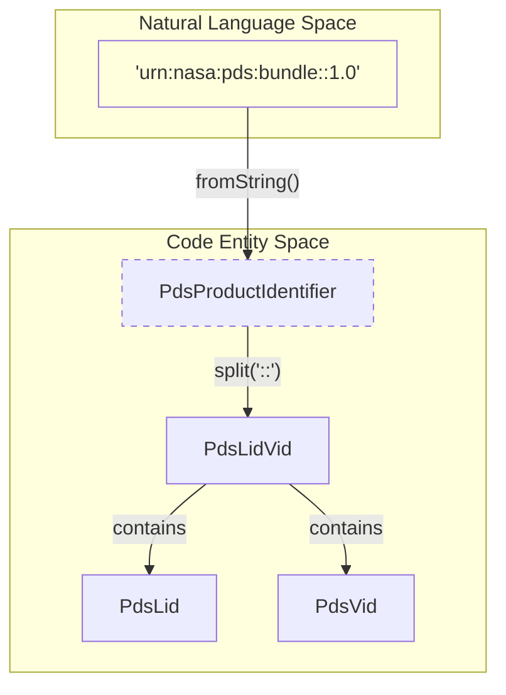
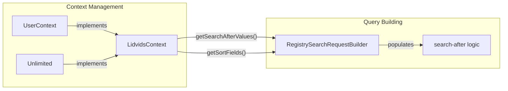

# Page: Pagination and LidVid Context

# Pagination and LidVid Context

Relevant source files

The following files were used as context for generating this wiki page:

- [service/src/main/java/gov/nasa/pds/api/registry/LidvidsContext.java](service/src/main/java/gov/nasa/pds/api/registry/LidvidsContext.java)
- [service/src/main/java/gov/nasa/pds/api/registry/UserContext.java](service/src/main/java/gov/nasa/pds/api/registry/UserContext.java)
- [service/src/main/java/gov/nasa/pds/api/registry/model/Unlimited.java](service/src/main/java/gov/nasa/pds/api/registry/model/Unlimited.java)
- [service/src/main/java/gov/nasa/pds/api/registry/model/identifiers/PdsLid.java](service/src/main/java/gov/nasa/pds/api/registry/model/identifiers/PdsLid.java)
- [service/src/main/java/gov/nasa/pds/api/registry/model/identifiers/PdsLidVid.java](service/src/main/java/gov/nasa/pds/api/registry/model/identifiers/PdsLidVid.java)
- [service/src/main/java/gov/nasa/pds/api/registry/model/identifiers/PdsProductIdentifier.java](service/src/main/java/gov/nasa/pds/api/registry/model/identifiers/PdsProductIdentifier.java)
- [service/src/test/java/gov/nasa/pds/api/registry/model/PdsProductIdentifierTest.java](service/src/test/java/gov/nasa/pds/api/registry/model/PdsProductIdentifierTest.java)

This page details the mechanisms used by the Registry API to manage large result sets and identify specific PDS products. It covers the `LidvidsContext` interface hierarchy, the `search-after` pagination strategy, and the internal representation of PDS identifiers.

## LidVid Context Hierarchy

The Registry API uses a context-based approach to pass search parameters and pagination state through the service layer. The root of this hierarchy is the `LidvidsContext`, which defines the minimum requirements for a paginated request.

### LidvidsContext Interface
The `LidvidsContext` interface provides the necessary metadata to execute a query against OpenSearch and handle results [service/src/main/java/gov/nasa/pds/api/registry/LidvidsContext.java:5-15]().

| Method | Description |
| :--- | :--- |
| `getProductIdentifierStr()` | Returns the raw string representation of the LID or LIDVID [service/src/main/java/gov/nasa/pds/api/registry/LidvidsContext.java:6](). |
| `getLimit()` | The maximum number of results to return (page size) [service/src/main/java/gov/nasa/pds/api/registry/LidvidsContext.java:8](). |
| `getSortFields()` | A list of fields used for ordering results [service/src/main/java/gov/nasa/pds/api/registry/LidvidsContext.java:10](). |
| `getSearchAfterValues()` | The tokens used for "search-after" deep paging [service/src/main/java/gov/nasa/pds/api/registry/LidvidsContext.java:12](). |
| `getSingletonResultExpected()` | Boolean indicating if only one result is anticipated [service/src/main/java/gov/nasa/pds/api/registry/LidvidsContext.java:14](). |

### UserContext Interface
The `UserContext` extends `LidvidsContext` to include parameters typically provided by an end-user via API endpoints, such as query strings, requested fields, and version selectors [service/src/main/java/gov/nasa/pds/api/registry/UserContext.java:8-28]().

### Unlimited Implementation
The `Unlimited` class is a specialized implementation of `LidvidsContext` used when the system needs to retrieve all versions or related products without a standard user-defined limit [service/src/main/java/gov/nasa/pds/api/registry/model/Unlimited.java:7-38]().
*   **Limit:** Hardcoded to `Integer.MAX_VALUE` [service/src/main/java/gov/nasa/pds/api/registry/model/Unlimited.java:21]().
*   **Default Sort:** Uses `ops:Harvest_Info/ops:harvest_date_time` to ensure a stable sort order for pagination [service/src/main/java/gov/nasa/pds/api/registry/model/Unlimited.java:26]().

**Sources:**
* [service/src/main/java/gov/nasa/pds/api/registry/LidvidsContext.java:5-15]()
* [service/src/main/java/gov/nasa/pds/api/registry/UserContext.java:8-28]()
* [service/src/main/java/gov/nasa/pds/api/registry/model/Unlimited.java:7-38]()

---

## PDS Product Identifiers

Identifiers are the primary way products are addressed. The system distinguishes between Logical Identifiers (LID) and Logical Identifier with Version (LIDVID).

### Identifier Class Structure
The `PdsProductIdentifier` abstract class provides a factory method `fromString()` to parse incoming identifier strings [service/src/main/java/gov/nasa/pds/api/registry/model/identifiers/PdsProductIdentifier.java:11-21]().

*   **PdsLid**: Represents a logical identifier (e.g., `urn:nasa:pds:context:instrument:host.mro`) [service/src/main/java/gov/nasa/pds/api/registry/model/identifiers/PdsLid.java:3-46]().
*   **PdsLidVid**: Represents a specific version of a product, combining a `PdsLid` and a `PdsVid` [service/src/main/java/gov/nasa/pds/api/registry/model/identifiers/PdsLidVid.java:3-73]().

### Parsing Logic
The parser looks for the `::` separator [service/src/main/java/gov/nasa/pds/api/registry/model/identifiers/PdsProductIdentifier.java:4](). If present and followed by a valid version, it creates a `PdsLidVid`. If the version part is malformed or missing, it falls back to a `PdsLid` [service/src/main/java/gov/nasa/pds/api/registry/model/identifiers/PdsProductIdentifier.java:16-25]().

### Code Entity Relationship: Identifiers
The following diagram shows how raw input strings are transformed into typed identifier objects.

"Identifier Parsing Flow"

**Sources:**
* [service/src/main/java/gov/nasa/pds/api/registry/model/identifiers/PdsProductIdentifier.java:3-44]()
* [service/src/main/java/gov/nasa/pds/api/registry/model/identifiers/PdsLidVid.java:3-73]()
* [service/src/main/java/gov/nasa/pds/api/registry/model/identifiers/PdsLid.java:3-46]()

---

## Search-After Pagination Mechanism

The Registry API implements "deep paging" using OpenSearch's `search_after` parameter. This avoids the performance degradation associated with high offsets in traditional `from/size` pagination.

### Sort Fields and Determinism
For `search_after` to work correctly, the sort order must be deterministic. The API defaults to sorting by `ops:Harvest_Info/ops:harvest_date_time` [service/src/main/java/gov/nasa/pds/api/registry/model/Unlimited.java:26-27]().

### Data Flow for Pagination
1.  **Initial Request:** The user provides a `limit`. The `search-after` token is empty.
2.  **OpenSearch Execution:** The service module executes the query.
3.  **Token Extraction:** The values of the sort fields from the *last* record in the current result set are extracted.
4.  **Response Construction:** These values are encoded (usually as a comma-separated list) and returned to the user as a `search-after` token.
5.  **Subsequent Request:** The user provides the `search-after` token in the next request. The API passes these values back to OpenSearch to resume the search from exactly where it left off.

### Pagination Component Interaction
This diagram illustrates how `LidvidsContext` interacts with the search request building process to enable pagination.

"Pagination and Context Interaction"

**Sources:**
* [service/src/main/java/gov/nasa/pds/api/registry/LidvidsContext.java:10-12]()
* [service/src/main/java/gov/nasa/pds/api/registry/model/Unlimited.java:25-32]()
* [service/src/main/java/gov/nasa/pds/api/registry/UserContext.java:23-25]()

---

## Comparison Logic

The `PdsLidVid` class implements `Comparable`, allowing the API to sort products by version programmatically when necessary [service/src/main/java/gov/nasa/pds/api/registry/model/identifiers/PdsLidVid.java:3]().

*   **Constraint:** Comparison is only allowed between LIDVIDs that share the same LID [service/src/main/java/gov/nasa/pds/api/registry/model/identifiers/PdsLidVid.java:64-69]().
*   **Implementation:** It delegates the actual version comparison to the `PdsVid` class [service/src/main/java/gov/nasa/pds/api/registry/model/identifiers/PdsLidVid.java:71]().

**Sources:**
* [service/src/main/java/gov/nasa/pds/api/registry/model/identifiers/PdsLidVid.java:59-72]()
