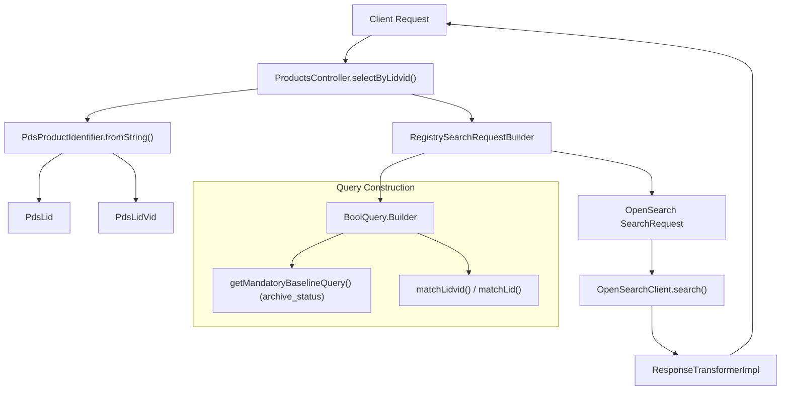

# Page: Product Endpoints

# Product Endpoints

Relevant source files

The following files were used as context for generating this wiki page:

- [lexer/src/main/antlr4/gov/nasa/pds/api/registry/lexer/Search.g4](lexer/src/main/antlr4/gov/nasa/pds/api/registry/lexer/Search.g4)
- [lexer/src/test/java/api/pds/nasa/gov/api_search_query_lexer/MockedListener.java](lexer/src/test/java/api/pds/nasa/gov/api_search_query_lexer/MockedListener.java)
- [lexer/src/test/java/api/pds/nasa/gov/api_search_query_lexer/TestParsing.java](lexer/src/test/java/api/pds/nasa/gov/api_search_query_lexer/TestParsing.java)
- [service/src/main/java/gov/nasa/pds/api/registry/configuration/OpenAPIClearedTags.java](service/src/main/java/gov/nasa/pds/api/registry/configuration/OpenAPIClearedTags.java)
- [service/src/main/java/gov/nasa/pds/api/registry/controllers/ProductsController.java](service/src/main/java/gov/nasa/pds/api/registry/controllers/ProductsController.java)
- [service/src/main/java/gov/nasa/pds/api/registry/model/Antlr4SearchListener.java](service/src/main/java/gov/nasa/pds/api/registry/model/Antlr4SearchListener.java)
- [service/src/main/java/gov/nasa/pds/api/registry/model/identifiers/PdsLid.java](service/src/main/java/gov/nasa/pds/api/registry/model/identifiers/PdsLid.java)
- [service/src/main/java/gov/nasa/pds/api/registry/model/identifiers/PdsLidVid.java](service/src/main/java/gov/nasa/pds/api/registry/model/identifiers/PdsLidVid.java)
- [service/src/main/java/gov/nasa/pds/api/registry/model/identifiers/PdsProductClasses.java](service/src/main/java/gov/nasa/pds/api/registry/model/identifiers/PdsProductClasses.java)
- [service/src/main/java/gov/nasa/pds/api/registry/model/identifiers/PdsProductIdentifier.java](service/src/main/java/gov/nasa/pds/api/registry/model/identifiers/PdsProductIdentifier.java)
- [service/src/main/java/gov/nasa/pds/api/registry/model/identifiers/PdsVid.java](service/src/main/java/gov/nasa/pds/api/registry/model/identifiers/PdsVid.java)
- [service/src/main/java/gov/nasa/pds/api/registry/model/transformers/ResponseTransformerImpl.java](service/src/main/java/gov/nasa/pds/api/registry/model/transformers/ResponseTransformerImpl.java)
- [service/src/main/java/gov/nasa/pds/api/registry/search/RegistrySearchRequestBuilder.java](service/src/main/java/gov/nasa/pds/api/registry/search/RegistrySearchRequestBuilder.java)
- [service/src/test/java/gov/nasa/pds/api/registry/model/PdsLidTest.java](service/src/test/java/gov/nasa/pds/api/registry/model/PdsLidTest.java)
- [service/src/test/java/gov/nasa/pds/api/registry/model/PdsLidVidTest.java](service/src/test/java/gov/nasa/pds/api/registry/model/PdsLidVidTest.java)
- [service/src/test/java/gov/nasa/pds/api/registry/model/PdsProductClassesTest.java](service/src/test/java/gov/nasa/pds/api/registry/model/PdsProductClassesTest.java)
- [service/src/test/java/gov/nasa/pds/api/registry/model/PdsProductIdentifierTest.java](service/src/test/java/gov/nasa/pds/api/registry/model/PdsProductIdentifierTest.java)
- [service/src/test/java/gov/nasa/pds/api/registry/model/PdsVidTest.java](service/src/test/java/gov/nasa/pds/api/registry/model/PdsVidTest.java)

Product endpoints provide the primary interface for searching and retrieving PDS4 product metadata. These endpoints support complex queries via an ANTLR4-based search grammar and handle the resolution of Logical Identifiers (LID) and versioned Logical Identifiers (LIDVID).

## Endpoint Overview

The `ProductsController` implements the `ProductsApi` interface (generated from OpenAPI) to handle the following routes:

| Route | Method | Description |
| :--- | :--- | :--- |
| `/products` | `GET` | List all products with optional filtering and search. |
| `/products/{identifier}` | `GET` | Retrieve a specific product by LID or LIDVID. |
| `/products/{identifier}/latest` | `GET` | Retrieve the latest version of a product by LID or LIDVID. |
| `/products/{identifier}/all` | `GET` | Retrieve all versions of a product by LID. |
| `/classes/{class}` | `GET` | Retrieve products belonging to a specific `product_class`. |

**Sources:** [service/src/main/java/gov/nasa/pds/api/registry/controllers/ProductsController.java:52-52](), [service/src/main/java/gov/nasa/pds/api/registry/configuration/OpenAPIClearedTags.java:22-23]()

## Identifier Resolution Logic

The API distinguishes between a **LID** (Logical Identifier) and a **LIDVID** (LID + Version Identifier). The resolution logic determines whether to return a specific version, the latest version, or a collection of versions.

### LID vs LIDVID Detection
The system uses the `PdsProductIdentifier` factory to parse incoming strings.
*   **LIDVID**: Contains the `::` separator (e.g., `urn:nasa:pds:bundle::1.0`).
*   **LID**: No separator (e.g., `urn:nasa:pds:bundle`).

**Sources:** [service/src/main/java/gov/nasa/pds/api/registry/model/identifiers/PdsProductIdentifier.java:11-21](), [service/src/main/java/gov/nasa/pds/api/registry/model/identifiers/PdsProductIdentifier.java:4-5]()

### Resolution Flow in ProductsController
The `selectByLidvid` method handles different scenarios based on the identifier type and the requested endpoint suffix:

| Identifier Type | Suffix | Resolution Logic |
| :--- | :--- | :--- |
| LIDVID | None | Exact match on LIDVID. |
| LID | None | Returns the latest version of that LID. |
| LID | `/latest` | Returns the latest version of that LID. |
| LIDVID | `/latest` | Ignores the VID in the identifier and returns the latest version of the LID. |
| LID | `/all` | Returns all versions associated with the LID. |
| LIDVID | `/all` | Returns all versions associated with the LID (ignores the VID provided). |

**Sources:** [service/src/main/java/gov/nasa/pds/api/registry/controllers/ProductsController.java:138-147]()

## Request Lifecycle Diagram

The following diagram illustrates how a request for a product identifier flows from the `ProductsController` through the `RegistrySearchRequestBuilder` to the OpenSearch backend.

### Product Retrieval Data Flow

**Sources:** [service/src/main/java/gov/nasa/pds/api/registry/controllers/ProductsController.java:146-160](), [service/src/main/java/gov/nasa/pds/api/registry/search/RegistrySearchRequestBuilder.java:50-70](), [service/src/main/java/gov/nasa/pds/api/registry/search/RegistrySearchRequestBuilder.java:80-91]()

## Search and Filtering

### The `excludeSupersededProducts` Filter
When querying the `/products` endpoint, the API can filter out older versions of products. This is handled by `RegistrySearchRequestBuilder.excludeSupersededProducts()`. This method adds a constraint to the OpenSearch query to only include documents where the version is the most recent for a given LID.

**Sources:** [service/src/main/java/gov/nasa/pds/api/registry/search/RegistrySearchRequestBuilder.java:130-134]()

### Search Grammar Integration
The `q` parameter is parsed using `Antlr4SearchListener`. This allows users to perform complex logic (e.g., `lid eq "urn:..." AND product_class eq "Product_Bundle"`).

**Sources:** [service/src/main/java/gov/nasa/pds/api/registry/model/Antlr4SearchListener.java:29-55](), [lexer/src/main/antlr4/gov/nasa/pds/api/registry/lexer/Search.g4:1-13]()

## Class-Based Retrieval

The `/classes/{class}` endpoint allows filtering by the PDS4 `product_class`. The `PdsProductClasses` enum maintains the mapping between the "shorthand" name used in the URL (e.g., `bundle`) and the full PDS4 class name (e.g., `Product_Bundle`).

*   **Logic**: `PdsProductClasses.fromSwaggerName(class)` resolves the URL segment.
*   **Query**: The `RegistrySearchRequestBuilder` applies a term filter on the `product_class` field.

**Sources:** [service/src/main/java/gov/nasa/pds/api/registry/model/identifiers/PdsProductClasses.java:10-45](), [service/src/main/java/gov/nasa/pds/api/registry/model/identifiers/PdsProductClasses.java:86-101]()

## Implementation Details

### Key Methods in `ProductsController`
*   `selectByLidvid(identifier, userRequestedFields)`: The entry point for identifier-based lookups. [service/src/main/java/gov/nasa/pds/api/registry/controllers/ProductsController.java:146]()
*   `searchAndTransform(...)`: A helper method that executes the OpenSearch request and applies the appropriate `ResponseTransformer` (JSON, XML, CSV, etc.). [service/src/main/java/gov/nasa/pds/api/registry/controllers/ProductsController.java:109-136]()
*   `getTransformerInstance()`: Uses the `ResponseTransformerRegistry` to select a transformer based on the HTTP `Accept` header. [service/src/main/java/gov/nasa/pds/api/registry/controllers/ProductsController.java:82-107]()

### Key Methods in `RegistrySearchRequestBuilder`
*   `getMandatoryBaselineQuery()`: Injects the `ops:Tracking_Meta/ops:archive_status` filter into every request to ensure only valid products are returned. [service/src/main/java/gov/nasa/pds/api/registry/search/RegistrySearchRequestBuilder.java:80-91]()
*   `applyMultipleProductsDefaults(...)`: Configures pagination, sorting, and field selection for list-based endpoints. [service/src/main/java/gov/nasa/pds/api/registry/search/RegistrySearchRequestBuilder.java:121-135]()

**Sources:** [service/src/main/java/gov/nasa/pds/api/registry/controllers/ProductsController.java:1-150](), [service/src/main/java/gov/nasa/pds/api/registry/search/RegistrySearchRequestBuilder.java:1-150]()
