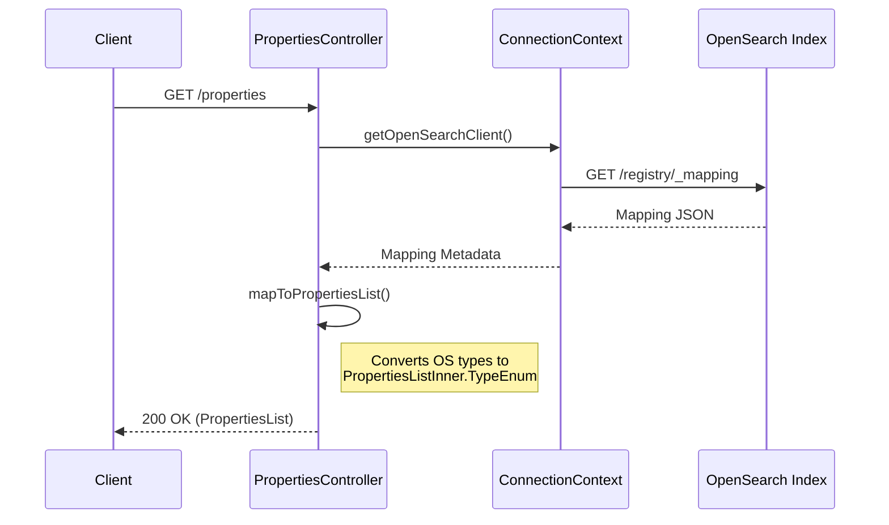
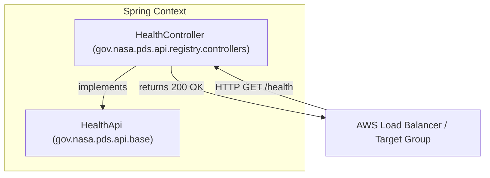
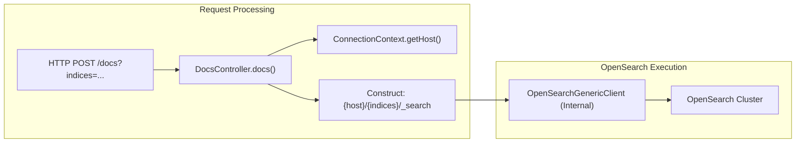

# Page: Properties, Health, and Docs Endpoints

# Properties, Health, and Docs Endpoints

Relevant source files

The following files were used as context for generating this wiki page:

- [docker/Dockerfile](docker/Dockerfile)
- [service/src/main/java/gov/nasa/pds/api/registry/configuration/AWSSecretsAccess.java](service/src/main/java/gov/nasa/pds/api/registry/configuration/AWSSecretsAccess.java)
- [service/src/main/java/gov/nasa/pds/api/registry/controllers/DocsController.java](service/src/main/java/gov/nasa/pds/api/registry/controllers/DocsController.java)
- [service/src/main/java/gov/nasa/pds/api/registry/controllers/HealthController.java](service/src/main/java/gov/nasa/pds/api/registry/controllers/HealthController.java)
- [service/src/main/java/gov/nasa/pds/api/registry/model/exceptions/AcceptFormatNotSupportedException.java](service/src/main/java/gov/nasa/pds/api/registry/model/exceptions/AcceptFormatNotSupportedException.java)
- [service/src/main/java/gov/nasa/pds/api/registry/model/exceptions/NotFoundException.java](service/src/main/java/gov/nasa/pds/api/registry/model/exceptions/NotFoundException.java)
- [service/src/main/java/gov/nasa/pds/api/registry/model/exceptions/RegistryApiException.java](service/src/main/java/gov/nasa/pds/api/registry/model/exceptions/RegistryApiException.java)
- [service/src/main/java/gov/nasa/pds/api/registry/model/exceptions/UnhandledException.java](service/src/main/java/gov/nasa/pds/api/registry/model/exceptions/UnhandledException.java)
- [service/src/main/java/gov/nasa/pds/api/registry/model/exceptions/UnparsableQParamException.java](service/src/main/java/gov/nasa/pds/api/registry/model/exceptions/UnparsableQParamException.java)
- [service/src/main/resources/static/logo.svg](service/src/main/resources/static/logo.svg)
- [service/src/main/resources/swagger-ui/pds.css](service/src/main/resources/swagger-ui/pds.css)

This page provides a technical reference for the utility endpoints of the Registry API: `/properties`, `/health`, and `/docs`. These endpoints facilitate system introspection, monitoring, and advanced debugging by providing direct access to the underlying OpenSearch schema and status.

## Properties Endpoint (`/properties`)

The `/properties` endpoint allows clients to inspect the dynamic mapping of the OpenSearch registry index. This is critical for discovery, as the PDS4 information model evolves and new attributes are added to the search index without requiring API code changes.

### Implementation and Data Flow

The system retrieves the current index mapping from OpenSearch and transforms it into a list of property objects. Each property is mapped to a `PropertiesListInner.TypeEnum` based on its OpenSearch field type.

| OpenSearch Type | API Property Type (`TypeEnum`) |
| :--- | :--- |
| `keyword` | `string` |
| `text` | `string` |
| `date` | `date` |
| `long` / `integer` | `integer` |

### System Logic Diagram: Property Mapping

The following diagram illustrates how the API discovers properties from the OpenSearch backend.

**Property Discovery Sequence**

**Sources:**
* [service/src/main/java/gov/nasa/pds/api/registry/ConnectionContext.java:1-50]() (Interface for OS access)
* [service/src/main/java/gov/nasa/pds/api/registry/controllers/DocsController.java:42-53]() (Example of ConnectionContext usage in controllers)

---

## Health Endpoint (`/health`)

The `/health` endpoint provides a basic heartbeat for the service. It is primarily used by infrastructure components, such as the AWS Application Load Balancer (ALB) and Docker Compose, to determine if the container is ready to receive traffic.

### Controller Implementation
The `HealthController` implements the `HealthApi` interface generated from the OpenAPI specification. Currently, it returns a simple `200 OK` status to indicate the Spring Boot application context is live.

**Code Entities: Health Check**

**Sources:**
* [service/src/main/java/gov/nasa/pds/api/registry/controllers/HealthController.java:9-20]() (Controller implementation)
* [docker/Dockerfile:82-85]() (Port exposure for health checks)

---

## Docs Endpoint (`/docs`)

The `/docs` endpoint is a developer-centric utility designed to allow raw OpenSearch Domain Specific Language (DSL) queries to be passed through the API to specific indices. 

### Current Status and Implementation
As noted in the source code, this controller is currently in a foundational state and is intended for internal development use. It utilizes the `OpenSearchGenericClient` to execute low-level requests.

* **Path**: `/docs`
* **Method**: `POST`
* **Parameters**: 
    * `indices`: A comma-separated list of OpenSearch indices to target.
    * `body`: A valid OpenSearch DSL JSON string.

### Request Lifecycle
The controller constructs a target URL using the configured host from `ConnectionContext` and appends the `_search` endpoint for the specified indices.

**Docs Request Flow**

**Sources:**
* [service/src/main/java/gov/nasa/pds/api/registry/controllers/DocsController.java:34-40]() (Class definition and status)
* [service/src/main/java/gov/nasa/pds/api/registry/controllers/DocsController.java:56-65]() (Endpoint logic and URL construction)
* [service/src/main/java/gov/nasa/pds/api/registry/controllers/DocsController.java:67-71]() (Header configuration)

---

## Error Handling

These endpoints utilize the standard Registry API exception hierarchy. If the OpenSearch backend is unreachable or returns an error, the controllers throw a `RegistryApiException` (or a subclass), which is then intercepted by the global exception handler to return a structured error response including a unique UUID for log correlation.

### Key Exception Classes
* **RegistryApiException**: Base class for all API-specific errors.
* **NotFoundException**: Thrown if a requested index or property is missing.
* **UnhandledException**: Catch-all for unexpected server-side failures.

**Sources:**
* [service/src/main/java/gov/nasa/pds/api/registry/model/exceptions/RegistryApiException.java:10-35]()
* [service/src/main/java/gov/nasa/pds/api/registry/model/exceptions/NotFoundException.java:6-15]()
* [service/src/main/java/gov/nasa/pds/api/registry/model/exceptions/UnhandledException.java:6-22]()
