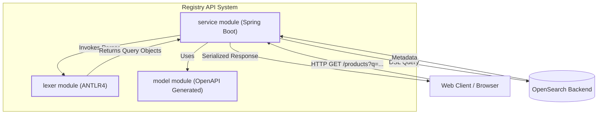
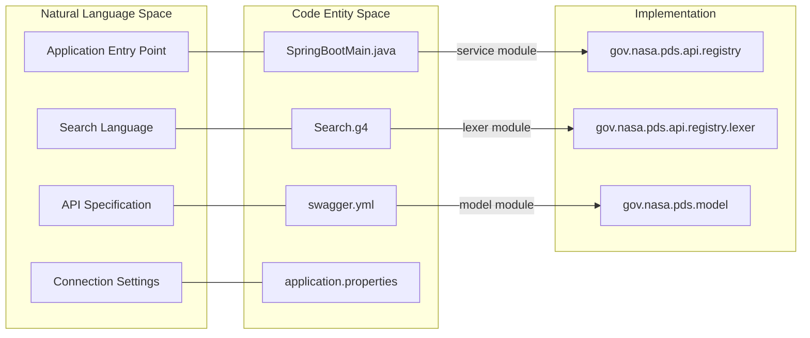

# Page: Registry API Overview

# Registry API Overview

Relevant source files

The following files were used as context for generating this wiki page:

- [.github/CODEOWNERS](.github/CODEOWNERS)
- [.gitignore](.gitignore)
- [CHANGELOG.md](CHANGELOG.md)
- [LICENSE.md](LICENSE.md)
- [NOTICE.txt](NOTICE.txt)
- [README.md](README.md)
- [SECURITY.md](SECURITY.md)
- [lexer/pom.xml](lexer/pom.xml)
- [model/pom.xml](model/pom.xml)
- [pom.xml](pom.xml)
- [service/pom.xml](service/pom.xml)
- [service/src/main/java/gov/nasa/pds/api/registry/model/EntityProduct.java](service/src/main/java/gov/nasa/pds/api/registry/model/EntityProduct.java)
- [service/src/test/java/gov/nasa/pds/api/registry/opensearch/RegistrySearchRequestBuilderTest.java](service/src/test/java/gov/nasa/pds/api/registry/opensearch/RegistrySearchRequestBuilderTest.java)

The **NASA PDS Registry API** is a high-level search interface designed to provide access to the Planetary Data System (PDS) registry metadata. It implements the [PDS API Specification](https://nasa-pds.github.io/pds-api/specifications.html) to allow users and client applications to discover PDS4 products via complex metadata queries [README.md:1-5]().

The system operates as a middle tier between client applications and an **OpenSearch** (or Elasticsearch) backend [README.md:14-17](). It translates RESTful requests and a custom search grammar into OpenSearch DSL queries, handles content negotiation for various response formats (JSON, XML, CSV), and manages complex product relationships such as bundle/collection memberships.

## Three-Module Architecture

The codebase is organized into a multi-module Maven project consisting of three primary components that separate the query language, the API contract, and the service implementation [pom.xml:77-81]().

| Module | Purpose | Key Technologies |
| :--- | :--- | :--- |
| **`lexer`** | Parses the `q` parameter search grammar. | ANTLR4 |
| **`model`** | Defines the API interface and Data Transfer Objects (DTOs). | OpenAPI (Swagger), Spring Interfaces |
| **`service`** | Implements the business logic and OpenSearch integration. | Spring Boot, OpenSearch Java Client |

### System Component Diagram
This diagram illustrates how the three modules interact to fulfill a search request.

**Sources:** [README.md:8-12](), [pom.xml:77-81]()

## Key Concepts

### Search Grammar (`q` parameter)
The API supports a domain-specific language for filtering products. Users can combine comparison operators (e.g., `eq`, `lt`, `like`) and logical operators (`and`, `or`, `not`) to query any PDS4 property [CHANGELOG.md:84-85](). The `lexer` module uses an ANTLR4 grammar to validate and transform these strings into backend queries [README.md:9]().

### Data Model and Product Entities
The API distinguishes between the internal representation of a product and the external DTOs. The `EntityProduct` class defines the core metadata fields retrieved from the registry, such as `lidvid`, `title`, and `product_class` [service/src/main/java/gov/nasa/pds/api/registry/model/EntityProduct.java:11-26]().

### Content Negotiation
The service supports multiple `Accept` headers to provide data in different formats, including:
*   Standard JSON/XML responses.
*   PDS4-specific metadata formats (`application/vnd.nasa.pds.pds4+json`).
*   CSV and HTML views for human readability.

## Code Entity Mapping
The following diagram maps high-level concepts to specific classes and configurations within the codebase.

**Sources:** [service/pom.xml:73](), [model/pom.xml:65-75](), [README.md:8-12]()

## Wiki Navigation

To dive deeper into specific areas of the Registry API, follow the links below:

*   **[Getting Started](#1.1)**: Instructions for setting up the development environment, including JDK 17 and Maven requirements, and running the service locally with Docker or as a standalone Spring Boot app.
*   **[Changelog and Requirements History](#1.2)**: A record of version milestones, closed issues, and the evolution of requirements like the `/properties` and `/classes` endpoints.

For detailed architectural deep-dives, see the subsequent sections on the **Architecture Overview**, **Search and Query Pipeline**, and **OpenSearch Backend Integration**.

**Sources:** [README.md:40-46](), [CHANGELOG.md:1-92]()
