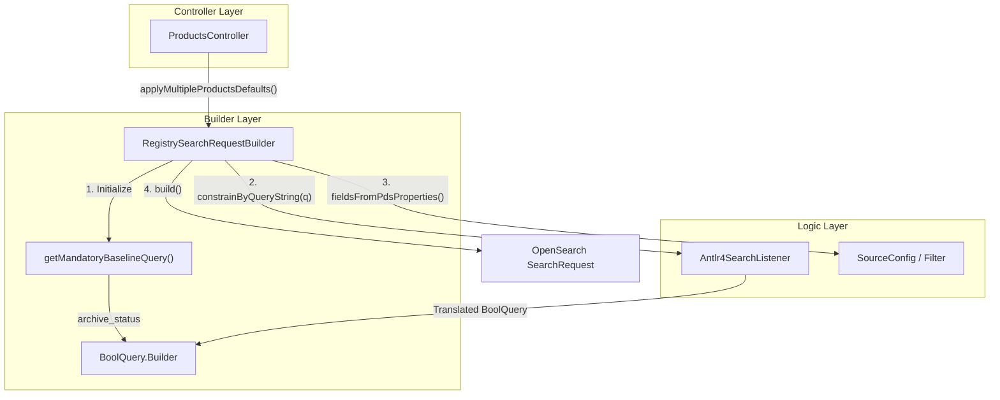
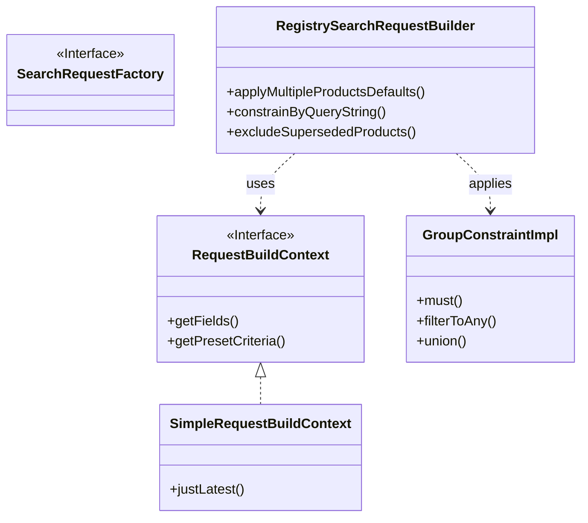

# Page: RegistrySearchRequestBuilder and Query Construction

# RegistrySearchRequestBuilder and Query Construction

Relevant source files

The following files were used as context for generating this wiki page:

- [lexer/src/main/antlr4/gov/nasa/pds/api/registry/lexer/Search.g4](lexer/src/main/antlr4/gov/nasa/pds/api/registry/lexer/Search.g4)
- [lexer/src/test/java/api/pds/nasa/gov/api_search_query_lexer/MockedListener.java](lexer/src/test/java/api/pds/nasa/gov/api_search_query_lexer/MockedListener.java)
- [lexer/src/test/java/api/pds/nasa/gov/api_search_query_lexer/TestParsing.java](lexer/src/test/java/api/pds/nasa/gov/api_search_query_lexer/TestParsing.java)
- [service/src/main/java/gov/nasa/pds/api/registry/GroupConstraint.java](service/src/main/java/gov/nasa/pds/api/registry/GroupConstraint.java)
- [service/src/main/java/gov/nasa/pds/api/registry/RequestBuildContext.java](service/src/main/java/gov/nasa/pds/api/registry/RequestBuildContext.java)
- [service/src/main/java/gov/nasa/pds/api/registry/RequestConstructionContext.java](service/src/main/java/gov/nasa/pds/api/registry/RequestConstructionContext.java)
- [service/src/main/java/gov/nasa/pds/api/registry/configuration/OpenAPIClearedTags.java](service/src/main/java/gov/nasa/pds/api/registry/configuration/OpenAPIClearedTags.java)
- [service/src/main/java/gov/nasa/pds/api/registry/controllers/ProductsController.java](service/src/main/java/gov/nasa/pds/api/registry/controllers/ProductsController.java)
- [service/src/main/java/gov/nasa/pds/api/registry/exceptions/LidVidNotFoundException.java](service/src/main/java/gov/nasa/pds/api/registry/exceptions/LidVidNotFoundException.java)
- [service/src/main/java/gov/nasa/pds/api/registry/model/Antlr4SearchListener.java](service/src/main/java/gov/nasa/pds/api/registry/model/Antlr4SearchListener.java)
- [service/src/main/java/gov/nasa/pds/api/registry/model/ProductQueryBuilderUtil.java](service/src/main/java/gov/nasa/pds/api/registry/model/ProductQueryBuilderUtil.java)
- [service/src/main/java/gov/nasa/pds/api/registry/model/transformers/ResponseTransformerImpl.java](service/src/main/java/gov/nasa/pds/api/registry/model/transformers/ResponseTransformerImpl.java)
- [service/src/main/java/gov/nasa/pds/api/registry/search/RegistrySearchRequestBuilder.java](service/src/main/java/gov/nasa/pds/api/registry/search/RegistrySearchRequestBuilder.java)
- [service/src/main/java/gov/nasa/pds/api/registry/search/RequestBuildContextFactory.java](service/src/main/java/gov/nasa/pds/api/registry/search/RequestBuildContextFactory.java)
- [service/src/main/java/gov/nasa/pds/api/registry/search/SimpleRequestBuildContext.java](service/src/main/java/gov/nasa/pds/api/registry/search/SimpleRequestBuildContext.java)
- [service/src/main/java/gov/nasa/pds/api/registry/search/SimpleRequestConstructionContext.java](service/src/main/java/gov/nasa/pds/api/registry/search/SimpleRequestConstructionContext.java)
- [service/src/main/java/gov/nasa/pds/api/registry/util/GroupConstraintImpl.java](service/src/main/java/gov/nasa/pds/api/registry/util/GroupConstraintImpl.java)

This page provides a deep dive into the query construction pipeline of the Registry API. It focuses on the `RegistrySearchRequestBuilder`, which abstracts the complexity of OpenSearch DSL generation, and the integration with ANTLR4 for parsing complex user-defined query strings.

## Overview of RegistrySearchRequestBuilder

The `RegistrySearchRequestBuilder` extends the OpenSearch `SearchRequest.Builder` to provide PDS-specific query logic [service/src/main/java/gov/nasa/pds/api/registry/search/RegistrySearchRequestBuilder.java:50](). It serves as the primary engine for translating API parameters (like `q`, `lidvid`, and `sort`) into executable OpenSearch queries.

### Mandatory Baseline Query
Every search request initiated through the builder automatically includes a "mandatory baseline query" [service/src/main/java/gov/nasa/pds/api/registry/search/RegistrySearchRequestBuilder.java:68-70](). This baseline enforces the `archive_status` filter, ensuring that only products matching the configured status (e.g., "archived") are returned to the user [service/src/main/java/gov/nasa/pds/api/registry/search/RegistrySearchRequestBuilder.java:80-91]().

### Core Construction Flow
The following diagram illustrates how a request flows from the `ProductsController` through the builder to produce a final `SearchRequest`.

**Query Construction Data Flow**

Sources: [service/src/main/java/gov/nasa/pds/api/registry/search/RegistrySearchRequestBuilder.java:50-135](), [service/src/main/java/gov/nasa/pds/api/registry/controllers/ProductsController.java:109-136]()

---

## ANTLR4 Integration (`constrainByQueryString`)

The `q` parameter in the API supports a complex grammar (e.g., `lid eq "urn:nasa:pds:..." and (target eq "Mars" or target eq "Moon")`). This is handled by the `lexer` module.

### Lexer and Parser
1.  **Grammar**: Defined in `Search.g4`, supporting operators like `eq`, `ne`, `gt`, `ge`, `lt`, `le`, `like`, and `exists` [lexer/src/main/antlr4/gov/nasa/pds/api/registry/lexer/Search.g4:1-13]().
2.  **Listener**: `Antlr4SearchListener` walks the parse tree generated by ANTLR [service/src/main/java/gov/nasa/pds/api/registry/model/Antlr4SearchListener.java:29]().
3.  **Translation**: The listener translates ANTLR nodes into OpenSearch `Query` objects (e.g., `MatchQuery` for `eq`, `RangeQuery` for `gt`) and pushes them onto a stack to maintain boolean logic (`AND`/`OR`) [service/src/main/java/gov/nasa/pds/api/registry/model/Antlr4SearchListener.java:103-153]().

### Wildcard Support
The listener handles field-level wildcards (e.g., `*.title exists`). It resolves these by inspecting the current OpenSearch index mappings to find all matching physical fields [service/src/main/java/gov/nasa/pds/api/registry/model/Antlr4SearchListener.java:76-98]().

Sources: [lexer/src/main/antlr4/gov/nasa/pds/api/registry/lexer/Search.g4:1-40](), [service/src/main/java/gov/nasa/pds/api/registry/model/Antlr4SearchListener.java:157-200]()

---

## Key Query Constraints

### matchLidvid
Used to find a specific product by its Logical Identifier (LID) or LID + Version (LIDVID). The builder constructs a `TermQuery` against either `lid` or `lidvid` fields [service/src/main/java/gov/nasa/pds/api/registry/search/RegistrySearchRequestBuilder.java:185-214]().

### excludeSupersededProducts
To ensure only the most recent versions are returned, the builder can add a filter that excludes products containing the `ops:Provenance/ops:superseded_by` field [service/src/main/java/gov/nasa/pds/api/registry/search/RegistrySearchRequestBuilder.java:221-224]().

### Field Source Filtering
To optimize performance and reduce payload size, the builder uses `SourceConfig` to tell OpenSearch which fields to include or exclude from the `_source` document [service/src/main/java/gov/nasa/pds/api/registry/search/RegistrySearchRequestBuilder.java:234-256]().

---

## Pagination and Sorting

The API uses `search-after` pagination to handle large result sets efficiently.

| Component | Description |
| :--- | :--- |
| **Sort Fields** | Default sort is typically `ops:Harvest_Info/ops:harvest_date_time` [service/src/main/java/gov/nasa/pds/api/registry/search/RegistrySearchRequestBuilder.java:312](). |
| **Search After** | A list of values from the last hit of the previous page, used to "seek" to the next set of results [service/src/main/java/gov/nasa/pds/api/registry/search/RegistrySearchRequestBuilder.java:323-333](). |
| **Page Size** | Controlled via the `limit` parameter, mapped to OpenSearch `size` [service/src/main/java/gov/nasa/pds/api/registry/search/RegistrySearchRequestBuilder.java:306](). |

Sources: [service/src/main/java/gov/nasa/pds/api/registry/search/RegistrySearchRequestBuilder.java:298-335]()

---

## GroupConstraint Abstraction

The `GroupConstraint` interface and its implementation `GroupConstraintImpl` provide a way to define sets of keyword/value matches that can be combined using boolean logic [service/src/main/java/gov/nasa/pds/api/registry/GroupConstraint.java:14]().

*   **must()**: Map of fields that MUST match specific values [service/src/main/java/gov/nasa/pds/api/registry/util/GroupConstraintImpl.java:37-39]().
*   **filterToAny()**: Map of fields where the document must match AT LEAST ONE of the provided values (OpenSearch `terms` query) [service/src/main/java/gov/nasa/pds/api/registry/util/GroupConstraintImpl.java:42-44]().
*   **mustNot()**: Map of fields that MUST NOT match [service/src/main/java/gov/nasa/pds/api/registry/util/GroupConstraintImpl.java:47-49]().

These constraints are often used for internal filtering, such as restricting a search to a specific PDS Bundle or Collection.

**Code Entity Mapping: Natural Language to Code**

Sources: [service/src/main/java/gov/nasa/pds/api/registry/RequestBuildContext.java:5-13](), [service/src/main/java/gov/nasa/pds/api/registry/util/GroupConstraintImpl.java:15-34](), [service/src/main/java/gov/nasa/pds/api/registry/search/RegistrySearchRequestBuilder.java:121-135]()
