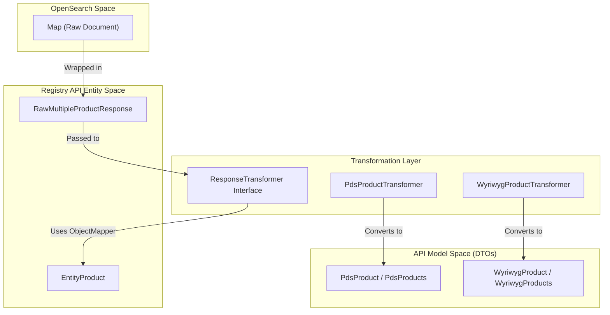
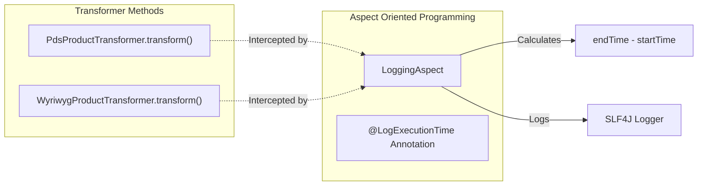

# Page: Response Transformation and Serialization

# Response Transformation and Serialization

Relevant source files

The following files were used as context for generating this wiki page:

- [service/src/main/java/gov/nasa/pds/api/registry/controllers/DocsController.java](service/src/main/java/gov/nasa/pds/api/registry/controllers/DocsController.java)
- [service/src/main/java/gov/nasa/pds/api/registry/model/exceptions/AcceptFormatNotSupportedException.java](service/src/main/java/gov/nasa/pds/api/registry/model/exceptions/AcceptFormatNotSupportedException.java)
- [service/src/main/java/gov/nasa/pds/api/registry/model/exceptions/NotFoundException.java](service/src/main/java/gov/nasa/pds/api/registry/model/exceptions/NotFoundException.java)
- [service/src/main/java/gov/nasa/pds/api/registry/model/exceptions/RegistryApiException.java](service/src/main/java/gov/nasa/pds/api/registry/model/exceptions/RegistryApiException.java)
- [service/src/main/java/gov/nasa/pds/api/registry/model/exceptions/UnhandledException.java](service/src/main/java/gov/nasa/pds/api/registry/model/exceptions/UnhandledException.java)
- [service/src/main/java/gov/nasa/pds/api/registry/model/exceptions/UnparsableQParamException.java](service/src/main/java/gov/nasa/pds/api/registry/model/exceptions/UnparsableQParamException.java)
- [service/src/main/java/gov/nasa/pds/api/registry/model/transformers/PdsProductTransformer.java](service/src/main/java/gov/nasa/pds/api/registry/model/transformers/PdsProductTransformer.java)
- [service/src/main/java/gov/nasa/pds/api/registry/model/transformers/WyriwygProductTransformer.java](service/src/main/java/gov/nasa/pds/api/registry/model/transformers/WyriwygProductTransformer.java)
- [service/src/main/java/gov/nasa/pds/api/registry/util/LogExecutionTime.java](service/src/main/java/gov/nasa/pds/api/registry/util/LogExecutionTime.java)
- [service/src/main/java/gov/nasa/pds/api/registry/util/LoggingAspect.java](service/src/main/java/gov/nasa/pds/api/registry/util/LoggingAspect.java)

The Registry API employs a flexible transformation layer to convert raw search results from OpenSearch into various PDS4-compliant formats and user-friendly representations. This process is driven by content negotiation via the HTTP `Accept` header, allowing the same endpoint to serve JSON, XML, CSV, or specialized PDS4 product labels.

### Response Transformation Architecture

The system uses a registry of transformers that implement the `ResponseTransformer` interface. When a request is processed, the `ResponseTransformerRegistry` selects the appropriate concrete transformer based on the requested media type.

#### Data Flow: From OpenSearch to Serialized Output

The following diagram illustrates how raw data from the OpenSearch backend is wrapped and transformed into the final DTOs defined in the `model` module.

**Response Transformation Flow**

Sources: [service/src/main/java/gov/nasa/pds/api/registry/model/transformers/PdsProductTransformer.java:53-84](), [service/src/main/java/gov/nasa/pds/api/registry/model/transformers/WyriwygProductTransformer.java:77-92]()

### The ResponseTransformer Interface

All transformers must implement the logic to handle both single product results and multiple product collections.

*   **`transform(RawMultipleProductResponse input, List<PdsProperty> fields)`**: Processes a collection of hits, typically for search endpoints.
*   **`transform(Map<String, Object> kvp, List<PdsProperty> fields)`**: Processes a single document hit, typically for identifier-specific endpoints.
*   **`getRequestedFields(List<PdsProperty> userRequestFields)`**: Allows the transformer to inject mandatory fields required for its specific output format (e.g., LIDVIDs for PDS products).

Sources: [service/src/main/java/gov/nasa/pds/api/registry/model/transformers/PdsProductTransformer.java:39-49](), [service/src/main/java/gov/nasa/pds/api/registry/model/transformers/PdsProductTransformer.java:53-96]()

### Concrete Transformers

The API provides several specialized transformers to support different "views" of the registry data.

#### PdsProductTransformer
The `PdsProductTransformer` is the primary transformer for standard API responses. It maps OpenSearch documents to the `PdsProduct` DTO. It ensures that a set of `REQUIRED_FIELDS` is always present in the response, regardless of user filtering, to maintain API contract integrity [service/src/main/java/gov/nasa/pds/api/registry/model/transformers/PdsProductTransformer.java:25-32]().

Key characteristics:
*   Filters out internal blobs like `XML_BLOB` and `JSON_BLOB` [service/src/main/java/gov/nasa/pds/api/registry/model/transformers/PdsProductTransformer.java:35-36]().
*   Uses `SearchUtil.entityProductToAPIProduct` to normalize raw maps into structured objects [service/src/main/java/gov/nasa/pds/api/registry/model/transformers/PdsProductTransformer.java:61-62]().
*   Aggregates unique properties into the `Summary` object [service/src/main/java/gov/nasa/pds/api/registry/model/transformers/PdsProductTransformer.java:79-81]().

#### WyriwygProductTransformer
"What You Registered Is What You Get" (WYRIWYG) provides a flattened, key-value pair representation of the document. This is useful for clients that need to inspect raw metadata without adhering to the structured `PdsProduct` schema.

Key characteristics:
*   Iterates through all entries in the document map [service/src/main/java/gov/nasa/pds/api/registry/model/transformers/WyriwygProductTransformer.java:39-40]().
*   Handles multi-valued fields by joining them with a pipe (`|`) delimiter [service/src/main/java/gov/nasa/pds/api/registry/model/transformers/WyriwygProductTransformer.java:60-67]().
*   Allows dynamic inclusion of fields based on user request while still excluding sensitive internal blobs [service/src/main/java/gov/nasa/pds/api/registry/model/transformers/WyriwygProductTransformer.java:42-49]().

#### PDS4 Specialized Transformers
The API supports direct retrieval of PDS4 labels and metadata blobs:
*   **Pds4XmlProductTransformer**: Extracts the `XML_BLOB` from the OpenSearch document to return the original PDS4 XML label.
*   **Pds4JsonProductTransformer**: Extracts the `JSON_BLOB` for a JSON-native representation of the PDS4 metadata.

Sources: [service/src/main/java/gov/nasa/pds/api/registry/model/transformers/PdsProductTransformer.java:20-22](), [service/src/main/java/gov/nasa/pds/api/registry/model/transformers/WyriwygProductTransformer.java:23-25]()

### Serialization and Content Negotiation

The transformation layer is tightly coupled with Spring's content negotiation. The `ResponseTransformerRegistry` (not shown in detail but referenced by architecture) uses the `Accept` header to determine which transformer to invoke.

| Accept Header | Transformer Used | Output DTO |
| :--- | :--- | :--- |
| `application/json` | `PdsProductTransformer` | `PdsProducts` |
| `application/xml` | `PdsProductTransformer` | `PdsProducts` (XML serialized) |
| `application/vnd.nasa.pds.pds4+xml` | `Pds4XmlProductTransformer` | Raw XML String |
| `application/vnd.nasa.pds.wyriwyg+json`| `WyriwygProductTransformer` | `WyriwygProducts` |

### Performance Monitoring

Transformations are monitored for performance using the `@LogExecutionTime` aspect. This annotation is applied to the `transform` methods to track how long the conversion from raw OpenSearch hits to API DTOs takes.

**Transformation Logging Logic**

Sources: [service/src/main/java/gov/nasa/pds/api/registry/util/LogExecutionTime.java:9-10](), [service/src/main/java/gov/nasa/pds/api/registry/util/LoggingAspect.java:26-34](), [service/src/main/java/gov/nasa/pds/api/registry/model/transformers/PdsProductTransformer.java:52-53]()

### Error Handling during Transformation

If a document in OpenSearch is malformed or cannot be mapped to an `EntityProduct`, the transformers are designed to catch `Throwable` exceptions, log the error with the associated `lidvid`, and continue processing the remaining results in the batch [service/src/main/java/gov/nasa/pds/api/registry/model/transformers/PdsProductTransformer.java:72-76]().

Specific exceptions like `AcceptFormatNotSupportedException` are thrown if a client requests a media type that the `ResponseTransformerRegistry` cannot fulfill [service/src/main/java/gov/nasa/pds/api/registry/model/exceptions/AcceptFormatNotSupportedException.java:3-10]().

Sources: [service/src/main/java/gov/nasa/pds/api/registry/model/transformers/PdsProductTransformer.java:72-76](), [service/src/main/java/gov/nasa/pds/api/registry/model/exceptions/RegistryApiException.java:10-35]()
