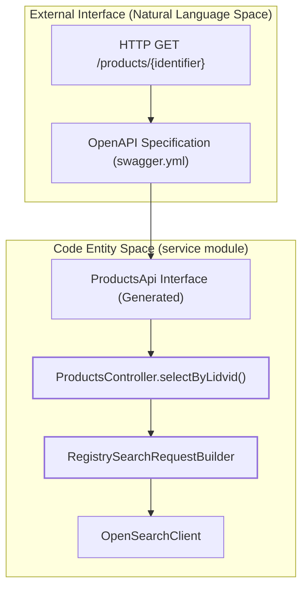
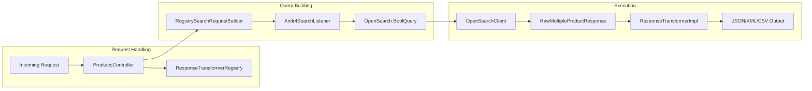

# Page: REST API Reference

# REST API Reference

Relevant source files

The following files were used as context for generating this wiki page:

- [CHANGELOG.md](CHANGELOG.md)
- [lexer/src/main/antlr4/gov/nasa/pds/api/registry/lexer/Search.g4](lexer/src/main/antlr4/gov/nasa/pds/api/registry/lexer/Search.g4)
- [lexer/src/test/java/api/pds/nasa/gov/api_search_query_lexer/MockedListener.java](lexer/src/test/java/api/pds/nasa/gov/api_search_query_lexer/MockedListener.java)
- [lexer/src/test/java/api/pds/nasa/gov/api_search_query_lexer/TestParsing.java](lexer/src/test/java/api/pds/nasa/gov/api_search_query_lexer/TestParsing.java)
- [model/swagger.yml](model/swagger.yml)
- [service/src/main/java/gov/nasa/pds/api/registry/configuration/OpenAPIClearedTags.java](service/src/main/java/gov/nasa/pds/api/registry/configuration/OpenAPIClearedTags.java)
- [service/src/main/java/gov/nasa/pds/api/registry/controllers/ProductsController.java](service/src/main/java/gov/nasa/pds/api/registry/controllers/ProductsController.java)
- [service/src/main/java/gov/nasa/pds/api/registry/model/Antlr4SearchListener.java](service/src/main/java/gov/nasa/pds/api/registry/model/Antlr4SearchListener.java)
- [service/src/main/java/gov/nasa/pds/api/registry/model/transformers/ResponseTransformerImpl.java](service/src/main/java/gov/nasa/pds/api/registry/model/transformers/ResponseTransformerImpl.java)
- [service/src/main/java/gov/nasa/pds/api/registry/search/RegistrySearchRequestBuilder.java](service/src/main/java/gov/nasa/pds/api/registry/search/RegistrySearchRequestBuilder.java)
- [service/src/main/resources/application.properties.all](service/src/main/resources/application.properties.all)
- [service/src/test/java/gov/nasa/pds/api/registry/opensearch/Antlr4SearchListenerTest.java](service/src/test/java/gov/nasa/pds/api/registry/opensearch/Antlr4SearchListenerTest.java)

The Registry API provides a suite of RESTful endpoints designed to enable advanced search, metadata retrieval, and hierarchical navigation of PDS4 data products. This page serves as a high-level directory of available endpoints, grouped by their functional roles within the system.

## Overview of Endpoint Categories

The API is defined via an OpenAPI 3.0 specification [model/swagger.yml:1-7]() and implemented primarily through the `ProductsController` [service/src/main/java/gov/nasa/pds/api/registry/controllers/ProductsController.java:52-52](). The endpoints are logically grouped into three main categories:

| Category | Purpose | Key Endpoints |
| :--- | :--- | :--- |
| **Product Search** | General search and resolution of products by LID/LIDVID. | `/products`, `/products/{identifier}`, `/classes/{class}` |
| **Hierarchy & Membership** | Navigation of PDS4 Bundle/Collection relationships. | `/products/{id}/members`, `/products/{id}/member-of` |
| **System & Metadata** | Health checks, schema inspection, and raw DSL access. | `/health`, `/properties`, `/docs` |

### System Flow: Request to Controller
The following diagram illustrates how a REST request is routed from the external interface (defined in Swagger) to the internal Spring Boot controller logic.

**REST Request Routing Logic**

Sources: [model/swagger.yml:172-178](), [service/src/main/java/gov/nasa/pds/api/registry/controllers/ProductsController.java:146-147](), [service/src/main/java/gov/nasa/pds/api/registry/search/RegistrySearchRequestBuilder.java:50-50]()

---

## 3.1 Product Endpoints
These endpoints are the primary entry points for searching the registry. They support complex filtering via the `q` parameter, which is parsed by an ANTLR4-based lexer [service/src/main/java/gov/nasa/pds/api/registry/search/RegistrySearchRequestBuilder.java:126-126]().

*   **`/products`**: Search across all versioned instances of PDS data products.
*   **`/products/{identifier}`**: Resolves a specific product. The `identifier` can be a LID (returning the latest version) or a LIDVID (returning a specific version) [service/src/main/java/gov/nasa/pds/api/registry/controllers/ProductsController.java:138-144]().
*   **`/classes/{class}`**: Filters results by a specific PDS4 product class (e.g., `Product_Bundle`).

For implementation details on LID vs LIDVID resolution and the `excludeSupersededProducts` logic, see [Product Endpoints](#3.1).

Sources: [model/swagger.yml:144-193](), [service/src/main/java/gov/nasa/pds/api/registry/controllers/ProductsController.java:146-160]()

---

## 3.2 Membership and Hierarchy Endpoints
These endpoints allow users to traverse the PDS4 hierarchy, moving "downward" from Bundles to Collections to Products, or "upward" from a product to its containing aggregates.

*   **Downward Navigation**: `/products/{identifier}/members` and recursive `/members/members`.
*   **Upward Navigation**: `/products/{identifier}/member-of` and recursive `/member-of/member-of`.

The logic for these transitions is handled by specialized `RefLogic` classes which determine how to resolve references based on the product type (e.g., `RefLogicBundle` vs `RefLogicCollection`).

For details on the recursive resolution and the `ReferencingLogicTransmuter`, see [Membership and Hierarchy Endpoints](#3.2).

Sources: [model/swagger.yml:213-333](), [CHANGELOG.md:14-14]()

---

## 3.3 Properties, Health, and Docs Endpoints
These endpoints provide system metadata and diagnostic capabilities.

*   **`/properties`**: Returns a list of all searchable PDS4 properties by inspecting the current OpenSearch index mappings [model/swagger.yml:430-440]().
*   **`/health`**: Evaluates system health, including the connection to the OpenSearch backend [model/swagger.yml:38-44]().
*   **`/docs`**: A "power-user" endpoint that allows posting raw OpenSearch DSL queries directly to the registry [model/swagger.yml:121-127]().

For details on how OpenSearch types are mapped to API property types, see [Properties, Health, and Docs Endpoints](#3.3).

Sources: [model/swagger.yml:38-143](), [service/src/main/java/gov/nasa/pds/api/registry/controllers/ProductsController.java:52-52]()

---

## Request Processing Architecture
Every request to a search endpoint follows a standardized pipeline within the `service` module.

**Internal Search Pipeline**

Sources: [service/src/main/java/gov/nasa/pds/api/registry/controllers/ProductsController.java:109-136](), [service/src/main/java/gov/nasa/pds/api/registry/model/Antlr4SearchListener.java:29-41](), [service/src/main/java/gov/nasa/pds/api/registry/model/transformers/ResponseTransformerRegistry.java:44-44]()
