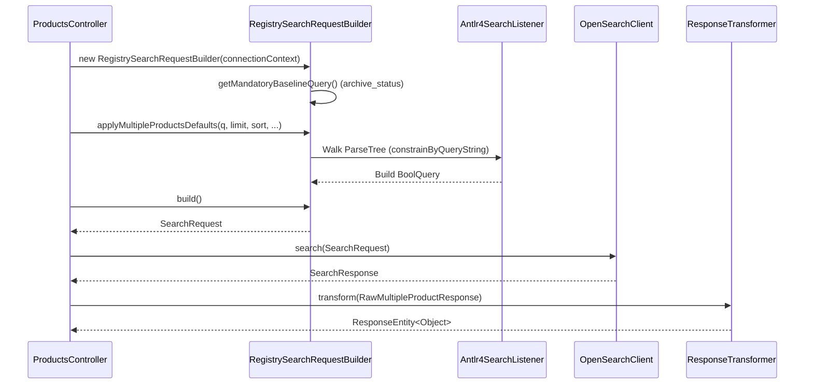
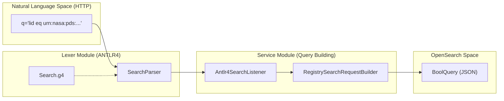

# Page: Search and Query Pipeline

# Search and Query Pipeline

Relevant source files

The following files were used as context for generating this wiki page:

- [lexer/pom.xml](lexer/pom.xml)
- [lexer/src/main/antlr4/gov/nasa/pds/api/registry/lexer/Search.g4](lexer/src/main/antlr4/gov/nasa/pds/api/registry/lexer/Search.g4)
- [lexer/src/test/java/api/pds/nasa/gov/api_search_query_lexer/MockedListener.java](lexer/src/test/java/api/pds/nasa/gov/api_search_query_lexer/MockedListener.java)
- [lexer/src/test/java/api/pds/nasa/gov/api_search_query_lexer/TestParsing.java](lexer/src/test/java/api/pds/nasa/gov/api_search_query_lexer/TestParsing.java)
- [model/pom.xml](model/pom.xml)
- [model/swagger.yml](model/swagger.yml)
- [pom.xml](pom.xml)
- [service/pom.xml](service/pom.xml)
- [service/src/main/java/gov/nasa/pds/api/registry/configuration/OpenAPIClearedTags.java](service/src/main/java/gov/nasa/pds/api/registry/configuration/OpenAPIClearedTags.java)
- [service/src/main/java/gov/nasa/pds/api/registry/controllers/ProductsController.java](service/src/main/java/gov/nasa/pds/api/registry/controllers/ProductsController.java)
- [service/src/main/java/gov/nasa/pds/api/registry/model/Antlr4SearchListener.java](service/src/main/java/gov/nasa/pds/api/registry/model/Antlr4SearchListener.java)
- [service/src/main/java/gov/nasa/pds/api/registry/model/EntityProduct.java](service/src/main/java/gov/nasa/pds/api/registry/model/EntityProduct.java)
- [service/src/main/java/gov/nasa/pds/api/registry/model/transformers/ResponseTransformerImpl.java](service/src/main/java/gov/nasa/pds/api/registry/model/transformers/ResponseTransformerImpl.java)
- [service/src/main/java/gov/nasa/pds/api/registry/search/RegistrySearchRequestBuilder.java](service/src/main/java/gov/nasa/pds/api/registry/search/RegistrySearchRequestBuilder.java)
- [service/src/main/resources/application.properties.all](service/src/main/resources/application.properties.all)
- [service/src/test/java/gov/nasa/pds/api/registry/opensearch/Antlr4SearchListenerTest.java](service/src/test/java/gov/nasa/pds/api/registry/opensearch/Antlr4SearchListenerTest.java)
- [service/src/test/java/gov/nasa/pds/api/registry/opensearch/RegistrySearchRequestBuilderTest.java](service/src/test/java/gov/nasa/pds/api/registry/opensearch/RegistrySearchRequestBuilderTest.java)

The Search and Query Pipeline is the core engine of the Registry API, responsible for transforming high-level REST requests into optimized OpenSearch DSL queries and subsequently formatting the results into various PDS-compliant representations. This process involves a multi-stage lifecycle: request parsing, query construction using a specialized builder, execution against the OpenSearch backend, and response transformation.

### High-Level Request Flow

When a search request (e.g., `/products?q=...`) hits the API, it follows a structured path through the system:

1.  **Controller Entry**: The `ProductsController` receives the request and extracts parameters such as `q` (query string), `limit`, `sort`, and `search_after` [[service/src/main/java/gov/nasa/pds/api/registry/controllers/ProductsController.java:109-112]().
2.  **Transformer Selection**: The API determines the output format based on the `Accept` header via the `ResponseTransformerRegistry` [[service/src/main/java/gov/nasa/pds/api/registry/controllers/ProductsController.java:91-92]().
3.  **Query Building**: A `RegistrySearchRequestBuilder` is initialized to encapsulate the logic for translating PDS search semantics into OpenSearch queries [[service/src/main/java/gov/nasa/pds/api/registry/controllers/ProductsController.java:123-125]().
4.  **Execution**: The generated `SearchRequest` is executed by the `OpenSearchClient` [[service/src/main/java/gov/nasa/pds/api/registry/controllers/ProductsController.java:127-128]().
5.  **Transformation**: The raw OpenSearch response is wrapped in a `RawMultipleProductResponse` and passed to the selected `ResponseTransformer` for final serialization [[service/src/main/java/gov/nasa/pds/api/registry/controllers/ProductsController.java:129-131]().

**Search Request Flow Diagram**

**Sources:**
* [service/src/main/java/gov/nasa/pds/api/registry/controllers/ProductsController.java:82-136]()
* [service/src/main/java/gov/nasa/pds/api/registry/search/RegistrySearchRequestBuilder.java:50-153]()

---

### Query Construction and the Lexer

The pipeline uses a specialized `RegistrySearchRequestBuilder` to manage the complexity of OpenSearch queries. A critical component of this builder is the integration with the `lexer` module. When a user provides a `q` parameter, the builder uses an ANTLR4-generated parser based on `Search.g4` [[lexer/src/main/antlr4/gov/nasa/pds/api/registry/lexer/Search.g4:1-13]().

The `Antlr4SearchListener` walks the resulting parse tree to programmatically construct an OpenSearch `BoolQuery` [[service/src/main/java/gov/nasa/pds/api/registry/model/Antlr4SearchListener.java:29-41](). This allows the API to support complex logical operations (`AND`, `OR`, `NOT`) and comparisons (`eq`, `gt`, `like`, `exists`) while abstracting the underlying JSON DSL from the end-user.

For details on baseline filters, query grammar, and the builder implementation, see [RegistrySearchRequestBuilder and Query Construction (#4.1)]().

**Code Entity Mapping: Query Translation**

**Sources:**
* [lexer/src/main/antlr4/gov/nasa/pds/api/registry/lexer/Search.g4:1-13]()
* [service/src/main/java/gov/nasa/pds/api/registry/model/Antlr4SearchListener.java:157-200]()
* [service/src/main/java/gov/nasa/pds/api/registry/search/RegistrySearchRequestBuilder.java:121-135]()

---

### Response Transformation

The API supports multiple output formats (JSON, XML, CSV, PDS4 Label) through a "Transformer" pattern. The `ProductsController` does not return OpenSearch documents directly; instead, it delegates to a `ResponseTransformer` selected by the `ResponseTransformerRegistry` [[service/src/main/java/gov/nasa/pds/api/registry/controllers/ProductsController.java:90-91]().

This layer handles:
*   **Field Mapping**: Mapping internal OpenSearch field names back to PDS property names.
*   **Content Negotiation**: Selecting the correct concrete class (e.g., `Pds4XmlProductTransformer`) based on the client's request.
*   **Serialization**: Converting the `RawMultipleProductResponse` into the final byte stream.

For details on the registry and concrete transformer implementations, see [Response Transformation and Serialization (#4.2)]().

**Sources:**
* [service/src/main/java/gov/nasa/pds/api/registry/controllers/ProductsController.java:82-107]()
* [service/src/main/java/gov/nasa/pds/api/registry/model/RawMultipleProductResponse.java]()

---

### Pagination and Deep Paging

To handle large result sets, the pipeline implements a "search-after" pagination mechanism [[service/src/main/java/gov/nasa/pds/api/registry/search/RegistrySearchRequestBuilder.java:128](). This avoids the performance degradation associated with deep offsets in distributed search engines.

The pipeline coordinates:
*   **Sort Order**: Mandatory sort fields (typically `ops:Harvest_Info/ops:harvest_date_time`) to ensure stable ordering.
*   **Search-After Tokens**: Opaque tokens returned in the response that the client must provide in subsequent requests to retrieve the next page.

For details on the pagination logic and the `LidvidsContext` abstraction, see [Pagination and LidVid Context (#4.3)]().

**Sources:**
* [service/src/main/java/gov/nasa/pds/api/registry/search/RegistrySearchRequestBuilder.java:121-135]()
* [service/src/main/java/gov/nasa/pds/api/registry/controllers/ProductsController.java:109-112]()
