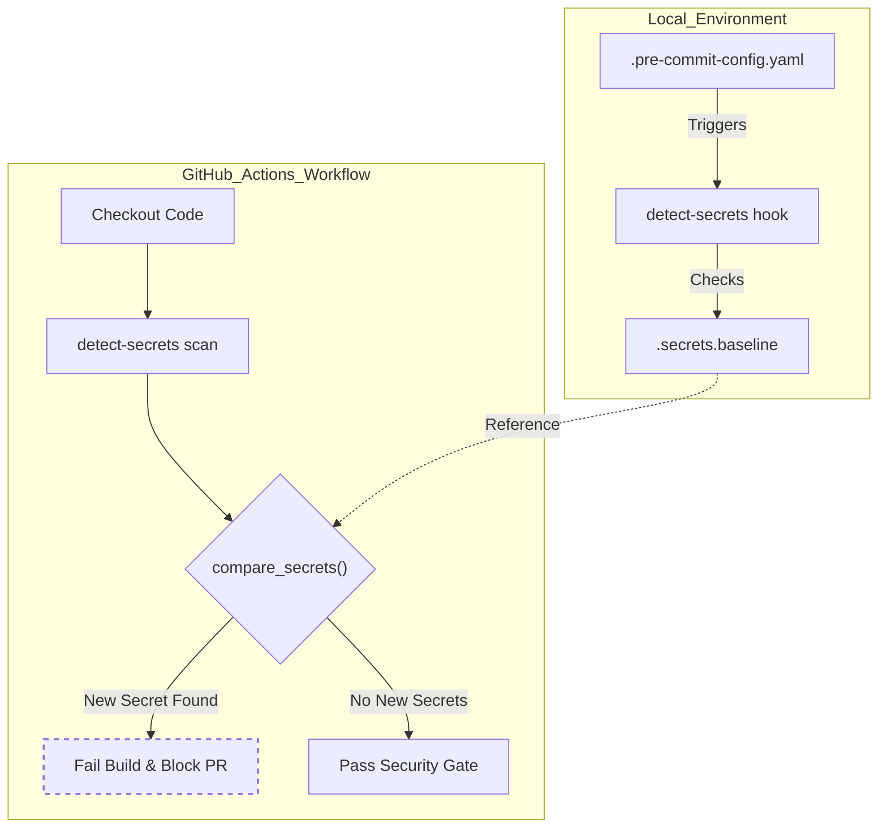
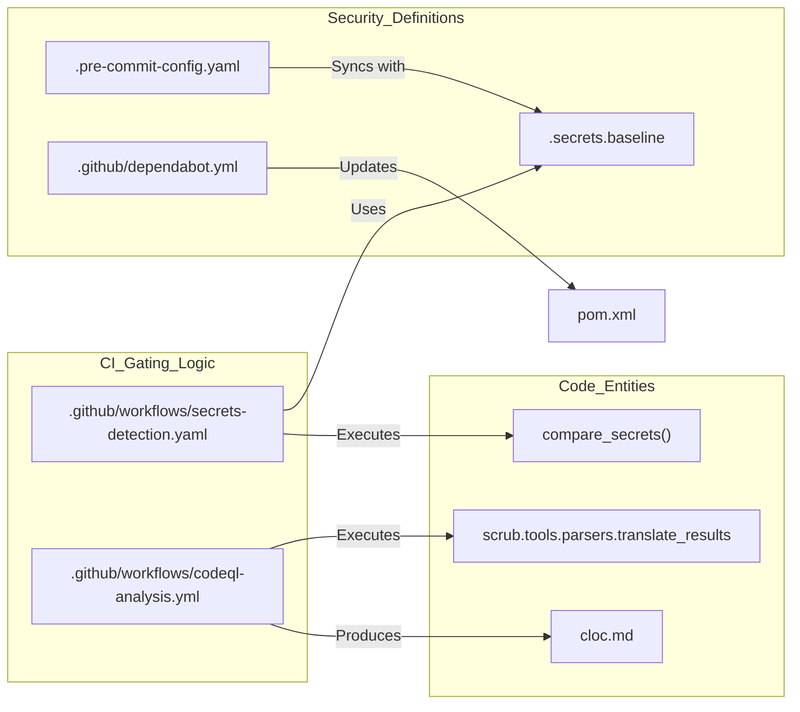

# Page: Security Scanning and Code Quality

# Security Scanning and Code Quality

Relevant source files

The following files were used as context for generating this wiki page:

- [.github/dependabot.yml](.github/dependabot.yml)
- [.github/workflows/branch-cicd.yaml](.github/workflows/branch-cicd.yaml)
- [.github/workflows/codeql-analysis.yml](.github/workflows/codeql-analysis.yml)
- [.github/workflows/secrets-detection.yaml](.github/workflows/secrets-detection.yaml)
- [.github/workflows/stable-cicd.yaml](.github/workflows/stable-cicd.yaml)
- [.github/workflows/unstable-cicd.yaml](.github/workflows/unstable-cicd.yaml)
- [.pre-commit-config.yaml](.pre-commit-config.yaml)
- [.secrets.baseline](.secrets.baseline)

This page details the automated security measures and code quality gates implemented in the Registry API. The system employs a multi-layered approach including static analysis (SAST), secret detection, dependency management, and pre-commit validation to ensure compliance with NASA PDS security standards.

## CodeQL Static Analysis

The Registry API utilizes GitHub CodeQL for semantic analysis of the codebase to identify security vulnerabilities and logic errors.

### Configuration and Schedule
The analysis is orchestrated via `.github/workflows/codeql-analysis.yml`.
*   **Schedule**: Runs weekly every Sunday at 23:23 UTC and on manual `workflow_dispatch` [.github/workflows/codeql-analysis.yml:4-7]().
*   **Languages**: Explicitly configured for `java` [.github/workflows/codeql-analysis.yml:20]().
*   **Query Suites**: The workflow utilizes two primary query suites: `security-and-quality` and `security-extended` [.github/workflows/codeql-analysis.yml:37]().

### Build and SCRUB Integration
The workflow uses `github/codeql-action/autobuild` to compile the Java project, ensuring the analysis covers the generated classes from the `lexer` and `model` modules [.github/workflows/codeql-analysis.yml:41-42](). 

Following the analysis, the results are processed through the NASA **SCRUB** (Static Code Review Utilization Bore) toolset:
1.  **Translation**: SARIF output files are translated into `.scrub` format using `scrub.tools.parsers.translate_results` [.github/workflows/codeql-analysis.yml:74]().
2.  **CSV Export**: A CSV summary is generated for reporting purposes using `scrub.tools.parsers.csv_parser` [.github/workflows/codeql-analysis.yml:77]().
3.  **Artifacts**: The final results directory is uploaded as a GitHub Action artifact named `codeql-artifacts` [.github/workflows/codeql-analysis.yml:82-87]().

**Sources:** [.github/workflows/codeql-analysis.yml:1-87]()

---

## Secret Detection Workflow

The repository prevents the accidental exposure of credentials, keys, and tokens using `detect-secrets`.

### Baseline Management
The file `.secrets.baseline` serves as the authoritative list of known and "allow-listed" secrets that are not considered risks (e.g., mock data in tests or public email addresses) [.secrets.baseline:1-222]().
*   **Plugins**: Detects AWS keys, Private Keys, High Entropy strings, and basic auth patterns [.secrets.baseline:3-85]().
*   **Exclusions**: The scanner ignores `.git` directories, `.pre-commit-config.yaml`, and the Maven `target` build folder [.secrets.baseline:126-133]().

### CI Enforcement Logic
The `Secret Detection Workflow` runs on every push and pull request to the `main` branch [.github/workflows/secrets-detection.yaml:2-8]().

#### Secret Comparison Data Flow
The workflow compares the current state of the repository against the baseline without exposing the actual secrets in logs.

| Step | Action | Command/Logic |
| :--- | :--- | :--- |
| 1 | **Initialization** | Creates a temporary blank baseline if none exists [.github/workflows/secrets-detection.yaml:24-37](). |
| 2 | **Scan** | Executes `detect-secrets scan` using the existing baseline to identify new entries [.github/workflows/secrets-detection.yaml:47-51](). |
| 3 | **Compare** | Extracts `hashed_secret` keys using `jq` and compares them via `diff` [.github/workflows/secrets-detection.yaml:55](). |
| 4 | **Gate** | If differences are found, the build fails with an exit code 1 [.github/workflows/secrets-detection.yaml:58-70](). |

### Secret Detection Data Flow
The following diagram illustrates how `detect-secrets` interacts with the repository baseline during a CI run.

**Secret Validation Flow**

**Sources:** [.github/workflows/secrets-detection.yaml:1-71](), [.secrets.baseline:1-222](), [.pre-commit-config.yaml:18-32]()

---

## Pre-commit Hooks

To catch issues before they reach the remote repository, the project provides a `.pre-commit-config.yaml` configuration [.pre-commit-config.yaml:1-16]().

*   **Hook**: `detect-secrets` from `NASA-AMMOS/slim-detect-secrets` [.pre-commit-config.yaml:20-24]().
*   **Arguments**: Configured to use the local `.secrets.baseline` and exclude the same directories as the CI workflow (e.g., `target`, `.git`) [.pre-commit-config.yaml:25-31]().

**Sources:** [.pre-commit-config.yaml:1-33]()

---

## Dependabot Configuration

Dependency security and freshness are managed via `.github/dependabot.yml`. The configuration targets the `develop` branch for all updates to ensure integration testing occurs before reaching `main` [.github/dependabot.yml:12,18,24,30]().

| Ecosystem | Directory | Schedule | Purpose |
| :--- | :--- | :--- | :--- |
| `maven` | `/` | Monthly | Updates Spring Boot, OpenSearch clients, and ANTLR libraries [.github/dependabot.yml:8-12]() |
| `github-actions` | `/` | Weekly | Updates actions like `actions/checkout` and `docker/build-push-action` [.github/dependabot.yml:14-18]() |
| `docker` | `/docker/` | Weekly | Updates base images (e.g., `openjdk`) in Dockerfiles [.github/dependabot.yml:20-24]() |
| `terraform` | `/terraform/` | Weekly | Updates AWS provider and module versions [.github/dependabot.yml:26-30]() |

**Sources:** [.github/dependabot.yml:1-31]()

---

## Code Quality and SLOC

The CodeQL workflow also includes a `sloc-count` job that runs on every scheduled execution [.github/workflows/codeql-analysis.yml:89-92]().
*   **Tool**: Uses `djdefi/cloc-action` [.github/workflows/codeql-analysis.yml:104]().
*   **Output**: Generates a `cloc.md` report and uploads it as an artifact named `sloc-count` [.github/workflows/codeql-analysis.yml:111-114]().

**Sources:** [.github/workflows/codeql-analysis.yml:89-115]()

## System Security Entity Map

The following diagram maps security-related CI/CD components to the specific files and logic that implement them.

**Security Logic Mapping**

**Sources:** [.github/workflows/secrets-detection.yaml:55](), [.github/workflows/codeql-analysis.yml:74,106](), [.secrets.baseline:1-5](), [.pre-commit-config.yaml:26-27]()
