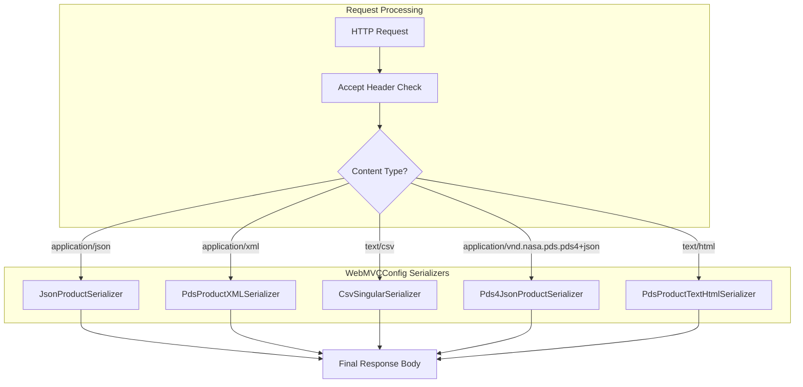
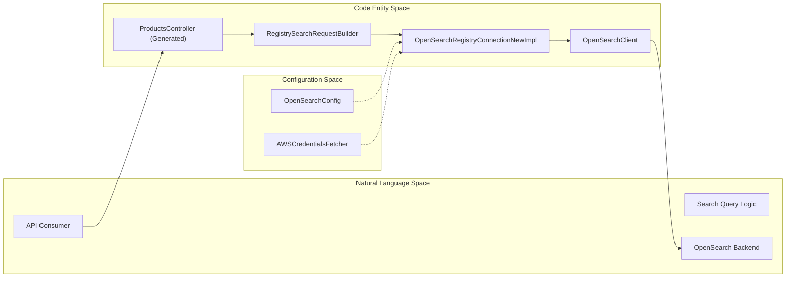

# Page: Service Module — Spring Boot Application

# Service Module — Spring Boot Application

Relevant source files

The following files were used as context for generating this wiki page:

- [service/src/main/java/gov/nasa/pds/api/registry/ConnectionContext.java](service/src/main/java/gov/nasa/pds/api/registry/ConnectionContext.java)
- [service/src/main/java/gov/nasa/pds/api/registry/SpringBootMain.java](service/src/main/java/gov/nasa/pds/api/registry/SpringBootMain.java)
- [service/src/main/java/gov/nasa/pds/api/registry/configuration/WebMVCConfig.java](service/src/main/java/gov/nasa/pds/api/registry/configuration/WebMVCConfig.java)
- [service/src/main/java/gov/nasa/pds/api/registry/controllers/RegistryApiResponseEntityExceptionHandler.java](service/src/main/java/gov/nasa/pds/api/registry/controllers/RegistryApiResponseEntityExceptionHandler.java)
- [service/src/main/java/gov/nasa/pds/api/registry/controllers/SecurityValidationFilter.java](service/src/main/java/gov/nasa/pds/api/registry/controllers/SecurityValidationFilter.java)
- [service/src/main/java/gov/nasa/pds/api/registry/model/Pds4ProductFactory.java](service/src/main/java/gov/nasa/pds/api/registry/model/Pds4ProductFactory.java)
- [service/src/main/java/gov/nasa/pds/api/registry/model/exceptions/BadRequestException.java](service/src/main/java/gov/nasa/pds/api/registry/model/exceptions/BadRequestException.java)
- [service/src/main/java/gov/nasa/pds/api/registry/model/properties/PdsProperty.java](service/src/main/java/gov/nasa/pds/api/registry/model/properties/PdsProperty.java)
- [service/src/main/java/gov/nasa/pds/api/registry/search/OpenSearchConfig.java](service/src/main/java/gov/nasa/pds/api/registry/search/OpenSearchConfig.java)
- [service/src/main/java/gov/nasa/pds/api/registry/search/OpenSearchRegistryConnectionImplBuilder.java](service/src/main/java/gov/nasa/pds/api/registry/search/OpenSearchRegistryConnectionImplBuilder.java)
- [service/src/main/java/gov/nasa/pds/api/registry/search/OpenSearchRegistryConnectionNewImpl.java](service/src/main/java/gov/nasa/pds/api/registry/search/OpenSearchRegistryConnectionNewImpl.java)
- [service/src/main/resources/swagger-ui/index.html](service/src/main/resources/swagger-ui/index.html)
- [service/src/main/resources/swagger-ui/pds.js](service/src/main/resources/swagger-ui/pds.js)

The **Service Module** is the core executable component of the NASA PDS Registry API. It leverages the Spring Boot framework to provide a RESTful interface, managing the lifecycle of HTTP requests, content negotiation, and the integration between the Lexer (query parsing) and the OpenSearch backend. It is responsible for wiring together the generated models and controllers from the Model module with actual business logic and data retrieval.

### Spring Boot Entry Point

The application entry point is `SpringBootMain`. It initializes the Spring context, enables scheduling, and performs component scanning across the registry packages to discover controllers, configurations, and search implementations.

*   **`SpringBootMain`**: The main class annotated with `@SpringBootApplication`. It uses `AnnotationConfigApplicationContext` to refresh the context and runs the Spring application [service/src/main/java/gov/nasa/pds/api/registry/SpringBootMain.java:19-43]().
*   **Component Scanning**: The application scans `gov.nasa.pds.api.registry.configuration`, `controllers`, `model`, `search`, and `util` to assemble the dependency injection graph [service/src/main/java/gov/nasa/pds/api/registry/SpringBootMain.java:22-24]().

**Sources:** [service/src/main/java/gov/nasa/pds/api/registry/SpringBootMain.java:19-50]()

---

### Request Lifecycle and Security Validation

Every request passing through the service is subject to interceptors and filters that ensure security and parameter integrity.

#### SecurityValidationFilter
This component implements `HandlerInterceptor` to protect the API against common web vulnerabilities like cache poisoning and unauthorized parameter injection [service/src/main/java/gov/nasa/pds/api/registry/controllers/SecurityValidationFilter.java:18-19]().

*   **Query Parameter Whitelisting**: It restricts incoming requests to a specific set of allowed parameters: `q`, `fields`, `limit`, `sort`, `search-after`, `keywords`, `facet-fields`, and `facet-limit` [service/src/main/java/gov/nasa/pds/api/registry/controllers/SecurityValidationFilter.java:22-23]().
*   **Cache Poisoning Protection**: It inspects headers such as `x-forwarded-host`, `x-host`, and `x-forwarded-server` [service/src/main/java/gov/nasa/pds/api/registry/controllers/SecurityValidationFilter.java:24-25](). It validates these against a list of `authorizedForwardedHosts` configured in `application.properties` [service/src/main/java/gov/nasa/pds/api/registry/controllers/SecurityValidationFilter.java:29-35]().

#### Global Exception Handling
The `RegistryApiResponseEntityExceptionHandler` uses `@ControllerAdvice` to provide a centralized mechanism for converting internal exceptions into standardized HTTP responses [service/src/main/java/gov/nasa/pds/api/registry/controllers/RegistryApiResponseEntityExceptionHandler.java:17-18]().

| Exception | HTTP Status | Description |
| :--- | :--- | :--- |
| `NotFoundException` | 404 Not Found | Resource (Product/LIDVID) does not exist [service/src/main/java/gov/nasa/pds/api/registry/controllers/RegistryApiResponseEntityExceptionHandler.java:42-46]() |
| `BadRequestException` | 400 Bad Request | Invalid request syntax or parameters [service/src/main/java/gov/nasa/pds/api/registry/controllers/RegistryApiResponseEntityExceptionHandler.java:48-52]() |
| `AcceptFormatNotSupportedException` | 406 Not Acceptable | Requested `Accept` header format is not available [service/src/main/java/gov/nasa/pds/api/registry/controllers/RegistryApiResponseEntityExceptionHandler.java:60-69]() |
| `UnauthorizedForwardedHostException` | 400 Bad Request | Security violation on proxy headers [service/src/main/java/gov/nasa/pds/api/registry/controllers/RegistryApiResponseEntityExceptionHandler.java:89-93]() |

**Sources:** [service/src/main/java/gov/nasa/pds/api/registry/controllers/SecurityValidationFilter.java:18-90](), [service/src/main/java/gov/nasa/pds/api/registry/controllers/RegistryApiResponseEntityExceptionHandler.java:17-96]()

---

### Configuration and Content Negotiation

The `WebMVCConfig` class handles the web layer configuration, specifically focusing on how data is serialized and presented to the user based on the `Accept` header.

#### Content Negotiation and Message Converters
The service supports multiple output formats including JSON, XML, CSV, and HTML. These are managed via `HttpMessageConverter` registrations in `configureMessageConverters` [service/src/main/java/gov/nasa/pds/api/registry/configuration/WebMVCConfig.java:81-125]().

**Data Flow: Request to Serializer**
The following diagram shows how a request for a specific media type is routed to the corresponding serializer.

Title: Content Negotiation Flow

#### Static Resources and OpenAPI
The service hosts its own API documentation.
*   **Swagger UI**: Configured to serve static assets from `classpath:/swagger-ui/` and `webjars` [service/src/main/java/gov/nasa/pds/api/registry/configuration/WebMVCConfig.java:49-64]().
*   **Path Matching**: `setUseSuffixPatternMatch(false)` is explicitly called to prevent Spring from truncating LIDVIDs that contain dots (e.g., `urn:nasa:pds:bundle::1.0`) [service/src/main/java/gov/nasa/pds/api/registry/configuration/WebMVCConfig.java:68-71]().

**Sources:** [service/src/main/java/gov/nasa/pds/api/registry/configuration/WebMVCConfig.java:38-135]()

---

### OpenSearch Connectivity and Wiring

The service module establishes the connection to the OpenSearch cluster using a builder pattern and configuration properties.

#### Connection Context
The `ConnectionContext` interface defines the requirements for backend communication, including methods for retrieving the `OpenSearchClient`, indices, and timeout settings [service/src/main/java/gov/nasa/pds/api/registry/ConnectionContext.java:7-24]().

*   **`OpenSearchRegistryConnectionNewImpl`**: The primary implementation of `ConnectionContext`. it uses the `ApacheHttpClient5TransportBuilder` to create an asynchronous transport layer [service/src/main/java/gov/nasa/pds/api/registry/search/OpenSearchRegistryConnectionNewImpl.java:51-171]().
*   **`OpenSearchConfig`**: A `@Configuration` bean that maps `application.properties` (prefixed with `openSearch.*`) to Java fields [service/src/main/java/gov/nasa/pds/api/registry/search/OpenSearchConfig.java:18-140]().

**Wiring Diagram: Model to Backend**
This diagram bridges the high-level system names with the specific code entities responsible for data flow.

Title: Service Wiring Architecture

#### AWS Integration
The `OpenSearchRegistryConnectionImplBuilder` triggers the `AWSCredentialsFetcher` to retrieve credentials if the application is running in an AWS environment [service/src/main/java/gov/nasa/pds/api/registry/search/OpenSearchRegistryConnectionImplBuilder.java:133-141](). This allows for seamless integration with IAM roles and AWS Secrets Manager.

**Sources:** [service/src/main/java/gov/nasa/pds/api/registry/search/OpenSearchRegistryConnectionNewImpl.java:51-171](), [service/src/main/java/gov/nasa/pds/api/registry/search/OpenSearchRegistryConnectionImplBuilder.java:17-161](), [service/src/main/java/gov/nasa/pds/api/registry/search/OpenSearchConfig.java:18-140]()

---

### Data Transformation and Serialization Logic

The service translates OpenSearch documents into PDS4-compliant models using factory classes.

*   **`Pds4ProductFactory`**: This class takes a `fieldMap` (the raw JSON/KVP result from OpenSearch) and maps it to a `Pds4Product` DTO [service/src/main/java/gov/nasa/pds/api/registry/model/Pds4ProductFactory.java:63-70]().
*   **Blob Handling**: It handles the decoding of base64-encoded blobs (XML or JSON) stored in OpenSearch to reconstruct the original product labels [service/src/main/java/gov/nasa/pds/api/registry/model/Pds4ProductFactory.java:80-100]().
*   **Metadata Mapping**: It extracts operational metadata such as file names, sizes, and MD5 checksums from the search result to populate the `Pds4Metadata` object [service/src/main/java/gov/nasa/pds/api/registry/model/Pds4ProductFactory.java:107-117]().

**Sources:** [service/src/main/java/gov/nasa/pds/api/registry/model/Pds4ProductFactory.java:22-179]()
