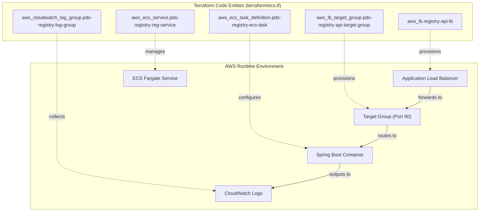
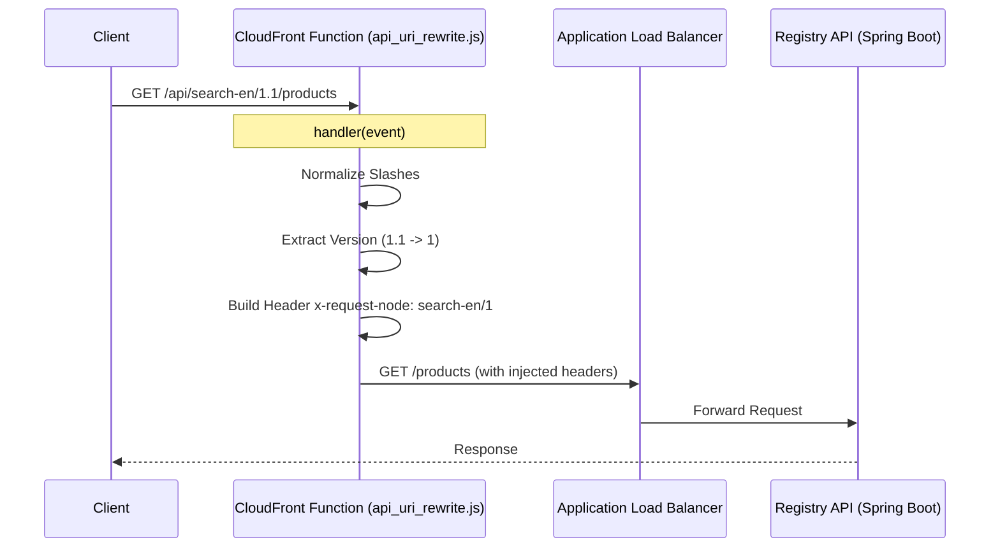

# Page: Terraform AWS ECS Fargate Deployment

# Terraform AWS ECS Fargate Deployment

<details>
<summary>Relevant source files</summary>

The following files were used as context for generating this wiki page:

- [terraform/README.md](terraform/README.md)
- [terraform/aws/api_uri_rewrite.js](terraform/aws/api_uri_rewrite.js)
- [terraform/aws/test_api_uri_rewrite.html](terraform/aws/test_api_uri_rewrite.html)
- [terraform/ecs.tf](terraform/ecs.tf)
- [terraform/provider.tf](terraform/provider.tf)
- [terraform/variables.tf](terraform/variables.tf)

</details>


This page details the infrastructure-as-code (IaC) configuration used to deploy the Registry API to AWS. The deployment utilizes **AWS ECS Fargate** for serverless container execution, managed by an **Application Load Balancer (ALB)** with HTTPS termination and a specialized **CloudFront Function** for URI normalization.

## Infrastructure Overview

The deployment is orchestrated using Terraform scripts located in the `terraform/` directory. It defines a scalable, containerized environment that integrates with existing VPC and OpenSearch resources.

### Code-to-Entity Mapping: Infrastructure Components

The following diagram maps Terraform resource definitions to their functional roles in the AWS ecosystem.

**Diagram: Infrastructure Entity Mapping**

**Sources:** [terraform/ecs.tf:1-21](), [terraform/ecs.tf:30-47](), [terraform/ecs.tf:108-164](), [terraform/ecs.tf:169-194]()

## ECS and Fargate Configuration

The Registry API runs as a Fargate task, ensuring no EC2 instances need manual management.

### Task Definition
The task definition `pds-registry-ecs-task` configures the runtime environment for the Spring Boot application:
*   **Container Port:** The application listens on port 80 inside the container [terraform/ecs.tf:116-120]().
*   **Environment Variables:** Passes `SERVER_PORT` and `SPRING_BOOT_APP_ARGS` (which includes OpenSearch connection strings) to the JVM [terraform/ecs.tf:139-143]().
*   **Resources:** Default allocation is 256 CPU units and 512 MB RAM [terraform/ecs.tf:152-153]().
*   **Logging:** Configured to use the `awslogs` driver, sending output to a specific CloudWatch Log Group `/ecs/pds-${var.venue}-registry-api-svc-task` [terraform/ecs.tf:121-128]().

### Service and Networking
The `aws_ecs_service` maintains a `desired_count` of 1 (configurable) and handles integration with the Load Balancer [terraform/ecs.tf:169-182](). It is deployed within a private VPC subnet and does not assign a public IP to the tasks [terraform/ecs.tf:183-187]().

**Sources:** [terraform/ecs.tf:108-164](), [terraform/ecs.tf:169-194](), [terraform/variables.tf:60-69]()

## Load Balancing and Health Checks

The deployment uses an Application Load Balancer (ALB) to handle incoming traffic and provide SSL termination.

### HTTPS Listener
The ALB listens on port 443 using an ACM certificate provided via the `aws_acm_certificate_arn` variable [terraform/ecs.tf:49-58](). It forwards traffic to the target group based on a path pattern condition of `/*` [terraform/ecs.tf:60-76]().

### Health Checks
The target group performs health checks against the `/health` endpoint of the service:
*   **Path:** `/health` [terraform/ecs.tf:43]()
*   **Protocol:** HTTP [terraform/ecs.tf:33]()
*   **Matcher:** Expects a `200 OK` response [terraform/ecs.tf:44]()
*   **Interval:** 300 seconds [terraform/ecs.tf:45]()

The DNS name of the created load balancer is exported to an SSM Parameter `/pds/registry/load-balancer-domain` for use by other infrastructure components [terraform/ecs.tf:23-28]().

**Sources:** [terraform/ecs.tf:1-21](), [terraform/ecs.tf:30-47](), [terraform/ecs.tf:49-58]()

## URI Normalization (CloudFront Function)

To support standardized PDS API routing, a CloudFront Function `api_uri_rewrite.js` is utilized. This function normalizes incoming URIs before they reach the ALB.

### Logic Flow
1.  **Slash Normalization:** Strips leading multiple slashes (e.g., `//api` to `/api`) [terraform/aws/api_uri_rewrite.js:26-29]().
2.  **Prefix Matching:** Only processes requests starting with `/api/search` [terraform/aws/api_uri_rewrite.js:35]().
3.  **Version Truncation:** Converts `major.minor` version strings to `major` only [terraform/aws/api_uri_rewrite.js:44-45]().
4.  **Header Injection:**
    *   `x-request-node`: Set to `<service>/<major_version>` [terraform/aws/api_uri_rewrite.js:58]().
    *   `x-forwarded-prefix`: Set to `/api/<service>/<major_version>`, which is required for correct Swagger UI base path resolution [terraform/aws/api_uri_rewrite.js:59]().

**Diagram: URI Rewrite Data Flow**

**Sources:** [terraform/aws/api_uri_rewrite.js:22-71](), [terraform/aws/test_api_uri_rewrite.html:29-42]()

## External Dependencies and Deployment

The Terraform scripts require several pre-existing resources to be passed as variables.

### Required Interfaces
As documented in the `terraform/README.md`, the following must exist prior to deployment:
*   **VPC & Subnets:** Shared with the OpenSearch service [terraform/README.md:13-15]().
*   **Security Groups:** Must allow inbound traffic on port 80 from the ALB [terraform/README.md:17]().
*   **ECR Image:** A Docker image for the Registry API must be available in Amazon Elastic Container Registry [terraform/README.md:18]().
*   **OpenSearch:** A running OpenSearch cluster with the appropriate registry indices [terraform/README.md:19]().

### Deployment Command
The deployment is triggered via `terraform apply` with specific variables for the target environment (venue):

```bash
terraform apply \
    -var 'ecs_task_role=...' \
    -var 'ecs_task_execution_role=...' \
    -var 'venue=delta' \
    -var 'aws_fg_vpc=...' \
    -var 'aws_fg_image=...' \
    -var 'spring_boot_args=--openSearch.host=... --openSearch.CCSEnabled=true'
```
**Sources:** [terraform/README.md:11-42](), [terraform/variables.tf:1-58]()
