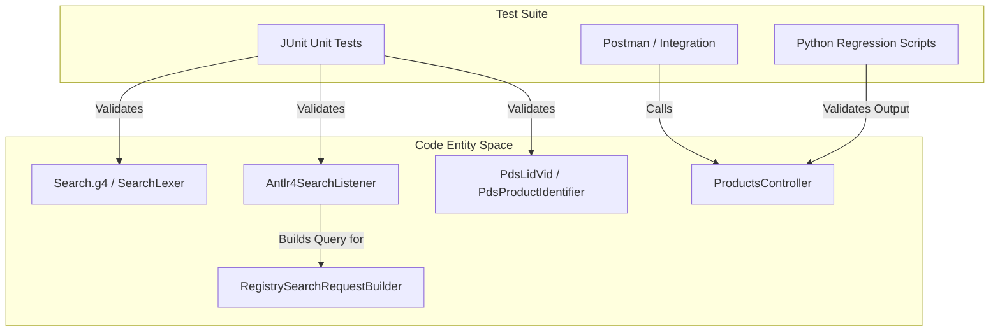
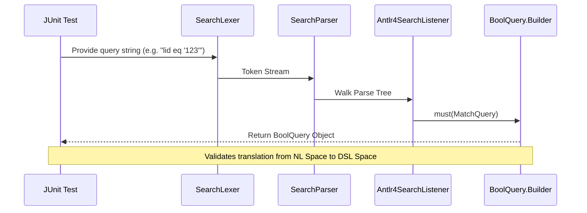

# Page: Testing

# Testing

Relevant source files

The following files were used as context for generating this wiki page:

- [lexer/src/main/antlr4/gov/nasa/pds/api/registry/lexer/Search.g4](lexer/src/main/antlr4/gov/nasa/pds/api/registry/lexer/Search.g4)
- [lexer/src/test/java/api/pds/nasa/gov/api_search_query_lexer/MockedListener.java](lexer/src/test/java/api/pds/nasa/gov/api_search_query_lexer/MockedListener.java)
- [lexer/src/test/java/api/pds/nasa/gov/api_search_query_lexer/TestParsing.java](lexer/src/test/java/api/pds/nasa/gov/api_search_query_lexer/TestParsing.java)
- [model/swagger.yml](model/swagger.yml)
- [service/src/main/java/gov/nasa/pds/api/registry/configuration/OpenAPIClearedTags.java](service/src/main/java/gov/nasa/pds/api/registry/configuration/OpenAPIClearedTags.java)
- [service/src/main/java/gov/nasa/pds/api/registry/controllers/ProductsController.java](service/src/main/java/gov/nasa/pds/api/registry/controllers/ProductsController.java)
- [service/src/main/java/gov/nasa/pds/api/registry/model/Antlr4SearchListener.java](service/src/main/java/gov/nasa/pds/api/registry/model/Antlr4SearchListener.java)
- [service/src/main/java/gov/nasa/pds/api/registry/model/transformers/ResponseTransformerImpl.java](service/src/main/java/gov/nasa/pds/api/registry/model/transformers/ResponseTransformerImpl.java)
- [service/src/main/java/gov/nasa/pds/api/registry/search/RegistrySearchRequestBuilder.java](service/src/main/java/gov/nasa/pds/api/registry/search/RegistrySearchRequestBuilder.java)
- [service/src/main/resources/application.properties.all](service/src/main/resources/application.properties.all)
- [service/src/test/java/gov/nasa/pds/api/registry/opensearch/Antlr4SearchListenerTest.java](service/src/test/java/gov/nasa/pds/api/registry/opensearch/Antlr4SearchListenerTest.java)
- [service/src/test/resources/POSTMAN_TESTS_README.txt](service/src/test/resources/POSTMAN_TESTS_README.txt)

The Registry API testing strategy is a multi-tiered approach designed to ensure the reliability of the ANTLR4-based search grammar, the correctness of the OpenSearch query construction, and the stability of the REST endpoints. The suite spans from low-level unit tests for identifier parsing to full-scale integration tests using Docker Compose and Postman.

## Testing Strategy Overview

The testing lifecycle is divided into three primary categories:

1.  **Unit Testing (JUnit 5):** Validates individual components in isolation, such as the `Search.g4` grammar, the `Antlr4SearchListener`, and PDS4 identifier logic (LID/LIDVID).
2.  **Integration Testing:** Uses `Docker Compose` to spin up the API service alongside an OpenSearch instance to verify end-to-end request flow.
3.  **Regression Testing:** Utilizes Postman collections and Python scripts to ensure that API updates do not break existing functionality or contract compliance.

### Testing Components Relationship

The following diagram illustrates how testing entities map to the system components they validate:

**Test-to-Component Mapping**

Sources: [lexer/src/test/java/api/pds/nasa/gov/api_search_query_lexer/TestParsing.java:19-196](), [service/src/test/java/gov/nasa/pds/api/registry/opensearch/Antlr4SearchListenerTest.java:27-204](), [service/src/main/java/gov/nasa/pds/api/registry/controllers/ProductsController.java:52-136]()

---

## Unit Testing

Unit tests are primarily located in the `lexer` and `service` modules. They focus on the logic that transforms a PDS4 search string into an OpenSearch `BoolQuery`.

*   **Grammar Validation:** `TestParsing.java` ensures that the ANTLR4 lexer and parser correctly handle various query scenarios, including temporal ranges, field existence, and malicious SQL-injection-style strings [lexer/src/test/java/api/pds/nasa/gov/api_search_query_lexer/TestParsing.java:22-196]().
*   **Query Translation:** `Antlr4SearchListenerTest.java` verifies that the `Antlr4SearchListener` correctly interprets comparison operators (eq, ne, gt, etc.) and groupings to build the expected OpenSearch DSL [service/src/test/java/gov/nasa/pds/api/registry/opensearch/Antlr4SearchListenerTest.java:70-135]().
*   **Identifier Logic:** Tests for `PdsLidVid` and `PdsProductIdentifier` ensure that URNs are correctly parsed and versioned [service/src/main/java/gov/nasa/pds/api/registry/controllers/ProductsController.java:159-165]().

For details, see **[Unit Tests](#9.1)**.

---

## Integration and Regression Testing

Integration tests verify the `ProductsController` and its interaction with the `ConnectionContext` and the OpenSearch backend.

### End-to-End Flow
When an integration test hits an endpoint like `/products`, the system follows this path:
1.  `ProductsController` receives the request [service/src/main/java/gov/nasa/pds/api/registry/controllers/ProductsController.java:146-170]().
2.  `RegistrySearchRequestBuilder` applies mandatory filters, such as `archive_status` [service/src/main/java/gov/nasa/pds/api/registry/search/RegistrySearchRequestBuilder.java:80-91]().
3.  The `Antlr4SearchListener` processes the `q` parameter to add constraints [service/src/main/java/gov/nasa/pds/api/registry/model/Antlr4SearchListener.java:157-200]().
4.  The result is transformed by a `ResponseTransformerImpl` [service/src/main/java/gov/nasa/pds/api/registry/model/transformers/ResponseTransformerImpl.java:77-80]().

### Integration Tools
*   **Postman:** A collection located at `service/src/test/resources/postman_collection.json` (referenced via external link) provides a suite of standard API requests to verify status codes and JSON schemas [service/src/test/resources/POSTMAN_TESTS_README.txt:1-4]().
*   **Docker Compose:** Used in CI/CD to orchestrate a transient environment for running the `reg-api-integration-test-with-wait` container.
*   **Regression Scripts:** Python-based scripts located in `service/ut/` perform deep comparisons of API responses against known "golden" datasets.

For details, see **[Integration and Regression Testing](#9.2)**.

---

## Execution Summary

| Test Type | Command / Tool | Primary Focus |
| :--- | :--- | :--- |
| **Unit** | `mvn test` | ANTLR4 Grammar, Listener logic, Identifier parsing |
| **Integration** | `docker-compose up` | Controller-to-OpenSearch connectivity, Endpoints |
| **Contract** | Postman / Newman | Swagger/OpenAPI compliance, HTTP status codes |
| **Regression** | Python Scripts | Data consistency across versions |

**Search Query Testing Pipeline**

Sources: [lexer/src/test/java/api/pds/nasa/gov/api_search_query_lexer/TestParsing.java:44-61](), [service/src/test/java/gov/nasa/pds/api/registry/opensearch/Antlr4SearchListenerTest.java:51-67](), [service/src/main/java/gov/nasa/pds/api/registry/model/Antlr4SearchListener.java:177-184]()
