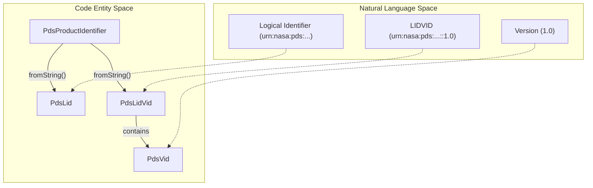
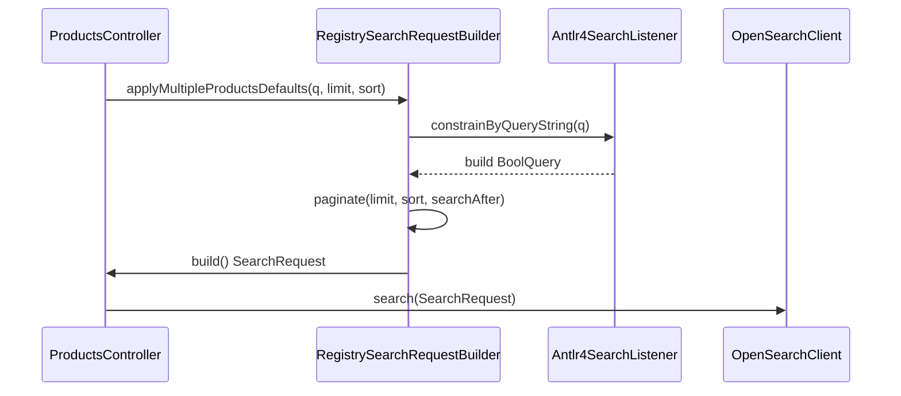

# Page: Unit Tests

# Unit Tests

<details>
<summary>Relevant source files</summary>

The following files were used as context for generating this wiki page:

- [lexer/src/main/antlr4/gov/nasa/pds/api/registry/lexer/Search.g4](lexer/src/main/antlr4/gov/nasa/pds/api/registry/lexer/Search.g4)
- [lexer/src/test/java/api/pds/nasa/gov/api_search_query_lexer/MockedListener.java](lexer/src/test/java/api/pds/nasa/gov/api_search_query_lexer/MockedListener.java)
- [lexer/src/test/java/api/pds/nasa/gov/api_search_query_lexer/TestParsing.java](lexer/src/test/java/api/pds/nasa/gov/api_search_query_lexer/TestParsing.java)
- [service/src/main/java/gov/nasa/pds/api/registry/configuration/OpenAPIClearedTags.java](service/src/main/java/gov/nasa/pds/api/registry/configuration/OpenAPIClearedTags.java)
- [service/src/main/java/gov/nasa/pds/api/registry/controllers/ProductsController.java](service/src/main/java/gov/nasa/pds/api/registry/controllers/ProductsController.java)
- [service/src/main/java/gov/nasa/pds/api/registry/model/Antlr4SearchListener.java](service/src/main/java/gov/nasa/pds/api/registry/model/Antlr4SearchListener.java)
- [service/src/main/java/gov/nasa/pds/api/registry/model/identifiers/PdsLid.java](service/src/main/java/gov/nasa/pds/api/registry/model/identifiers/PdsLid.java)
- [service/src/main/java/gov/nasa/pds/api/registry/model/identifiers/PdsLidVid.java](service/src/main/java/gov/nasa/pds/api/registry/model/identifiers/PdsLidVid.java)
- [service/src/main/java/gov/nasa/pds/api/registry/model/identifiers/PdsProductClasses.java](service/src/main/java/gov/nasa/pds/api/registry/model/identifiers/PdsProductClasses.java)
- [service/src/main/java/gov/nasa/pds/api/registry/model/identifiers/PdsProductIdentifier.java](service/src/main/java/gov/nasa/pds/api/registry/model/identifiers/PdsProductIdentifier.java)
- [service/src/main/java/gov/nasa/pds/api/registry/model/identifiers/PdsVid.java](service/src/main/java/gov/nasa/pds/api/registry/model/identifiers/PdsVid.java)
- [service/src/main/java/gov/nasa/pds/api/registry/model/transformers/ResponseTransformerImpl.java](service/src/main/java/gov/nasa/pds/api/registry/model/transformers/ResponseTransformerImpl.java)
- [service/src/main/java/gov/nasa/pds/api/registry/search/RegistrySearchRequestBuilder.java](service/src/main/java/gov/nasa/pds/api/registry/search/RegistrySearchRequestBuilder.java)
- [service/src/test/java/gov/nasa/pds/api/registry/model/PdsLidTest.java](service/src/test/java/gov/nasa/pds/api/registry/model/PdsLidTest.java)
- [service/src/test/java/gov/nasa/pds/api/registry/model/PdsLidVidTest.java](service/src/test/java/gov/nasa/pds/api/registry/model/PdsLidVidTest.java)
- [service/src/test/java/gov/nasa/pds/api/registry/model/PdsProductClassesTest.java](service/src/test/java/gov/nasa/pds/api/registry/model/PdsProductClassesTest.java)
- [service/src/test/java/gov/nasa/pds/api/registry/model/PdsProductIdentifierTest.java](service/src/test/java/gov/nasa/pds/api/registry/model/PdsProductIdentifierTest.java)
- [service/src/test/java/gov/nasa/pds/api/registry/model/PdsVidTest.java](service/src/test/java/gov/nasa/pds/api/registry/model/PdsVidTest.java)

</details>


The Registry API unit test suite is designed to validate core business logic, query construction, identifier parsing, and configuration management without requiring a live OpenSearch instance. These tests are executed using the standard Maven test lifecycle.

## Running Tests

To execute the entire unit test suite across all modules, run the following command from the project root:

```bash
mvn test
```

Tests are primarily located in the `lexer/src/test` and `service/src/test` directories.

---

## Lexer and Search Query Validation

The lexer module tests ensure that the ANTLR4 grammar correctly parses PDS search queries into a format that the `Antlr4SearchListener` can translate into OpenSearch DSL.

### TestParsing
`TestParsing` validates the `Search.g4` grammar. It uses a `MockedListener` to verify that tokens like field names, numbers, and strings are correctly identified by the parser.
*   **Malicious Query Detection**: Verifies that SQL-like syntax (e.g., `select * from table`) throws a `ParseCancellationException` [lexer/src/test/java/api/pds/nasa/gov/api_search_query_lexer/TestParsing.java:23-39]().
*   **Operator Validation**: Checks parsing of `eq`, `like`, and `exists` operators [lexer/src/test/java/api/pds/nasa/gov/api_search_query_lexer/TestParsing.java:43-100]().
*   **Wildcard Handling**: Ensures field names with wildcards (e.g., `*.apple`) are correctly identified for expansion [lexer/src/test/java/api/pds/nasa/gov/api_search_query_lexer/TestParsing.java:158-173]().

### Antlr4SearchListener Logic
While `TestParsing` checks the grammar, the `Antlr4SearchListener` (tested via integration in the service module) handles the stateful translation to OpenSearch `BoolQuery` objects. It manages a stack of query builders to handle nested groups and logical conjunctions (`AND`/`OR`) [service/src/main/java/gov/nasa/pds/api/registry/model/Antlr4SearchListener.java:46-47]().

**Natural Language to Search Logic Mapping**

| Natural Language Concept | Code Entity / Grammar Rule | Implementation Detail |
| :--- | :--- | :--- |
| **Field Name** | `FIELDNAME` [lexer/src/main/antlr4/gov/nasa/pds/api/registry/lexer/Search.g4:35]() | Supports dots, underscores, and colons. |
| **Equality** | `EQ` / `operator` [lexer/src/main/antlr4/gov/nasa/pds/api/registry/lexer/Search.g4:13]() | Maps to `MatchQuery` in `Antlr4SearchListener` [service/src/main/java/gov/nasa/pds/api/registry/model/Antlr4SearchListener.java:179](). |
| **Presence** | `existence` [lexer/src/main/antlr4/gov/nasa/pds/api/registry/lexer/Search.g4:7]() | Maps to `ExistsQuery` in `Antlr4SearchListener`. |
| **Grouping** | `group` [lexer/src/main/antlr4/gov/nasa/pds/api/registry/lexer/Search.g4:6]() | Uses `stackQueryBuilders` to manage scope [service/src/main/java/gov/nasa/pds/api/registry/model/Antlr4SearchListener.java:109](). |

**Sources:** [lexer/src/test/java/api/pds/nasa/gov/api_search_query_lexer/TestParsing.java:1-197](), [service/src/main/java/gov/nasa/pds/api/registry/model/Antlr4SearchListener.java:29-155](), [lexer/src/main/antlr4/gov/nasa/pds/api/registry/lexer/Search.g4:1-68]()

---

## Identifier and Class Validation

The API relies heavily on parsing PDS4 Logical Identifiers (LID) and Versioned Identifiers (LIDVID).

### PdsProductIdentifierTest
Tests the factory logic in `PdsProductIdentifier.fromString()`. It ensures that strings are correctly routed to either `PdsLid` or `PdsLidVid` subclasses [service/src/main/java/gov/nasa/pds/api/registry/model/identifiers/PdsProductIdentifier.java:11-21]().
*   **Partial LIDVIDs**: Validates that malformed LIDVIDs (e.g., missing version after `::`) fallback to LID parsing [service/src/test/java/gov/nasa/pds/api/registry/model/PdsProductIdentifierTest.java:18-29]().

### PdsVidTest
Focuses on the `PdsVid` class which represents the `M.m` version component.
*   **Validation**: Asserts that negative versions or extra dot-segments (e.g., `1.0.0`) throw `IllegalArgumentException` [service/src/test/java/gov/nasa/pds/api/registry/model/PdsVidTest.java:15-23]().
*   **Comparison**: Validates `compareTo` logic for version sorting (e.g., `10.1` is higher than `1.10`) [service/src/test/java/gov/nasa/pds/api/registry/model/PdsVidTest.java:43-60]().

### PdsProductClassesTest
Validates the enumeration of PDS4 product classes and their transformation into "Swagger names" used in REST URLs (e.g., `Product_Bundle` becomes `bundle`) [service/src/main/java/gov/nasa/pds/api/registry/model/identifiers/PdsProductClasses.java:71-81]().

**Identifier Entity Relationship**



**Sources:** [service/src/main/java/gov/nasa/pds/api/registry/model/identifiers/PdsProductIdentifier.java:1-44](), [service/src/test/java/gov/nasa/pds/api/registry/model/PdsProductIdentifierTest.java:1-31](), [service/src/test/java/gov/nasa/pds/api/registry/model/PdsVidTest.java:1-61](), [service/src/main/java/gov/nasa/pds/api/registry/model/identifiers/PdsProductClasses.java:10-115]()

---

## Query Construction and Search Logic

### RegistrySearchRequestBuilderTest
This test suite verifies the construction of the OpenSearch `SearchRequest`.
*   **Mandatory Baseline**: Ensures every query includes the `archive_status` filter retrieved from `ConnectionContext` [service/src/main/java/gov/nasa/pds/api/registry/search/RegistrySearchRequestBuilder.java:80-91]().
*   **Defaults Application**: Validates `applyMultipleProductsDefaults` correctly configures pagination, sorting, and property filtering [service/src/main/java/gov/nasa/pds/api/registry/search/RegistrySearchRequestBuilder.java:121-135]().

### PaginationLidvidBuilderTest
Tests the logic for generating `search-after` tokens and handling deep pagination. It ensures that the sort fields provided in the request match the tokens provided in the `search-after` parameter.

**Search Request Flow**



**Sources:** [service/src/main/java/gov/nasa/pds/api/registry/search/RegistrySearchRequestBuilder.java:50-153](), [service/src/main/java/gov/nasa/pds/api/registry/controllers/ProductsController.java:109-136]()

---

## Infrastructure and Configuration Tests

### WebMVCConfigTest
Validates the Spring MVC configuration, specifically the registration of custom serializers and content negotiation strategies. It ensures that the `ResponseTransformerRegistry` is correctly populated.

### AWSSecretsAccessTest
Tests the integration with AWS Secrets Manager.
*   **Mocking**: Uses a mocked AWS SDK client to verify that secret strings are correctly parsed into OpenSearch credentials.
*   **Profile Activation**: Ensures that the `aws` profile correctly triggers the `AWSCredentialsFetcher`.

### OpenAPIClearedTags Test
Validates the `OpenApiCustomizer` implementation which filters out internal or redundant tags from the generated Swagger documentation [service/src/main/java/gov/nasa/pds/api/registry/configuration/OpenAPIClearedTags.java:19-58]().

**Sources:** [service/src/main/java/gov/nasa/pds/api/registry/configuration/OpenAPIClearedTags.java:1-62](), [service/src/main/java/gov/nasa/pds/api/registry/model/transformers/ResponseTransformerImpl.java:24-57]()
