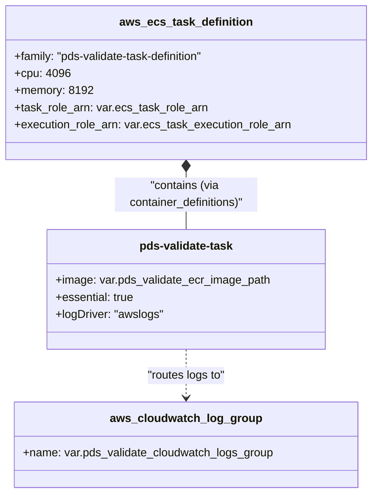

# Page: AWS/Terraform Deployment

# AWS/Terraform Deployment

<details>
<summary>Relevant source files</summary>

The following files were used as context for generating this wiki page:

- [terraform/README.md](terraform/README.md)
- [terraform/main.tf](terraform/main.tf)
- [terraform/providers.tf](terraform/providers.tf)
- [terraform/terraform-modules/ecs/container-definitions/pds-validate-containers.json](terraform/terraform-modules/ecs/container-definitions/pds-validate-containers.json)
- [terraform/terraform-modules/ecs/ecs.tf](terraform/terraform-modules/ecs/ecs.tf)
- [terraform/terraform-modules/ecs/variables.tf](terraform/terraform-modules/ecs/variables.tf)
- [terraform/terraform.tfvars](terraform/terraform.tfvars)
- [terraform/variables.tf](terraform/variables.tf)

</details>


This section describes the infrastructure-as-code (IaC) implementation for deploying the PDS Validate tool as an AWS Elastic Container Service (ECS) Task. The deployment utilizes Terraform to manage ECS task definitions, CloudWatch logging, and Elastic File System (EFS) integration, enabling the tool to run in a scalable, containerized environment compatible with both Fargate and EC2 launch types.

## Infrastructure Overview

The deployment architecture is centered around a modular Terraform structure that separates the core logic into an `ecs` module [terraform/main.tf:1-11](). The primary goal is to provide a repeatable environment where the Validate tool can be executed as a transient or long-running task, often triggered by an external orchestrator like Apache Airflow [terraform/README.md:94-95]().

### Component Interaction

The following diagram illustrates the relationship between the Terraform resources and the AWS services they provision.

**AWS Infrastructure Data Flow**
```mermaid
graph TD
    subgraph "Terraform_Files"
        ["main.tf"] -- "calls" --> ["module.ecs"]
        ["variables.tf"] -- "populates" --> ["main.tf"]
        ["pds-validate-containers.json"] -- "rendered_by" --> ["module.ecs"]
    end

    subgraph "AWS_Cloud_Resources"
        ["module.ecs"] -- "creates" --> ["aws_cloudwatch_log_group"]
        ["module.ecs"] -- "creates" --> ["aws_ecs_task_definition"]
        
        ["aws_ecs_task_definition"] -- "references" --> ["Amazon_ECR_Image"]
        ["aws_ecs_task_definition"] -- "mounts" --> ["Amazon_EFS"]
        ["aws_ecs_task_definition"] -- "logs_to" --> ["aws_cloudwatch_log_group"]
        
        ["EFS_Access_Point"] -- "authorizes" --> ["aws_ecs_task_definition"]
    end
```
**Sources:** [terraform/main.tf:1-11](), [terraform/terraform-modules/ecs/ecs.tf:17-46](), [terraform/terraform-modules/ecs/container-definitions/pds-validate-containers.json:1-21]()

---

## ECS Task Definition

The core resource is the `aws_ecs_task_definition` named `pds-validate-task-definition` [terraform/terraform-modules/ecs/ecs.tf:17-18](). 

### Compatibility and Sizing
The task is configured for high compatibility and specific resource allocations:
*   **Launch Types**: Supports both `EC2` and `FARGATE` [terraform/terraform-modules/ecs/ecs.tf:19]().
*   **Network Mode**: Uses `awsvpc` for dedicated ENIs [terraform/terraform-modules/ecs/ecs.tf:20]().
*   **Resources**: Allocated 4096 CPU units (4 vCPUs) and 8192 MiB of memory [terraform/terraform-modules/ecs/ecs.tf:21-22]().
*   **Runtime**: Fixed to `LINUX` operating system family [terraform/terraform-modules/ecs/ecs.tf:24]().

### Container Configuration
The container definition is injected via a JSON template [terraform/terraform-modules/ecs/container-definitions/pds-validate-containers.json:1-21](). This template dynamically maps the ECR image path and logging parameters during the Terraform `apply` phase using a `template_file` data source [terraform/terraform-modules/ecs/ecs.tf:7-14]().

**Entity Mapping: Terraform to AWS ECS**

**Sources:** [terraform/terraform-modules/ecs/ecs.tf:17-46](), [terraform/terraform-modules/ecs/container-definitions/pds-validate-containers.json:1-21]()

---

## Storage and EFS Mounting

To handle large PDS datasets, the task definition includes a persistent volume configuration using Amazon EFS.

*   **Volume Name**: `pds-validate-data` [terraform/terraform-modules/ecs/ecs.tf:28]().
*   **Transit Encryption**: Enabled to ensure data security in flight [terraform/terraform-modules/ecs/ecs.tf:33]().
*   **IAM Authorization**: The task uses IAM for EFS access, requiring an `access_point_id` to map the container user to the correct file system permissions [terraform/terraform-modules/ecs/ecs.tf:34-37]().

The file system ID (`efs_file_system_id`) and access point ID (`pds_validate_data_access_point_id`) are passed as variables through the module [terraform/main.tf:7-8]().

**Sources:** [terraform/terraform-modules/ecs/ecs.tf:27-39](), [terraform/variables.tf:19-29]()

---

## Logging and Monitoring

Logging is centralized via Amazon CloudWatch. The Terraform configuration:
1.  Creates an `aws_cloudwatch_log_group` using the name provided in `pds_validate_cloudwatch_logs_group` [terraform/terraform-modules/ecs/ecs.tf:2-4]().
2.  Configures the container within `pds-validate-containers.json` to use the `awslogs` driver [terraform/terraform-modules/ecs/container-definitions/pds-validate-containers.json:13]().
3.  Sets the log stream prefix to `ecs` for easy filtering in the AWS Console [terraform/terraform-modules/ecs/container-definitions/pds-validate-containers.json:17]().

**Sources:** [terraform/terraform-modules/ecs/ecs.tf:2-4](), [terraform/terraform-modules/ecs/container-definitions/pds-validate-containers.json:12-19]()

---

## Deployment Configuration

Deployment is driven by variable files (`terraform.tfvars`) and environment variables [terraform/README.md:41-58](). Sensitive information such as ARNs and image paths are marked as `sensitive = true` in the Terraform definitions to prevent exposure in logs [terraform/variables.tf:10,16,22,28,34,40]().

### Key Variables

| Variable | Description | Source |
| :--- | :--- | :--- |
| `pds_validate_ecr_image_path` | URI of the Docker image in ECR | [terraform/variables.tf:13-17]() |
| `efs_file_system_id` | The ID of the EFS instance containing data | [terraform/variables.tf:19-23]() |
| `ecs_task_role_arn` | IAM role for the task to access AWS services (S3, EFS) | [terraform/variables.tf:31-35]() |
| `ecs_task_execution_role_arn` | IAM role for ECS agent to pull images and publish logs | [terraform/variables.tf:37-41]() |

### Integration with Apache Airflow

The resulting ECS Task Definition is designed to be invoked by the `ECSOperator` within an Apache Airflow DAG [terraform/README.md:94-95](). This allows the Validate tool to be integrated into broader PDS data processing pipelines where validation is a prerequisite for ingestion or archiving.

**Sources:** [terraform/README.md:41-65](), [terraform/variables.tf:1-42](), [terraform/providers.tf:1-13]()
