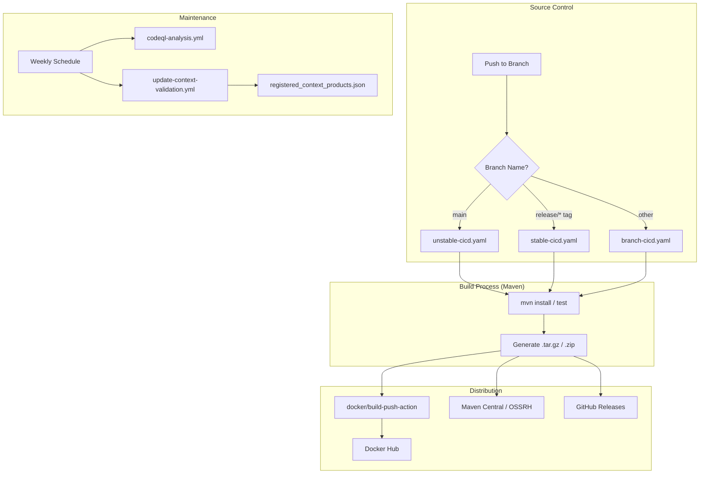
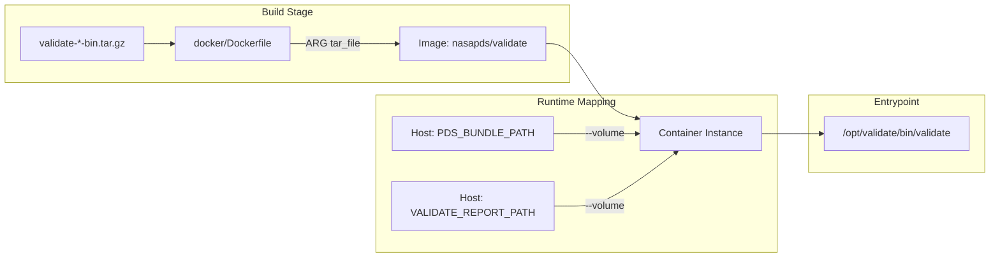
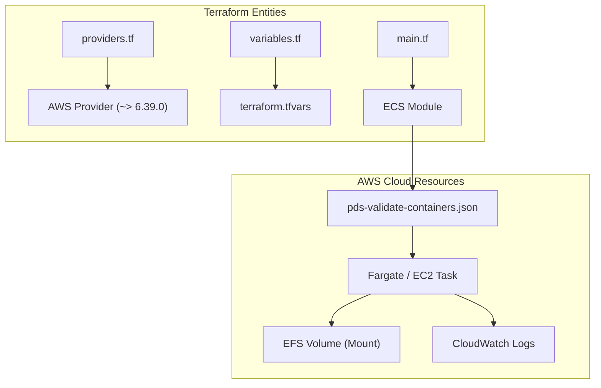

# Page: CI/CD, Build, and Deployment

# CI/CD, Build, and Deployment

Relevant source files

The following files were used as context for generating this wiki page:

- [.github/workflows/branch-cicd.yaml](.github/workflows/branch-cicd.yaml)
- [.github/workflows/codeql-analysis.yml](.github/workflows/codeql-analysis.yml)
- [.github/workflows/secrets-detection.yaml](.github/workflows/secrets-detection.yaml)
- [.github/workflows/stable-cicd.yaml](.github/workflows/stable-cicd.yaml)
- [.github/workflows/unstable-cicd.yaml](.github/workflows/unstable-cicd.yaml)
- [.github/workflows/update-context-validation.yml](.github/workflows/update-context-validation.yml)
- [.pre-commit-config.yaml](.pre-commit-config.yaml)
- [.secrets.baseline](.secrets.baseline)
- [build/update_context.sh](build/update_context.sh)
- [docker/Dockerfile](docker/Dockerfile)
- [docker/README.md](docker/README.md)
- [docker/run.sh](docker/run.sh)
- [terraform/README.md](terraform/README.md)
- [terraform/main.tf](terraform/main.tf)
- [terraform/providers.tf](terraform/providers.tf)
- [terraform/terraform-modules/ecs/container-definitions/pds-validate-containers.json](terraform/terraform-modules/ecs/container-definitions/pds-validate-containers.json)
- [terraform/terraform-modules/ecs/ecs.tf](terraform/terraform-modules/ecs/ecs.tf)
- [terraform/terraform-modules/ecs/variables.tf](terraform/terraform-modules/ecs/variables.tf)
- [terraform/terraform.tfvars](terraform/terraform.tfvars)
- [terraform/variables.tf](terraform/variables.tf)

This page provides an overview of the automated infrastructure used to build, test, package, and deploy the NASA PDS Validate tool. The system leverages GitHub Actions for continuous integration, Docker for containerized distribution, and Terraform for AWS-based cloud deployment.

### System Overview

The build and deployment lifecycle is triggered by various GitHub events (pushes, tags, schedules) and coordinates several external services including Maven Central (OSSRH), Docker Hub, and GitHub Packages.

**CI/CD Pipeline Flow**

Sources: [.github/workflows/unstable-cicd.yaml:23-40](), [.github/workflows/stable-cicd.yaml:24-38](), [.github/workflows/branch-cicd.yaml:7-21](), [.github/workflows/codeql-analysis.yml:1-7](), [.github/workflows/update-context-validation.yml:4-9]()

---

### 8.1 GitHub Actions Workflows

The repository contains several specialized workflows to manage different stages of the software lifecycle. These workflows utilize the `NASA-PDS/roundup-action` to standardize Maven build phases across PDS projects.

*   **Stable CI/CD**: Triggered by `release/*` tags. It performs a full deployment to Maven Central and pushes versioned images to Docker Hub [.github/workflows/stable-cicd.yaml:34-38]().
*   **Unstable CI/CD**: Triggered by pushes to the `main` branch. It deploys snapshot artifacts and updates the `latest` tag on Docker Hub [.github/workflows/unstable-cicd.yaml:32-35]().
*   **Branch Testing**: Runs on all non-main branches to ensure code quality via `mvn test` across multiple Java versions (17, 21) [.github/workflows/branch-cicd.yaml:34-36]().
*   **Security & Maintenance**: 
    *   **CodeQL**: Weekly static analysis for security vulnerabilities [.github/workflows/codeql-analysis.yml:4-5](). This workflow also includes a step to count lines of code (SLOC) using `djdefi/cloc-action` and uploads the report as an artifact [.github/workflows/codeql-analysis.yml:83-106]().
    *   **Secret Detection**: Scans for leaked credentials using `slim-detect-secrets` against a baseline file [.github/workflows/secrets-detection.yaml:1-11](). The workflow creates an initial `.secrets.baseline` if one doesn't exist and then compares new scans against it, failing the build if new secrets are detected [.github/workflows/secrets-detection.yaml:25-80]().
    *   **Context Update**: A weekly scheduled job that runs `build/update_context.sh` to refresh the `registered_context_products.json` file from the PDS Registry [.github/workflows/update-context-validation.yml:4-9]().

For details, see [GitHub Actions Workflows](#8.1).

Sources: [.github/workflows/stable-cicd.yaml:71-85](), [.github/workflows/unstable-cicd.yaml:74-87](), [.github/workflows/branch-cicd.yaml:65-67](), [.github/workflows/secrets-detection.yaml:49-61](), [build/update_context.sh:1-15](), [.github/workflows/codeql-analysis.yml:83-106](), [.github/workflows/secrets-detection.yaml:25-80]()

---

### 8.2 Docker Packaging and Distribution

The Validate tool is packaged as a Docker image based on the `eclipse-temurin:25-jdk` runtime [docker/Dockerfile:1](). The build process is multi-platform, supporting both `linux/amd64` and `linux/arm64` architectures via Docker Buildx [.github/workflows/unstable-cicd.yaml:105-113]().

**Docker Build and Execution Logic**

The containerization strategy relies on extracting the standard binary distribution tarball into `/opt/validate` within the image [docker/Dockerfile:8-9](). The `Dockerfile` uses a `tar_file` build argument to specify the tarball to be copied and extracted [docker/Dockerfile:3-6](). Users can interact with the containerized tool using the `docker/run.sh` helper script, which manages the necessary volume mappings to allow the container to access local data and write reports back to the host [docker/README.md:58-63](). The `run.sh` script defines environment variables like `PDS_BUNDLE_PATH`, `CHECKSUM_MANIFEST_FILE_NAME`, `VALIDATE_REPORT_PATH`, and `VALIDATE_REPORT_FILE_NAME` to configure the validation run [docker/README.md:68-74]().

For details, see [Docker Packaging and Distribution](#8.2).

Sources: [docker/Dockerfile:1-17](), [docker/README.md:42-55](), [docker/README.md:68-94](), [docker/Dockerfile:3-6]()

---

### 8.3 AWS/Terraform Deployment

Infrastructure-as-code (Terraform) is provided for deploying the tool within the PDS AWS ecosystem. This infrastructure typically supports running validation as part of an automated ingestion pipeline.

**Terraform Infrastructure Configuration**

Key components include:
*   **Provider Configuration**: The project uses the Hashicorp AWS provider, requiring version `~> 6.39.0` [terraform/providers.tf:4-7]().
*   **ECS Task Definitions**: Configured via `pds-validate-containers.json` to run the Validate container on AWS Fargate or EC2.
*   **EFS Integration**: Mounting Amazon Elastic File System (EFS) volumes to provide the tool with access to large-scale data archives.
*   **Airflow Integration**: Utilizing the `ECSOperator` within Apache Airflow to trigger validation jobs as part of broader PDS data processing DAGs.

For details, see [AWS/Terraform Deployment](#8.3).

Sources: [terraform/providers.tf:1-13](), [.secrets.baseline:132-137](), [.github/workflows/secrets-detection.yaml:54-59]()
