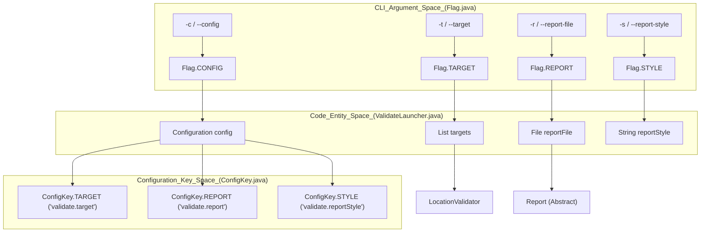
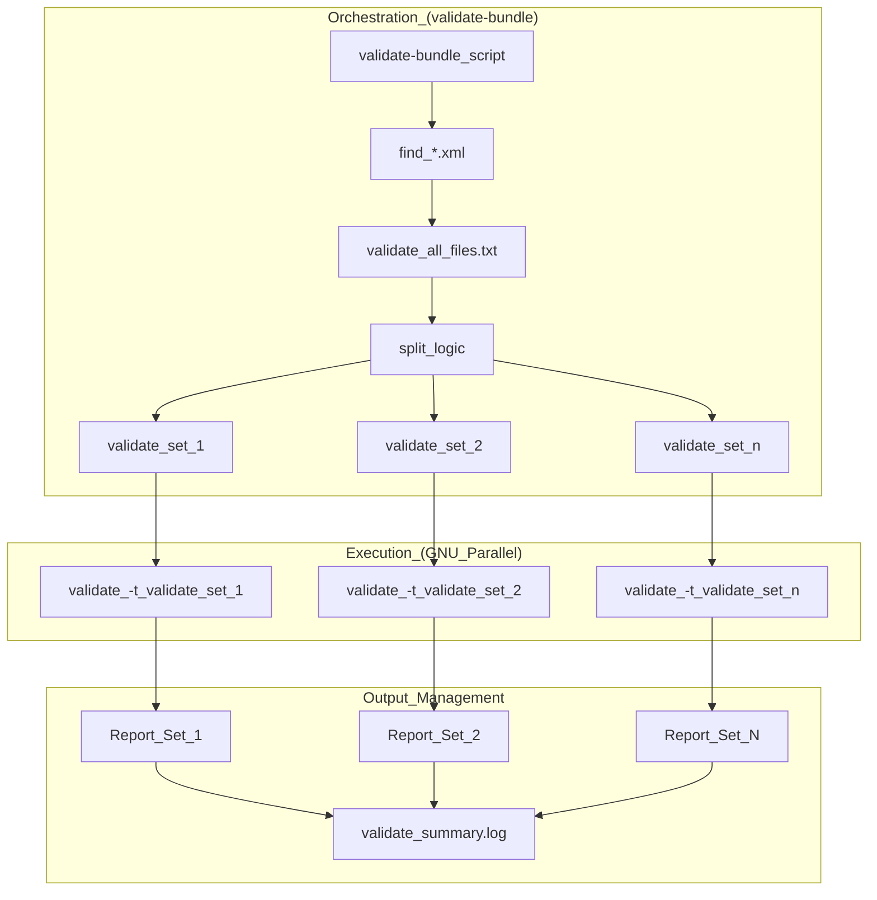

# Page: Command-Line Interface

# Command-Line Interface

Relevant source files

The following files were used as context for generating this wiki page:

- [CHANGELOG.md](CHANGELOG.md)
- [build/pre-build.sh](build/pre-build.sh)
- [pom.xml](pom.xml)
- [src/changes/changes.xml](src/changes/changes.xml)
- [src/main/assembly/tar-assembly.xml](src/main/assembly/tar-assembly.xml)
- [src/main/assembly/zip-assembly.xml](src/main/assembly/zip-assembly.xml)
- [src/main/java/gov/nasa/pds/tools/util/ContextProductReference.java](src/main/java/gov/nasa/pds/tools/util/ContextProductReference.java)
- [src/main/java/gov/nasa/pds/tools/validate/rule/pds4/SchemaValidator.java](src/main/java/gov/nasa/pds/tools/validate/rule/pds4/SchemaValidator.java)
- [src/main/java/gov/nasa/pds/validate/ValidateLauncher.java](src/main/java/gov/nasa/pds/validate/ValidateLauncher.java)
- [src/main/java/gov/nasa/pds/validate/Validator.java](src/main/java/gov/nasa/pds/validate/Validator.java)
- [src/main/java/gov/nasa/pds/validate/ValidatorFactory.java](src/main/java/gov/nasa/pds/validate/ValidatorFactory.java)
- [src/main/java/gov/nasa/pds/validate/commandline/options/ConfigKey.java](src/main/java/gov/nasa/pds/validate/commandline/options/ConfigKey.java)
- [src/main/java/gov/nasa/pds/validate/commandline/options/Flag.java](src/main/java/gov/nasa/pds/validate/commandline/options/Flag.java)
- [src/main/java/gov/nasa/pds/validate/commandline/options/FlagOptions.java](src/main/java/gov/nasa/pds/validate/commandline/options/FlagOptions.java)
- [src/main/java/gov/nasa/pds/validate/commandline/options/InvalidOptionException.java](src/main/java/gov/nasa/pds/validate/commandline/options/InvalidOptionException.java)
- [src/main/java/gov/nasa/pds/validate/commandline/options/ToolsOption.java](src/main/java/gov/nasa/pds/validate/commandline/options/ToolsOption.java)
- [src/main/java/gov/nasa/pds/validate/crawler/WildcardOSFilter.java](src/main/java/gov/nasa/pds/validate/crawler/WildcardOSFilter.java)
- [src/main/java/gov/nasa/pds/validate/util/Namespace.java](src/main/java/gov/nasa/pds/validate/util/Namespace.java)
- [src/main/java/gov/nasa/pds/validate/util/ToolInfo.java](src/main/java/gov/nasa/pds/validate/util/ToolInfo.java)
- [src/main/java/gov/nasa/pds/validate/util/Utility.java](src/main/java/gov/nasa/pds/validate/util/Utility.java)
- [src/main/resources/bin/logging.properties](src/main/resources/bin/logging.properties)
- [src/main/resources/bin/validate](src/main/resources/bin/validate)
- [src/main/resources/bin/validate-bundle](src/main/resources/bin/validate-bundle)
- [src/main/resources/bin/validate-refs](src/main/resources/bin/validate-refs)
- [src/main/resources/bin/validate-refs.bat](src/main/resources/bin/validate-refs.bat)
- [src/main/resources/bin/validate.bat](src/main/resources/bin/validate.bat)
- [src/main/resources/util/registered_context_products.json](src/main/resources/util/registered_context_products.json)
- [src/main/resources/validate.properties](src/main/resources/validate.properties)
- [src/test/resources/github28/new_context.json](src/test/resources/github28/new_context.json)

The Validate Tool provides a robust Command-Line Interface (CLI) for executing PDS4 product and PDS3 volume validation. The interface is managed by the `ValidateLauncher` class, which handles argument parsing, configuration loading, and the initialization of the validation engine.

### CLI Execution Flow

The entry point for the application is `gov.nasa.pds.validate.ValidateLauncher` [src/main/java/gov/nasa/pds/validate/ValidateLauncher.java:134-135](). It uses `org.apache.commons.cli` to parse command-line arguments and `org.apache.commons.configuration` to handle properties-based configuration [src/main/java/gov/nasa/pds/validate/ValidateLauncher.java:68-78]().

**Data Flow: Argument Parsing to Engine Initialization**
1. `ValidateLauncher.main()` receives raw strings.
2. `CommandLineParser` (specifically `DefaultParser`) parses strings against `FlagOptions` [src/main/java/gov/nasa/pds/validate/ValidateLauncher.java:69-73]().
3. `ValidateLauncher.query()` extracts values from the `CommandLine` object [src/main/java/gov/nasa/pds/validate/ValidateLauncher.java:128-133]().
4. If a config file is provided via `-c` (`Flag.CONFIG`), it is loaded into an `AbstractConfiguration` [src/main/java/gov/nasa/pds/validate/ValidateLauncher.java:75-78]().
5. The launcher populates internal lists for targets, schemas, and schematrons, and instantiates the appropriate `Report` implementation (Full, JSON, or XML) [src/main/java/gov/nasa/pds/validate/ValidateLauncher.java:138-177]().

#### CLI Entity Mapping
The following diagram bridges the natural language command-line concepts to the specific Java entities and configuration keys used in the codebase.

**Natural Language to Code Entity Space**

Sources: [src/main/java/gov/nasa/pds/validate/ValidateLauncher.java:134-180](), [src/main/java/gov/nasa/pds/validate/commandline/options/Flag.java:39-150](), [src/main/java/gov/nasa/pds/validate/commandline/options/ConfigKey.java:44-169]()

---

### Command-Line Flags Reference

Flags are defined in the `Flag` enum and assembled into an `Options` object by `FlagOptions`.

| Flag (Short/Long) | Data Type | Description |
| :--- | :--- | :--- |
| `-t, --target` | `String` | The target file or directory to validate. [src/main/java/gov/nasa/pds/validate/commandline/options/Flag.java:147-148]() |
| `-c, --config` | `File` | Path to a configuration file to set tool behavior. [src/main/java/gov/nasa/pds/validate/commandline/options/Flag.java:55-56]() |
| `-r, --report-file` | `File` | Destination for the report. Defaults to standard out. [src/main/java/gov/nasa/pds/validate/commandline/options/Flag.java:126-127]() |
| `-s, --report-style` | `String` | Output format: `full`, `json`, or `xml`. [src/main/java/gov/nasa/pds/validate/commandline/options/Flag.java:139-142]() |
| `-v, --verbose` | `int` | Severity level to include in report (1-3). [src/main/java/gov/nasa/pds/validate/commandline/options/Flag.java:154-155]() |
| `-L, --local` | `boolean` | Disables recursive traversal of subdirectories. [src/main/java/gov/nasa/pds/validate/commandline/options/Flag.java:90-91]() |
| `-D, --skip-content-validation` | `boolean` | Skips checking data content (bytes) against labels. [src/main/java/gov/nasa/pds/validate/commandline/options/Flag.java:116-117]() |
| `-S, --schematron` | `String` | Specify schematron files for validation. [src/main/java/gov/nasa/pds/validate/commandline/options/Flag.java:132-133]() |
| `-x, --xml-schema` | `String` | Specify XML Schema files for validation. [src/main/java/gov/nasa/pds/validate/commandline/options/Flag.java:166-167]() |
| `-M, --checksum-manifest`| `File` | Specify a manifest file for MD5 checksum verification. [src/main/java/gov/nasa/pds/validate/commandline/options/Flag.java:96-98]() |
| `-E, --max-errors` | `short` | Maximum errors before exiting (Default: 100,000). [src/main/java/gov/nasa/pds/validate/commandline/options/Flag.java:61-63]() |
| `--everyN` | `int` | Process every Nth record during content validation. [src/main/java/gov/nasa/pds/validate/commandline/options/Flag.java:71-71]() |
| `--progressN` | `int` | Show progress statement every N labels. [src/main/java/gov/nasa/pds/validate/commandline/options/Flag.java:72-72]() |
| `--pdf-error-dir` | `String` | Directory for detailed PDF non-compliance reports. [src/main/java/gov/nasa/pds/validate/commandline/options/Flag.java:111-114]() |
| `--strict-field-checks` | `boolean` | Enables strict field format checks (e.g., against Table_Character). [src/main/java/gov/nasa/pds/validate/commandline/options/ConfigKey.java:113]() |

Sources: [src/main/java/gov/nasa/pds/validate/commandline/options/Flag.java:40-167](), [src/main/java/gov/nasa/pds/validate/commandline/options/FlagOptions.java:48-85](), [src/main/java/gov/nasa/pds/validate/commandline/options/ConfigKey.java:113]()

---

### Configuration Keys

The tool supports a configuration file (standard Java `.properties` format). These keys correspond directly to the `ConfigKey` constants.

| Property Key | CLI Equivalent | Purpose |
| :--- | :--- | :--- |
| `validate.target` | `-t` | List of target URLs or file paths. [src/main/java/gov/nasa/pds/validate/commandline/options/ConfigKey.java:52]() |
| `validate.report` | `-r` | Destination file for the report. [src/main/java/gov/nasa/pds/validate/commandline/options/ConfigKey.java:49]() |
| `validate.reportStyle`| `-s` | Sets the `Report` class implementation. [src/main/java/gov/nasa/pds/validate/commandline/options/ConfigKey.java:81]() |
| `validate.rule` | `-R` | Specifies the validation rule (e.g., `pds4.bundle`). [src/main/java/gov/nasa/pds/validate/commandline/options/ConfigKey.java:92]() |
| `validate.everyN` | `--everyN` | Process every Nth record during content validation. [src/main/java/gov/nasa/pds/validate/commandline/options/ConfigKey.java:123]() |
| `validate.maxErrors` | `-E` | Sets the threshold for graceful termination. [src/main/java/gov/nasa/pds/validate/commandline/options/ConfigKey.java:118]() |
| `validate.skipContentValidation`| `-D` | Disables data content validation. [src/main/java/gov/nasa/pds/validate/commandline/options/ConfigKey.java:102]() |
| `validate.targetManifest` | N/A | File containing a list of files/directories to validate. [src/main/java/gov/nasa/pds/validate/commandline/options/ConfigKey.java:166]() |
| `validate.updateContextProducts` | N/A | Downloads latest registered context products JSON. [src/main/java/gov/nasa/pds/validate/commandline/options/ConfigKey.java:154]() |
| `validate.allowUnlabeledFiles` | N/A | Allows files not referenced by a label in bundles/collections. [src/main/java/gov/nasa/pds/validate/commandline/options/ConfigKey.java:148]() |

Sources: [src/main/java/gov/nasa/pds/validate/commandline/options/ConfigKey.java:44-169]()

---

### Parallel Execution: validate-bundle

The `validate-bundle` script is a bash-based wrapper designed for high-performance archival validation by parallelizing tasks across CPU cores [src/main/resources/bin/validate-bundle:14-19]().

#### Implementation and Logic
The script performs target discovery using `find` and then splits the file list into groups based on the number of available cores. It relies on **GNU Parallel** to orchestrate the execution of multiple `validate` instances [src/main/resources/bin/validate-bundle:31-33]().

**Execution Lifecycle in validate-bundle**
1. **Target Discovery**: Runs `find ${PRODUCT_DIR} -iname "*.xml"` to build `validate_all_files.txt` [src/main/resources/bin/validate-bundle:167]().
2. **Core Calculation**: Determines `NUM_CORES` via `getconf _NPROCESSORS_ONLN` [src/main/resources/bin/validate-bundle:154]().
3. **Chunking**: Calculates `FILES_PER_VALIDATE` and prepares groups [src/main/resources/bin/validate-bundle:181-183]().
4. **Parallel Launch**: Invokes `parallel` to run the `validate` binary on each set.
5. **Aggregation**: Generates a summary report at the specified path [src/main/resources/bin/validate-bundle:44-48]().

**validate-bundle Process Architecture**

Sources: [src/main/resources/bin/validate-bundle:12-53](), [src/main/resources/bin/validate-bundle:154-183]()

#### Requirements and Constraints
* **Dependencies**: Requires `parallel` (GNU Parallel) and the `validate` binary to be in the system `PATH` [src/main/resources/bin/validate-bundle:126-151]().
* **Scope**: Intended for archival validation. It checks syntactic/semantic validity, content, and referential integrity (`pds4.bundle`) [src/main/resources/bin/validate-bundle:21-28]().
* **Reporting**: All individual run reports are stored in a unique directory (default: `validate_YYYYMMDD_HHMMSS`) [src/main/resources/bin/validate-bundle:105-113]().

Sources: [src/main/resources/bin/validate-bundle:99-113](), [src/main/resources/bin/validate-bundle:126-151]()
