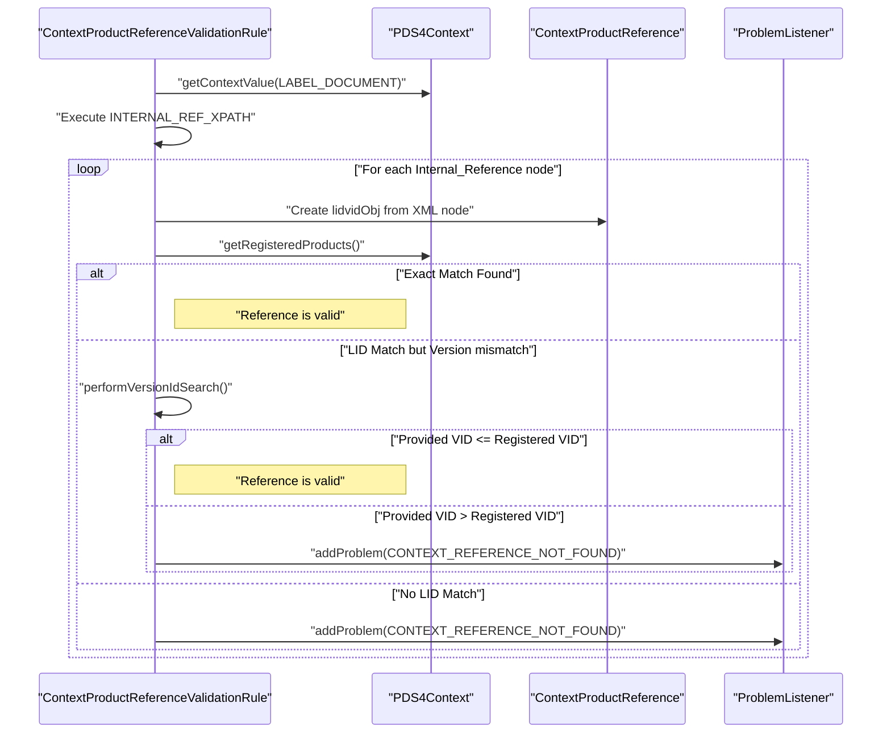

# Page: Context Product Reference Validation

# Context Product Reference Validation

<details>
<summary>Relevant source files</summary>

The following files were used as context for generating this wiki page:

- [build/pre-build.sh](build/pre-build.sh)
- [src/main/java/gov/nasa/pds/tools/util/ContextProductReference.java](src/main/java/gov/nasa/pds/tools/util/ContextProductReference.java)
- [src/main/java/gov/nasa/pds/tools/util/LabelUtil.java](src/main/java/gov/nasa/pds/tools/util/LabelUtil.java)
- [src/main/java/gov/nasa/pds/tools/util/ReferentialIntegrityUtil.java](src/main/java/gov/nasa/pds/tools/util/ReferentialIntegrityUtil.java)
- [src/main/java/gov/nasa/pds/tools/validate/rule/pds4/ContextProductReferenceValidationRule.java](src/main/java/gov/nasa/pds/tools/validate/rule/pds4/ContextProductReferenceValidationRule.java)
- [src/main/java/gov/nasa/pds/validate/commandline/options/InvalidOptionException.java](src/main/java/gov/nasa/pds/validate/commandline/options/InvalidOptionException.java)
- [src/main/java/gov/nasa/pds/validate/commandline/options/ToolsOption.java](src/main/java/gov/nasa/pds/validate/commandline/options/ToolsOption.java)
- [src/main/java/gov/nasa/pds/validate/crawler/WildcardOSFilter.java](src/main/java/gov/nasa/pds/validate/crawler/WildcardOSFilter.java)
- [src/main/java/gov/nasa/pds/validate/util/Namespace.java](src/main/java/gov/nasa/pds/validate/util/Namespace.java)
- [src/main/java/gov/nasa/pds/validate/util/ToolInfo.java](src/main/java/gov/nasa/pds/validate/util/ToolInfo.java)
- [src/main/resources/util/registered_context_products.json](src/main/resources/util/registered_context_products.json)
- [src/main/resources/validate.properties](src/main/resources/validate.properties)
- [src/test/java/gov/nasa/pds/validate/ValidationIntegrationTests.java](src/test/java/gov/nasa/pds/validate/ValidationIntegrationTests.java)
- [src/test/resources/features/4.1.x.feature](src/test/resources/features/4.1.x.feature)
- [src/test/resources/github1130/hyb2_ldr_l0_aocsm_range_ts_20151219_v01.csv](src/test/resources/github1130/hyb2_ldr_l0_aocsm_range_ts_20151219_v01.csv)
- [src/test/resources/github1130/hyb2_ldr_l0_aocsm_range_ts_20151219_v01.xml](src/test/resources/github1130/hyb2_ldr_l0_aocsm_range_ts_20151219_v01.xml)
- [src/test/resources/github1481/bundle_test.xml](src/test/resources/github1481/bundle_test.xml)
- [src/test/resources/github1481/data/collection_data.csv](src/test/resources/github1481/data/collection_data.csv)
- [src/test/resources/github1481/data/collection_data.xml](src/test/resources/github1481/data/collection_data.xml)
- [src/test/resources/github1481/data/product_a.xml](src/test/resources/github1481/data/product_a.xml)
- [src/test/resources/github1548/.gitkeep](src/test/resources/github1548/.gitkeep)
- [src/test/resources/github28/new_context.json](src/test/resources/github28/new_context.json)
- [src/test/resources/github631/hyb2_tir_20180629_075501_l1.fit](src/test/resources/github631/hyb2_tir_20180629_075501_l1.fit)
- [src/test/resources/github631/hyb2_tir_20180629_075501_l1.xml](src/test/resources/github631/hyb2_tir_20180629_075501_l1.xml)

</details>


The **Context Product Reference Validation** subsystem ensures that all `Internal_Reference` elements within a PDS4 label that point to context products (e.g., instruments, missions, targets) refer to valid, registered products. This validation is performed against a local registry of known products maintained by the PDS Engineering Node.

## Overview

The validation logic is encapsulated in the `ContextProductReferenceValidationRule`. This rule extracts LID/LIDVID references from labels and compares them against a JSON-based registry of authorized context products. It supports both exact LIDVID matching and version-based logic where a reference is considered valid if its version is less than or equal to the registered version.

### Key Components

| Component | Role | File Path |
| :--- | :--- | :--- |
| `ContextProductReferenceValidationRule` | The primary rule class that executes the validation logic during the PDS4 validation pipeline. | [src/main/java/gov/nasa/pds/tools/validate/rule/pds4/ContextProductReferenceValidationRule.java:64-66]() |
| `ContextProductReference` | The data model representing a context product, including its LID, VID, names, and types. | [src/main/java/gov/nasa/pds/tools/util/ContextProductReference.java:23-38]() |
| `registered_context_products.json` | The default registry file containing thousands of authorized PDS context products. | [src/main/resources/util/registered_context_products.json:1-10]() |
| `ReferentialIntegrityUtil` | Provides utility methods for parsing references from `Context_Area` tags across multiple labels. | [src/main/java/gov/nasa/pds/tools/util/ReferentialIntegrityUtil.java:48-57]() |

Sources: [src/main/java/gov/nasa/pds/tools/validate/rule/pds4/ContextProductReferenceValidationRule.java:64-68](), [src/main/java/gov/nasa/pds/tools/util/ContextProductReference.java:23-38](), [src/main/resources/util/registered_context_products.json:1-10](), [src/main/java/gov/nasa/pds/tools/util/ReferentialIntegrityUtil.java:48-57]()

---

## Data Flow and Implementation

The validation process follows a specific sequence: extraction of references using complex XPath expressions, lookup in the registry, and optional version comparison.

### Validation Sequence Diagram

The following diagram illustrates the interaction between the validation rule and the data models.

"Context Product Validation Sequence"

Sources: [src/main/java/gov/nasa/pds/tools/validate/rule/pds4/ContextProductReferenceValidationRule.java:117-142](), [src/main/java/gov/nasa/pds/tools/validate/rule/pds4/ContextProductReferenceValidationRule.java:79-104]()

### LID/LIDVID Matching Logic

The tool implements a flexible matching strategy in `performVersionIdSearch`:
1. **Exact Match**: If the LIDVID in the label matches the registry exactly, it passes.
2. **Version Comparison**: If only the LID matches, the tool parses the Version ID (VID). If the version in the label is less than or equal to the version in the registry, it is accepted. This accounts for the registry typically holding the latest version of a context product. [src/main/java/gov/nasa/pds/tools/validate/rule/pds4/ContextProductReferenceValidationRule.java:117-142]()
3. **Missing Version**: If the label provides a LID without a VID, it is accepted if the LID exists in the registry. [src/main/java/gov/nasa/pds/tools/util/ContextProductReference.java:118-121]()

The `ContextProductReference.equals()` method specifically handles case-insensitive LID comparison and version matching. [src/main/java/gov/nasa/pds/tools/util/ContextProductReference.java:107-124]()

Sources: [src/main/java/gov/nasa/pds/tools/validate/rule/pds4/ContextProductReferenceValidationRule.java:117-142](), [src/main/java/gov/nasa/pds/tools/util/ContextProductReference.java:107-124]()

---

## The Registry (`registered_context_products.json`)

The registry is a static JSON file bundled with the application. It contains an array of objects under the `Product_Context` key.

### Registry Data Model

"Registry Data Mapping"
```mermaid
classDiagram
    class "registered_context_products.json" {
        +List Product_Context
    }
    class "ContextProductEntry" {
        +List name
        +List type
        +String lidvid
    }
    class "ContextProductReference" {
        +String lid
        +String version
        +List types
        +List names
        +equals(Object o)
        +hashCode()
    }
    "registered_context_products.json" "1" --* "*" "ContextProductEntry" : "contains"
    "ContextProductEntry" ..> "ContextProductReference" : "maps to"
```

Example Entry from the registry:
```json
{
  "name": ["Vega", "HD 172167"],
  "type": ["Star"],
  "lidvid": "urn:esa:psa:context:target:star.hd_172167::1.2"
}
```
Sources: [src/main/resources/util/registered_context_products.json:1-71](), [src/main/java/gov/nasa/pds/tools/util/ContextProductReference.java:23-38]()

---

## Workflow and Configuration

### Automated Update Workflow
The registry is updated via automated queries to the PDS Engineering Node API. The configuration for this update is stored in `validate.properties`, which defines the search URL and the specific query used to filter context products. A pre-build script `build/pre-build.sh` is used to trigger version upgrades and registry synchronization.

| Property | Value | File Path |
| :--- | :--- | :--- |
| `validate.search_url` | `https://pds.nasa.gov/api` | [src/main/resources/validate.properties:37]() |
| `validate.endpoint` | `search/1/products` | [src/main/resources/validate.properties:39]() |
| `validate.query` | `(product_class eq "Product_Context" and ...)` | [src/main/resources/validate.properties:40]() |

Sources: [src/main/resources/validate.properties:37-41](), [build/pre-build.sh:1-25]()

### User-Defined Context Products
Users can provide additional context products at runtime using the `--add-context-products` CLI flag. This is useful for validating new products before they are officially registered. The tool merges these custom entries with the internal registry during initialization.

Example of a custom context file used in integration testing:
```json
{
	"Product_Context": [
		{
			"name": [ "FOO" ],
			"type": [ "Spacecraft" ],
			"lidvid": "urn:nasa:pds:context:instrument_host:spacecraft.FOO::1.0"
		}
	]
}
```
Sources: [src/test/resources/github28/new_context.json:1-9](), [src/test/java/gov/nasa/pds/validate/ValidationIntegrationTests.java:157-165]()

### Error Handling
If a reference is not found or has an invalid version, the rule reports a `CONTEXT_REFERENCE_NOT_FOUND` problem type. Validation can be skipped using the `--skip-context-validation` flag, which sets the `skipContextValidation` flag in the `RuleContext`.

| Problem Type | Level | Description |
| :--- | :--- | :--- |
| `CONTEXT_REFERENCE_NOT_FOUND` | ERROR | The referenced LID or LIDVID does not exist in the context registry. |
| `CONTEXT_REF_MISMATCH` | WARNING | Reported when a context reference is found but has discrepancies (e.g., in `github1458` tests). |

Sources: [src/main/java/gov/nasa/pds/tools/validate/rule/pds4/ContextProductReferenceValidationRule.java:51-52](), [src/test/java/gov/nasa/pds/validate/ValidationIntegrationTests.java:153-154](), [src/test/resources/features/4.1.x.feature:10-10]()
