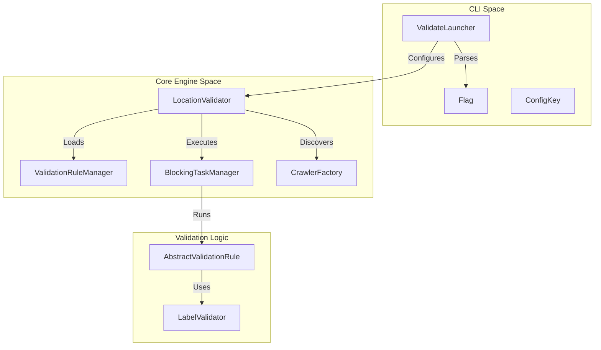
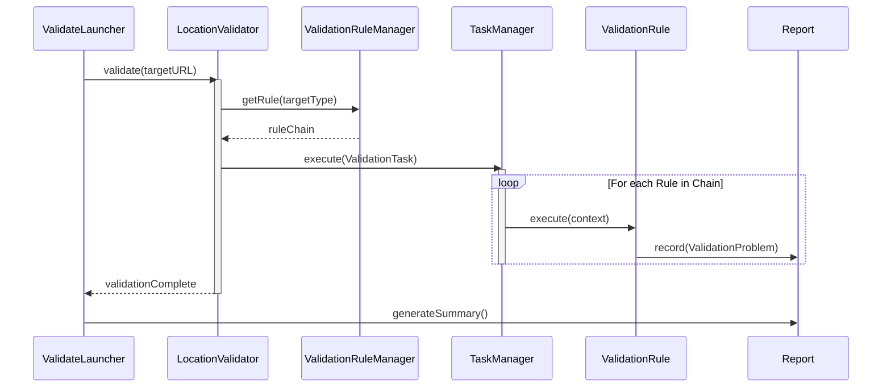

# Page: Core Architecture

# Core Architecture

Relevant source files

The following files were used as context for generating this wiki page:

- [.github/CODEOWNERS](.github/CODEOWNERS)
- [.gitignore](.gitignore)
- [CHANGELOG.md](CHANGELOG.md)
- [LICENSE.md](LICENSE.md)
- [NOTICE.txt](NOTICE.txt)
- [README.md](README.md)
- [SECURITY.md](SECURITY.md)
- [pom.xml](pom.xml)
- [src/changes/changes.xml](src/changes/changes.xml)
- [src/main/java/gov/nasa/pds/tools/label/LabelValidator.java](src/main/java/gov/nasa/pds/tools/label/LabelValidator.java)
- [src/main/java/gov/nasa/pds/tools/label/LocationValidator.java](src/main/java/gov/nasa/pds/tools/label/LocationValidator.java)
- [src/main/java/gov/nasa/pds/tools/validate/TargetExaminer.java](src/main/java/gov/nasa/pds/tools/validate/TargetExaminer.java)
- [src/main/java/gov/nasa/pds/tools/validate/content/table/TableContentProblem.java](src/main/java/gov/nasa/pds/tools/validate/content/table/TableContentProblem.java)
- [src/main/java/gov/nasa/pds/tools/validate/rule/RuleContext.java](src/main/java/gov/nasa/pds/tools/validate/rule/RuleContext.java)
- [src/main/java/gov/nasa/pds/tools/validate/rule/pds4/LabelInFolderRule.java](src/main/java/gov/nasa/pds/tools/validate/rule/pds4/LabelInFolderRule.java)
- [src/main/java/gov/nasa/pds/tools/validate/rule/pds4/LabelValidationRule.java](src/main/java/gov/nasa/pds/tools/validate/rule/pds4/LabelValidationRule.java)
- [src/main/java/gov/nasa/pds/tools/validate/rule/pds4/SchemaValidator.java](src/main/java/gov/nasa/pds/tools/validate/rule/pds4/SchemaValidator.java)
- [src/main/java/gov/nasa/pds/tools/validate/rule/pds4/TableFieldDefinitionRule.java](src/main/java/gov/nasa/pds/tools/validate/rule/pds4/TableFieldDefinitionRule.java)
- [src/main/java/gov/nasa/pds/validate/ValidateLauncher.java](src/main/java/gov/nasa/pds/validate/ValidateLauncher.java)
- [src/main/java/gov/nasa/pds/validate/Validator.java](src/main/java/gov/nasa/pds/validate/Validator.java)
- [src/main/java/gov/nasa/pds/validate/ValidatorFactory.java](src/main/java/gov/nasa/pds/validate/ValidatorFactory.java)
- [src/main/java/gov/nasa/pds/validate/commandline/options/ConfigKey.java](src/main/java/gov/nasa/pds/validate/commandline/options/ConfigKey.java)
- [src/main/java/gov/nasa/pds/validate/commandline/options/Flag.java](src/main/java/gov/nasa/pds/validate/commandline/options/Flag.java)
- [src/main/java/gov/nasa/pds/validate/commandline/options/FlagOptions.java](src/main/java/gov/nasa/pds/validate/commandline/options/FlagOptions.java)
- [src/main/java/gov/nasa/pds/validate/util/Utility.java](src/main/java/gov/nasa/pds/validate/util/Utility.java)
- [src/main/resources/bin/logging.properties](src/main/resources/bin/logging.properties)
- [src/main/resources/bin/validate-bundle](src/main/resources/bin/validate-bundle)
- [src/main/resources/validation-commands.xml](src/main/resources/validation-commands.xml)
- [src/site/site.xml](src/site/site.xml)

The PDS Validate Tool is designed as a modular, rule-based engine capable of validating PDS4 product labels, data content, and PDS3 volumes. The architecture decouples target discovery from the validation logic itself, allowing the tool to scale from single-label checks to massive bundle-level referential integrity scans.

## High-Level System Overview

The system follows a pipeline where user input (CLI or configuration files) is translated into a set of targets and a validation rule set. The `ValidateLauncher` acts as the entry point, coordinating the initialization of the reporting subsystem and the validation engine.

### System Context Diagram
The following diagram illustrates how the primary code entities bridge the gap between user commands and the internal validation logic.

"Validate Tool Architecture"

Sources: [src/main/java/gov/nasa/pds/validate/ValidateLauncher.java:134-178](), [src/main/java/gov/nasa/pds/tools/label/LocationValidator.java:64-76](), [src/main/java/gov/nasa/pds/validate/commandline/options/Flag.java:39-145](), [src/main/java/gov/nasa/pds/tools/label/LocationValidator.java:112-142]()

## Major Subsystems

The tool's architecture is divided into four primary functional areas:

### 1. Rule Engine and Pipeline
Validation is driven by a "Chain of Responsibility" pattern. The `LocationValidator` loads a set of commands from `validation-commands.xml` into the `ValidationRuleManager`. Based on the detected product type (e.g., Bundle, Collection, or Product), a specific sequence of rules is executed.

*   **Key Class:** `ValidationRuleManager` [src/main/java/gov/nasa/pds/tools/validate/rule/ValidationRuleManager.java:54-54]()
*   **Key Configuration:** `validation-commands.xml` [src/main/resources/validation-commands.xml]()
*   **For details, see [Rule Engine and Validation Pipeline](#2.1).**

### 2. Label Validation (XML/Schema/Schematron)
The `LabelValidator` handles the technical specifics of XML validation. It utilizes SAX parsing and JAXP to perform XSD 1.1 schema validation and applies Schematron rules via XSLT transformations. It includes caching mechanisms for Schematron transformers to improve performance across large datasets.

*   **Key Class:** `LabelValidator` [src/main/java/gov/nasa/pds/tools/label/LabelValidator.java:94-121]()
*   **Key Improvement:** Schematron transformer caching [CHANGELOG.md:9-9]()
*   **For details, see [Label Validation (XML, Schema, Schematron)](#2.2).**

### 3. Target Discovery and Crawling
Before validation begins, the tool must identify all relevant files. The `CrawlerFactory` produces either a `FileCrawler` (for local filesystems) or a `URLCrawler` (for remote targets). The `TargetExaminer` is then used to inspect the root of these targets to determine if they are PDS4 Bundles, Collections, or individual labels.

*   **Key Class:** `CrawlerFactory` [src/main/java/gov/nasa/pds/tools/validate/crawler/CrawlerFactory.java:51-51]()
*   **Key Utility:** `TargetExaminer` [src/main/java/gov/nasa/pds/tools/validate/TargetExaminer.java:40-49]()
*   **For details, see [Target Discovery and Crawling](#2.3).**

### 4. Problem Reporting
Errors, warnings, and informational messages are captured through a unified `ProblemListener` interface. The `ProblemHandler` aggregates these into `ValidationProblem` objects, which are then formatted by the `Report` subsystem into Full (text), JSON, or XML outputs.

*   **Key Class:** `ValidationProblem` [src/main/java/gov/nasa/pds/tools/validate/ValidationProblem.java:111-111]()
*   **Key Class:** `Report` [src/main/java/gov/nasa/pds/validate/report/Report.java:122-122]()
*   **For details, see [Problem Reporting System](#2.4).**

## Validation Lifecycle

The following diagram traces the lifecycle of a validation request from the `ValidateLauncher` through the `LocationValidator` to the final report.

"Validation Lifecycle"

Sources: [src/main/java/gov/nasa/pds/tools/label/LocationValidator.java:149-185](), [src/main/java/gov/nasa/pds/tools/validate/task/ValidationTask.java:57-57](), [src/main/java/gov/nasa/pds/validate/ValidateLauncher.java:175-177]()

## Core Abstractions

| Abstraction | Code Entity | Responsibility |
| :--- | :--- | :--- |
| **Target** | `gov.nasa.pds.tools.validate.Target` | Represents a file or URL being validated [src/main/java/gov/nasa/pds/tools/validate/Target.java:109-109](). |
| **Rule** | `gov.nasa.pds.tools.validate.rule.ValidationRule` | A discrete unit of validation logic (e.g., `LabelValidationRule`) [src/main/java/gov/nasa/pds/tools/validate/rule/ValidationRule.java:53-53](). |
| **Context** | `gov.nasa.pds.tools.validate.rule.RuleContext` | Holds state shared across a rule chain, such as user-defined schemas [src/main/java/gov/nasa/pds/tools/validate/rule/RuleContext.java:52-172](). |
| **Problem** | `gov.nasa.pds.tools.validate.ValidationProblem` | Encapsulates an error/warning, including its source location and `ProblemType` [src/main/java/gov/nasa/pds/tools/validate/ValidationProblem.java:111-111](). |
| **Registrar** | `gov.nasa.pds.tools.validate.TargetRegistrar` | Tracks discovered targets and their product types during a run [src/main/java/gov/nasa/pds/tools/validate/TargetRegistrar.java:46-46](). |

Sources: [src/main/java/gov/nasa/pds/tools/validate/Target.java:109-109](), [src/main/java/gov/nasa/pds/tools/validate/rule/RuleContext.java:52-172](), [src/main/java/gov/nasa/pds/tools/validate/ValidationProblem.java:111-111](), [src/main/java/gov/nasa/pds/tools/validate/rule/ValidationRule.java:53-53](), [src/main/java/gov/nasa/pds/tools/validate/TargetRegistrar.java:46-46]()
