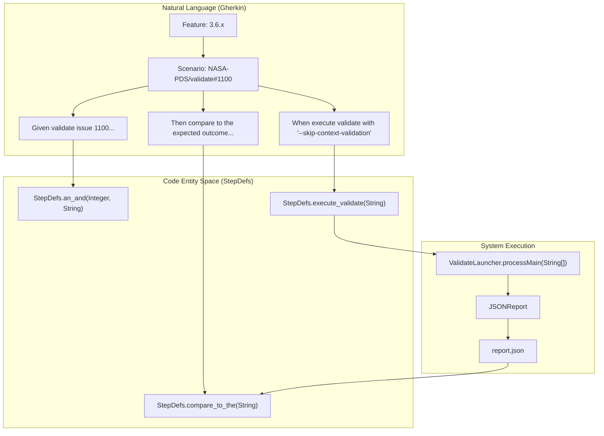
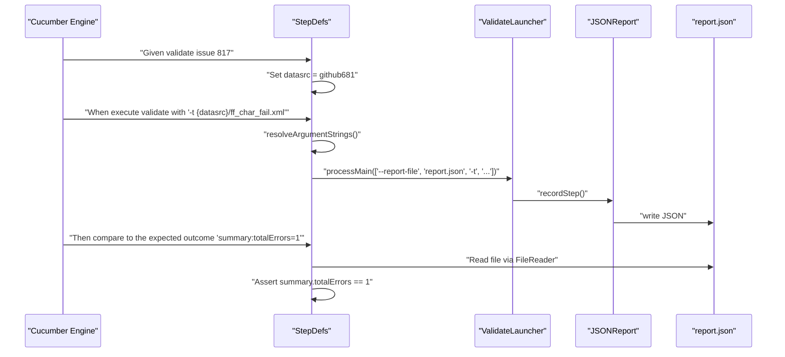

# Page: Cucumber BDD Test Framework

# Cucumber BDD Test Framework

Relevant source files

The following files were used as context for generating this wiki page:

- [src/main/java/gov/nasa/pds/tools/util/DocumentUtil.java](src/main/java/gov/nasa/pds/tools/util/DocumentUtil.java)
- [src/main/java/gov/nasa/pds/tools/util/LabelUtil.java](src/main/java/gov/nasa/pds/tools/util/LabelUtil.java)
- [src/main/java/gov/nasa/pds/tools/util/PDFUtil.java](src/main/java/gov/nasa/pds/tools/util/PDFUtil.java)
- [src/main/java/gov/nasa/pds/tools/util/ReferentialIntegrityUtil.java](src/main/java/gov/nasa/pds/tools/util/ReferentialIntegrityUtil.java)
- [src/main/java/gov/nasa/pds/web/ui/utils/DataSetValidator.java](src/main/java/gov/nasa/pds/web/ui/utils/DataSetValidator.java)
- [src/test/java/cucumber/CucumberTest.java](src/test/java/cucumber/CucumberTest.java)
- [src/test/java/cucumber/SingleScenerio.java](src/test/java/cucumber/SingleScenerio.java)
- [src/test/java/cucumber/StepDefs.java](src/test/java/cucumber/StepDefs.java)
- [src/test/java/gov/nasa/pds/validate/RunFeatureScenerioAsValidateFromCLI.java](src/test/java/gov/nasa/pds/validate/RunFeatureScenerioAsValidateFromCLI.java)
- [src/test/resources/features/3.6.x.feature](src/test/resources/features/3.6.x.feature)
- [src/test/resources/features/3.7.x.feature](src/test/resources/features/3.7.x.feature)
- [src/test/resources/features/4.0.x.feature](src/test/resources/features/4.0.x.feature)
- [src/test/resources/features/4.1.x.feature](src/test/resources/features/4.1.x.feature)
- [src/test/resources/features/pre.3.6.x.feature](src/test/resources/features/pre.3.6.x.feature)
- [src/test/resources/github1358/catalog.xml](src/test/resources/github1358/catalog.xml)
- [src/test/resources/github1481/bundle_test.xml](src/test/resources/github1481/bundle_test.xml)
- [src/test/resources/github1481/data/collection_data.csv](src/test/resources/github1481/data/collection_data.csv)
- [src/test/resources/github1481/data/collection_data.xml](src/test/resources/github1481/data/collection_data.xml)
- [src/test/resources/github1481/data/product_a.xml](src/test/resources/github1481/data/product_a.xml)
- [src/test/resources/github1548/.gitkeep](src/test/resources/github1548/.gitkeep)
- [src/test/resources/github50/target-manifest.xml](src/test/resources/github50/target-manifest.xml)
- [src/test/resources/github992/ff_char.xml](src/test/resources/github992/ff_char.xml)
- [src/test/resources/github992/ff_del.xml](src/test/resources/github992/ff_del.xml)
- [src/test/resources/github992/ff_test.csv](src/test/resources/github992/ff_test.csv)
- [src/test/resources/jaxa/PDS4_DISP_1J00_1510.sch](src/test/resources/jaxa/PDS4_DISP_1J00_1510.sch)
- [src/test/resources/jaxa/PDS4_DISP_1J00_1510.xsd](src/test/resources/jaxa/PDS4_DISP_1J00_1510.xsd)
- [src/test/resources/jaxa/PDS4_GEOM_1J00_1960.sch](src/test/resources/jaxa/PDS4_GEOM_1J00_1960.sch)
- [src/test/resources/jaxa/PDS4_GEOM_1J00_1960.xsd](src/test/resources/jaxa/PDS4_GEOM_1J00_1960.xsd)
- [src/test/resources/jaxa/PDS4_IMG_1J00_1870.sch](src/test/resources/jaxa/PDS4_IMG_1J00_1870.sch)
- [src/test/resources/jaxa/PDS4_IMG_1J00_1870.xsd](src/test/resources/jaxa/PDS4_IMG_1J00_1870.xsd)
- [src/test/resources/junit-platform.properties](src/test/resources/junit-platform.properties)

The `validate` tool uses a Cucumber-based Behavior-Driven Development (BDD) framework to execute integration tests. These tests bridge natural language requirements (Gherkin) with the technical execution of the `ValidateLauncher`. This framework allows developers to verify complex validation scenarios—such as specific GitHub issues—by defining inputs, command-line arguments, and expected JSON report outcomes in a human-readable format.

## Test Execution Lifecycle

The testing infrastructure is built on top of JUnit 5, using the Cucumber engine to discover and run `.feature` files. The primary entry point for full suite execution is `CucumberTest` [src/test/java/cucumber/CucumberTest.java:1-11](). Configuration for the test engine, including feature locations and reporting plugins, is defined in `junit-platform.properties` [src/test/resources/junit-platform.properties:1-4]().

### Natural Language to Code Mapping

The framework maps Gherkin steps to Java methods using the `StepDefs` class.

| Gherkin Step Pattern | Java Implementation | Role |
| :--- | :--- | :--- |
| `Given validate issue {int}...` | `StepDefs.an_and(...)` | Initializes source/sink paths and the `ValidateLauncher` [src/test/java/cucumber/StepDefs.java:109-119](). |
| `When execute validate with {string}` | `StepDefs.execute_validate(...)` | Resolves arguments and invokes the tool's main entry point [src/test/java/cucumber/StepDefs.java:121-134](). |
| `Then compare to the expected outcome {string}.` | `StepDefs.compare_to_the(...)` | Parses the generated `report.json` and asserts values [src/test/java/cucumber/StepDefs.java:141-188](). |

**Natural Language Space to Code Entity Space**

Sources: [src/test/resources/features/3.6.x.feature:1-11](), [src/test/java/cucumber/StepDefs.java:109-142](), [src/test/java/cucumber/CucumberTest.java:6-9]()

## Core Components

### Step Definitions (StepDefs)
The `StepDefs` class manages the state of a single test scenario execution. It handles:
*   **Path Resolution**: Converts placeholders like `{datasrc}` and `{datasink}` into absolute paths based on `TestConstants.RESOURCES_DIR` (mapped to `resources.home`) and the internal `datasrc` path [src/test/java/cucumber/StepDefs.java:36-59]().
*   **Argument Resolution**: The `resolveArgumentStrings` method splits the argument string and injects mandatory reporting flags (`--report-file` and `--report-style json`) to ensure the test can inspect the results [src/test/java/cucumber/StepDefs.java:60-67](). It also handles specialized flag logic for `--catalog` and `--target-manifest` [src/test/java/cucumber/StepDefs.java:90-103]().
*   **Lifecycle Management**: Calls `launcher.flushValidators()` and `CrossLabelFileAreaReferenceChecker.reset()` during `tearDown` to ensure test isolation [src/test/java/cucumber/StepDefs.java:46-49]().

### Report Assertion Logic
Instead of comparing raw text files, the framework performs deep inspection of the `report.json` generated by the `JSONReport` class.
1.  The `compare_to_the` method loads the JSON file using `Gson` [src/test/java/cucumber/StepDefs.java:155-158]().
2.  It iterates through the `expectation` string (e.g., `summary:totalErrors=1`).
3.  It traverses the JSON tree (e.g., `summary` -> `messageTypes`) to find the specific error count or problem type [src/test/java/cucumber/StepDefs.java:170-185]().
4.  It asserts that the reported count matches the expected count [src/test/java/cucumber/StepDefs.java:186]().

### Debugging and CLI Execution
The `SingleScenario` [src/test/java/cucumber/SingleScenerio.java:9-55]() and `RunFeatureScenarioAsValidateFromCLI` [src/test/java/gov/nasa/pds/validate/RunFeatureScenerioAsValidateFromCLI.java:12-61]() utilities allow developers to run specific slices of the feature files for debugging by providing the issue number and subtest ID as command-line arguments.

**Component Interaction Diagram**

Sources: [src/test/java/cucumber/StepDefs.java:121-134](), [src/test/resources/features/pre.3.6.x.feature:11](), [src/test/java/cucumber/StepDefs.java:156-187](), [src/test/java/cucumber/SingleScenerio.java:33-45]()

## Feature File Structure

Feature files are organized by version milestones (e.g., `pre.3.6.x.feature`, `3.6.x.feature`, `3.7.x.feature`, `4.0.x.feature`, `4.1.x.feature`). They use `Scenario Outline` to execute the same logic across a large matrix of test data.

| Parameter | Description | Example |
| :--- | :--- | :--- |
| `issueNumber` | The GitHub issue ID associated with the test. | `1100` |
| `subtest` | Incremental ID for multiple tests within one issue. | `1` |
| `datasrc` | Directory name within `src/test/resources/`. | `"github1100"` |
| `args` | CLI flags passed to `ValidateLauncher`. | `"--skip-context-validation -R pds4.bundle -t {datasrc}"` |
| `expectation` | Comma-separated key-value pairs for JSON validation. | `summary:totalErrors=1,summary:messageTypes:error.label.table_definition_problem=1` |

Sources: [src/test/resources/features/pre.3.6.x.feature:2-11](), [src/test/resources/features/3.6.x.feature:1-8](), [src/test/resources/features/3.7.x.feature:1-8](), [src/test/resources/features/4.0.x.feature:1-8](), [src/test/resources/features/4.1.x.feature:1-8]()

## Problem Type Mapping
The expectations in Gherkin files refer to the string identifiers that are serialized into the JSON report's `messageType` field. These identifiers correspond to validation logic across various rules and utility classes.

**Commonly Asserted Problem Types:**
*   `error.table.field_value_data_type_mismatch`: Found in PDS4 table validation [src/test/resources/features/3.6.x.feature:15]().
*   `error.pdf.file.not_pdfa_compliant`: Triggered by `PDFUtil` during document validation [src/test/resources/features/pre.3.6.x.feature:17](), [src/main/java/gov/nasa/pds/tools/util/PDFUtil.java:130-132]().
*   `warning.label.context_ref_mismatch`: Common warning for missing or mismatched context product references [src/test/resources/features/pre.3.6.x.feature:11]().
*   `error.label.file_areas_duplicated_reference`: Occurs when multiple file areas refer to the same physical file incorrectly [src/test/resources/features/pre.3.6.x.feature:14]().
*   `error.label.missing_file`: Asserted when a target file specified in the arguments does not exist [src/test/resources/features/4.1.x.feature:12]().
*   `error.inventory.duplicate_lidvid`: Triggered during collection inventory validation [src/test/resources/features/3.6.x.feature:30]().

Sources: [src/test/resources/features/pre.3.6.x.feature:11-17](), [src/test/resources/features/3.6.x.feature:15-16](), [src/test/resources/features/4.1.x.feature:12](), [src/main/java/gov/nasa/pds/tools/util/PDFUtil.java:130-132](), [src/test/resources/features/3.6.x.feature:30-31]()
