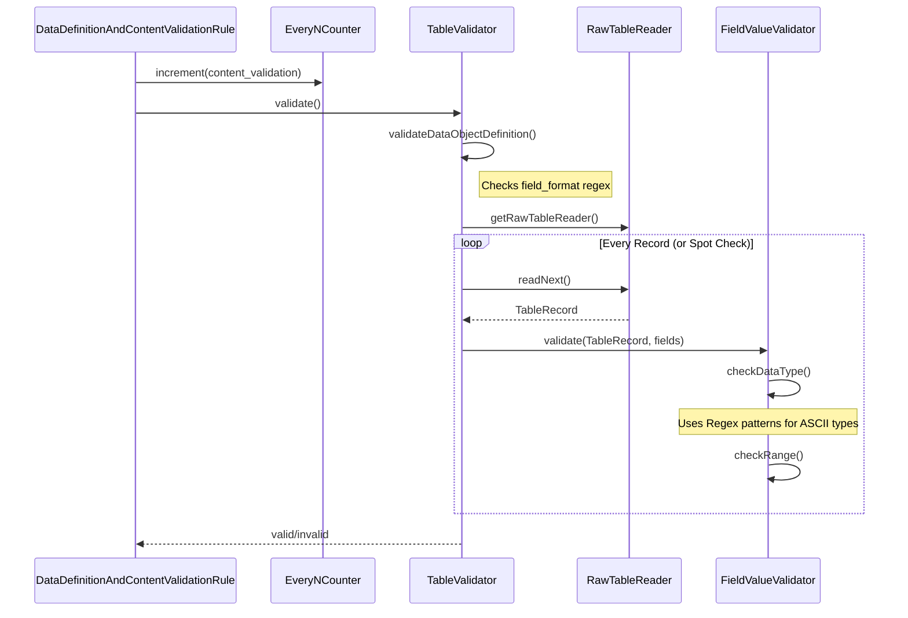

# Page: Data Content Validation

# Data Content Validation

<details>
<summary>Relevant source files</summary>

The following files were used as context for generating this wiki page:

- [src/main/java/gov/nasa/pds/tools/inventory/reader/InventoryTableReader.java](src/main/java/gov/nasa/pds/tools/inventory/reader/InventoryTableReader.java)
- [src/main/java/gov/nasa/pds/tools/util/EveryNCounter.java](src/main/java/gov/nasa/pds/tools/util/EveryNCounter.java)
- [src/main/java/gov/nasa/pds/tools/util/TableCharacterUtil.java](src/main/java/gov/nasa/pds/tools/util/TableCharacterUtil.java)
- [src/main/java/gov/nasa/pds/tools/util/TableUtil.java](src/main/java/gov/nasa/pds/tools/util/TableUtil.java)
- [src/main/java/gov/nasa/pds/tools/validate/SpecialConstantChecker.java](src/main/java/gov/nasa/pds/tools/validate/SpecialConstantChecker.java)
- [src/main/java/gov/nasa/pds/tools/validate/content/ProblemReporter.java](src/main/java/gov/nasa/pds/tools/validate/content/ProblemReporter.java)
- [src/main/java/gov/nasa/pds/tools/validate/content/SpecialConstantBitPatternTransforms.java](src/main/java/gov/nasa/pds/tools/validate/content/SpecialConstantBitPatternTransforms.java)
- [src/main/java/gov/nasa/pds/tools/validate/content/array/ArrayContentValidator.java](src/main/java/gov/nasa/pds/tools/validate/content/array/ArrayContentValidator.java)
- [src/main/java/gov/nasa/pds/tools/validate/content/array/ArrayProblemReporter.java](src/main/java/gov/nasa/pds/tools/validate/content/array/ArrayProblemReporter.java)
- [src/main/java/gov/nasa/pds/tools/validate/content/table/FieldProblemReporter.java](src/main/java/gov/nasa/pds/tools/validate/content/table/FieldProblemReporter.java)
- [src/main/java/gov/nasa/pds/tools/validate/content/table/FieldValueValidator.java](src/main/java/gov/nasa/pds/tools/validate/content/table/FieldValueValidator.java)
- [src/main/java/gov/nasa/pds/tools/validate/rule/FileAreaExtractor.java](src/main/java/gov/nasa/pds/tools/validate/rule/FileAreaExtractor.java)
- [src/main/java/gov/nasa/pds/tools/validate/rule/pds4/ArrayValidator.java](src/main/java/gov/nasa/pds/tools/validate/rule/pds4/ArrayValidator.java)
- [src/main/java/gov/nasa/pds/tools/validate/rule/pds4/DataDefinitionAndContentValidationRule.java](src/main/java/gov/nasa/pds/tools/validate/rule/pds4/DataDefinitionAndContentValidationRule.java)
- [src/main/java/gov/nasa/pds/tools/validate/rule/pds4/DateTimeValidator.java](src/main/java/gov/nasa/pds/tools/validate/rule/pds4/DateTimeValidator.java)
- [src/main/java/gov/nasa/pds/tools/validate/rule/pds4/TableValidator.java](src/main/java/gov/nasa/pds/tools/validate/rule/pds4/TableValidator.java)
- [src/test/java/gov/nasa/pds/validate/DateTimeEfficiency.java](src/test/java/gov/nasa/pds/validate/DateTimeEfficiency.java)
- [src/test/resources/github416/mix_raw_calib_mixs-c_sw_offset_table_20160301.fits](src/test/resources/github416/mix_raw_calib_mixs-c_sw_offset_table_20160301.fits)
- [src/test/resources/github416/mix_raw_calib_mixs-c_sw_offset_table_20160301.xml](src/test/resources/github416/mix_raw_calib_mixs-c_sw_offset_table_20160301.xml)
- [src/test/resources/github416/mix_raw_calib_mixs-c_sw_offset_table_20160301_invalid.xml](src/test/resources/github416/mix_raw_calib_mixs-c_sw_offset_table_20160301_invalid.xml)
- [src/test/resources/github416/phe_misc_temperature_reference_20190524.fits](src/test/resources/github416/phe_misc_temperature_reference_20190524.fits)
- [src/test/resources/github416/phe_misc_temperature_reference_20190524.xml](src/test/resources/github416/phe_misc_temperature_reference_20190524.xml)
- [src/test/resources/github416/phe_misc_temperature_reference_20190524_invalid.xml](src/test/resources/github416/phe_misc_temperature_reference_20190524_invalid.xml)
- [src/test/resources/github476/collection_lab.hydrocarbon_spectra_data.xml](src/test/resources/github476/collection_lab.hydrocarbon_spectra_data.xml)
- [src/test/resources/github476/collection_lab.hydrocarbon_spectra_data_inventory.csv](src/test/resources/github476/collection_lab.hydrocarbon_spectra_data_inventory.csv)
- [src/test/resources/github837/times_table.txt](src/test/resources/github837/times_table.txt)
- [src/test/resources/github837/times_table.xml](src/test/resources/github837/times_table.xml)
- [src/test/resources/github956/fsb_01500_rhk_xib_85s238_v1.csv](src/test/resources/github956/fsb_01500_rhk_xib_85s238_v1.csv)
- [src/test/resources/github956/fsb_01500_rhk_xib_85s238_v1.lbl](src/test/resources/github956/fsb_01500_rhk_xib_85s238_v1.lbl)
- [src/test/resources/github956/fsb_01500_rhk_xib_85s238_v1.xml](src/test/resources/github956/fsb_01500_rhk_xib_85s238_v1.xml)

</details>


The Data Content Validation subsystem is responsible for verifying that the actual binary or character data stored in PDS4 data files matches the definitions provided in their associated XML labels. This includes structural verification (offsets, sizes, record counts) and value-level verification (data types, ranges, special constants).

## Overview and Architecture

The entry point for content validation is the `DataDefinitionAndContentValidationRule`. This rule iterates through all data objects defined in a label, ensuring they are correctly described and that their physical content conforms to the PDS4 specification.

### Data Flow for Content Validation

1.  **Object Discovery**: `DataDefinitionAndContentValidationRule` uses the `gov.nasa.pds.label.Label` class to extract all `DataObject` instances (Tables, Arrays, Headers) [src/main/java/gov/nasa/pds/tools/validate/rule/pds4/DataDefinitionAndContentValidationRule.java:45-54]().
2.  **Structural Check**: It verifies that objects are defined in increasing offset order and checks for gaps or overlaps using `DataObjectCompareViaOffset` [src/main/java/gov/nasa/pds/tools/validate/rule/pds4/DataDefinitionAndContentValidationRule.java:71-84]().
3.  **Delegation**: Depending on the object type, it instantiates a `TableValidator` or `ArrayValidator` [src/main/java/gov/nasa/pds/tools/validate/rule/pds4/DataDefinitionAndContentValidationRule.java:122-128]().
4.  **Content Extraction**: The validators use `RawTableReader` (for tables) or `ArrayObject` (for arrays) to access the underlying file bytes [src/main/java/gov/nasa/pds/tools/validate/rule/pds4/TableValidator.java:132-132]() [src/main/java/gov/nasa/pds/tools/validate/content/array/ArrayContentValidator.java:123-124]().
5.  **Value Validation**: Individual fields (for tables) or elements (for arrays) are passed to `FieldValueValidator` or `ArrayContentValidator` for semantic checks [src/main/java/gov/nasa/pds/tools/validate/rule/pds4/TableValidator.java:136-136]() [src/main/java/gov/nasa/pds/tools/validate/rule/pds4/ArrayValidator.java:101-104]().

### Natural Language to Code Entity Mapping: Validation Logic

| Natural Language Concept | Code Entity | File Path |
| :--- | :--- | :--- |
| **Data Object Rule** | `DataDefinitionAndContentValidationRule` | [src/main/java/gov/nasa/pds/tools/validate/rule/pds4/DataDefinitionAndContentValidationRule.java:31-31]() |
| **Table Engine** | `TableValidator` | [src/main/java/gov/nasa/pds/tools/validate/rule/pds4/TableValidator.java:54-54]() |
| **Array Engine** | `ArrayValidator` | [src/main/java/gov/nasa/pds/tools/validate/rule/pds4/ArrayValidator.java:31-31]() |
| **Field Checker** | `FieldValueValidator` | [src/main/java/gov/nasa/pds/tools/validate/content/table/FieldValueValidator.java:51-51]() |
| **Special Constants** | `SpecialConstantChecker` | [src/main/java/gov/nasa/pds/tools/validate/SpecialConstantChecker.java:15-15]() |
| **Bit Pattern Logic** | `SpecialConstantBitPatternTransforms` | [src/main/java/gov/nasa/pds/tools/validate/content/SpecialConstantBitPatternTransforms.java:6-6]() |

**Sources:** [src/main/java/gov/nasa/pds/tools/validate/rule/pds4/DataDefinitionAndContentValidationRule.java:31-133](), [src/main/java/gov/nasa/pds/tools/validate/rule/pds4/TableValidator.java:54-105]()

## Structural Validation

Before checking values, the tool validates the physical layout of the data file.

### Offset and Size Checking
The `DataDefinitionAndContentValidationRule` maintains a `minimumExpectedOffset`. It compares this against the `offset` defined in the label for each `DataObject`. If the label's offset is less than the bytes already consumed by previous objects, a `DATA_OBJECTS_OUT_OF_ORDER` warning is reported [src/main/java/gov/nasa/pds/tools/validate/rule/pds4/DataDefinitionAndContentValidationRule.java:77-80](). The tool explicitly checks offsets against the end of previous objects [src/main/java/gov/nasa/pds/tools/validate/rule/pds4/DataDefinitionAndContentValidationRule.java:113-119]().

### Complete Descriptions Mode
If the `--complete-descriptions` flag is enabled in the `RuleContext`, the tool checks if there is "undescribed" data at the end of a file. This happens if the total file size is greater than the offset + size of the last defined object, triggering a `DATA_NOT_DESCRIBED` problem [src/main/java/gov/nasa/pds/tools/validate/rule/pds4/DataDefinitionAndContentValidationRule.java:96-102]().

**Sources:** [src/main/java/gov/nasa/pds/tools/validate/rule/pds4/DataDefinitionAndContentValidationRule.java:71-142]()

## Table Validation

`TableValidator` handles `Table_Character`, `Table_Binary`, and `Table_Delimited` objects.

### Validation Flow: Table Content
The validator supports three primary strategies based on the table type and record orientation:
1.  **Binary**: Uses `validateTableBinaryContent` [src/main/java/gov/nasa/pds/tools/validate/rule/pds4/TableValidator.java:154-156]().
2.  **Delimited (Fixed-Width)**: Uses `validateTableDelimitedContent` if record lengths are defined but it is not line-oriented [src/main/java/gov/nasa/pds/tools/validate/rule/pds4/TableValidator.java:157-171]().
3.  **Character/Line-Oriented**: Uses `validateTableCharacterContent` for stream-based parsing [src/main/java/gov/nasa/pds/tools/validate/rule/pds4/TableValidator.java:174-176]().

### Field Value Validation
The `FieldValueValidator` performs rigorous checks on every field in a record:
*   **Data Type Conformance**: Validates ASCII_Integer, ASCII_Real, ASCII_Date_Time, etc., using complex regex patterns like `asciiReal` or `asciiLidVidPattern` [src/main/java/gov/nasa/pds/tools/validate/content/table/FieldValueValidator.java:76-120]().
*   **DateTime Parsing**: Delegates complex date/time strings to `DateTimeValidator` to convert values to `Instant` for comparison [src/main/java/gov/nasa/pds/tools/validate/rule/pds4/DateTimeValidator.java:74-91]().
*   **Formatting**: Validates fields against the `field_format` attribute using the `formatPattern` regex to parse C-style specifiers [src/main/java/gov/nasa/pds/tools/validate/content/table/FieldValueValidator.java:76-77]().

**Sources:** [src/main/java/gov/nasa/pds/tools/validate/rule/pds4/TableValidator.java:126-180](), [src/main/java/gov/nasa/pds/tools/validate/content/table/FieldValueValidator.java:51-120]()

## Array Validation

`ArrayValidator` and `ArrayContentValidator` process N-dimensional array data.

### Array Processing Logic
The `ArrayContentValidator` uses a recursive `process` method to navigate multi-dimensional space. It iterates through dimensions and calculates the physical position of each element [src/main/java/gov/nasa/pds/tools/validate/content/array/ArrayContentValidator.java:136-166]().

### Value Checks
For each element, `validatePosition` performs:
*   **Range Verification**: Checks if the value fits within the specified `NumericDataType` (e.g., `SignedByte_RANGE`, `UnsignedLSB4_RANGE`) [src/main/java/gov/nasa/pds/tools/validate/content/array/ArrayContentValidator.java:62-87]().
*   **Object Statistics**: If `Object_Statistics` (minimum/maximum) are present in the label, it validates elements against these values using `SpecialConstantChecker` [src/main/java/gov/nasa/pds/tools/validate/content/array/ArrayContentValidator.java:28-35]().

**Sources:** [src/main/java/gov/nasa/pds/tools/validate/content/array/ArrayContentValidator.java:45-134](), [src/main/java/gov/nasa/pds/tools/validate/rule/pds4/ArrayValidator.java:31-110]()

## Optimization and Sampling

Content validation of multi-gigabyte files is computationally expensive. The tool provides two mechanisms to manage performance:

### Spot-Check Sampling
Users can specify a sampling interval via the `--spot-check-data` CLI flag. 
*   In **Tables**, it skips N records after every validated record [src/main/java/gov/nasa/pds/tools/validate/rule/pds4/TableValidator.java:134-134]().
*   In **Arrays**, it increments the innermost loop index by the spot-check value in the `process` method [src/main/java/gov/nasa/pds/tools/validate/content/array/ArrayContentValidator.java:159-163]().

### Every-N Product Validation
The `EveryNCounter` utility allows the tool to only perform content validation on every Nth product in a large collection. It tracks progress across `content_validation`, `label_validation`, and `reference_integrity` groups [src/main/java/gov/nasa/pds/tools/util/EveryNCounter.java:6-28]().

**Sources:** [src/main/java/gov/nasa/pds/tools/util/EveryNCounter.java:1-28](), [src/main/java/gov/nasa/pds/tools/validate/rule/pds4/DataDefinitionAndContentValidationRule.java:72-72]()

## Special Constants Handling

The `SpecialConstantChecker` is used by both table and array validators to distinguish between valid data and "placeholder" values like `missing_constant` or `invalid_constant`.

*   **Conformant Constants**: Constants that match the data type of the field. The tool uses `SpecialConstantBitPatternTransforms` to convert hex (`0x`), octal (`0o`), or binary (`2#`) strings into `BigInteger` or `BigDecimal` for comparison with the actual data [src/main/java/gov/nasa/pds/tools/validate/content/SpecialConstantBitPatternTransforms.java:7-43]().
*   **Non-Conformant Constants**: String-based comparisons for cases where the constant might not strictly follow the field's type constraints (e.g., "NaN" in an integer field) [src/main/java/gov/nasa/pds/tools/validate/SpecialConstantChecker.java:31-46]().

**Sources:** [src/main/java/gov/nasa/pds/tools/validate/SpecialConstantChecker.java:15-115](), [src/main/java/gov/nasa/pds/tools/validate/content/SpecialConstantBitPatternTransforms.java:1-45]()

## Technical Diagrams

### Content Validation Entity Relationship
This diagram shows how the core validation classes interact with the PDS4 data model and utility classes.

```mermaid
graph TD
    subgraph "Rule Engine Space"
        RULE["DataDefinitionAndContentValidationRule"]
    end

    subgraph "Validation Logic Space"
        RULE --> TV["TableValidator"]
        RULE --> AV["ArrayValidator"]
        
        TV --> FVV["FieldValueValidator"]
        AV --> ACV["ArrayContentValidator"]
        
        FVV --> SCC["SpecialConstantChecker"]
        ACV --> SCC
        SCC --> SCBPT["SpecialConstantBitPatternTransforms"]
        FVV --> DTV["DateTimeValidator"]
    end

    subgraph "PDS4 Object Access Space"
        TV --> TO["TableObject"]
        AV --> AO["ArrayObject"]
        TO --> RTR["RawTableReader"]
        AO --> ADC["ArrayObject.open()"]
    end

    subgraph "Natural Language Space"
        "Table Definition" --- TO
        "Array Elements" --- AO
        "Field Value" --- FVV
        "Bit Pattern Constants" --- SCBPT
    end
```
**Sources:** [src/main/java/gov/nasa/pds/tools/validate/rule/pds4/DataDefinitionAndContentValidationRule.java:122-128](), [src/main/java/gov/nasa/pds/tools/validate/rule/pds4/TableValidator.java:132-136](), [src/main/java/gov/nasa/pds/tools/validate/rule/pds4/ArrayValidator.java:101-104](), [src/main/java/gov/nasa/pds/tools/validate/SpecialConstantChecker.java:15-15]()

### Data Processing Sequence
The following sequence describes the flow of validating a single Table object, including sampling logic.


**Sources:** [src/main/java/gov/nasa/pds/tools/validate/rule/pds4/TableValidator.java:92-105](), [src/main/java/gov/nasa/pds/tools/validate/rule/pds4/TableValidator.java:126-176](), [src/main/java/gov/nasa/pds/tools/validate/content/table/FieldValueValidator.java:143-160](), [src/main/java/gov/nasa/pds/tools/util/EveryNCounter.java:19-26]()
