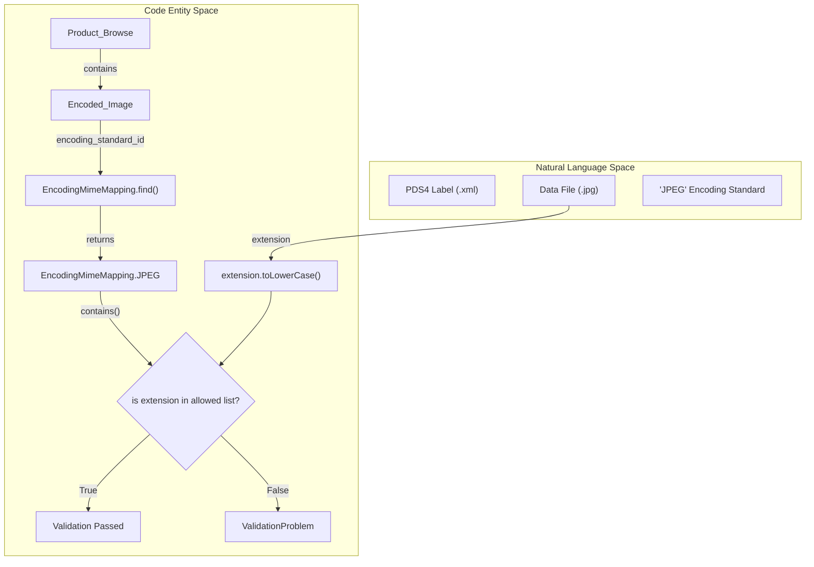
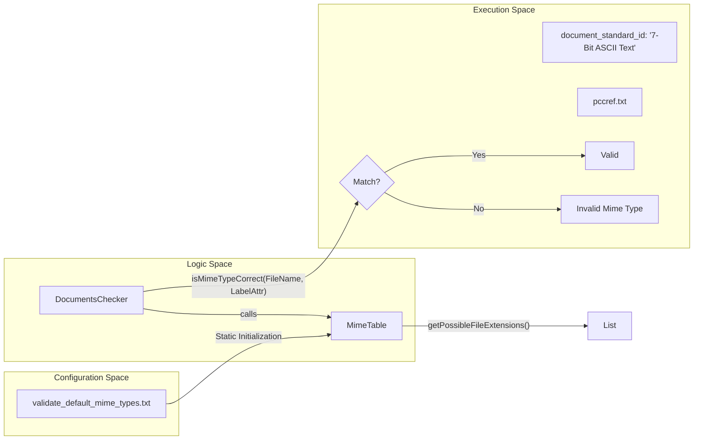

# Page: Data Format and File Utilities

# Data Format and File Utilities

Relevant source files

The following files were used as context for generating this wiki page:

- [src/main/java/gov/nasa/pds/tools/inventory/reader/InventoryTableReader.java](src/main/java/gov/nasa/pds/tools/inventory/reader/InventoryTableReader.java)
- [src/main/java/gov/nasa/pds/tools/util/DocumentsChecker.java](src/main/java/gov/nasa/pds/tools/util/DocumentsChecker.java)
- [src/main/java/gov/nasa/pds/tools/util/EncodingMimeMapping.java](src/main/java/gov/nasa/pds/tools/util/EncodingMimeMapping.java)
- [src/main/java/gov/nasa/pds/tools/util/FileSizesUtil.java](src/main/java/gov/nasa/pds/tools/util/FileSizesUtil.java)
- [src/main/java/gov/nasa/pds/tools/util/FilenameUtility.java](src/main/java/gov/nasa/pds/tools/util/FilenameUtility.java)
- [src/main/java/gov/nasa/pds/tools/util/ImageUtil.java](src/main/java/gov/nasa/pds/tools/util/ImageUtil.java)
- [src/main/java/gov/nasa/pds/tools/util/MimeTable.java](src/main/java/gov/nasa/pds/tools/util/MimeTable.java)
- [src/main/java/gov/nasa/pds/tools/util/TableCharacterUtil.java](src/main/java/gov/nasa/pds/tools/util/TableCharacterUtil.java)
- [src/main/java/gov/nasa/pds/tools/util/VersionInfo.java](src/main/java/gov/nasa/pds/tools/util/VersionInfo.java)
- [src/main/java/gov/nasa/pds/tools/validate/AggregateManager.java](src/main/java/gov/nasa/pds/tools/validate/AggregateManager.java)
- [src/main/java/gov/nasa/pds/tools/validate/ProblemType.java](src/main/java/gov/nasa/pds/tools/validate/ProblemType.java)
- [src/main/java/gov/nasa/pds/tools/validate/content/AudioVideo.java](src/main/java/gov/nasa/pds/tools/validate/content/AudioVideo.java)
- [src/main/java/gov/nasa/pds/tools/validate/rule/pds4/FileReferenceValidationRule.java](src/main/java/gov/nasa/pds/tools/validate/rule/pds4/FileReferenceValidationRule.java)
- [src/main/resources/validate_default_mime_types.txt](src/main/resources/validate_default_mime_types.txt)
- [src/test/java/gov/nasa/pds/validate/EncodingMimeMappingTest.java](src/test/java/gov/nasa/pds/validate/EncodingMimeMappingTest.java)
- [src/test/resources/github367/document/pccref.xml](src/test/resources/github367/document/pccref.xml)
- [src/test/resources/github381/a test/minmax-error.csv](src/test/resources/github381/a test/minmax-error.csv)
- [src/test/resources/github381/a test/minmax-error.xml](src/test/resources/github381/a test/minmax-error.xml)
- [src/test/resources/github424/asurpif_photos_amboycrater_v1.0_20211021_aip_v1.0.xml](src/test/resources/github424/asurpif_photos_amboycrater_v1.0_20211021_aip_v1.0.xml)
- [src/test/resources/github424/asurpif_photos_amboycrater_v1.0_20211021_checksum_manifest_v1.0.tab](src/test/resources/github424/asurpif_photos_amboycrater_v1.0_20211021_checksum_manifest_v1.0.tab)
- [src/test/resources/github424/asurpif_photos_amboycrater_v1.0_20211021_sip_v1.0.tab](src/test/resources/github424/asurpif_photos_amboycrater_v1.0_20211021_sip_v1.0.tab)
- [src/test/resources/github424/asurpif_photos_amboycrater_v1.0_20211021_sip_v1.0.xml](src/test/resources/github424/asurpif_photos_amboycrater_v1.0_20211021_sip_v1.0.xml)
- [src/test/resources/github424/asurpif_photos_amboycrater_v1.0_20211021_transfer_manifest_v1.0.tab](src/test/resources/github424/asurpif_photos_amboycrater_v1.0_20211021_transfer_manifest_v1.0.tab)
- [src/test/resources/github429/EPPS_EDR_SIS.DOC](src/test/resources/github429/EPPS_EDR_SIS.DOC)
- [src/test/resources/github435/flat_w.fit](src/test/resources/github435/flat_w.fit)
- [src/test/resources/github435/flat_w.txt](src/test/resources/github435/flat_w.txt)
- [src/test/resources/github435/flat_w.xml](src/test/resources/github435/flat_w.xml)
- [src/test/resources/github447/document/mission_phase_plans/Preliminary_Survey_Phase_Plan_Narrative.pdf](src/test/resources/github447/document/mission_phase_plans/Preliminary_Survey_Phase_Plan_Narrative.pdf)
- [src/test/resources/github447/document/mission_phase_plans/Preliminary_Survey_Phase_Plan_Narrative.xml](src/test/resources/github447/document/mission_phase_plans/Preliminary_Survey_Phase_Plan_Narrative.xml)
- [src/test/resources/github447/document/orex_ldd_description_doc.pdf](src/test/resources/github447/document/orex_ldd_description_doc.pdf)
- [src/test/resources/github617/uvis_euv_2005_159_solar_time_series_ingress.xml](src/test/resources/github617/uvis_euv_2005_159_solar_time_series_ingress.xml)

The Data Format and File Utilities provide a suite of specialized tools for verifying file-level attributes, mapping data encodings to MIME types, and performing low-level checks on data structures like tables, audio/video containers, and documents. These utilities bridge the gap between high-level PDS4 label definitions and the physical bytes stored on disk.

## MIME Type and Encoding Mapping

The system uses a combination of static mapping files and Java Enums to ensure that file extensions match the declared encoding standards in PDS4 labels.

### EncodingMimeMapping
`EncodingMimeMapping` is an enum that maps PDS4 `encoding_standard_id` values to their allowed file extensions. It is primarily used to validate `Encoded_Image` and other encoded byte streams [src/main/java/gov/nasa/pds/tools/util/EncodingMimeMapping.java:6-19]().

Key behaviors include:
*   **Extension Lookup**: The `contains(String extension)` method checks if a given extension is valid for a specific encoding, performing case-insensitive comparisons [src/main/java/gov/nasa/pds/tools/util/EncodingMimeMapping.java:24-26]().
*   **Encoding Discovery**: The `find(String encoding)` method maps string identifiers (e.g., "J2C", "TIFF", "SEED 2.") to the enum constants [src/main/java/gov/nasa/pds/tools/util/EncodingMimeMapping.java:30-54]().
*   **Special Mappings**: It handles complex PDS4 strings like "MSSS Camera Mini Header" (mapped to DAT) and "Nikon Electronic Format (NEF)" (mapped to NEF) [src/main/java/gov/nasa/pds/tools/util/EncodingMimeMapping.java:39-40]().

### MimeTable and DocumentsChecker
For general document validation, `MimeTable` loads mappings from a configuration file named `validate_default_mime_types.txt` [src/main/java/gov/nasa/pds/tools/util/MimeTable.java:25-31](). This file defines the relationship between MIME types (or PDS4 document standard IDs) and file extensions.

`DocumentsChecker` acts as a high-level wrapper around `MimeTable`, providing methods to:
1.  Retrieve allowed extensions for a `document_standard_id` [src/main/java/gov/nasa/pds/tools/util/DocumentsChecker.java:30-33]().
2.  Verify if a specific file name's extension is correct for its declared type [src/main/java/gov/nasa/pds/tools/util/DocumentsChecker.java:44-50]().

**Sources:**
*   [src/main/java/gov/nasa/pds/tools/util/EncodingMimeMapping.java:1-55]()
*   [src/main/java/gov/nasa/pds/tools/util/DocumentsChecker.java:1-51]()
*   [src/main/java/gov/nasa/pds/tools/util/MimeTable.java:1-161]()

## File and Integrity Utilities

### MD5Checksum
The `MD5Checksum` utility calculates the hash of a file to verify referential integrity. To handle large data files, it utilizes `RandomAccessFile` and `FileChannel` with a buffer [src/main/java/gov/nasa/pds/tools/util/MD5Checksum.java:65-78](). The core logic iterates through the file channel, updating the `MessageDigest` with byte buffers until the end of the stream is reached.

### FileSizesUtil
`FileSizesUtil` provides a robust way to determine file sizes across different protocols. It handles local `file` protocols by decoding URL-encoded paths (e.g., converting `%20` back to spaces) before querying the file system [src/main/java/gov/nasa/pds/tools/util/FileSizesUtil.java:34-44](). For remote resources, it uses an HTTP `HEAD` request to retrieve the `Content-Length` without downloading the entire file [src/main/java/gov/nasa/pds/tools/util/FileSizesUtil.java:57-61]().

### ImageUtil
`ImageUtil` performs low-level byte inspections to verify the integrity of image files beyond simple extension checks:
*   **JPEG Validation**: Inspects the first two bytes for the SOI (Start of Image) marker `0xffd8` and the last two bytes for the EOI (End of Image) marker `0xffd9` [src/main/java/gov/nasa/pds/tools/util/ImageUtil.java:79-98]().
*   **PNG Validation**: Checks for the 8-byte signature: `0x89504e47` followed by `0x0d0a1a0a` [src/main/java/gov/nasa/pds/tools/util/ImageUtil.java:168-170]().

### AudioVideo
The `AudioVideo` utility validates MP4/M4A and WAV file formats. 
*   **MP4 Validation**: Uses the `IsoFile` and `MovieBox` classes from `org.mp4parser` to verify the presence of audio (`soun`) or video (`vide`) tracks as expected by the label [src/main/java/gov/nasa/pds/tools/validate/content/AudioVideo.java:33-44]().
*   **WAV Validation**: Manually parses the RIFF header, checking for the `RIFF` chunk ID, verifying that the header's size matches the file length, and ensuring the `WAVE` and `fmt ` markers are present [src/main/java/gov/nasa/pds/tools/validate/content/AudioVideo.java:68-111]().

**Sources:**
*   [src/main/java/gov/nasa/pds/tools/util/FileSizesUtil.java:1-70]()
*   [src/main/java/gov/nasa/pds/tools/util/ImageUtil.java:1-180]()
*   [src/main/java/gov/nasa/pds/tools/validate/content/AudioVideo.java:1-121]()

## Table and Character Utilities

### TableCharacterUtil
`TableCharacterUtil` provides mechanisms for validating character-based tables. It extracts field metadata (location, length, format) from the label and can verify the content between fields for non-blank values [src/main/java/gov/nasa/pds/tools/util/TableCharacterUtil.java:91-132]().

Key features:
*   **Metadata Extraction**: Uses `XMLExtractor` to retrieve `field_location`, `field_length`, and `data_type` from `Field_Character` nodes [src/main/java/gov/nasa/pds/tools/util/TableCharacterUtil.java:107-118]().
*   **In-Between Validation**: Checks gaps between defined fields to ensure no unexpected data exists in the character stream [src/main/java/gov/nasa/pds/tools/util/TableCharacterUtil.java:142-168]().

### FilenameUtility
`FilenameUtility` is a simple helper class that sanitizes file paths by decoding URL-encoded characters, specifically replacing `%20` with space characters [src/main/java/gov/nasa/pds/tools/util/FilenameUtility.java:37-51]().

**Sources:**
*   [src/main/java/gov/nasa/pds/tools/util/TableCharacterUtil.java:1-170]()
*   [src/main/java/gov/nasa/pds/tools/util/FilenameUtility.java:1-53]()

## System Architecture Diagrams

### MIME Mapping Data Flow
This diagram illustrates how a PDS4 label's encoding standard is resolved against the physical file extension using the utility classes.

Title: MIME Resolution and Validation Flow

**Sources:**
*   [src/main/java/gov/nasa/pds/tools/util/EncodingMimeMapping.java:30-54]()
*   [src/main/java/gov/nasa/pds/tools/validate/rule/pds4/FileReferenceValidationRule.java:138-142]()

### Document Type Verification
This diagram maps the interaction between the `DocumentsChecker`, the `MimeTable`, and the external configuration file.

Title: Document Standard Verification Logic

**Sources:**
*   [src/main/java/gov/nasa/pds/tools/util/DocumentsChecker.java:44-50]()
*   [src/main/java/gov/nasa/pds/tools/util/MimeTable.java:25-44]()

## Summary of Key Utilities

| Class | Purpose | Key Method |
| :--- | :--- | :--- |
| `EncodingMimeMapping` | Maps image/stream encodings to extensions. | `find(String encoding)` [src/main/java/gov/nasa/pds/tools/util/EncodingMimeMapping.java:30]() |
| `MimeTable` | Internal registry of MIME types from text file. | `isMimeTypeCorrect(String, String)` [src/main/java/gov/nasa/pds/tools/util/MimeTable.java:128]() |
| `DocumentsChecker` | High-level API for document file validation. | `isMimeTypeCorrect(String, String)` [src/main/java/gov/nasa/pds/tools/util/DocumentsChecker.java:44]() |
| `FileSizesUtil` | Cross-protocol file size determination. | `getExternalFilesize(URL url)` [src/main/java/gov/nasa/pds/tools/util/FileSizesUtil.java:28]() |
| `ImageUtil` | Byte-level signature validation for JPEG/PNG. | `isJPEG(String, URL)` [src/main/java/gov/nasa/pds/tools/util/ImageUtil.java:38]() |
| `AudioVideo` | Format-specific header/track validation (MP4/WAV). | `checkWavHeader()` [src/main/java/gov/nasa/pds/tools/validate/content/AudioVideo.java:68]() |
| `AggregateManager` | Utility for finding latest versions of bundle/collection files. | `findBundleWithLatestVersion(URL, String)` [src/main/java/gov/nasa/pds/tools/validate/AggregateManager.java:97]() |
| `TableCharacterUtil` | Character table field and gap validation. | `parseFieldsInfo()` [src/main/java/gov/nasa/pds/tools/util/TableCharacterUtil.java:91]() |
| `FilenameUtility` | URL-decoded path sanitization. | `decodeSpace(String)` [src/main/java/gov/nasa/pds/tools/util/FilenameUtility.java:37]() |

**Sources:**
*   [src/main/java/gov/nasa/pds/tools/util/EncodingMimeMapping.java:1-55]()
*   [src/main/java/gov/nasa/pds/tools/util/FileSizesUtil.java:1-70]()
*   [src/main/java/gov/nasa/pds/tools/util/ImageUtil.java:1-180]()
*   [src/main/java/gov/nasa/pds/tools/validate/content/AudioVideo.java:1-121]()
*   [src/main/java/gov/nasa/pds/tools/validate/AggregateManager.java:1-180]()
*   [src/main/java/gov/nasa/pds/tools/util/TableCharacterUtil.java:1-170]()
