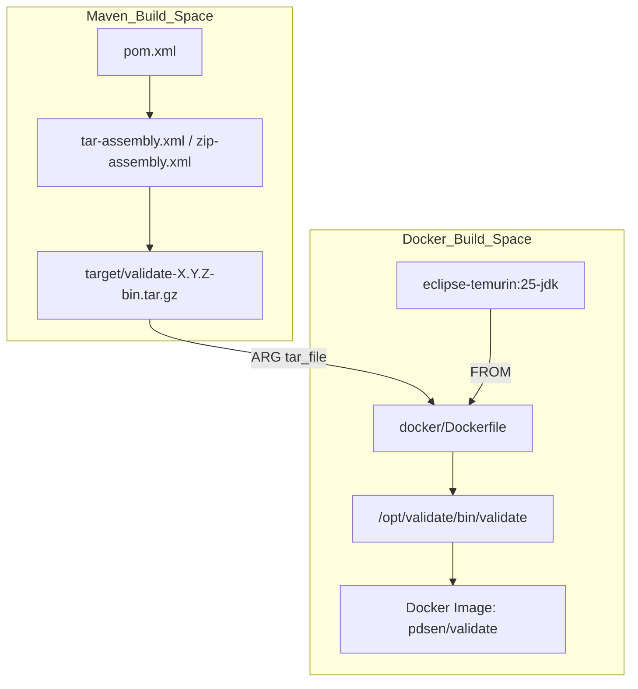
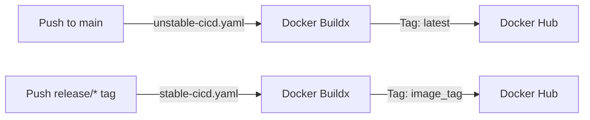
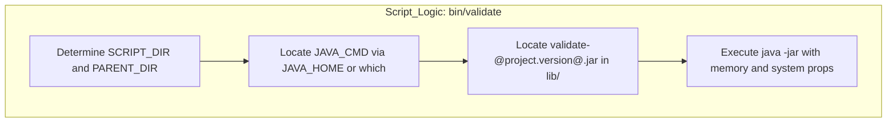

# Page: Docker Packaging and Distribution

# Docker Packaging and Distribution

Relevant source files

The following files were used as context for generating this wiki page:

- [.github/workflows/branch-cicd.yaml](.github/workflows/branch-cicd.yaml)
- [.github/workflows/codeql-analysis.yml](.github/workflows/codeql-analysis.yml)
- [.github/workflows/secrets-detection.yaml](.github/workflows/secrets-detection.yaml)
- [.github/workflows/stable-cicd.yaml](.github/workflows/stable-cicd.yaml)
- [.github/workflows/unstable-cicd.yaml](.github/workflows/unstable-cicd.yaml)
- [.github/workflows/update-context-validation.yml](.github/workflows/update-context-validation.yml)
- [.pre-commit-config.yaml](.pre-commit-config.yaml)
- [.secrets.baseline](.secrets.baseline)
- [build/update_context.sh](build/update_context.sh)
- [docker/Dockerfile](docker/Dockerfile)
- [docker/README.md](docker/README.md)
- [docker/run.sh](docker/run.sh)
- [src/main/assembly/tar-assembly.xml](src/main/assembly/tar-assembly.xml)
- [src/main/assembly/zip-assembly.xml](src/main/assembly/zip-assembly.xml)
- [src/main/resources/bin/validate](src/main/resources/bin/validate)
- [src/main/resources/bin/validate-refs](src/main/resources/bin/validate-refs)
- [src/main/resources/bin/validate-refs.bat](src/main/resources/bin/validate-refs.bat)
- [src/main/resources/bin/validate.bat](src/main/resources/bin/validate.bat)

The PDS Validate tool is distributed both as a standalone binary assembly and as a containerized application. This section details the Docker-based distribution pipeline, including the Dockerfile (based on Eclipse Temurin), the `run.sh` helper for volume mapping, the multi-platform amd64 and arm64 build process in GitHub Actions, the Docker Hub tagging strategy, and the Maven assembly descriptors used to produce the distributable tar/zip archives.

---

## Dockerfile and Base Image

The container image for the `validate` tool is built upon the `eclipse-temurin:25-jdk` base image, which provides a recent, fully supported OpenJDK 25 JVM environment maintained by the Eclipse Adoptium project [docker/Dockerfile:1-1]().

### Implementation Details

- **Base Image**: Uses `eclipse-temurin:25-jdk` as the runtime base [docker/Dockerfile:1-1]().
- **Build Argument `tar_file`**: The Docker build requires an argument `tar_file`, which specifies the path to the packaged binary distribution tarball (e.g., `validate-4.0.0-bin.tar.gz`) produced by the Maven assembly plugin [docker/Dockerfile:3-3]().
- **Installation Logic**: The tarball is copied into the container `/tmp` directory, then extracted to `/opt/validate`. The extraction strips the top-level directory component to produce a clean layout. After extraction, the tarball is removed to reduce the image size [docker/Dockerfile:6-12]().
- **Environment Variable**: Adds `/opt/validate/bin` to the `PATH` so that the validation command scripts are executable directly [docker/Dockerfile:14-14]().
- **Entrypoint**: The container entrypoint is tied to the `validate` executable script, allowing the container to be run with `docker run <image> [args]` [docker/Dockerfile:16-16]().

### Data Flow: Assembly to Image

The tarball used as `tar_file` is produced by the Maven assembly plugin based on descriptors located in `src/main/assembly/tar-assembly.xml`.

| Stage | Entity | Role |
| :--- | :--- | :--- |
| **Build** | `tar-assembly.xml` | Defines the file structure for the `.tar.gz` distribution [src/main/assembly/tar-assembly.xml:39-43](). |
| **Artifact** | `validate-*-bin.tar.gz` | The binary bundle containing jars, scripts, and resources [src/main/assembly/tar-assembly.xml:45-125](). |
| **Docker Context** | `Dockerfile` | Extracts the bundle into `/opt/validate` and sets the entrypoint [docker/Dockerfile:6-16](). |

**Figure 1: Packaging Pipeline Flow**

Sources: [docker/Dockerfile:1-17](), [src/main/assembly/tar-assembly.xml:39-43](), [src/main/assembly/zip-assembly.xml:39-43]()

---

## Multi-Platform Build Pipeline

To support users on both AMD64 and ARM64 (Apple Silicon/Graviton), the project uses multi-platform Docker builds via GitHub Actions.

### Build Infrastructure

- **QEMU Emulation**: Enabled via `docker/setup-qemu-action@v4` to build ARM64 images on standard Ubuntu runners [ .github/workflows/unstable-cicd.yaml:99-100]().
- **Docker Buildx**: Utilized via `docker/setup-buildx-action@v4` to manage multi-platform builds [ .github/workflows/unstable-cicd.yaml:102-103]().
- **Platforms Targeted**: The build command explicitly targets `linux/amd64,linux/arm64` [ .github/workflows/unstable-cicd.yaml:111-111]().

### Tagging Strategy

The project distinguishes between unstable and stable images through distinct workflows:

| Workflow | Trigger | Docker Tag | Target File |
| :--- | :--- | :--- | :--- |
| **Unstable CI/CD** | Push to `main` [ .github/workflows/unstable-cicd.yaml:33-35]() | `validate:latest` [ .github/workflows/unstable-cicd.yaml:113-113]() | Latest SNAPSHOT tarball [ .github/workflows/unstable-cicd.yaml:91-91]() |
| **Stable CI/CD** | Push of `release/*` tag [ .github/workflows/stable-cicd.yaml:34-37]() | `validate:<version>` [ .github/workflows/stable-cicd.yaml:113-113]() | Release bin tarball [ .github/workflows/stable-cicd.yaml:90-90]() |

**Figure 2: Docker Distribution Workflows**

Sources: [ .github/workflows/unstable-cicd.yaml:99-114](), [ .github/workflows/stable-cicd.yaml:87-114]()

---

## Maven Assembly Descriptors

Binary distributions are created by the Maven Assembly Plugin using two descriptors:
- `src/main/assembly/tar-assembly.xml` (Linux/macOS/Docker) [src/main/assembly/tar-assembly.xml:42-42]()
- `src/main/assembly/zip-assembly.xml` (Windows) [src/main/assembly/zip-assembly.xml:42-42]()

### Assembly Structure

The descriptors define a consistent layout for the tool [src/main/assembly/tar-assembly.xml:45-116]():

| Directory | Source | Contents |
| :--- | :--- | :--- |
| `lib/` | `target/*.jar` | Main application JAR and all runtime dependencies [src/main/assembly/tar-assembly.xml:46-57](). |
| `bin/` | `target/classes/bin/` | Shell/Batch scripts (`validate`, `validate-refs`, etc.) and `logging.properties` [src/main/assembly/tar-assembly.xml:58-79](). |
| `resources/` | `src/main/resources/util/` | Context metadata such as `registered_context_products.json` [src/main/assembly/tar-assembly.xml:80-88](). |
| `doc/` | `target/site/` | Generated project documentation and sites [src/main/assembly/tar-assembly.xml:89-94](). |
| Root | Project Root | `LICENSE.md`, `NOTICE.txt`, `CHANGELOG.md` [src/main/assembly/tar-assembly.xml:97-116](). |

Sources: [src/main/assembly/tar-assembly.xml:39-126](), [src/main/assembly/zip-assembly.xml:39-126]()

---

## Validation Execution Scripts and JVM Settings

The `validate` script (and its Windows counterpart `validate.bat`) serves as the entrypoint for the application, handling environment setup and JVM configuration.

### Implementation Details

- **Memory Allocation**: Both scripts set `-Xms2048m` and `-Xmx4096m` to ensure the tool has sufficient heap for large-scale bundle validation [src/main/resources/bin/validate:66-66](), [src/main/resources/bin/validate.bat:61-61]().
- **System Properties**:
    - `-Dresources.home`: Points to the `${PARENT_DIR}/resources` directory to locate context products [src/main/resources/bin/validate:66-66]().
    - `-Dcom.sun.xml.bind.v2.bytecode.ClassTailor.noOptimize=true`: Disables JAXB optimization to prevent issues with specific XML parsing environments [src/main/resources/bin/validate:66-66]().
- **Dependency Resolution**: The scripts expect the `validate-*.jar` to be located in the `../lib` directory relative to the script location [src/main/resources/bin/validate:52-62](), [src/main/resources/bin/validate.bat:46-56]().

**Figure 3: CLI Script Execution Logic**

Sources: [src/main/resources/bin/validate:33-66](), [src/main/resources/bin/validate.bat:31-61]()

---

## Volume Mapping and run.sh Helper Script

The `docker/run.sh` script (located in the `docker/` directory) is a convenience wrapper for `docker run`. It manages the complexities of mounting local host directories into the container so the `validate` tool can access data and configuration files.

### Key Responsibilities of `run.sh`:
1. **Target Mounting**: Maps the local data directory to a path inside the container.
2. **Resource Mounting**: Optionally maps a local `resources` directory or `logging.properties` to override defaults.
3. **Argument Passing**: Forwards all CLI arguments (e.g., `-t`, `-r`, `-v`) to the `validate` entrypoint inside the container [docker/Dockerfile:16-16]().

Sources: [docker/run.sh](), [docker/Dockerfile:14-16](), [src/main/resources/bin/validate:66-66]()

---

# References

- **Dockerfile**: Defines base image, extraction logic, and entrypoint [docker/Dockerfile:1-17]().
- **CI/CD Workflows**: Multi-platform build and Docker Hub push logic [ .github/workflows/unstable-cicd.yaml:89-114](), [ .github/workflows/stable-cicd.yaml:87-114]().
- **Assembly Descriptors**: Define binary package contents [src/main/assembly/tar-assembly.xml:39-126](), [src/main/assembly/zip-assembly.xml:39-126]().
- **CLI Scripts**: Manage JVM memory and system properties for the tool [src/main/resources/bin/validate:1-67](), [src/main/resources/bin/validate.bat:1-64]().

Sources:
[docker/Dockerfile:1-17](),
[.github/workflows/unstable-cicd.yaml:89-114](),
[.github/workflows/stable-cicd.yaml:87-114](),
[src/main/assembly/tar-assembly.xml:39-126](),
[src/main/assembly/zip-assembly.xml:39-126](),
[src/main/resources/bin/validate:1-67](),
[src/main/resources/bin/validate.bat:1-64]()
