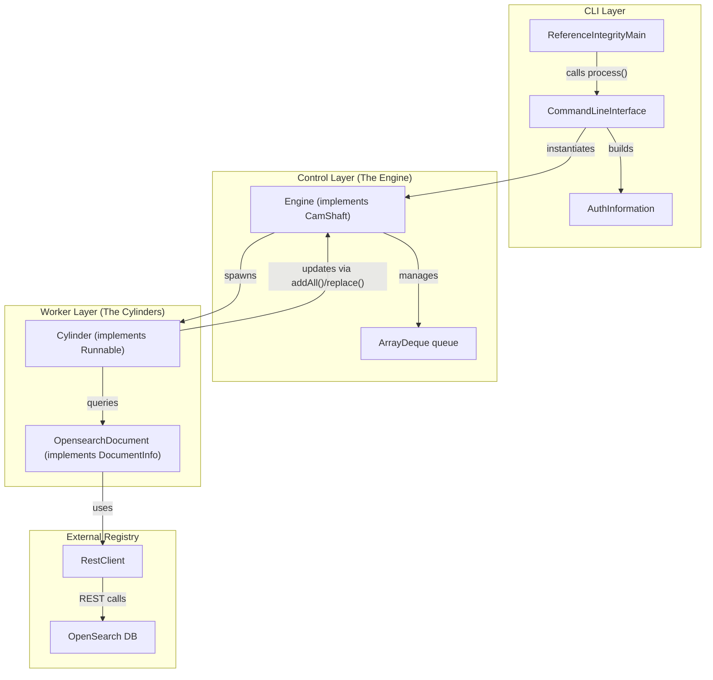
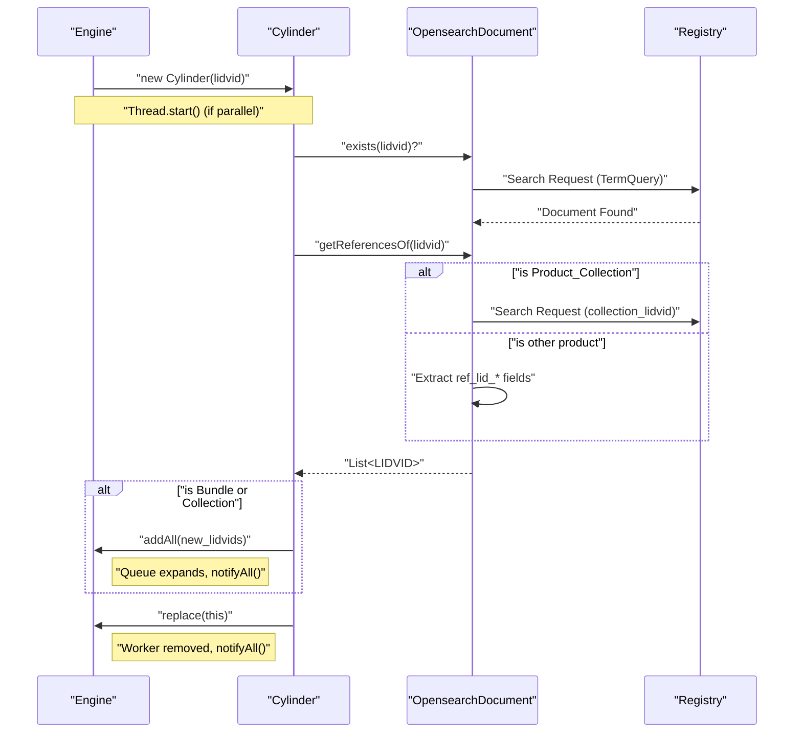

# Page: Engine and Multi-threaded Processing

# Engine and Multi-threaded Processing

Relevant source files

The following files were used as context for generating this wiki page:

- [src/main/java/gov/nasa/pds/tools/validate/rule/pds4/FindUnreferencedFiles.java](src/main/java/gov/nasa/pds/tools/validate/rule/pds4/FindUnreferencedFiles.java)
- [src/main/java/gov/nasa/pds/validate/ReferenceIntegrityMain.java](src/main/java/gov/nasa/pds/validate/ReferenceIntegrityMain.java)
- [src/main/java/gov/nasa/pds/validate/ri/AuthInformation.java](src/main/java/gov/nasa/pds/validate/ri/AuthInformation.java)
- [src/main/java/gov/nasa/pds/validate/ri/CamShaft.java](src/main/java/gov/nasa/pds/validate/ri/CamShaft.java)
- [src/main/java/gov/nasa/pds/validate/ri/CommandLineInterface.java](src/main/java/gov/nasa/pds/validate/ri/CommandLineInterface.java)
- [src/main/java/gov/nasa/pds/validate/ri/CountingAppender.java](src/main/java/gov/nasa/pds/validate/ri/CountingAppender.java)
- [src/main/java/gov/nasa/pds/validate/ri/Cylinder.java](src/main/java/gov/nasa/pds/validate/ri/Cylinder.java)
- [src/main/java/gov/nasa/pds/validate/ri/DocumentInfo.java](src/main/java/gov/nasa/pds/validate/ri/DocumentInfo.java)
- [src/main/java/gov/nasa/pds/validate/ri/DuplicateFileAreaFilenames.java](src/main/java/gov/nasa/pds/validate/ri/DuplicateFileAreaFilenames.java)
- [src/main/java/gov/nasa/pds/validate/ri/Engine.java](src/main/java/gov/nasa/pds/validate/ri/Engine.java)
- [src/main/java/gov/nasa/pds/validate/ri/LidvidComparator.java](src/main/java/gov/nasa/pds/validate/ri/LidvidComparator.java)
- [src/main/java/gov/nasa/pds/validate/ri/OpensearchDocument.java](src/main/java/gov/nasa/pds/validate/ri/OpensearchDocument.java)
- [src/test/java/gov/nasa/pds/validate/ri/CliExecutioner.java](src/test/java/gov/nasa/pds/validate/ri/CliExecutioner.java)

The `ri` (Referential Integrity) subsystem utilizes an automotive-inspired multi-threaded architecture to validate LIDVID references against a PDS Registry. This system is designed to crawl through aggregate products (Bundles and Collections) and verify that every referenced product exists within the OpenSearch database.

## Architecture Overview

The architecture is built around a "mechanical" metaphor where the `Engine` manages a pool of `Cylinder` workers. The `CamShaft` interface acts as the control mechanism for the engine to receive new tasks and manage worker completion.

### Key Components

| Class | Role |
| :--- | :--- |
| `ReferenceIntegrityMain` | Entry point for the `validate-refs` tool [src/main/java/gov/nasa/pds/validate/ReferenceIntegrityMain.java:10-11](). |
| `CommandLineInterface` | Parses CLI arguments and initializes the execution environment [src/main/java/gov/nasa/pds/validate/ri/CommandLineInterface.java:21-22](). |
| `Engine` | The central controller that manages the queue of LIDVIDs and the worker pool [src/main/java/gov/nasa/pds/validate/ri/Engine.java:10-16](). |
| `Cylinder` | A `Runnable` worker that processes a single LIDVID, checks its existence, and extracts its references [src/main/java/gov/nasa/pds/validate/ri/Cylinder.java:7-12](). |
| `CamShaft` | Interface used by `Cylinder` to communicate back to the `Engine` (adding new references to the queue or signaling completion) [src/main/java/gov/nasa/pds/validate/ri/CamShaft.java:5-9](). |

### System Entity Map
The following diagram bridges the high-level system concepts to the specific Java classes and interfaces.

**Referential Integrity Entity Mapping**

Sources: [src/main/java/gov/nasa/pds/validate/ri/CommandLineInterface.java:109-114](), [src/main/java/gov/nasa/pds/validate/ri/Engine.java:10-15](), [src/main/java/gov/nasa/pds/validate/ri/Cylinder.java:7-12](), [src/main/java/gov/nasa/pds/validate/ri/AuthInformation.java:20-26]()

## Multi-threaded Processing Logic

The `Engine` processes the queue until both the LIDVID queue is empty and all active workers have finished.

### Thread Management
- **Sequential Mode**: If the thread count (`-t`) is set to 1 or not provided, LIDVIDs are processed sequentially in the main thread [src/main/java/gov/nasa/pds/validate/ri/CommandLineInterface.java:106-107](), [src/main/java/gov/nasa/pds/validate/ri/Engine.java:67-69]().
- **Parallel Mode**: For thread counts > 1, the `Engine` wraps `Cylinder` instances in new `Thread` objects and starts them [src/main/java/gov/nasa/pds/validate/ri/Engine.java:71-78]().
- **Synchronization**: The `Engine` uses `synchronized` blocks on `this.workers` and `this.queue` to ensure thread safety when adding new references discovered by a `Cylinder` or removing finished workers [src/main/java/gov/nasa/pds/validate/ri/Engine.java:28-32](), [src/main/java/gov/nasa/pds/validate/ri/Engine.java:45-49]().

### Data Flow and Lifecycle
1.  **Initialization**: `CommandLineInterface` parses positional arguments (LIDVIDs, labels, or manifests) into a list of starting LIDVIDs via `UserInput.toLidvids()` [src/main/java/gov/nasa/pds/validate/ri/CommandLineInterface.java:94-110]().
2.  **Processing**: The `Engine` takes a LIDVID from the queue and assigns it to a `Cylinder` [src/main/java/gov/nasa/pds/validate/ri/Engine.java:61-64]().
3.  **Validation**: The `Cylinder` uses `OpensearchDocument` to check if the LIDVID exists in the registry [src/main/java/gov/nasa/pds/validate/ri/Cylinder.java:40-42]().
4.  **Discovery**: If the product is a `Product_Bundle` or `Product_Collection`, the `Cylinder` extracts its member references [src/main/java/gov/nasa/pds/validate/ri/Cylinder.java:21-29]().
5.  **Recursion**: Discovered references are passed back to the `Engine` via `cam.addAll(referenced_valid_lidvids)`, which adds them to the processing queue and notifies waiting threads [src/main/java/gov/nasa/pds/validate/ri/Cylinder.java:55-56](), [src/main/java/gov/nasa/pds/validate/ri/Engine.java:26-33]().
6.  **Completion**: When a `Cylinder` finishes, it calls `cam.replace(this)` to remove itself from the active worker list and update the "broken" reference count [src/main/java/gov/nasa/pds/validate/ri/Cylinder.java:58-59](), [src/main/java/gov/nasa/pds/validate/ri/Engine.java:44-50]().

**Engine Execution Sequence**

Sources: [src/main/java/gov/nasa/pds/validate/ri/Engine.java:52-98](), [src/main/java/gov/nasa/pds/validate/ri/Cylinder.java:35-60](), [src/main/java/gov/nasa/pds/validate/ri/OpensearchDocument.java:97-116]()

## Key Classes and Implementation Details

### CommandLineInterface
Handles the parsing of the following key options using Apache Commons CLI [src/main/java/gov/nasa/pds/validate/ri/CommandLineInterface.java:27-49]():
- `-r`: Registry connection URL (e.g., `app://connection/direct/localhost.xml`) [src/main/java/gov/nasa/pds/validate/ri/CommandLineInterface.java:41-43]().
- `-a`: Authentication file for direct OpenSearch DB access [src/main/java/gov/nasa/pds/validate/ri/CommandLineInterface.java:34-36]().
- `-t`: Maximum number of threads (cylinders) to process LIDVIDs in parallel [src/main/java/gov/nasa/pds/validate/ri/CommandLineInterface.java:44-46]().
- `-o`: Override for the index name in the connection file (defaults to `registry`) [src/main/java/gov/nasa/pds/validate/ri/CommandLineInterface.java:39-40]().

### AuthInformation
A configuration holder that manages the `ConnectionFactory`. It creates the `RestClient` used by the `ri` engine to communicate with OpenSearch [src/main/java/gov/nasa/pds/validate/ri/AuthInformation.java:27-41](). It supports overriding the target index name [src/main/java/gov/nasa/pds/validate/ri/AuthInformation.java:38]().

### DuplicateFileAreaFilenames
An auxiliary component that can run in the background to find duplicate file references across the registry. It extends `OpensearchDocument` and uses the `buildFindDuplicates` search request to identify cases where multiple LIDVIDs refer to the same physical file reference [src/main/java/gov/nasa/pds/validate/ri/DuplicateFileAreaFilenames.java:15-56]().

### CountingAppender
A custom Log4j `Appender` used to track the number of Errors, Fatals, and Warnings during the validation run [src/main/java/gov/nasa/pds/validate/ri/CountingAppender.java:11-12](). This allows the `CommandLineInterface` to report a final summary of issues, separating missing reference errors from other types of errors [src/main/java/gov/nasa/pds/validate/ri/CommandLineInterface.java:121-128]().

### OpensearchDocument
The implementation of `DocumentInfo` that interacts with the OpenSearch Registry. It performs two main types of queries:
1.  **LID/LIDVID lookup**: Uses `buildTermQuery` to check if a product exists [src/main/java/gov/nasa/pds/validate/ri/OpensearchDocument.java:27-30](). It handles resolution of the latest version if only a LID is provided [src/main/java/gov/nasa/pds/validate/ri/OpensearchDocument.java:34-45]().
2.  **Reference lookup**: For collections, it queries the `-refs` index using `collection_lidvid` or `collection_lid` [src/main/java/gov/nasa/pds/validate/ri/OpensearchDocument.java:60-63](). For other products, it extracts fields starting with `ref_lid_` [src/main/java/gov/nasa/pds/validate/ri/OpensearchDocument.java:104-105]().

Sources:
- [src/main/java/gov/nasa/pds/validate/ri/CommandLineInterface.java:21-149]()
- [src/main/java/gov/nasa/pds/validate/ri/Engine.java:10-99]()
- [src/main/java/gov/nasa/pds/validate/ri/Cylinder.java:7-61]()
- [src/main/java/gov/nasa/pds/validate/ri/AuthInformation.java:8-45]()
- [src/main/java/gov/nasa/pds/validate/ri/DuplicateFileAreaFilenames.java:15-70]()
- [src/main/java/gov/nasa/pds/validate/ri/CountingAppender.java:11-115]()
- [src/main/java/gov/nasa/pds/validate/ri/OpensearchDocument.java:12-117]()
- [src/main/java/gov/nasa/pds/validate/ri/CamShaft.java:5-9]()
- [src/main/java/gov/nasa/pds/validate/ReferenceIntegrityMain.java:10-24]()
