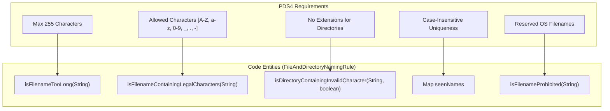
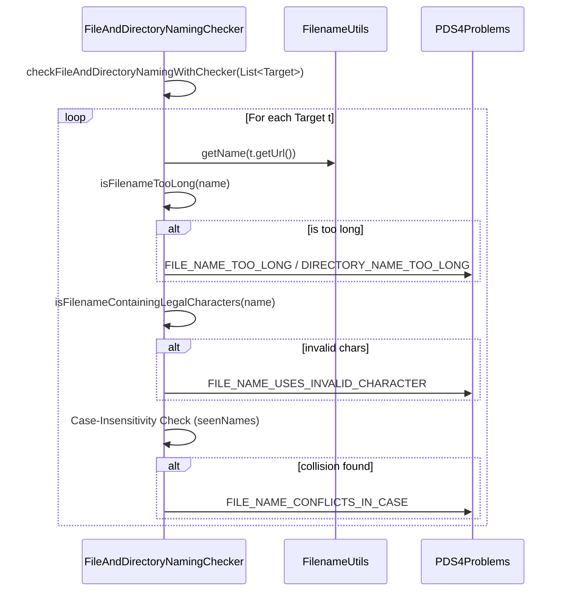

# Page: File and Directory Naming Rules

# File and Directory Naming Rules

Relevant source files

The following files were used as context for generating this wiki page:

- [src/main/java/gov/nasa/pds/tools/util/FilenameUtility.java](src/main/java/gov/nasa/pds/tools/util/FilenameUtility.java)
- [src/main/java/gov/nasa/pds/tools/validate/rule/pds4/FileAndDirectoryNamingChecker.java](src/main/java/gov/nasa/pds/tools/validate/rule/pds4/FileAndDirectoryNamingChecker.java)
- [src/main/java/gov/nasa/pds/tools/validate/rule/pds4/FileAndDirectoryNamingRule.java](src/main/java/gov/nasa/pds/tools/validate/rule/pds4/FileAndDirectoryNamingRule.java)
- [src/main/java/gov/nasa/pds/tools/validate/rule/pds4/LocalIdentifierReferencesRule.java](src/main/java/gov/nasa/pds/tools/validate/rule/pds4/LocalIdentifierReferencesRule.java)
- [src/test/resources/github153/iue_asteroid_spectra/bundle_iue_asteroid_spectra.xml](src/test/resources/github153/iue_asteroid_spectra/bundle_iue_asteroid_spectra.xml)
- [src/test/resources/github153/iue_asteroid_spectra/document/3juno_lwr01896_ines fits headers.pdfa.pdf](src/test/resources/github153/iue_asteroid_spectra/document/3juno_lwr01896_ines fits headers.pdfa.pdf)
- [src/test/resources/github153/iue_asteroid_spectra/document/3juno_lwr01896_ines fits headers.pdfa.xml](src/test/resources/github153/iue_asteroid_spectra/document/3juno_lwr01896_ines fits headers.pdfa.xml)
- [src/test/resources/github153/iue_asteroid_spectra/document/collection_iue_asteroid_spectra_document.xml](src/test/resources/github153/iue_asteroid_spectra/document/collection_iue_asteroid_spectra_document.xml)
- [src/test/resources/github153/iue_asteroid_spectra/document/collection_iue_asteroid_spectra_document_inventory.csv](src/test/resources/github153/iue_asteroid_spectra/document/collection_iue_asteroid_spectra_document_inventory.csv)
- [src/test/resources/github424/asurpif_photos_amboycrater_v1.0_20211021_aip_v1.0.xml](src/test/resources/github424/asurpif_photos_amboycrater_v1.0_20211021_aip_v1.0.xml)
- [src/test/resources/github424/asurpif_photos_amboycrater_v1.0_20211021_checksum_manifest_v1.0.tab](src/test/resources/github424/asurpif_photos_amboycrater_v1.0_20211021_checksum_manifest_v1.0.tab)
- [src/test/resources/github424/asurpif_photos_amboycrater_v1.0_20211021_sip_v1.0.tab](src/test/resources/github424/asurpif_photos_amboycrater_v1.0_20211021_sip_v1.0.tab)
- [src/test/resources/github424/asurpif_photos_amboycrater_v1.0_20211021_sip_v1.0.xml](src/test/resources/github424/asurpif_photos_amboycrater_v1.0_20211021_sip_v1.0.xml)
- [src/test/resources/github424/asurpif_photos_amboycrater_v1.0_20211021_transfer_manifest_v1.0.tab](src/test/resources/github424/asurpif_photos_amboycrater_v1.0_20211021_transfer_manifest_v1.0.tab)

The PDS4 Information Model imposes strict constraints on the naming of files and directories within an archive to ensure cross-platform compatibility and long-term data integrity. The `validate` tool enforces these standards during bundle and collection validation. These rules are primarily implemented within the `gov.nasa.pds.tools.validate.rule.pds4` package and supported by utility classes for string sanitization and URI decoding.

## Core Components

The naming validation system is built around a base rule class and a specialized checker that allows for validation without immediate side effects (like listener notification).

### FileAndDirectoryNamingRule
This is the primary validation rule class. It crawls the target location and evaluates every discovered file and directory against PDS4 standards [src/main/java/gov/nasa/pds/tools/validate/rule/pds4/FileAndDirectoryNamingRule.java:39-40]().

*   **Maximum Length**: Enforces a limit of 255 characters for any file or directory name [src/main/java/gov/nasa/pds/tools/validate/rule/pds4/FileAndDirectoryNamingRule.java:41]().
*   **Legal Characters**: Uses the regex `[A-Za-z0-9][A-Za-z0-9_.-]*` to ensure names start with an alphanumeric character and contain only letters, numbers, dashes, underscores, or dots [src/main/java/gov/nasa/pds/tools/validate/rule/pds4/FileAndDirectoryNamingRule.java:43]().
*   **Prohibited Names**: Maintains a set of reserved names (e.g., `aux`, `com1-9`, `con`, `lpt1-9`, `nul`, `prn`, `core`) that are prohibited to maintain compatibility with Windows and Unix systems [src/main/java/gov/nasa/pds/tools/validate/rule/pds4/FileAndDirectoryNamingRule.java:45-70]().

### FileAndDirectoryNamingChecker
This class extends the base rule to provide a functional interface. It returns a `List<ValidationProblem>` directly, allowing other validation rules to perform naming checks as sub-tasks without needing a global `ProblemListener` context [src/main/java/gov/nasa/pds/tools/validate/rule/pds4/FileAndDirectoryNamingChecker.java:36-48](). It implements the `checkFileAndDirectoryNamingWithChecker(List<Target>)` method to aggregate problems across a list of discovered targets [src/main/java/gov/nasa/pds/tools/validate/rule/pds4/FileAndDirectoryNamingChecker.java:48-61]().

### FilenameUtility
A utility class used to handle URL-encoded paths. It specifically handles the conversion of `%20` back to spaces using `URLDecoder.decode(filename, "UTF-8")` to ensure the underlying `File` objects can resolve paths correctly during the discovery phase [src/main/java/gov/nasa/pds/tools/util/FilenameUtility.java:26-52]().

**Sources:** [src/main/java/gov/nasa/pds/tools/validate/rule/pds4/FileAndDirectoryNamingRule.java:39-70](), [src/main/java/gov/nasa/pds/tools/validate/rule/pds4/FileAndDirectoryNamingChecker.java:36-61](), [src/main/java/gov/nasa/pds/tools/util/FilenameUtility.java:26-52]()

## Data Flow and Implementation

The validation process typically starts when the `checkFileAndDirectoryNaming()` method is triggered by the rule engine, utilizing a `Crawler` to identify targets [src/main/java/gov/nasa/pds/tools/validate/rule/pds4/FileAndDirectoryNamingRule.java:77-84]().

### Logic Flow for Naming Validation

| Step | Action | Code Reference |
| :--- | :--- | :--- |
| 1 | **Crawl** | Discovers all targets (files/dirs) using the configured `Crawler`. | [src/main/java/gov/nasa/pds/tools/validate/rule/pds4/FileAndDirectoryNamingRule.java:77-84]() |
| 2 | **Sanitize** | Removes trailing slashes and extracts the base name using `FilenameUtils.getName()`. | [src/main/java/gov/nasa/pds/tools/validate/rule/pds4/FileAndDirectoryNamingRule.java:151]() |
| 3 | **Length Check** | Validates `name.length() <= 255` via `isFilenameTooLong()`. | [src/main/java/gov/nasa/pds/tools/validate/rule/pds4/FileAndDirectoryNamingRule.java:100-109]() |
| 4 | **Char Check** | Applies `NAMING_PATTERN` regex via `isFilenameContainingLegalCharacters()`. | [src/main/java/gov/nasa/pds/tools/validate/rule/pds4/FileAndDirectoryNamingRule.java:113-124]() |
| 5 | **Case Check** | Stores lowercase versions in `seenNames` to detect case-insensitive collisions. | [src/main/java/gov/nasa/pds/tools/validate/rule/pds4/FileAndDirectoryNamingRule.java:142-147]() |
| 6 | **Prohibited** | Checks against the `PROHIBITED_BASE_NAMES` set via `isFilenameProhibited()`. | [src/main/java/gov/nasa/pds/tools/validate/rule/pds4/FileAndDirectoryNamingRule.java:88-96]() |

**Sources:** [src/main/java/gov/nasa/pds/tools/validate/rule/pds4/FileAndDirectoryNamingRule.java:77-151](), [src/main/java/gov/nasa/pds/tools/validate/rule/pds4/FileAndDirectoryNamingChecker.java:48-121]()

## Natural Language to Code Entity Mapping

The following diagrams bridge the PDS4 naming requirements to the internal class structures.

### Requirement Enforcement Mapping
This diagram shows how specific PDS4 requirements are mapped to methods within the `FileAndDirectoryNamingRule` hierarchy.

**Sources:** [src/main/java/gov/nasa/pds/tools/validate/rule/pds4/FileAndDirectoryNamingRule.java:88-140]()

### Validation Logic Sequence
This diagram illustrates the internal execution flow of the `FileAndDirectoryNamingChecker`.

**Sources:** [src/main/java/gov/nasa/pds/tools/validate/rule/pds4/FileAndDirectoryNamingChecker.java:48-121]()

## Key Constraints Enforced

### Directory Specific Rules
Directories are subject to an additional constraint: they **cannot** contain a dot (`.`) character in their name, as this is interpreted as a file extension in many PDS4 contexts [src/main/java/gov/nasa/pds/tools/validate/rule/pds4/FileAndDirectoryNamingRule.java:128-139](). This is enforced via `isDirectoryContainingInvalidCharacter()`.

### Prohibited Filenames
The following base names are strictly forbidden regardless of extension [src/main/java/gov/nasa/pds/tools/validate/rule/pds4/FileAndDirectoryNamingRule.java:45-70]():
*   **System Devices**: `con`, `prn`, `aux`, `nul`
*   **Ports**: `com1` through `com9`, `lpt1` through `lpt9`
*   **System Files**: `core`
*   **Executable Outputs**: `a.out` (specifically checked for files) [src/main/java/gov/nasa/pds/tools/validate/rule/pds4/FileAndDirectoryNamingChecker.java:105-108]()

### Case Sensitivity
PDS4 requires that file and directory names be unique within a single directory even when compared case-insensitively. The `validate` tool enforces this by maintaining a `Map<String, String> seenNames` where the key is the lowercase version of the name and the value is the original name [src/main/java/gov/nasa/pds/tools/validate/rule/pds4/FileAndDirectoryNamingRule.java:142-147](). If a key already exists in the map, a `FILE_NAME_CONFLICTS_IN_CASE` or `DIRECTORY_NAME_CONFLICTS_IN_CASE` problem is reported [src/main/java/gov/nasa/pds/tools/validate/rule/pds4/FileAndDirectoryNamingChecker.java:94-100]().

### Local Identifier References
While not strictly a "naming" rule for files, the `LocalIdentifierReferencesRule` ensures that `local_identifier_reference` elements within a label correspond to existing `local_identifier` attributes in the same label [src/main/java/gov/nasa/pds/tools/validate/rule/pds4/LocalIdentifierReferencesRule.java:42-129](). It uses XPath queries to find references and definitions [src/main/java/gov/nasa/pds/tools/validate/rule/pds4/LocalIdentifierReferencesRule.java:45-50]().

**Sources:** [src/main/java/gov/nasa/pds/tools/validate/rule/pds4/FileAndDirectoryNamingRule.java:45-147](), [src/main/java/gov/nasa/pds/tools/validate/rule/pds4/FileAndDirectoryNamingChecker.java:94-108](), [src/main/java/gov/nasa/pds/tools/validate/rule/pds4/LocalIdentifierReferencesRule.java:42-129]()
